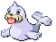

#086 - Seel
<table cellspacing="0" cellpadding="0"><tr><th colspan="1" align="center"></th><th colspan="1" align="center">Type</th><th colspan="1" align="center">Ability</th></tr><tr><td align="center";rowspan="1"></td><td align="center";rowspan="1"></td><td rowspan="1">(1) Thick Fat   (2) Hydration   (HA) Ice Body</td></tr><tr><th colspan="3" align="center">Defenses</th></tr><tr><td align="right">Immune:</td><td colspan="2"></td></tr><tr><td align="right">0.25x Resist:</td><td colspan="2"></td></tr><tr><td align="right">0.5x Resist:</td><td colspan="2"></td></tr><tr><td align="right">Neutral:</td><td colspan="2"></td></tr><tr><td align="right">2x Weak:</td><td colspan="2"></td></tr><tr><td align="right">4x Weak:</td><td colspan="2"></td></tr></table>

## Evolutions
<table>
<tr><td rowspan="1"style="vertical-align: middle;">    <a href="../086">Seel</a> </td><td rowspan="1"style="vertical-align: middle; word-break:break-all;">Level 34</td><td rowspan="1"style="vertical-align: middle;">    <a href="../087">Dewgong</a> </td></tr>
</table>

## Stats
<table class="stat"><tr><td class="stat-icon-single"></td><td class="stat-single"><u>HP</u> 65</td><td class="stat-single"><u>ATK</u> 45</td><td class="stat-single"><u>DEF</u> 55</td><td class="stat-single"><u>SPA</u> 45</td><td class="stat-single"><u>SPD</u> 70</td><td class="stat-single"><u>SPE</u> 45</td><td class="stat-single"><u>BST</u> 325</td></tr></table>

## Level Up Moves
<table><th>Level</th><th>Name</th><th>Power</th><th>Accuracy</th><th>PP</th><th>Type</th><th>Damage Class</th><th>Effect</th>
<tr><td>1</td><td>Bide</td><td>None</td><td>None</td><td>10</td><td></td><td></td><td>Priority: 1. User waits for two turns.  On the second turn, the user inflicts twice the damage it accumulated on the last Pokémon to hit it.  Damage inflicted is typeless.</td></tr>
<tr><td>1</td><td>Growl</td><td>None</td><td>100</td><td>40</td><td></td><td></td><td>Priority: 0. Lowers the target's Attack by one stage.</td></tr>
<tr><td>1</td><td>Lick</td><td>30</td><td>100</td><td>25</td><td></td><td></td><td>Priority: 0. Has a 30% chance to paralyze the target.</td></tr>
<tr><td>1</td><td>Peck</td><td>35</td><td>100</td><td>35</td><td></td><td></td><td>Priority: 0. Inflicts regular damage.</td></tr>
<tr><td>4</td><td>Powder Snow</td><td>40</td><td>100</td><td>25</td><td></td><td></td><td>Priority: 0. Has a 10% chance to freeze the target.</td></tr>
<tr><td>7</td><td>Headbutt</td><td>70</td><td>100</td><td>15</td><td></td><td></td><td>Priority: 0. Has a 30% chance to make the target flinch.</td></tr>
<tr><td>10</td><td>Water Gun</td><td>40</td><td>100</td><td>25</td><td></td><td></td><td>Priority: 0. Inflicts regular damage.</td></tr>
<tr><td>13</td><td>Disable</td><td>None</td><td>100</td><td>20</td><td></td><td></td><td>Priority: 0. Disables the target's last used move, preventing its use for 4–7 turns, selected at random, or until the target leaves the field.</td></tr>
<tr><td>16</td><td>Ice Shard</td><td>40</td><td>100</td><td>20</td><td></td><td></td><td>Priority: 1. Inflicts regular damage.</td></tr>
<tr><td>19</td><td>Bubble Beam</td><td>70</td><td>100</td><td>20</td><td></td><td></td><td>Priority: 0. Has a 10% chance to lower the target's Speed by one stage.</td></tr>
<tr><td>22</td><td>Fake Out</td><td>40</td><td>100</td><td>10</td><td></td><td></td><td>Priority: 3. Causes the target to flinch.  Can only be used on the user's first turn after entering the field.</td></tr>
<tr><td>25</td><td>Entrainment</td><td>None</td><td>100</td><td>15</td><td></td><td></td><td>Priority: 0. Changes the target's ability to match the user's.  This effect ends when the target leaves battle.</td></tr>
<tr><td>28</td><td>Brine</td><td>65</td><td>100</td><td>10</td><td></td><td></td><td>Priority: 0. If the target has less than half its max HP remaining, this move has double power.</td></tr>
<tr><td>31</td><td>Aurora Beam</td><td>75</td><td>100</td><td>20</td><td></td><td></td><td>Priority: 0. Has a 10% chance to lower the target's Attack by one stage.</td></tr>
<tr><td>34</td><td>Aqua Jet</td><td>40</td><td>100</td><td>20</td><td></td><td></td><td>Priority: 1. Inflicts regular damage.</td></tr>
<tr><td>37</td><td>Aqua Ring</td><td>None</td><td>None</td><td>20</td><td></td><td></td><td>Priority: 0. Restores 1/16 of the user's max HP at the end of each turn.  If the user leaves the field, this effect ends.  This effect is passed on by baton pass.</td></tr>
<tr><td>40</td><td>Icicle Spear</td><td>25</td><td>100</td><td>30</td><td></td><td></td><td>Priority: 0. Hits 2–5 times in one turn.  Has a 3/8 chance each to hit 2 or 3 times, and a 1/8 chance each to hit 4 or 5 times.  Averages to 3 hits per use.</td></tr>
<tr><td>44</td><td>Smart Strike</td><td>70</td><td>None</td><td>10</td><td></td><td></td><td>Priority: 0. Ignores accuracy and evasion modifiers.</td></tr>
<tr><td>48</td><td>Aqua Tail</td><td>100</td><td>85</td><td>10</td><td></td><td></td><td>Priority: 0. Inflicts regular damage.</td></tr>
<tr><td>52</td><td>Icicle Crash</td><td>85</td><td>90</td><td>10</td><td></td><td></td><td>Priority: 0. Has a 30% chance to make the target flinch.</td></tr>
<tr><td>56</td><td>Perish Song</td><td>None</td><td>None</td><td>5</td><td></td><td></td><td>Priority: 0. Every Pokémon is given a counter that starts at 3 and decreases by 1 at the end of every turn, including this one.  When a Pokémon's counter reaches zero, that Pokémon faints.</td></tr>
</table>

## TM Moves
<table><th>Machine</th><th>Name</th><th>Power</th><th>Accuracy</th><th>PP</th><th>Type</th><th>Damage Class</th><th>Effect</th>
<tr><td>TM6</td><td>Toxic</td><td>None</td><td>90</td><td>10</td><td></td><td></td><td>Priority: 0. Badly poisons the target.  Never misses when used by a poison-type Pokémon.</td></tr>
<tr><td>TM7</td><td>Hail</td><td>None</td><td>None</td><td>10</td><td></td><td></td><td>Priority: 0. Changes the weather to hail for five turns, during which non-ice Pokémon are damaged for 1/16 their max HP at the end of every turn.</td></tr>
<tr><td>TM10</td><td>Hidden Power</td><td>60</td><td>100</td><td>15</td><td></td><td></td><td>Priority: 0. Power and type depend upon user's IVs. Power can range from 30 to 70.</td></tr>
<tr><td>TM13</td><td>Ice Beam</td><td>90</td><td>100</td><td>10</td><td></td><td></td><td>Priority: 0. Has a 10% chance to freeze the target.</td></tr>
<tr><td>TM14</td><td>Blizzard</td><td>110</td><td>70</td><td>5</td><td></td><td></td><td>Priority: 0. Has a 10% chance to freeze the target.  During hail, this move has 100% accuracy.</td></tr>
<tr><td>TM17</td><td>Protect</td><td>None</td><td>None</td><td>10</td><td></td><td></td><td>Priority: 4. No moves will hit the user for the remainder of this turn. If the user is last to act this turn, this move will fail. Success rate drops by 1/2 on successive attempts.</td></tr>
<tr><td>TM18</td><td>Rain Dance</td><td>None</td><td>None</td><td>5</td><td></td><td></td><td>Priority: 0. Changes the weather to rain for five turns, during which water moves inflict 50% extra damage, and fire moves inflict half damage.</td></tr>
<tr><td>TM21</td><td>Frustration</td><td>None</td><td>100</td><td>20</td><td></td><td></td><td>Priority: 0. Power increases inversely with happiness, given by `(255 - happiness) * 2 / 5`, to a maximum of 102.  Power bottoms out at 1.</td></tr>
<tr><td>TM27</td><td>Return</td><td>None</td><td>100</td><td>20</td><td></td><td></td><td>Priority: 0. Power increases with happiness, given by `happiness * 2 / 5`, to a maximum of 102.  Power bottoms out at 1.</td></tr>
<tr><td>TM42</td><td>Facade</td><td>70</td><td>100</td><td>20</td><td></td><td></td><td>Priority: 0. If the user is burned, paralyzed, or poisoned, this move has double power.</td></tr>
<tr><td>TM44</td><td>Rest</td><td>None</td><td>None</td><td>10</td><td></td><td></td><td>Priority: 0. User falls to sleep for two turns, replacing any existing non-volatile status ailments, and immediately regains all its HP.</td></tr>
<tr><td>TM49</td><td>Echoed Voice</td><td>50</td><td>100</td><td>15</td><td></td><td></td><td>Priority: 0. If any friendly Pokémon used this move earlier this turn or on the previous turn, that use's power is added to this move's power, to a maximum of 200.</td></tr>
<tr><td>TM51</td><td>Wave Crash</td><td>110</td><td>100</td><td>5</td><td></td><td></td><td>Priority: 0. Damages user 1/3 recoil damage</td></tr>
<tr><td>TM90</td><td>Substitute</td><td>None</td><td>None</td><td>10</td><td></td><td></td><td>Priority: 0. Transfers 1/4 the user's max HP into a doll that absorbs damage and causes most negative move effects to fail.</td></tr>
<tr><td>HM3</td><td>Surf</td><td>90</td><td>100</td><td>15</td><td></td><td></td><td>Priority: 0. Inflicts regular damage.  If the target is in the first turn of dive, this move will hit with double power.</td></tr>
<tr><td>HM5</td><td>Waterfall</td><td>80</td><td>100</td><td>10</td><td></td><td></td><td>Priority: 0. Has a 20% chance to make the target flinch.</td></tr>
<tr><td>HM6</td><td>Dive</td><td>100</td><td>100</td><td>10</td><td></td><td></td><td>Priority: 0. User dives underwater for one turn, becoming immune to attack, and hits on the second turn.  During the immune turn, surf, and whirlpool still hit the user normally, and their power is doubled if appropriate.  The user may be hit during its immune turn if under the effect of lock on, mind reader, or no guard.  This move cannot be selected by sleep talk.</td></tr>
</table>

## Tutor Moves
<table><th>Name</th><th>Power</th><th>Accuracy</th><th>PP</th><th>Type</th><th>Damage Class</th><th>Effect</th>
<tr><td>Aqua Tail</td><td>100</td><td>85</td><td>10</td><td></td><td></td><td>Priority: 0. Inflicts regular damage.</td></tr>
<tr><td>Drill Run</td><td>80</td><td>95</td><td>10</td><td></td><td></td><td>Priority: 0. User's critical hit rate is one level higher when using this move.</td></tr>
<tr><td>Icy Wind</td><td>55</td><td>95</td><td>15</td><td></td><td></td><td>Priority: 0. Has a 100% chance to lower the target's Speed by one stage.</td></tr>
<tr><td>Iron Tail</td><td>100</td><td>75</td><td>15</td><td></td><td></td><td>Priority: 0. Has a 30% chance to lower the target's Defense by one stage.</td></tr>
<tr><td>Signal Beam</td><td>75</td><td>100</td><td>15</td><td></td><td></td><td>Priority: 0. Has a 10% chance to confuse the target.</td></tr>
<tr><td>Sleep Talk</td><td>None</td><td>None</td><td>10</td><td></td><td></td><td>Priority: 0. Only usable if the user is sleeping. Randomly selects and uses one of the user's other three moves. Use of the selected move requires and costs 0 PP.</td></tr>
<tr><td>Snore</td><td>50</td><td>100</td><td>15</td><td></td><td></td><td>Priority: 0. Only usable if the user is sleeping.   Has a 30% chance to make the target flinch.</td></tr>
</table>

## Encounter Locations

| Location | &nbsp; | &nbsp; | Level | Spawn Percent |
|: -- :|: -- :|: -- :|: -- :|: -- :|
| [Clay Tunnel] | Fish | &nbsp; | 35-40 | 70.0 |
| [Clay Tunnel] | Fish, Rippling Water | &nbsp; | 35-40 | 70.0 |
| [Clay Tunnel] | Surf | &nbsp; | 35-40 | 65.0 |
| [Clay Tunnel] | Surf, Rippling Water | &nbsp; | 35-40 | 65.0 |
| [Giants Chasm] | Entrance Cave | Surf | 50-60 | 30.0 |
| [Giants Chasm] | Entrance Cave | Surf, Rippling Water | 50-60 | 70.0 |
| [Giants Chasm] | Kyurems Cave | Surf | 50-60 | 30.0 |
| [Giants Chasm] | Kyurems Cave | Surf, Rippling Water | 50-60 | 70.0 |
| [Route 13] | Hidden Grotto: Outside Giant Chasm | &nbsp; | ?? | 1.0 |
| [Route 20] | Winter | Surf | 05-35 | 5.0 |
| [Route 20] | Winter | Surf, Rippling Water | 30-40 | 5.0 |
| [Route 6] | Winter | Surf | 30 | 30.0 |
| [Seaside Cave] | Upper Floor | Cave | 41-44 | 10.0 |
| [Seaside Cave] | Upper Floor | Surf | 40-46 | 30.0 |
| [Seaside Cave] | Upper Floor | Surf, Rippling Water | 40-46 | 60.0 |

--8<-- "includes/abilities.md"

[Route 13]: ../../wildareas/Route_13/
[Seaside Cave]: ../../wildareas/Seaside_Cave/
[Route 6]: ../../wildareas/Route_6/
[Giants Chasm]: ../../wildareas/Giants_Chasm/
[Clay Tunnel]: ../../wildareas/Clay_Tunnel/
[Route 20]: ../../wildareas/Route_20/
