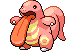

#108 - Lickitung
<table cellspacing="0" cellpadding="0"><tr><th colspan="1" align="center"></th><th colspan="1" align="center">Type</th><th colspan="1" align="center">Ability</th></tr><tr><td align="center";rowspan="1"></td><td align="center";rowspan="1"></td><td rowspan="1">(1) Cloud Nine   (2) Gluttony   (HA) Cloud Nine</td></tr><tr><th colspan="3" align="center">Defenses</th></tr><tr><td align="right">Immune:</td><td colspan="2"></td></tr><tr><td align="right">0.25x Resist:</td><td colspan="2"></td></tr><tr><td align="right">0.5x Resist:</td><td colspan="2"></td></tr><tr><td align="right">Neutral:</td><td colspan="2"></td></tr><tr><td align="right">2x Weak:</td><td colspan="2"></td></tr><tr><td align="right">4x Weak:</td><td colspan="2"></td></tr></table>

## Evolutions
<table>
<tr><td rowspan="1"style="vertical-align: middle;">    <a href="../108">Lickitung</a> </td><td rowspan="1"style="vertical-align: middle; word-break:break-all;">Level Up with move Rollout</td><td rowspan="1"style="vertical-align: middle;">    <a href="../463">Lickilicky</a> </td></tr>
</table>

## Stats
<table class="stat"><tr><td class="stat-icon-single"></td><td class="stat-single"><u>HP</u> 90</td><td class="stat-single"><u>ATK</u> 55</td><td class="stat-single"><u>DEF</u> 75</td><td class="stat-single"><u>SPA</u> 60</td><td class="stat-single"><u>SPD</u> 75</td><td class="stat-single"><u>SPE</u> 30</td><td class="stat-single"><u>BST</u> 385</td></tr></table>

## Wild Hold Items
- 5%: Lagging Tail

## Level Up Moves
<table><th>Level</th><th>Name</th><th>Power</th><th>Accuracy</th><th>PP</th><th>Type</th><th>Damage Class</th><th>Effect</th>
<tr><td>1</td><td>Defense Curl</td><td>None</td><td>None</td><td>40</td><td></td><td></td><td>Priority: 0. Raises user's Defense by one stage.  After this move is used, the power of ice ball and rollout are doubled until the user leaves the field.</td></tr>
<tr><td>1</td><td>Lick</td><td>30</td><td>100</td><td>25</td><td></td><td></td><td>Priority: 0. Has a 30% chance to paralyze the target.</td></tr>
<tr><td>1</td><td>Wrap</td><td>15</td><td>90</td><td>20</td><td></td><td></td><td>Priority: 0. For the next 2–5 turns, the target cannot leave the field and is damaged for 1/16 its max HP at the end of each turn.    Has a 3/8 chance each to hit 2 or 3 times, and a 1/8 chance each to hit 4 or 5 times.</td></tr>
<tr><td>4</td><td>Amnesia</td><td>None</td><td>None</td><td>20</td><td></td><td></td><td>Priority: 0. Raises the user's Special Defense by two stages.</td></tr>
<tr><td>7</td><td>Refresh</td><td>None</td><td>None</td><td>20</td><td></td><td></td><td>Priority: 0. Removes a burn, paralysis, or poison from the user.</td></tr>
<tr><td>10</td><td>Screech</td><td>None</td><td>85</td><td>40</td><td></td><td></td><td>Priority: 0. Lowers the target's Defense by two stages.</td></tr>
<tr><td>13</td><td>Me First</td><td>None</td><td>None</td><td>20</td><td></td><td></td><td>Priority: 0. If the target has selected a damaging move this turn, the user will copy that move and use it against the target, with a 50% increase in power.  If the target moves before the user, this move will fail.</td></tr>
<tr><td>16</td><td>Curse</td><td>None</td><td>None</td><td>10</td><td></td><td></td><td>Priority: 0. If the user is a ghost: user pays half its max HP to place a curse on the target, damaging it for 1/4 its max HP every turn. Otherwise: Lowers the user's Speed by one stage, and raises its Attack and Defense by one stage each.  The curse effect is passed on by baton pass.  This move cannot be copied by mirror move.</td></tr>
<tr><td>19</td><td>Stomp</td><td>65</td><td>100</td><td>20</td><td></td><td></td><td>Priority: 0. Has a 30% chance to make the target flinch.  Power is doubled against Pokémon that have used minimize since entering the field.</td></tr>
<tr><td>22</td><td>Helping Hand</td><td>None</td><td>None</td><td>20</td><td></td><td></td><td>Priority: 5. Boosts the power of the target's moves by 50% until the end of this turn.  This move cannot be copied by mirror move, nor selected by assist or metronome.</td></tr>
<tr><td>25</td><td>Disable</td><td>None</td><td>100</td><td>20</td><td></td><td></td><td>Priority: 0. Disables the target's last used move, preventing its use for 4–7 turns, selected at random, or until the target leaves the field.</td></tr>
<tr><td>28</td><td>Screech</td><td>None</td><td>85</td><td>40</td><td></td><td></td><td>Priority: 0. Lowers the target's Defense by two stages.</td></tr>
<tr><td>31</td><td>Chip Away</td><td>70</td><td>100</td><td>20</td><td></td><td></td><td>Priority: 0. Damage calculation ignores the target's stat modifiers, including evasion.</td></tr>
<tr><td>34</td><td>Muddy Water</td><td>90</td><td>85</td><td>10</td><td></td><td></td><td>Priority: 0. Has a 30% chance to lower the target's accuracy by one stage.</td></tr>
<tr><td>37</td><td>Zen Headbutt</td><td>80</td><td>90</td><td>10</td><td></td><td></td><td>Priority: 0. Has a 20% chance to make the target flinch.</td></tr>
<tr><td>40</td><td>Rollout</td><td>40</td><td>90</td><td>20</td><td></td><td></td><td>Priority: 0. User is forced to use this move for five turns.  Power doubles every time this move is used in succession to a maximum of 16x, and resets to normal after the lock-in ends.</td></tr>
<tr><td>43</td><td>Magnitude</td><td>None</td><td>100</td><td>30</td><td></td><td></td><td>Priority: 0. Power is selected at random between 10 and 150, with an average of 71:  Magnitude | Power | Chance --------: | ----: | -----:         4 |    10 |     5%         5 |    30 |    10%         6 |    50 |    20%         7 |    70 |    30%         8 |    90 |    20%         9 |   110 |    10%        10 |   150 |     5%  This move has double power against Pokémon currently underground due to dig.</td></tr>
<tr><td>46</td><td>Body Slam</td><td>85</td><td>100</td><td>15</td><td></td><td></td><td>Priority: 0. Has a 30% chance to paralyze the target.</td></tr>
<tr><td>50</td><td>Hammer Arm</td><td>100</td><td>90</td><td>10</td><td></td><td></td><td>Priority: 0. Inflicts regular damage, then lowers the user's Speed by one stage.</td></tr>
<tr><td>54</td><td>Power Whip</td><td>120</td><td>85</td><td>10</td><td></td><td></td><td>Priority: 0. Inflicts regular damage.</td></tr>
<tr><td>58</td><td>Double-Edge</td><td>120</td><td>100</td><td>15</td><td></td><td></td><td>Priority: 0. User takes 1/3 the damage it inflicts in recoil.</td></tr>
<tr><td>62</td><td>Belly Drum</td><td>None</td><td>None</td><td>10</td><td></td><td></td><td>Priority: 0. User pays half its max HP to raise its Attack to +6 stages.  If the user cannot pay the HP cost, this move will fail.</td></tr>
<tr><td>66</td><td>Wring Out</td><td>None</td><td>100</td><td>5</td><td></td><td></td><td>Priority: 0. Power directly relates to the target's relative remaining HP, given by `1 + 120 * current HP / max HP`, to a maximum of 121.</td></tr>
</table>

## TM Moves
<table><th>Machine</th><th>Name</th><th>Power</th><th>Accuracy</th><th>PP</th><th>Type</th><th>Damage Class</th><th>Effect</th>
<tr><td>TM6</td><td>Toxic</td><td>None</td><td>90</td><td>10</td><td></td><td></td><td>Priority: 0. Badly poisons the target.  Never misses when used by a poison-type Pokémon.</td></tr>
<tr><td>TM10</td><td>Hidden Power</td><td>60</td><td>100</td><td>15</td><td></td><td></td><td>Priority: 0. Power and type depend upon user's IVs. Power can range from 30 to 70.</td></tr>
<tr><td>TM11</td><td>Sunny Day</td><td>None</td><td>None</td><td>5</td><td></td><td></td><td>Priority: 0. Changes the weather to sunshine for five turns.</td></tr>
<tr><td>TM13</td><td>Ice Beam</td><td>90</td><td>100</td><td>10</td><td></td><td></td><td>Priority: 0. Has a 10% chance to freeze the target.</td></tr>
<tr><td>TM14</td><td>Blizzard</td><td>110</td><td>70</td><td>5</td><td></td><td></td><td>Priority: 0. Has a 10% chance to freeze the target.  During hail, this move has 100% accuracy.</td></tr>
<tr><td>TM15</td><td>Hyper Beam</td><td>150</td><td>90</td><td>5</td><td></td><td></td><td>Priority: 0. User loses its next turn to "recharge", and cannot attack or switch out during that turn.</td></tr>
<tr><td>TM17</td><td>Protect</td><td>None</td><td>None</td><td>10</td><td></td><td></td><td>Priority: 4. No moves will hit the user for the remainder of this turn. If the user is last to act this turn, this move will fail. Success rate drops by 1/2 on successive attempts.</td></tr>
<tr><td>TM18</td><td>Rain Dance</td><td>None</td><td>None</td><td>5</td><td></td><td></td><td>Priority: 0. Changes the weather to rain for five turns, during which water moves inflict 50% extra damage, and fire moves inflict half damage.</td></tr>
<tr><td>TM21</td><td>Frustration</td><td>None</td><td>100</td><td>20</td><td></td><td></td><td>Priority: 0. Power increases inversely with happiness, given by `(255 - happiness) * 2 / 5`, to a maximum of 102.  Power bottoms out at 1.</td></tr>
<tr><td>TM22</td><td>Solar Beam</td><td>120</td><td>100</td><td>10</td><td></td><td></td><td>Priority: 0. User charges for one turn before attacking.</td></tr>
<tr><td>TM24</td><td>Thunderbolt</td><td>90</td><td>100</td><td>10</td><td></td><td></td><td>Priority: 0. Has a 10% chance to paralyze the target.</td></tr>
<tr><td>TM25</td><td>Thunder</td><td>110</td><td>70</td><td>5</td><td></td><td></td><td>Priority: 0. Has a 30% chance to paralyze the target.  During rain dance, this move has 100% accuracy.  During sunny day, this move has 50% accuracy.</td></tr>
<tr><td>TM26</td><td>Earthquake</td><td>100</td><td>100</td><td>10</td><td></td><td></td><td>Priority: 0. Inflicts regular damage.  If the target is in the first turn of dig, this move will hit with double power.</td></tr>
<tr><td>TM27</td><td>Return</td><td>None</td><td>100</td><td>20</td><td></td><td></td><td>Priority: 0. Power increases with happiness, given by `happiness * 2 / 5`, to a maximum of 102.  Power bottoms out at 1.</td></tr>
<tr><td>TM28</td><td>Dig</td><td>80</td><td>100</td><td>10</td><td></td><td></td><td>Priority: 0. User digs underground for one turn, becoming immune to attack, and hits on the second turn.  During the immune turn, earthquake, fissure, and magnitude still hit the user normally, and their power is doubled if appropriate.  The user may be hit during its immune turn if under the effect of lock on, mind reader, or no guard.  This move cannot be selected by sleep talk.</td></tr>
<tr><td>TM30</td><td>Shadow Ball</td><td>80</td><td>100</td><td>10</td><td></td><td></td><td>Priority: 0. Has a 20% chance to lower the target's Special Defense by one stage.</td></tr>
<tr><td>TM31</td><td>Brick Break</td><td>75</td><td>100</td><td>15</td><td></td><td></td><td>Priority: 0. Destroys any light screen or reflect on the target's side of the field, then inflicts regular damage.</td></tr>
<tr><td>TM35</td><td>Flamethrower</td><td>90</td><td>100</td><td>10</td><td></td><td></td><td>Priority: 0. Has a 10% chance to burn the target.</td></tr>
<tr><td>TM37</td><td>Sandstorm</td><td>None</td><td>None</td><td>10</td><td></td><td></td><td>Priority: 0. Changes the weather to a sandstorm for five turns.  Pokémon that are not ground, rock, or steel take 1/16 their max HP at the end of every turn.  Every rock Pokémon's original Special Defense is raised by 50% for the duration of this effect.</td></tr>
<tr><td>TM38</td><td>Fire Blast</td><td>110</td><td>85</td><td>5</td><td></td><td></td><td>Priority: 0. Has a 10% chance to burn the target.</td></tr>
<tr><td>TM39</td><td>Rock Tomb</td><td>60</td><td>95</td><td>15</td><td></td><td></td><td>Priority: 0. Has a 100% chance to lower the target's Speed by one stage.</td></tr>
<tr><td>TM42</td><td>Facade</td><td>70</td><td>100</td><td>20</td><td></td><td></td><td>Priority: 0. If the user is burned, paralyzed, or poisoned, this move has double power.</td></tr>
<tr><td>TM44</td><td>Rest</td><td>None</td><td>None</td><td>10</td><td></td><td></td><td>Priority: 0. User falls to sleep for two turns, replacing any existing non-volatile status ailments, and immediately regains all its HP.</td></tr>
<tr><td>TM45</td><td>Power-Up Punch</td><td>50</td><td>100</td><td>20</td><td></td><td></td><td>Priority: 0. Raises the user's Attack by one stage.</td></tr>
<tr><td>TM51</td><td>Wave Crash</td><td>110</td><td>100</td><td>5</td><td></td><td></td><td>Priority: 0. Damages user 1/3 recoil damage</td></tr>
<tr><td>TM59</td><td>Incinerate</td><td>60</td><td>100</td><td>15</td><td></td><td></td><td>Priority: 0. If the target is holding a berry, it's destroyed and cannot be used in response to this move.</td></tr>
<tr><td>TM63</td><td>Brutal Swing</td><td>60</td><td>100</td><td>20</td><td></td><td></td><td>Priority: 0. Inflicts regular damage.</td></tr>
<tr><td>TM67</td><td>Retaliate</td><td>70</td><td>100</td><td>5</td><td></td><td></td><td>Priority: 0. If a friendly Pokémon fainted on the previous turn, this move has double power.</td></tr>
<tr><td>TM68</td><td>Giga Impact</td><td>150</td><td>90</td><td>5</td><td></td><td></td><td>Priority: 0. User loses its next turn to "recharge", and cannot attack or switch out during that turn.</td></tr>
<tr><td>TM75</td><td>Swords Dance</td><td>None</td><td>None</td><td>20</td><td></td><td></td><td>Priority: 0. Raises the user's Attack by two stages.</td></tr>
<tr><td>TM77</td><td>Psych Up</td><td>None</td><td>None</td><td>10</td><td></td><td></td><td>Priority: 0. Discards the user's stat changes and copies the target's.  This move cannot be copied by mirror move.</td></tr>
<tr><td>TM78</td><td>Bulldoze</td><td>60</td><td>100</td><td>20</td><td></td><td></td><td>Priority: 0. Has a 100% chance to lower the target's Speed by one stage.</td></tr>
<tr><td>TM80</td><td>Rock Slide</td><td>75</td><td>90</td><td>10</td><td></td><td></td><td>Priority: 0. Has a 30% chance to make the target flinch.</td></tr>
<tr><td>TM82</td><td>Dragon Tail</td><td>60</td><td>95</td><td>10</td><td></td><td></td><td>Priority: -6. Inflicts regular damage, then switches the target out for another of its trainer's Pokémon, selected at random.  If the target is under the effect of ingrain or suction cups, or it has a substitute, or its Trainer has no more usable Pokémon, it will not be switched out.  If the target is a wild Pokémon, the battle ends instead.</td></tr>
<tr><td>TM83</td><td>Work Up</td><td>None</td><td>None</td><td>30</td><td></td><td></td><td>Priority: 0. Raises the user's Attack and Special Attack by one stage each.</td></tr>
<tr><td>TM87</td><td>Rock Climb</td><td>80</td><td>95</td><td>10</td><td></td><td></td><td>Priority: 0. Has a 20% chance to confuse the target.</td></tr>
<tr><td>TM90</td><td>Substitute</td><td>None</td><td>None</td><td>10</td><td></td><td></td><td>Priority: 0. Transfers 1/4 the user's max HP into a doll that absorbs damage and causes most negative move effects to fail.</td></tr>
<tr><td>TM94</td><td>Rock Smash</td><td>55</td><td>100</td><td>15</td><td></td><td></td><td>Priority: 0. 100% chance to drop target's Def by one stage. Also boosted by the ability Iron Fist</td></tr>
<tr><td>HM1</td><td>Cut</td><td>50</td><td>95</td><td>30</td><td></td><td></td><td>Priority: 0. High Critical Ratio</td></tr>
<tr><td>HM3</td><td>Surf</td><td>90</td><td>100</td><td>15</td><td></td><td></td><td>Priority: 0. Inflicts regular damage.  If the target is in the first turn of dive, this move will hit with double power.</td></tr>
<tr><td>HM4</td><td>Strength</td><td>85</td><td>100</td><td>10</td><td></td><td></td><td>Priority: 0. 10% Raise Attack</td></tr>
</table>

## Tutor Moves
<table><th>Name</th><th>Power</th><th>Accuracy</th><th>PP</th><th>Type</th><th>Damage Class</th><th>Effect</th>
<tr><td>Aqua Tail</td><td>100</td><td>85</td><td>10</td><td></td><td></td><td>Priority: 0. Inflicts regular damage.</td></tr>
<tr><td>Bind</td><td>15</td><td>85</td><td>20</td><td></td><td></td><td>Priority: 0. For the next 2–5 turns, the target cannot leave the field and is damaged for 1/16 its max HP at the end of each turn.</td></tr>
<tr><td>Fire Punch</td><td>75</td><td>100</td><td>10</td><td></td><td></td><td>Priority: 0. Has a 10% chance to burn the target.</td></tr>
<tr><td>Ice Punch</td><td>75</td><td>100</td><td>10</td><td></td><td></td><td>Priority: 0. Has a 10% chance to freeze the target.</td></tr>
<tr><td>Icy Wind</td><td>55</td><td>95</td><td>15</td><td></td><td></td><td>Priority: 0. Has a 100% chance to lower the target's Speed by one stage.</td></tr>
<tr><td>Iron Tail</td><td>100</td><td>75</td><td>15</td><td></td><td></td><td>Priority: 0. Has a 30% chance to lower the target's Defense by one stage.</td></tr>
<tr><td>Knock Off</td><td>65</td><td>100</td><td>20</td><td></td><td></td><td>Priority: 0. Target loses its held item.</td></tr>
<tr><td>Sleep Talk</td><td>None</td><td>None</td><td>10</td><td></td><td></td><td>Priority: 0. Only usable if the user is sleeping. Randomly selects and uses one of the user's other three moves. Use of the selected move requires and costs 0 PP.</td></tr>
<tr><td>Snore</td><td>50</td><td>100</td><td>15</td><td></td><td></td><td>Priority: 0. Only usable if the user is sleeping.   Has a 30% chance to make the target flinch.</td></tr>
<tr><td>Thunder Punch</td><td>75</td><td>100</td><td>10</td><td></td><td></td><td>Priority: 0. Has a 10% chance to paralyze the target.</td></tr>
<tr><td>Zen Headbutt</td><td>80</td><td>90</td><td>10</td><td></td><td></td><td>Priority: 0. Has a 20% chance to make the target flinch.</td></tr>
</table>

## Encounter Locations

| Location | &nbsp; | Level | Spawn Percent |
|: -- :|: -- :|: -- :|: -- :|
| [Route 16] | Dark Grass (Doubles) | 27-30 | 10.0 |

--8<-- "includes/abilities.md"

[Route 16]: ../../wildareas/Route_16/
