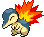

#155 - Cyndaquil
<table cellspacing="0" cellpadding="0"><tr><th colspan="1" align="center"></th><th colspan="1" align="center">Type</th><th colspan="1" align="center">Ability</th></tr><tr><td align="center";rowspan="1"></td><td align="center";rowspan="1"></td><td rowspan="1">(1) Flash Fire   (2) Blaze   (HA) Flash Fire</td></tr><tr><th colspan="3" align="center">Defenses</th></tr><tr><td align="right">Immune:</td><td colspan="2"></td></tr><tr><td align="right">0.25x Resist:</td><td colspan="2"></td></tr><tr><td align="right">0.5x Resist:</td><td colspan="2"></td></tr><tr><td align="right">Neutral:</td><td colspan="2"></td></tr><tr><td align="right">2x Weak:</td><td colspan="2"></td></tr><tr><td align="right">4x Weak:</td><td colspan="2"></td></tr></table>

## Evolutions
<table>
<tr><td rowspan="1"style="vertical-align: middle;">    <a href="../155">Cyndaquil</a> </td><td rowspan="1"style="vertical-align: middle; word-break:break-all;">Level 14</td><td rowspan="1"style="vertical-align: middle;">    <a href="../156">Quilava</a> </td><td rowspan="1"style="vertical-align: middle; word-break:break-all;">Level 36</td><td rowspan="1"style="vertical-align: middle;">    <a href="../157">Typhlosion</a> </td></tr>
</table>

## Stats
<table class="stat"><tr><td class="stat-icon-single"></td><td class="stat-single"><u>HP</u> 39</td><td class="stat-single"><u>ATK</u> 52</td><td class="stat-single"><u>DEF</u> 43</td><td class="stat-single"><u>SPA</u> 60</td><td class="stat-single"><u>SPD</u> 50</td><td class="stat-single"><u>SPE</u> 65</td><td class="stat-single"><u>BST</u> 309</td></tr></table>

## Level Up Moves
<table><th>Level</th><th>Name</th><th>Power</th><th>Accuracy</th><th>PP</th><th>Type</th><th>Damage Class</th><th>Effect</th>
<tr><td>1</td><td>Leer</td><td>None</td><td>100</td><td>30</td><td></td><td></td><td>Priority: 0. Lowers the target's Defense by one stage.</td></tr>
<tr><td>1</td><td>Tackle</td><td>50</td><td>100</td><td>30</td><td></td><td></td><td>Priority: 0. Inflicts regular damage.</td></tr>
<tr><td>5</td><td>Ember</td><td>40</td><td>100</td><td>25</td><td></td><td></td><td>Priority: 0. Has a 10% chance to burn the target.</td></tr>
<tr><td>7</td><td>Smokescreen</td><td>None</td><td>100</td><td>20</td><td></td><td></td><td>Priority: 0. Lowers the target's accuracy by one stage.</td></tr>
<tr><td>10</td><td>Quick Attack</td><td>40</td><td>100</td><td>20</td><td></td><td></td><td>Priority: 1. Inflicts regular damage.</td></tr>
<tr><td>13</td><td>Flame Wheel</td><td>75</td><td>100</td><td>20</td><td></td><td></td><td>Priority: 0. Has a 10% chance to burn the target.  Frozen Pokémon may use this move, in which case they will thaw.</td></tr>
<tr><td>16</td><td>Defense Curl</td><td>None</td><td>None</td><td>40</td><td></td><td></td><td>Priority: 0. Raises user's Defense by one stage.  After this move is used, the power of ice ball and rollout are doubled until the user leaves the field.</td></tr>
<tr><td>20</td><td>Reversal</td><td>None</td><td>100</td><td>15</td><td></td><td></td><td>Priority: 0. Power varies inversely with the user's proportional remaining HP.  64 * current HP / max HP | Power -----------------------: | ----:  0– 1                    |  200  2– 5                    |  150  6–12                    |  100 13–21                    |   80 22–42                    |   40 43–64                    |   20</td></tr>
<tr><td>22</td><td>Flame Burst</td><td>70</td><td>100</td><td>15</td><td></td><td></td><td>Priority: 0. If this move successfully hits the target, any Pokémon adjacent to the target are damaged for 1/16 their max HP.</td></tr>
<tr><td>25</td><td>Rollout</td><td>40</td><td>90</td><td>20</td><td></td><td></td><td>Priority: 0. User is forced to use this move for five turns.  Power doubles every time this move is used in succession to a maximum of 16x, and resets to normal after the lock-in ends.</td></tr>
<tr><td>28</td><td>Swift</td><td>60</td><td>None</td><td>20</td><td></td><td></td><td>Priority: 0. Ignores accuracy and evasion modifiers.</td></tr>
<tr><td>31</td><td>Crush Claw</td><td>75</td><td>95</td><td>10</td><td></td><td></td><td>Priority: 0. Has a 50% chance to lower the target's Defense by one stage.</td></tr>
<tr><td>34</td><td>Body Slam</td><td>85</td><td>100</td><td>15</td><td></td><td></td><td>Priority: 0. Has a 30% chance to paralyze the target.</td></tr>
<tr><td>37</td><td>Work Up</td><td>None</td><td>None</td><td>30</td><td></td><td></td><td>Priority: 0. Raises the user's Attack and Special Attack by one stage each.</td></tr>
<tr><td>40</td><td>Nature Power</td><td>None</td><td>None</td><td>20</td><td></td><td></td><td>Priority: 0. Uses another move chosen according to the terrain.</td></tr>
<tr><td>43</td><td>Inferno</td><td>100</td><td>65</td><td>5</td><td></td><td></td><td>Priority: 0. Has a 100% chance to burn the target.</td></tr>
<tr><td>46</td><td>Extrasensory</td><td>80</td><td>100</td><td>15</td><td></td><td></td><td>Priority: 0. Has a 10% chance to make the target flinch.</td></tr>
<tr><td>49</td><td>Mystical Fire</td><td>75</td><td>100</td><td>10</td><td></td><td></td><td>Priority: 0. Has a 100% chance to lower the target's Special Attack by one stage.</td></tr>
</table>

## TM Moves
<table><th>Machine</th><th>Name</th><th>Power</th><th>Accuracy</th><th>PP</th><th>Type</th><th>Damage Class</th><th>Effect</th>
<tr><td>TM6</td><td>Toxic</td><td>None</td><td>90</td><td>10</td><td></td><td></td><td>Priority: 0. Badly poisons the target.  Never misses when used by a poison-type Pokémon.</td></tr>
<tr><td>TM10</td><td>Hidden Power</td><td>60</td><td>100</td><td>15</td><td></td><td></td><td>Priority: 0. Power and type depend upon user's IVs. Power can range from 30 to 70.</td></tr>
<tr><td>TM11</td><td>Sunny Day</td><td>None</td><td>None</td><td>5</td><td></td><td></td><td>Priority: 0. Changes the weather to sunshine for five turns.</td></tr>
<tr><td>TM17</td><td>Protect</td><td>None</td><td>None</td><td>10</td><td></td><td></td><td>Priority: 4. No moves will hit the user for the remainder of this turn. If the user is last to act this turn, this move will fail. Success rate drops by 1/2 on successive attempts.</td></tr>
<tr><td>TM21</td><td>Frustration</td><td>None</td><td>100</td><td>20</td><td></td><td></td><td>Priority: 0. Power increases inversely with happiness, given by `(255 - happiness) * 2 / 5`, to a maximum of 102.  Power bottoms out at 1.</td></tr>
<tr><td>TM27</td><td>Return</td><td>None</td><td>100</td><td>20</td><td></td><td></td><td>Priority: 0. Power increases with happiness, given by `happiness * 2 / 5`, to a maximum of 102.  Power bottoms out at 1.</td></tr>
<tr><td>TM28</td><td>Dig</td><td>80</td><td>100</td><td>10</td><td></td><td></td><td>Priority: 0. User digs underground for one turn, becoming immune to attack, and hits on the second turn.  During the immune turn, earthquake, fissure, and magnitude still hit the user normally, and their power is doubled if appropriate.  The user may be hit during its immune turn if under the effect of lock on, mind reader, or no guard.  This move cannot be selected by sleep talk.</td></tr>
<tr><td>TM35</td><td>Flamethrower</td><td>90</td><td>100</td><td>10</td><td></td><td></td><td>Priority: 0. Has a 10% chance to burn the target.</td></tr>
<tr><td>TM38</td><td>Fire Blast</td><td>110</td><td>85</td><td>5</td><td></td><td></td><td>Priority: 0. Has a 10% chance to burn the target.</td></tr>
<tr><td>TM40</td><td>Aerial Ace</td><td>60</td><td>None</td><td>20</td><td></td><td></td><td>Priority: 0. Ignores accuracy and evasion modifiers.</td></tr>
<tr><td>TM42</td><td>Facade</td><td>70</td><td>100</td><td>20</td><td></td><td></td><td>Priority: 0. If the user is burned, paralyzed, or poisoned, this move has double power.</td></tr>
<tr><td>TM43</td><td>Flame Charge</td><td>60</td><td>100</td><td>20</td><td></td><td></td><td>Priority: 0. Raises the user's Speed by one stage.</td></tr>
<tr><td>TM44</td><td>Rest</td><td>None</td><td>None</td><td>10</td><td></td><td></td><td>Priority: 0. User falls to sleep for two turns, replacing any existing non-volatile status ailments, and immediately regains all its HP.</td></tr>
<tr><td>TM50</td><td>Overheat</td><td>130</td><td>90</td><td>5</td><td></td><td></td><td>Priority: 0. Inflicts regular damage, then lowers the user's Special Attack by two stages.</td></tr>
<tr><td>TM59</td><td>Incinerate</td><td>60</td><td>100</td><td>15</td><td></td><td></td><td>Priority: 0. If the target is holding a berry, it's destroyed and cannot be used in response to this move.</td></tr>
<tr><td>TM61</td><td>Will-O-Wisp</td><td>None</td><td>85</td><td>15</td><td></td><td></td><td>Priority: 0. Burns the target.</td></tr>
<tr><td>TM83</td><td>Work Up</td><td>None</td><td>None</td><td>30</td><td></td><td></td><td>Priority: 0. Raises the user's Attack and Special Attack by one stage each.</td></tr>
<tr><td>TM90</td><td>Substitute</td><td>None</td><td>None</td><td>10</td><td></td><td></td><td>Priority: 0. Transfers 1/4 the user's max HP into a doll that absorbs damage and causes most negative move effects to fail.</td></tr>
<tr><td>TM93</td><td>Wild Charge</td><td>90</td><td>100</td><td>10</td><td></td><td></td><td>Priority: 0. Inflicts regular damage without recoil.</td></tr>
<tr><td>HM1</td><td>Cut</td><td>50</td><td>95</td><td>30</td><td></td><td></td><td>Priority: 0. High Critical Ratio</td></tr>
</table>

## Tutor Moves
<table><th>Name</th><th>Power</th><th>Accuracy</th><th>PP</th><th>Type</th><th>Damage Class</th><th>Effect</th>
<tr><td>Covet</td><td>60</td><td>100</td><td>20</td><td></td><td></td><td>Priority: 0. If the target is holding an item and the user is not, the user will permanently take the item.  Damage is still inflicted if an item cannot be taken.  Pokémon with sticky hold or multitype are immune to the item theft effect.  The target cannot recover its item with recycle.</td></tr>
<tr><td>Fire Pledge</td><td>75</td><td>100</td><td>10</td><td></td><td></td><td>Priority: 0. If a friendly Pokémon used water pledge earlier this turn, moves used by any friendly Pokémon have doubled effect chance for four turns (including this one).</td></tr>
<tr><td>Heat Wave</td><td>100</td><td>90</td><td>10</td><td></td><td></td><td>Priority: 0. Has a 10% chance to burn the target.</td></tr>
<tr><td>Sleep Talk</td><td>None</td><td>None</td><td>10</td><td></td><td></td><td>Priority: 0. Only usable if the user is sleeping. Randomly selects and uses one of the user's other three moves. Use of the selected move requires and costs 0 PP.</td></tr>
<tr><td>Snore</td><td>50</td><td>100</td><td>15</td><td></td><td></td><td>Priority: 0. Only usable if the user is sleeping.   Has a 30% chance to make the target flinch.</td></tr>
</table>

## Encounter Locations

| Location | &nbsp; | &nbsp; | Level | Spawn Percent |
|: -- :|: -- :|: -- :|: -- :|: -- :|
| [Route 6] | Spring, Summer, Autumn | Hidden Grotto:  Mistralton Cave Entrance | ?? | 0.33 |
| [Route 6] | Winter | Hidden Grotto:  Mistralton Cave Entrance | ?? | 0.33 |

--8<-- "includes/abilities.md"

[Route 6]: ../../wildareas/Route_6/
