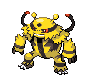

#239 - Elekid
<table cellspacing="0" cellpadding="0"><tr><th colspan="1" align="center"></th><th colspan="1" align="center">Type</th><th colspan="1" align="center">Ability</th></tr><tr><td align="center";rowspan="1"></td><td align="center";rowspan="1"></td><td rowspan="1">(1) Static   (2) Vital Spirit   (HA) Vital Spirit</td></tr><tr><th colspan="3" align="center">Defenses</th></tr><tr><td align="right">Immune:</td><td colspan="2"></td></tr><tr><td align="right">0.25x Resist:</td><td colspan="2"></td></tr><tr><td align="right">0.5x Resist:</td><td colspan="2"></td></tr><tr><td align="right">Neutral:</td><td colspan="2"></td></tr><tr><td align="right">2x Weak:</td><td colspan="2"></td></tr><tr><td align="right">4x Weak:</td><td colspan="2"></td></tr></table>

## Evolutions
<table>
<tr><td rowspan="1"style="vertical-align: middle;">    <a href="../239">Elekid</a> </td><td rowspan="1"style="vertical-align: middle; word-break:break-all;">Level 29</td><td rowspan="1"style="vertical-align: middle;">    <a href="../125">Electabuzz</a> </td><td rowspan="1"style="vertical-align: middle; word-break:break-all;">Use Electirizer</td><td rowspan="1"style="vertical-align: middle;">    <a href="../466">Electivire</a> </td></tr>
</table>

## Stats
<table class="stat"><tr><td class="stat-icon-single"></td><td class="stat-single"><u>HP</u> 45</td><td class="stat-single"><u>ATK</u> 63</td><td class="stat-single"><u>DEF</u> 37</td><td class="stat-single"><u>SPA</u> 65</td><td class="stat-single"><u>SPD</u> 55</td><td class="stat-single"><u>SPE</u> 95</td><td class="stat-single"><u>BST</u> 360</td></tr></table>

## Level Up Moves
<table><th>Level</th><th>Name</th><th>Power</th><th>Accuracy</th><th>PP</th><th>Type</th><th>Damage Class</th><th>Effect</th>
<tr><td>1</td><td>Charge</td><td>None</td><td>None</td><td>20</td><td></td><td></td><td>Priority: 0. Raises the user's Special Defense by one stage.  If the user uses an electric move next turn, its power will be doubled.</td></tr>
<tr><td>1</td><td>Leer</td><td>None</td><td>100</td><td>30</td><td></td><td></td><td>Priority: 0. Lowers the target's Defense by one stage.</td></tr>
<tr><td>1</td><td>Quick Attack</td><td>40</td><td>100</td><td>20</td><td></td><td></td><td>Priority: 1. Inflicts regular damage.</td></tr>
<tr><td>1</td><td>Thunder Shock</td><td>40</td><td>100</td><td>25</td><td></td><td></td><td>Priority: 0. Has a 10% chance to paralyze the target.</td></tr>
<tr><td>5</td><td>Swift</td><td>60</td><td>None</td><td>20</td><td></td><td></td><td>Priority: 0. Ignores accuracy and evasion modifiers.</td></tr>
<tr><td>8</td><td>Spark</td><td>65</td><td>100</td><td>20</td><td></td><td></td><td>Priority: 0. Has a 30% chance to paralyze the target.</td></tr>
<tr><td>10</td><td>Uproar</td><td>90</td><td>100</td><td>10</td><td></td><td></td><td>Priority: 0. User is forced to use this move for 2–5 turns, selected at random. No Pokemon can sleep during the effect of this move. </td></tr>
<tr><td>12</td><td>Screech</td><td>None</td><td>85</td><td>40</td><td></td><td></td><td>Priority: 0. Lowers the target's Defense by two stages.</td></tr>
<tr><td>14</td><td>Shock Wave</td><td>60</td><td>None</td><td>20</td><td></td><td></td><td>Priority: 0. Ignores accuracy and evasion modifiers.</td></tr>
<tr><td>16</td><td>Thunder Wave</td><td>None</td><td>90</td><td>20</td><td></td><td></td><td>Priority: 0. Paralyzes the target.</td></tr>
<tr><td>18</td><td>Electro Ball</td><td>None</td><td>100</td><td>10</td><td></td><td></td><td>Priority: 0. The greater the user's Speed compared to the target's, the higher power this move has, to a maximum of 150.  User's Speed                     | Power -------------------------------- | ----: Up to 2× the target's Speed      |    60 Up to 3× the target's Speed      |    80 Up to 4× the target's Speed      |   120 More than 4× the target's Speed  |   150</td></tr>
<tr><td>21</td><td>Brick Break</td><td>75</td><td>100</td><td>15</td><td></td><td></td><td>Priority: 0. Destroys any light screen or reflect on the target's side of the field, then inflicts regular damage.</td></tr>
<tr><td>24</td><td>Helping Hand</td><td>None</td><td>None</td><td>20</td><td></td><td></td><td>Priority: 5. Boosts the power of the target's moves by 50% until the end of this turn.  This move cannot be copied by mirror move, nor selected by assist or metronome.</td></tr>
<tr><td>27</td><td>Dual Chop</td><td>40</td><td>90</td><td>15</td><td></td><td></td><td>Priority: 0. Hits twice in one turn.</td></tr>
<tr><td>32</td><td>Thunder Punch</td><td>75</td><td>100</td><td>10</td><td></td><td></td><td>Priority: 0. Has a 10% chance to paralyze the target.</td></tr>
<tr><td>35</td><td>Cross Chop</td><td>100</td><td>80</td><td>5</td><td></td><td></td><td>Priority: 0. User's critical hit rate is one level higher when using this move.</td></tr>
<tr><td>39</td><td>Psychic</td><td>90</td><td>100</td><td>10</td><td></td><td></td><td>Priority: 0. Has a 10% chance to lower the target's Special Defense by one stage.</td></tr>
<tr><td>43</td><td>Hammer Arm</td><td>100</td><td>90</td><td>10</td><td></td><td></td><td>Priority: 0. Inflicts regular damage, then lowers the user's Speed by one stage.</td></tr>
<tr><td>47</td><td>Focus Punch</td><td>150</td><td>100</td><td>20</td><td></td><td></td><td>Priority: -3. If the user takes damage this turn before hitting, this move will fail.</td></tr>
<tr><td>51</td><td>Feint</td><td>30</td><td>100</td><td>10</td><td></td><td></td><td>Priority: 2. Removes the effects of detect or protect from the target before hitting.  This move cannot be copied by mirror move, nor selected by assist or metronome.</td></tr>
<tr><td>55</td><td>Cross Chop</td><td>100</td><td>80</td><td>5</td><td></td><td></td><td>Priority: 0. User's critical hit rate is one level higher when using this move.</td></tr>
<tr><td>59</td><td>Discharge</td><td>80</td><td>100</td><td>15</td><td></td><td></td><td>Priority: 0. Has a 30% chance to paralyze the target.</td></tr>
</table>

## TM Moves
<table><th>Machine</th><th>Name</th><th>Power</th><th>Accuracy</th><th>PP</th><th>Type</th><th>Damage Class</th><th>Effect</th>
<tr><td>TM6</td><td>Toxic</td><td>None</td><td>90</td><td>10</td><td></td><td></td><td>Priority: 0. Badly poisons the target.  Never misses when used by a poison-type Pokémon.</td></tr>
<tr><td>TM10</td><td>Hidden Power</td><td>60</td><td>100</td><td>15</td><td></td><td></td><td>Priority: 0. Power and type depend upon user's IVs. Power can range from 30 to 70.</td></tr>
<tr><td>TM16</td><td>Light Screen</td><td>None</td><td>None</td><td>30</td><td></td><td></td><td>Priority: 0. Reduces damage from special attacks by half for five turns. In double battles, the reduction is 1/3.</td></tr>
<tr><td>TM17</td><td>Protect</td><td>None</td><td>None</td><td>10</td><td></td><td></td><td>Priority: 4. No moves will hit the user for the remainder of this turn. If the user is last to act this turn, this move will fail. Success rate drops by 1/2 on successive attempts.</td></tr>
<tr><td>TM18</td><td>Rain Dance</td><td>None</td><td>None</td><td>5</td><td></td><td></td><td>Priority: 0. Changes the weather to rain for five turns, during which water moves inflict 50% extra damage, and fire moves inflict half damage.</td></tr>
<tr><td>TM21</td><td>Frustration</td><td>None</td><td>100</td><td>20</td><td></td><td></td><td>Priority: 0. Power increases inversely with happiness, given by `(255 - happiness) * 2 / 5`, to a maximum of 102.  Power bottoms out at 1.</td></tr>
<tr><td>TM24</td><td>Thunderbolt</td><td>90</td><td>100</td><td>10</td><td></td><td></td><td>Priority: 0. Has a 10% chance to paralyze the target.</td></tr>
<tr><td>TM25</td><td>Thunder</td><td>110</td><td>70</td><td>5</td><td></td><td></td><td>Priority: 0. Has a 30% chance to paralyze the target.  During rain dance, this move has 100% accuracy.  During sunny day, this move has 50% accuracy.</td></tr>
<tr><td>TM27</td><td>Return</td><td>None</td><td>100</td><td>20</td><td></td><td></td><td>Priority: 0. Power increases with happiness, given by `happiness * 2 / 5`, to a maximum of 102.  Power bottoms out at 1.</td></tr>
<tr><td>TM29</td><td>Psychic</td><td>90</td><td>100</td><td>10</td><td></td><td></td><td>Priority: 0. Has a 10% chance to lower the target's Special Defense by one stage.</td></tr>
<tr><td>TM31</td><td>Brick Break</td><td>75</td><td>100</td><td>15</td><td></td><td></td><td>Priority: 0. Destroys any light screen or reflect on the target's side of the field, then inflicts regular damage.</td></tr>
<tr><td>TM42</td><td>Facade</td><td>70</td><td>100</td><td>20</td><td></td><td></td><td>Priority: 0. If the user is burned, paralyzed, or poisoned, this move has double power.</td></tr>
<tr><td>TM44</td><td>Rest</td><td>None</td><td>None</td><td>10</td><td></td><td></td><td>Priority: 0. User falls to sleep for two turns, replacing any existing non-volatile status ailments, and immediately regains all its HP.</td></tr>
<tr><td>TM45</td><td>Power-Up Punch</td><td>50</td><td>100</td><td>20</td><td></td><td></td><td>Priority: 0. Raises the user's Attack by one stage.</td></tr>
<tr><td>TM57</td><td>Charge Beam</td><td>50</td><td>90</td><td>15</td><td></td><td></td><td>Priority: 0. Has a 70% chance to raise the user's Special Attack by one stage.</td></tr>
<tr><td>TM70</td><td>Flash</td><td>None</td><td>100</td><td>20</td><td></td><td></td><td>Priority: 0. Lowers the target's accuracy by one stage.</td></tr>
<tr><td>TM72</td><td>Volt Switch</td><td>70</td><td>100</td><td>20</td><td></td><td></td><td>Priority: 0. Inflicts regular damage, then the user immediately switches out, and the trainer selects a replacement Pokémon from the party.  If the target faints from this attack, the user's trainer selects the new Pokémon to send out first.  If the user is the last Pokémon in its party that can battle, it will not switch out.  The user may be hit by pursuit when it switches out, if it has been targeted and pursuit has not yet been used.  This move may be used even if the user is under the effect of ingrain.  ingrain's effect will end.</td></tr>
<tr><td>TM73</td><td>Thunder Wave</td><td>None</td><td>90</td><td>20</td><td></td><td></td><td>Priority: 0. Paralyzes the target.</td></tr>
<tr><td>TM90</td><td>Substitute</td><td>None</td><td>None</td><td>10</td><td></td><td></td><td>Priority: 0. Transfers 1/4 the user's max HP into a doll that absorbs damage and causes most negative move effects to fail.</td></tr>
<tr><td>TM93</td><td>Wild Charge</td><td>90</td><td>100</td><td>10</td><td></td><td></td><td>Priority: 0. Inflicts regular damage without recoil.</td></tr>
<tr><td>TM94</td><td>Rock Smash</td><td>55</td><td>100</td><td>15</td><td></td><td></td><td>Priority: 0. 100% chance to drop target's Def by one stage. Also boosted by the ability Iron Fist</td></tr>
</table>

## Tutor Moves
<table><th>Name</th><th>Power</th><th>Accuracy</th><th>PP</th><th>Type</th><th>Damage Class</th><th>Effect</th>
<tr><td>Covet</td><td>60</td><td>100</td><td>20</td><td></td><td></td><td>Priority: 0. If the target is holding an item and the user is not, the user will permanently take the item.  Damage is still inflicted if an item cannot be taken.  Pokémon with sticky hold or multitype are immune to the item theft effect.  The target cannot recover its item with recycle.</td></tr>
<tr><td>Dual Chop</td><td>40</td><td>90</td><td>15</td><td></td><td></td><td>Priority: 0. Hits twice in one turn.</td></tr>
<tr><td>Electroweb</td><td>55</td><td>95</td><td>15</td><td></td><td></td><td>Priority: 0. Lowers the target's Speed by one stage.</td></tr>
<tr><td>Fire Punch</td><td>75</td><td>100</td><td>10</td><td></td><td></td><td>Priority: 0. Has a 10% chance to burn the target.</td></tr>
<tr><td>Helping Hand</td><td>None</td><td>None</td><td>20</td><td></td><td></td><td>Priority: 5. Boosts the power of the target's moves by 50% until the end of this turn.  This move cannot be copied by mirror move, nor selected by assist or metronome.</td></tr>
<tr><td>Ice Punch</td><td>75</td><td>100</td><td>10</td><td></td><td></td><td>Priority: 0. Has a 10% chance to freeze the target.</td></tr>
<tr><td>Low Kick</td><td>None</td><td>100</td><td>20</td><td></td><td></td><td>Priority: 0. Power increases with the target's weight in kilograms, to a maximum of 120.  Target's weight | Power --------------- | ----: Up to 10kg      |    20 Up to 25kg      |    40 Up to 50kg      |    60 Up to 100kg     |    80 Up to 200kg     |   100 Above 200kg     |   120</td></tr>
<tr><td>Magnet Rise</td><td>None</td><td>None</td><td>10</td><td></td><td></td><td>Priority: 0. For five turns, the user is immune to ground moves.  If the user is under the effect of ingrain or has levitate, this move will fail.  This effect is temporarily disabled by and cannot be used during gravity.  This effect is passed on by baton pass.</td></tr>
<tr><td>Signal Beam</td><td>75</td><td>100</td><td>15</td><td></td><td></td><td>Priority: 0. Has a 10% chance to confuse the target.</td></tr>
<tr><td>Sleep Talk</td><td>None</td><td>None</td><td>10</td><td></td><td></td><td>Priority: 0. Only usable if the user is sleeping. Randomly selects and uses one of the user's other three moves. Use of the selected move requires and costs 0 PP.</td></tr>
<tr><td>Snore</td><td>50</td><td>100</td><td>15</td><td></td><td></td><td>Priority: 0. Only usable if the user is sleeping.   Has a 30% chance to make the target flinch.</td></tr>
<tr><td>Thunder Punch</td><td>75</td><td>100</td><td>10</td><td></td><td></td><td>Priority: 0. Has a 10% chance to paralyze the target.</td></tr>
<tr><td>Uproar</td><td>90</td><td>100</td><td>10</td><td></td><td></td><td>Priority: 0. User is forced to use this move for 2–5 turns, selected at random. No Pokemon can sleep during the effect of this move. </td></tr>
</table>

## Encounter Locations

| Location | &nbsp; | Level | Spawn Percent |
|: -- :|: -- :|: -- :|: -- :|
| [Virbank Complex - Inside] | Dark Grass (Doubles) | 15-16 | 10.0 |
| [Virbank Complex - Inside] | Grass | 14-15 | 10.0 |

--8<-- "includes/abilities.md"

[Virbank Complex - Inside]: ../../wildareas/Virbank_Complex_-_Inside/
