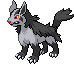

#262 - Mightyena
<table cellspacing="0" cellpadding="0"><tr><th colspan="1" align="center"></th><th colspan="1" align="center">Type</th><th colspan="1" align="center">Ability</th></tr><tr><td align="center";rowspan="1"></td><td align="center";rowspan="1"></td><td rowspan="1">(1) Intimidate   (2) Moxie   (HA) Quick Feet</td></tr><tr><th colspan="3" align="center">Defenses</th></tr><tr><td align="right">Immune:</td><td colspan="2"></td></tr><tr><td align="right">0.25x Resist:</td><td colspan="2"></td></tr><tr><td align="right">0.5x Resist:</td><td colspan="2"></td></tr><tr><td align="right">Neutral:</td><td colspan="2"></td></tr><tr><td align="right">2x Weak:</td><td colspan="2"></td></tr><tr><td align="right">4x Weak:</td><td colspan="2"></td></tr></table>

## Evolutions
<table>
<tr><td rowspan="1"style="vertical-align: middle;">    <a href="../261">Poochyena</a> </td><td rowspan="1"style="vertical-align: middle; word-break:break-all;">Level 18</td><td rowspan="1"style="vertical-align: middle;">    <a href="../262">Mightyena</a> </td></tr>
</table>

## Stats
<table class="stat"><tr><td class="stat-icon-single"></td><td class="stat-single"><u>HP</u> 70</td><td  class="stat-single">            <u>ATK                +20</u>                     110</td><td class="stat-single"><u>DEF</u> 70</td><td class="stat-single"><u>SPA</u> 60</td><td class="stat-single"><u>SPD</u> 60</td><td  class="stat-single">            <u>SPE                +20</u>                     90</td><td  class="stat-single">            <u>BST                +40</u>                     460</td></tr></table>

## Wild Hold Items
- 5%: Pecha Berry

## Level Up Moves
<table><th>Level</th><th>Name</th><th>Power</th><th>Accuracy</th><th>PP</th><th>Type</th><th>Damage Class</th><th>Effect</th>
<tr><td>1</td><td>Astonish</td><td>35</td><td>100</td><td>15</td><td></td><td></td><td>Priority: 0. Has a 30% chance to make the target flinch.</td></tr>
<tr><td>1</td><td>Lick</td><td>30</td><td>100</td><td>25</td><td></td><td></td><td>Priority: 0. Has a 30% chance to paralyze the target.</td></tr>
<tr><td>1</td><td>Sand Attack</td><td>None</td><td>100</td><td>15</td><td></td><td></td><td>Priority: 0. Lowers the target's accuracy by one stage.</td></tr>
<tr><td>1</td><td>Tackle</td><td>50</td><td>100</td><td>30</td><td></td><td></td><td>Priority: 0. Inflicts regular damage.</td></tr>
<tr><td>4</td><td>Howl</td><td>None</td><td>None</td><td>40</td><td></td><td></td><td>Priority: 0. Raises the user's Attack by one stage.</td></tr>
<tr><td>6</td><td>Bite</td><td>60</td><td>100</td><td>20</td><td></td><td></td><td>Priority: 0. Has a 30% chance to make the target flinch.</td></tr>
<tr><td>8</td><td>Mud-Slap</td><td>30</td><td>100</td><td>20</td><td></td><td></td><td>Priority: 0. Has a 100% chance to lower the target's accuracy by one stage.</td></tr>
<tr><td>10</td><td>Spite</td><td>None</td><td>100</td><td>10</td><td></td><td></td><td>Priority: 0. Lowers the PP of the target's last used move by 4.  If the target hasn't used a move since entering the field, if it tried to use a move this turn and failed, or if its last used move has 0 PP remaining, this move will fail.</td></tr>
<tr><td>12</td><td>Headbutt</td><td>70</td><td>100</td><td>15</td><td></td><td></td><td>Priority: 0. Has a 30% chance to make the target flinch.</td></tr>
<tr><td>14</td><td>Fire Fang</td><td>65</td><td>95</td><td>15</td><td></td><td></td><td>Priority: 0. Has a 10% chance to burn the target and a separate 10% chance to make the target flinch.</td></tr>
<tr><td>14</td><td>Ice Fang</td><td>65</td><td>95</td><td>15</td><td></td><td></td><td>Priority: 0. Has a 10% chance to freeze the target and a separate 10% chance to make the target flinch.</td></tr>
<tr><td>14</td><td>Thunder Fang</td><td>65</td><td>95</td><td>15</td><td></td><td></td><td>Priority: 0. Has a 10% chance to paralyze the target and a separate 10% chance to make the target flinch.</td></tr>
<tr><td>16</td><td>Scary Face</td><td>None</td><td>100</td><td>10</td><td></td><td></td><td>Priority: 0. Lowers the target's Speed by two stages.</td></tr>
<tr><td>18</td><td>Assurance</td><td>60</td><td>100</td><td>10</td><td></td><td></td><td>Priority: 0. If the target takes damage this turn for any reason before this move is used, this move has double power.</td></tr>
<tr><td>22</td><td>Poison Fang</td><td>65</td><td>95</td><td>15</td><td></td><td></td><td>Priority: 0. 50% chance to toxic poison target</td></tr>
<tr><td>25</td><td>Yawn</td><td>None</td><td>None</td><td>10</td><td></td><td></td><td>Priority: 0. Puts the target to sleep at the end of the next turn.  Ignores accuracy and evasion modifiers.</td></tr>
<tr><td>29</td><td>Sucker Punch</td><td>70</td><td>100</td><td>5</td><td></td><td></td><td>Priority: 1. If the target has not selected a damaging move this turn, or if the target has already acted this turn, this move will fail.  This move is not affected by iron fist.</td></tr>
<tr><td>33</td><td>Super Fang</td><td>None</td><td>90</td><td>10</td><td></td><td></td><td>Priority: 0. Inflicts typeless damage equal to half the target's remaining HP.</td></tr>
<tr><td>37</td><td>Lunge</td><td>80</td><td>100</td><td>15</td><td></td><td></td><td>Priority: 0. Lowers the target's Attack by one stage.</td></tr>
<tr><td>41</td><td>Psychic Fangs</td><td>85</td><td>100</td><td>10</td><td></td><td></td><td>Priority: 0. Destroys any light screen or reflect on the target's side of the field, then inflicts regular damage.</td></tr>
<tr><td>45</td><td>Play Rough</td><td>90</td><td>90</td><td>10</td><td></td><td></td><td>Priority: 0. Has a 10% chance to lower the target's Attack by one stage.</td></tr>
<tr><td>49</td><td>Crunch</td><td>80</td><td>100</td><td>10</td><td></td><td></td><td>Priority: 0. Has a 20% chance to lower the target's Defense by one stage.</td></tr>
<tr><td>53</td><td>Body Slam</td><td>85</td><td>100</td><td>15</td><td></td><td></td><td>Priority: 0. Has a 30% chance to paralyze the target.</td></tr>
<tr><td>57</td><td>Foul Play</td><td>95</td><td>100</td><td>15</td><td></td><td></td><td>Priority: 0. Damage is calculated using the target's attacking stat rather than the user's.</td></tr>
</table>

## TM Moves
<table><th>Machine</th><th>Name</th><th>Power</th><th>Accuracy</th><th>PP</th><th>Type</th><th>Damage Class</th><th>Effect</th>
<tr><td>TM5</td><td>Roar</td><td>None</td><td>None</td><td>20</td><td></td><td></td><td>Priority: -6. Switches the target out for another of its trainer's Pokémon selected at random.  Wild battles end immediately.</td></tr>
<tr><td>TM6</td><td>Toxic</td><td>None</td><td>90</td><td>10</td><td></td><td></td><td>Priority: 0. Badly poisons the target.  Never misses when used by a poison-type Pokémon.</td></tr>
<tr><td>TM10</td><td>Hidden Power</td><td>60</td><td>100</td><td>15</td><td></td><td></td><td>Priority: 0. Power and type depend upon user's IVs. Power can range from 30 to 70.</td></tr>
<tr><td>TM11</td><td>Sunny Day</td><td>None</td><td>None</td><td>5</td><td></td><td></td><td>Priority: 0. Changes the weather to sunshine for five turns.</td></tr>
<tr><td>TM12</td><td>Taunt</td><td>None</td><td>100</td><td>20</td><td></td><td></td><td>Priority: 0. Target is forced to only use damaging moves for the next 3–5 turns, selected at random.</td></tr>
<tr><td>TM15</td><td>Hyper Beam</td><td>150</td><td>90</td><td>5</td><td></td><td></td><td>Priority: 0. User loses its next turn to "recharge", and cannot attack or switch out during that turn.</td></tr>
<tr><td>TM17</td><td>Protect</td><td>None</td><td>None</td><td>10</td><td></td><td></td><td>Priority: 4. No moves will hit the user for the remainder of this turn. If the user is last to act this turn, this move will fail. Success rate drops by 1/2 on successive attempts.</td></tr>
<tr><td>TM18</td><td>Rain Dance</td><td>None</td><td>None</td><td>5</td><td></td><td></td><td>Priority: 0. Changes the weather to rain for five turns, during which water moves inflict 50% extra damage, and fire moves inflict half damage.</td></tr>
<tr><td>TM21</td><td>Frustration</td><td>None</td><td>100</td><td>20</td><td></td><td></td><td>Priority: 0. Power increases inversely with happiness, given by `(255 - happiness) * 2 / 5`, to a maximum of 102.  Power bottoms out at 1.</td></tr>
<tr><td>TM27</td><td>Return</td><td>None</td><td>100</td><td>20</td><td></td><td></td><td>Priority: 0. Power increases with happiness, given by `happiness * 2 / 5`, to a maximum of 102.  Power bottoms out at 1.</td></tr>
<tr><td>TM28</td><td>Dig</td><td>80</td><td>100</td><td>10</td><td></td><td></td><td>Priority: 0. User digs underground for one turn, becoming immune to attack, and hits on the second turn.  During the immune turn, earthquake, fissure, and magnitude still hit the user normally, and their power is doubled if appropriate.  The user may be hit during its immune turn if under the effect of lock on, mind reader, or no guard.  This move cannot be selected by sleep talk.</td></tr>
<tr><td>TM30</td><td>Shadow Ball</td><td>80</td><td>100</td><td>10</td><td></td><td></td><td>Priority: 0. Has a 20% chance to lower the target's Special Defense by one stage.</td></tr>
<tr><td>TM42</td><td>Facade</td><td>70</td><td>100</td><td>20</td><td></td><td></td><td>Priority: 0. If the user is burned, paralyzed, or poisoned, this move has double power.</td></tr>
<tr><td>TM44</td><td>Rest</td><td>None</td><td>None</td><td>10</td><td></td><td></td><td>Priority: 0. User falls to sleep for two turns, replacing any existing non-volatile status ailments, and immediately regains all its HP.</td></tr>
<tr><td>TM59</td><td>Incinerate</td><td>60</td><td>100</td><td>15</td><td></td><td></td><td>Priority: 0. If the target is holding a berry, it's destroyed and cannot be used in response to this move.</td></tr>
<tr><td>TM60</td><td>Quash</td><td>None</td><td>100</td><td>15</td><td></td><td></td><td>Priority: 0. Forces the target to act last this turn, regardless of Speed or move priority.  If the target has already acted this turn, this move will fail.</td></tr>
<tr><td>TM67</td><td>Retaliate</td><td>70</td><td>100</td><td>5</td><td></td><td></td><td>Priority: 0. If a friendly Pokémon fainted on the previous turn, this move has double power.</td></tr>
<tr><td>TM68</td><td>Giga Impact</td><td>150</td><td>90</td><td>5</td><td></td><td></td><td>Priority: 0. User loses its next turn to "recharge", and cannot attack or switch out during that turn.</td></tr>
<tr><td>TM85</td><td>Play Rough</td><td>90</td><td>90</td><td>10</td><td></td><td></td><td>Priority: 0. Has a 10% chance to lower the target's Attack by one stage.</td></tr>
<tr><td>TM90</td><td>Substitute</td><td>None</td><td>None</td><td>10</td><td></td><td></td><td>Priority: 0. Transfers 1/4 the user's max HP into a doll that absorbs damage and causes most negative move effects to fail.</td></tr>
<tr><td>TM94</td><td>Rock Smash</td><td>55</td><td>100</td><td>15</td><td></td><td></td><td>Priority: 0. 100% chance to drop target's Def by one stage. Also boosted by the ability Iron Fist</td></tr>
<tr><td>TM95</td><td>Snarl</td><td>55</td><td>100</td><td>15</td><td></td><td></td><td>Priority: 0. Has a 100% chance to lower the target's Special Attack by one stage.</td></tr>
<tr><td>HM4</td><td>Strength</td><td>85</td><td>100</td><td>10</td><td></td><td></td><td>Priority: 0. 10% Raise Attack</td></tr>
</table>

## Tutor Moves
<table><th>Name</th><th>Power</th><th>Accuracy</th><th>PP</th><th>Type</th><th>Damage Class</th><th>Effect</th>
<tr><td>Covet</td><td>60</td><td>100</td><td>20</td><td></td><td></td><td>Priority: 0. If the target is holding an item and the user is not, the user will permanently take the item.  Damage is still inflicted if an item cannot be taken.  Pokémon with sticky hold or multitype are immune to the item theft effect.  The target cannot recover its item with recycle.</td></tr>
<tr><td>Dark Pulse</td><td>80</td><td>Never Miss</td><td>10</td><td></td><td></td><td>Priority: 0. Has a 20% chance to make the target flinch.</td></tr>
<tr><td>Foul Play</td><td>95</td><td>100</td><td>15</td><td></td><td></td><td>Priority: 0. Damage is calculated using the target's attacking stat rather than the user's.</td></tr>
<tr><td>Hyper Voice</td><td>90</td><td>100</td><td>10</td><td></td><td></td><td>Priority: 0. Inflicts regular damage.</td></tr>
<tr><td>Iron Tail</td><td>100</td><td>75</td><td>15</td><td></td><td></td><td>Priority: 0. Has a 30% chance to lower the target's Defense by one stage.</td></tr>
<tr><td>Sleep Talk</td><td>None</td><td>None</td><td>10</td><td></td><td></td><td>Priority: 0. Only usable if the user is sleeping. Randomly selects and uses one of the user's other three moves. Use of the selected move requires and costs 0 PP.</td></tr>
<tr><td>Snatch</td><td>None</td><td>None</td><td>10</td><td></td><td></td><td>Priority: 4. The next time a Pokémon uses a beneficial move on itself or itself and its ally this turn, the user of this move will steal the move and use it itself.  Moves which may be stolen by this move are identified by the "snatchable" flag.  If two Pokémon use this move on the same turn, the faster Pokémon will steal the first beneficial move, and the slower Pokémon will then steal it again—thus, only the slowest Pokémon using this move ultimately gains a stolen move's effect.  If the user steals psych up, it will target the Pokémon that used psych up.  If the user was the original target of psych up, and the Pokémon that originally used it's affected by pressure, it will only lose 1 PP.  This move cannot be copied by mirror move, nor selected by assist or metronome.</td></tr>
<tr><td>Snore</td><td>50</td><td>100</td><td>15</td><td></td><td></td><td>Priority: 0. Only usable if the user is sleeping.   Has a 30% chance to make the target flinch.</td></tr>
<tr><td>Spite</td><td>None</td><td>100</td><td>10</td><td></td><td></td><td>Priority: 0. Lowers the PP of the target's last used move by 4.  If the target hasn't used a move since entering the field, if it tried to use a move this turn and failed, or if its last used move has 0 PP remaining, this move will fail.</td></tr>
<tr><td>Super Fang</td><td>None</td><td>90</td><td>10</td><td></td><td></td><td>Priority: 0. Inflicts typeless damage equal to half the target's remaining HP.</td></tr>
<tr><td>Uproar</td><td>90</td><td>100</td><td>10</td><td></td><td></td><td>Priority: 0. User is forced to use this move for 2–5 turns, selected at random. No Pokemon can sleep during the effect of this move. </td></tr>
</table>

## Encounter Locations

| Location | &nbsp; | Level | Spawn Percent |
|: -- :|: -- :|: -- :|: -- :|
| [Route 2] | Grass | 66 | 10.0 |
| [Route 3] | Hidden Grotto: Over the Clear, Blue Pond | ?? | 0.5 |
| [Route 9] | Dark Grass (Doubles) | 50-52 | 20.0 |

--8<-- "includes/abilities.md"

[Route 2]: ../../wildareas/Route_2/
[Route 3]: ../../wildareas/Route_3/
[Route 9]: ../../wildareas/Route_9/
