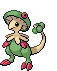

#285 - Shroomish
<table cellspacing="0" cellpadding="0"><tr><th colspan="1" align="center"></th><th colspan="1" align="center">Type</th><th colspan="1" align="center">Ability</th></tr><tr><td align="center";rowspan="1"></td><td align="center";rowspan="1"></td><td rowspan="1">(1) Effect Spore   (2) Poison Heal   (HA) Quick Feet</td></tr><tr><th colspan="3" align="center">Defenses</th></tr><tr><td align="right">Immune:</td><td colspan="2"></td></tr><tr><td align="right">0.25x Resist:</td><td colspan="2"></td></tr><tr><td align="right">0.5x Resist:</td><td colspan="2"></td></tr><tr><td align="right">Neutral:</td><td colspan="2"></td></tr><tr><td align="right">2x Weak:</td><td colspan="2"></td></tr><tr><td align="right">4x Weak:</td><td colspan="2"></td></tr></table>

## Evolutions
<table>
<tr><td rowspan="1"style="vertical-align: middle;">    <a href="../285">Shroomish</a> </td><td rowspan="1"style="vertical-align: middle; word-break:break-all;">Level 21</td><td rowspan="1"style="vertical-align: middle;">    <a href="../286">Breloom</a> </td></tr>
</table>

## Stats
<table class="stat"><tr><td class="stat-icon-single"></td><td class="stat-single"><u>HP</u> 60</td><td class="stat-single"><u>ATK</u> 40</td><td class="stat-single"><u>DEF</u> 60</td><td class="stat-single"><u>SPA</u> 40</td><td class="stat-single"><u>SPD</u> 60</td><td class="stat-single"><u>SPE</u> 35</td><td class="stat-single"><u>BST</u> 295</td></tr></table>

## Wild Hold Items
- 5%: Kebia Berry

## Level Up Moves
<table><th>Level</th><th>Name</th><th>Power</th><th>Accuracy</th><th>PP</th><th>Type</th><th>Damage Class</th><th>Effect</th>
<tr><td>1</td><td>Absorb</td><td>35</td><td>100</td><td>25</td><td></td><td></td><td>Priority: 0. Drains half the damage inflicted to heal the user.</td></tr>
<tr><td>1</td><td>Tackle</td><td>50</td><td>100</td><td>30</td><td></td><td></td><td>Priority: 0. Inflicts regular damage.</td></tr>
<tr><td>1</td><td>Worry Seed</td><td>None</td><td>100</td><td>10</td><td></td><td></td><td>Priority: 0. Changes the target's ability to insomnia.  If the target's ability is truant or multitype, this move will fail.</td></tr>
<tr><td>4</td><td>Leech Seed</td><td>None</td><td>90</td><td>10</td><td></td><td></td><td>Priority: 0. Plants a seed on the target that drains 1/8 of its max HP at the end of every turn and heals the user for the amount taken.</td></tr>
<tr><td>8</td><td>Grass Whistle</td><td>None</td><td>65</td><td>15</td><td></td><td></td><td>Priority: 0. Puts the target to sleep.</td></tr>
<tr><td>10</td><td>Mega Drain</td><td>65</td><td>100</td><td>15</td><td></td><td></td><td>Priority: 0. Drains half the damage inflicted to heal the user.</td></tr>
<tr><td>12</td><td>Headbutt</td><td>70</td><td>100</td><td>15</td><td></td><td></td><td>Priority: 0. Has a 30% chance to make the target flinch.</td></tr>
<tr><td>14</td><td>Charm</td><td>None</td><td>100</td><td>20</td><td></td><td></td><td>Priority: 0. Lowers the target's Attack by two stages.</td></tr>
<tr><td>16</td><td>Helping Hand</td><td>None</td><td>None</td><td>20</td><td></td><td></td><td>Priority: 5. Boosts the power of the target's moves by 50% until the end of this turn.  This move cannot be copied by mirror move, nor selected by assist or metronome.</td></tr>
<tr><td>19</td><td>Counter</td><td>None</td><td>100</td><td>20</td><td></td><td></td><td>Priority: -5. Targets the last opposing Pokémon to hit the user with a physical move this turn.  Inflicts twice the damage that move did to the user.</td></tr>
<tr><td>22</td><td>Wake-Up Slap</td><td>70</td><td>100</td><td>10</td><td></td><td></td><td>Priority: 0. If the target is sleeping, this move has double power, and the target wakes up.</td></tr>
<tr><td>25</td><td>Poison Powder</td><td>None</td><td>75</td><td>20</td><td></td><td></td><td>Priority: 0. Poisons the target.</td></tr>
<tr><td>25</td><td>Sleep Powder</td><td>None</td><td>75</td><td>15</td><td></td><td></td><td>Priority: 0. Puts the target to sleep.</td></tr>
<tr><td>25</td><td>Stun Spore</td><td>None</td><td>90</td><td>20</td><td></td><td></td><td>Priority: 0. Paralyzes the target.</td></tr>
<tr><td>28</td><td>Counter</td><td>None</td><td>100</td><td>20</td><td></td><td></td><td>Priority: -5. Targets the last opposing Pokémon to hit the user with a physical move this turn.  Inflicts twice the damage that move did to the user.</td></tr>
<tr><td>31</td><td>Fake Tears</td><td>None</td><td>100</td><td>20</td><td></td><td></td><td>Priority: 0. Lowers the target's Special Defense by two stages.</td></tr>
<tr><td>34</td><td>Take Down</td><td>90</td><td>85</td><td>20</td><td></td><td></td><td>Priority: 0. User takes 1/4 the damage it inflicts in recoil.</td></tr>
<tr><td>38</td><td>Safeguard</td><td>None</td><td>None</td><td>25</td><td></td><td></td><td>Priority: 0. Protects Pokémon on the user's side of the field from major status effects and confusion for five turns.  Does not cancel existing ailments.</td></tr>
<tr><td>42</td><td>Giga Drain</td><td>80</td><td>100</td><td>10</td><td></td><td></td><td>Priority: 0. Drains half the damage inflicted to heal the user.</td></tr>
<tr><td>46</td><td>Zen Headbutt</td><td>80</td><td>90</td><td>10</td><td></td><td></td><td>Priority: 0. Has a 20% chance to make the target flinch.</td></tr>
<tr><td>50</td><td>Lunge</td><td>80</td><td>100</td><td>15</td><td></td><td></td><td>Priority: 0. Lowers the target's Attack by one stage.</td></tr>
<tr><td>54</td><td>Spore</td><td>None</td><td>100</td><td>10</td><td></td><td></td><td>Priority: 0. Puts the target to sleep.</td></tr>
<tr><td>58</td><td>Leaf Storm</td><td>130</td><td>90</td><td>5</td><td></td><td></td><td>Priority: 0. Inflicts regular damage, then lowers the user's Special Attack by two stages.</td></tr>
</table>

## TM Moves
<table><th>Machine</th><th>Name</th><th>Power</th><th>Accuracy</th><th>PP</th><th>Type</th><th>Damage Class</th><th>Effect</th>
<tr><td>TM6</td><td>Toxic</td><td>None</td><td>90</td><td>10</td><td></td><td></td><td>Priority: 0. Badly poisons the target.  Never misses when used by a poison-type Pokémon.</td></tr>
<tr><td>TM9</td><td>Venoshock</td><td>65</td><td>100</td><td>15</td><td></td><td></td><td>Priority: 0. If the target is poisoned, this move has double power.</td></tr>
<tr><td>TM10</td><td>Hidden Power</td><td>60</td><td>100</td><td>15</td><td></td><td></td><td>Priority: 0. Power and type depend upon user's IVs. Power can range from 30 to 70.</td></tr>
<tr><td>TM11</td><td>Sunny Day</td><td>None</td><td>None</td><td>5</td><td></td><td></td><td>Priority: 0. Changes the weather to sunshine for five turns.</td></tr>
<tr><td>TM17</td><td>Protect</td><td>None</td><td>None</td><td>10</td><td></td><td></td><td>Priority: 4. No moves will hit the user for the remainder of this turn. If the user is last to act this turn, this move will fail. Success rate drops by 1/2 on successive attempts.</td></tr>
<tr><td>TM19</td><td>Giga Drain</td><td>80</td><td>100</td><td>10</td><td></td><td></td><td>Priority: 0. Drains half the damage inflicted to heal the user.</td></tr>
<tr><td>TM21</td><td>Frustration</td><td>None</td><td>100</td><td>20</td><td></td><td></td><td>Priority: 0. Power increases inversely with happiness, given by `(255 - happiness) * 2 / 5`, to a maximum of 102.  Power bottoms out at 1.</td></tr>
<tr><td>TM22</td><td>Solar Beam</td><td>120</td><td>100</td><td>10</td><td></td><td></td><td>Priority: 0. User charges for one turn before attacking.</td></tr>
<tr><td>TM27</td><td>Return</td><td>None</td><td>100</td><td>20</td><td></td><td></td><td>Priority: 0. Power increases with happiness, given by `happiness * 2 / 5`, to a maximum of 102.  Power bottoms out at 1.</td></tr>
<tr><td>TM36</td><td>Sludge Bomb</td><td>90</td><td>100</td><td>10</td><td></td><td></td><td>Priority: 0. Has a 30% chance to poison the target.</td></tr>
<tr><td>TM42</td><td>Facade</td><td>70</td><td>100</td><td>20</td><td></td><td></td><td>Priority: 0. If the user is burned, paralyzed, or poisoned, this move has double power.</td></tr>
<tr><td>TM44</td><td>Rest</td><td>None</td><td>None</td><td>10</td><td></td><td></td><td>Priority: 0. User falls to sleep for two turns, replacing any existing non-volatile status ailments, and immediately regains all its HP.</td></tr>
<tr><td>TM53</td><td>Energy Ball</td><td>90</td><td>100</td><td>10</td><td></td><td></td><td>Priority: 0. Has a 10% chance to lower the target's Special Defense by one stage.</td></tr>
<tr><td>TM54</td><td>False Swipe</td><td>40</td><td>100</td><td>30</td><td></td><td></td><td>Priority: 0. Will not reduce the target's HP below 1.</td></tr>
<tr><td>TM70</td><td>Flash</td><td>None</td><td>100</td><td>20</td><td></td><td></td><td>Priority: 0. Lowers the target's accuracy by one stage.</td></tr>
<tr><td>TM75</td><td>Swords Dance</td><td>None</td><td>None</td><td>20</td><td></td><td></td><td>Priority: 0. Raises the user's Attack by two stages.</td></tr>
<tr><td>TM86</td><td>Grass Knot</td><td>None</td><td>100</td><td>20</td><td></td><td></td><td>Priority: 0. Power increases with the target's weight in kilograms, to a maximum of 120.</td></tr>
<tr><td>TM90</td><td>Substitute</td><td>None</td><td>None</td><td>10</td><td></td><td></td><td>Priority: 0. Transfers 1/4 the user's max HP into a doll that absorbs damage and causes most negative move effects to fail.</td></tr>
</table>

## Tutor Moves
<table><th>Name</th><th>Power</th><th>Accuracy</th><th>PP</th><th>Type</th><th>Damage Class</th><th>Effect</th>
<tr><td>Drain Punch</td><td>75</td><td>100</td><td>10</td><td></td><td></td><td>Priority: 0. Drains half the damage inflicted to heal the user.</td></tr>
<tr><td>Giga Drain</td><td>80</td><td>100</td><td>10</td><td></td><td></td><td>Priority: 0. Drains half the damage inflicted to heal the user.</td></tr>
<tr><td>Helping Hand</td><td>None</td><td>None</td><td>20</td><td></td><td></td><td>Priority: 5. Boosts the power of the target's moves by 50% until the end of this turn.  This move cannot be copied by mirror move, nor selected by assist or metronome.</td></tr>
<tr><td>Seed Bomb</td><td>80</td><td>100</td><td>15</td><td></td><td></td><td>Priority: 0. Inflicts regular damage.</td></tr>
<tr><td>Sleep Talk</td><td>None</td><td>None</td><td>10</td><td></td><td></td><td>Priority: 0. Only usable if the user is sleeping. Randomly selects and uses one of the user's other three moves. Use of the selected move requires and costs 0 PP.</td></tr>
<tr><td>Snatch</td><td>None</td><td>None</td><td>10</td><td></td><td></td><td>Priority: 4. The next time a Pokémon uses a beneficial move on itself or itself and its ally this turn, the user of this move will steal the move and use it itself.  Moves which may be stolen by this move are identified by the "snatchable" flag.  If two Pokémon use this move on the same turn, the faster Pokémon will steal the first beneficial move, and the slower Pokémon will then steal it again—thus, only the slowest Pokémon using this move ultimately gains a stolen move's effect.  If the user steals psych up, it will target the Pokémon that used psych up.  If the user was the original target of psych up, and the Pokémon that originally used it's affected by pressure, it will only lose 1 PP.  This move cannot be copied by mirror move, nor selected by assist or metronome.</td></tr>
<tr><td>Snore</td><td>50</td><td>100</td><td>15</td><td></td><td></td><td>Priority: 0. Only usable if the user is sleeping.   Has a 30% chance to make the target flinch.</td></tr>
<tr><td>Synthesis</td><td>None</td><td>None</td><td>5</td><td></td><td></td><td>Priority: 0. Heals the user for half its max HP, plus modifiers from weather.</td></tr>
<tr><td>Worry Seed</td><td>None</td><td>100</td><td>10</td><td></td><td></td><td>Priority: 0. Changes the target's ability to insomnia.  If the target's ability is truant or multitype, this move will fail.</td></tr>
</table>

## Encounter Locations

| Location | &nbsp; | &nbsp; | Level | Spawn Percent |
|: -- :|: -- :|: -- :|: -- :|: -- :|
| [Pinwheel Forest - Inside] | Grass | &nbsp; | 61 | 10.0 |
| [Route 16] | Grass | &nbsp; | 27-29 | 5.0 |
| [Route 20] | Autumn | Dark Grass (Doubles) | 11-14 | 4.0 |
| [Route 20] | Autumn | Grass | 05-07 | 5.0 |
| [Route 20] | Spring | Dark Grass (Doubles) | 11-14 | 4.0 |
| [Route 20] | Spring | Grass | 05-07 | 5.0 |
| [Route 6] | Spring, Summer, Autumn | Hidden Grotto: Driftveil Entrance | ?? | 3.75 |
| [Route 6] | Winter | Hidden Grotto: Driftveil Entrance | ?? | 3.75 |

--8<-- "includes/abilities.md"

[Route 16]: ../../wildareas/Route_16/
[Route 6]: ../../wildareas/Route_6/
[Route 20]: ../../wildareas/Route_20/
[Pinwheel Forest - Inside]: ../../wildareas/Pinwheel_Forest_-_Inside/
