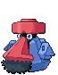

#299 - Nosepass
<table cellspacing="0" cellpadding="0"><tr><th colspan="1" align="center"></th><th colspan="1" align="center">Type</th><th colspan="1" align="center">Ability</th></tr><tr><td align="center";rowspan="1"></td><td align="center";rowspan="1"></td><td rowspan="1">(1) Sturdy   (2) Sand Force   (HA) Magnet Pull</td></tr><tr><th colspan="3" align="center">Defenses</th></tr><tr><td align="right">Immune:</td><td colspan="2"></td></tr><tr><td align="right">0.25x Resist:</td><td colspan="2"></td></tr><tr><td align="right">0.5x Resist:</td><td colspan="2"></td></tr><tr><td align="right">Neutral:</td><td colspan="2"></td></tr><tr><td align="right">2x Weak:</td><td colspan="2"></td></tr><tr><td align="right">4x Weak:</td><td colspan="2"></td></tr></table>

## Evolutions
<table>
<tr><td rowspan="1"style="vertical-align: middle;">    <a href="../299">Nosepass</a> </td><td rowspan="1"style="vertical-align: middle; word-break:break-all;">Level up at Electric Rock in Chargestone cave</td><td rowspan="1"style="vertical-align: middle;">    <a href="../476">Probopass</a> </td></tr>
</table>

## Stats
<table class="stat"><tr><td class="stat-icon-single"></td><td class="stat-single"><u>HP</u> 30</td><td  class="stat-single">            <u>ATK                -10</u>                     35</td><td class="stat-single"><u>DEF</u> 135</td><td  class="stat-single">            <u>SPA                +10</u>                     55</td><td class="stat-single"><u>SPD</u> 90</td><td class="stat-single"><u>SPE</u> 30</td><td class="stat-single"><u>BST</u> 375</td></tr></table>

## Wild Hold Items
- 5%: Hard Stone

## Level Up Moves
<table><th>Level</th><th>Name</th><th>Power</th><th>Accuracy</th><th>PP</th><th>Type</th><th>Damage Class</th><th>Effect</th>
<tr><td>1</td><td>Block</td><td>None</td><td>None</td><td>5</td><td></td><td></td><td>Priority: 0. The target cannot switch out normally.</td></tr>
<tr><td>1</td><td>Harden</td><td>None</td><td>None</td><td>30</td><td></td><td></td><td>Priority: 0. Raises the user's Defense by one stage.</td></tr>
<tr><td>1</td><td>Tackle</td><td>50</td><td>100</td><td>30</td><td></td><td></td><td>Priority: 0. Inflicts regular damage.</td></tr>
<tr><td>4</td><td>Explosion</td><td>250</td><td>100</td><td>5</td><td></td><td></td><td>Priority: 0. User faints, even if the attack fails or misses.  Inflicts regular damage.</td></tr>
<tr><td>7</td><td>Magnitude</td><td>None</td><td>100</td><td>30</td><td></td><td></td><td>Priority: 0. Power is selected at random between 10 and 150, with an average of 71:  Magnitude | Power | Chance --------: | ----: | -----:         4 |    10 |     5%         5 |    30 |    10%         6 |    50 |    20%         7 |    70 |    30%         8 |    90 |    20%         9 |   110 |    10%        10 |   150 |     5%  This move has double power against Pokémon currently underground due to dig.</td></tr>
<tr><td>10</td><td>Rock Throw</td><td>50</td><td>90</td><td>15</td><td></td><td></td><td>Priority: 0. Inflicts regular damage.</td></tr>
<tr><td>13</td><td>Spark</td><td>65</td><td>100</td><td>20</td><td></td><td></td><td>Priority: 0. Has a 30% chance to paralyze the target.</td></tr>
<tr><td>16</td><td>Rock Blast</td><td>25</td><td>90</td><td>10</td><td></td><td></td><td>Priority: 0. Hits 2–5 times in one turn.  Has a 3/8 chance each to hit 2 or 3 times, and a 1/8 chance each to hit 4 or 5 times.  Averages to 3 hits per use.</td></tr>
<tr><td>19</td><td>Iron Defense</td><td>None</td><td>None</td><td>15</td><td></td><td></td><td>Priority: 0. Raises the user's Defense by two stages.</td></tr>
<tr><td>22</td><td>Thunder Wave</td><td>None</td><td>90</td><td>20</td><td></td><td></td><td>Priority: 0. Paralyzes the target.</td></tr>
<tr><td>25</td><td>Ancient Power</td><td>60</td><td>100</td><td>5</td><td></td><td></td><td>Priority: 0. Has a 10% chance to raise all of the user's stats one stage.</td></tr>
<tr><td>28</td><td>Charge Beam</td><td>50</td><td>90</td><td>15</td><td></td><td></td><td>Priority: 0. Has a 70% chance to raise the user's Special Attack by one stage.</td></tr>
<tr><td>31</td><td>Sandstorm</td><td>None</td><td>None</td><td>10</td><td></td><td></td><td>Priority: 0. Changes the weather to a sandstorm for five turns.  Pokémon that are not ground, rock, or steel take 1/16 their max HP at the end of every turn.  Every rock Pokémon's original Special Defense is raised by 50% for the duration of this effect.</td></tr>
<tr><td>34</td><td>Pain Split</td><td>None</td><td>None</td><td>20</td><td></td><td></td><td>Priority: 0. Changes the user's and target's remaining HP to the average of their current remaining HP.</td></tr>
<tr><td>38</td><td>Magnet Rise</td><td>None</td><td>None</td><td>10</td><td></td><td></td><td>Priority: 0. For five turns, the user is immune to ground moves.  If the user is under the effect of ingrain or has levitate, this move will fail.  This effect is temporarily disabled by and cannot be used during gravity.  This effect is passed on by baton pass.</td></tr>
<tr><td>42</td><td>Gravity</td><td>None</td><td>None</td><td>5</td><td></td><td></td><td>Priority: 0. For five turns (including this one), all immunities to ground moves are disabled.  For the duration of this effect, the evasion of every Pokémon on the field is lowered by two stages.  Cancels the effects of bounce, fly, and sky drop.  Specifically, flying Pokémon and those with levitate or that have used magnet rise are no longer immune to ground attacks, arena trap, spikes, or toxic spikes.  bounce, fly, sky drop, high jump kick, jump kick, and splash cannot be used while this move is in effect.  *Bug*: If this move is used during a double or triple battle while Pokémon are under the effect of sky drop, Sky Drop's effect is not correctly canceled on its target, and it remains high in the air indefinitely.  As Sky Drop prevents the target from acting, the only way to subsequently remove it from the field is to faint it.</td></tr>
<tr><td>46</td><td>Discharge</td><td>80</td><td>100</td><td>15</td><td></td><td></td><td>Priority: 0. Has a 30% chance to paralyze the target.</td></tr>
<tr><td>50</td><td>Wide Guard</td><td>None</td><td>None</td><td>10</td><td></td><td></td><td>Priority: 3. Moves with multiple targets will not hit friendly Pokémon for the remainder of this turn.  If the user is last to act this turn, this move will fail.  This move cannot be selected by assist or metronome.</td></tr>
<tr><td>54</td><td>Lock-On</td><td>None</td><td>None</td><td>5</td><td></td><td></td><td>Priority: 0. If the user targets the same target again before the end of the next turn, the move it uses is guaranteed to hit.</td></tr>
<tr><td>58</td><td>Zap Cannon</td><td>120</td><td>50</td><td>5</td><td></td><td></td><td>Priority: 0. Has a 100% chance to paralyze the target.</td></tr>
<tr><td>62</td><td>Head Smash</td><td>150</td><td>85</td><td>5</td><td></td><td></td><td>Priority: 0. User takes 1/2 the damage it inflicts in recoil.</td></tr>
</table>

## TM Moves
<table><th>Machine</th><th>Name</th><th>Power</th><th>Accuracy</th><th>PP</th><th>Type</th><th>Damage Class</th><th>Effect</th>
<tr><td>TM6</td><td>Toxic</td><td>None</td><td>90</td><td>10</td><td></td><td></td><td>Priority: 0. Badly poisons the target.  Never misses when used by a poison-type Pokémon.</td></tr>
<tr><td>TM10</td><td>Hidden Power</td><td>60</td><td>100</td><td>15</td><td></td><td></td><td>Priority: 0. Power and type depend upon user's IVs. Power can range from 30 to 70.</td></tr>
<tr><td>TM11</td><td>Sunny Day</td><td>None</td><td>None</td><td>5</td><td></td><td></td><td>Priority: 0. Changes the weather to sunshine for five turns.</td></tr>
<tr><td>TM12</td><td>Taunt</td><td>None</td><td>100</td><td>20</td><td></td><td></td><td>Priority: 0. Target is forced to only use damaging moves for the next 3–5 turns, selected at random.</td></tr>
<tr><td>TM17</td><td>Protect</td><td>None</td><td>None</td><td>10</td><td></td><td></td><td>Priority: 4. No moves will hit the user for the remainder of this turn. If the user is last to act this turn, this move will fail. Success rate drops by 1/2 on successive attempts.</td></tr>
<tr><td>TM21</td><td>Frustration</td><td>None</td><td>100</td><td>20</td><td></td><td></td><td>Priority: 0. Power increases inversely with happiness, given by `(255 - happiness) * 2 / 5`, to a maximum of 102.  Power bottoms out at 1.</td></tr>
<tr><td>TM23</td><td>Smack Down</td><td>50</td><td>100</td><td>15</td><td></td><td></td><td>Priority: 0. Removes the target's immunity to ground-type damage.  This effect removes any existing Ground immunity due to levitate, magnet rise, or telekinesis, and causes the target's flying type to be ignored when it takes Ground damage.  If the target isn't immune to Ground damage, this move will fail.  This move can hit Pokémon under the effect of bounce, fly, or sky drop, and ends the effect of Bounce or Fly.</td></tr>
<tr><td>TM24</td><td>Thunderbolt</td><td>90</td><td>100</td><td>10</td><td></td><td></td><td>Priority: 0. Has a 10% chance to paralyze the target.</td></tr>
<tr><td>TM25</td><td>Thunder</td><td>110</td><td>70</td><td>5</td><td></td><td></td><td>Priority: 0. Has a 30% chance to paralyze the target.  During rain dance, this move has 100% accuracy.  During sunny day, this move has 50% accuracy.</td></tr>
<tr><td>TM26</td><td>Earthquake</td><td>100</td><td>100</td><td>10</td><td></td><td></td><td>Priority: 0. Inflicts regular damage.  If the target is in the first turn of dig, this move will hit with double power.</td></tr>
<tr><td>TM27</td><td>Return</td><td>None</td><td>100</td><td>20</td><td></td><td></td><td>Priority: 0. Power increases with happiness, given by `happiness * 2 / 5`, to a maximum of 102.  Power bottoms out at 1.</td></tr>
<tr><td>TM32</td><td>Dazzling Gleam</td><td>80</td><td>100</td><td>10</td><td></td><td></td><td>Priority: 0. Inflicts regular damage.</td></tr>
<tr><td>TM37</td><td>Sandstorm</td><td>None</td><td>None</td><td>10</td><td></td><td></td><td>Priority: 0. Changes the weather to a sandstorm for five turns.  Pokémon that are not ground, rock, or steel take 1/16 their max HP at the end of every turn.  Every rock Pokémon's original Special Defense is raised by 50% for the duration of this effect.</td></tr>
<tr><td>TM39</td><td>Rock Tomb</td><td>60</td><td>95</td><td>15</td><td></td><td></td><td>Priority: 0. Has a 100% chance to lower the target's Speed by one stage.</td></tr>
<tr><td>TM42</td><td>Facade</td><td>70</td><td>100</td><td>20</td><td></td><td></td><td>Priority: 0. If the user is burned, paralyzed, or poisoned, this move has double power.</td></tr>
<tr><td>TM44</td><td>Rest</td><td>None</td><td>None</td><td>10</td><td></td><td></td><td>Priority: 0. User falls to sleep for two turns, replacing any existing non-volatile status ailments, and immediately regains all its HP.</td></tr>
<tr><td>TM57</td><td>Charge Beam</td><td>50</td><td>90</td><td>15</td><td></td><td></td><td>Priority: 0. Has a 70% chance to raise the user's Special Attack by one stage.</td></tr>
<tr><td>TM64</td><td>Explosion</td><td>250</td><td>100</td><td>5</td><td></td><td></td><td>Priority: 0. User faints, even if the attack fails or misses.  Inflicts regular damage.</td></tr>
<tr><td>TM66</td><td>Power Gem</td><td>90</td><td>100</td><td>10</td><td></td><td></td><td>Priority: 0. 10% chance to drop opponents Sp. Def by one stage</td></tr>
<tr><td>TM69</td><td>Rock Polish</td><td>None</td><td>None</td><td>20</td><td></td><td></td><td>Priority: 0. Raises the user's Speed by two stages.</td></tr>
<tr><td>TM71</td><td>Stone Edge</td><td>100</td><td>80</td><td>5</td><td></td><td></td><td>Priority: 0. User's critical hit rate is one level higher when using this move.</td></tr>
<tr><td>TM72</td><td>Volt Switch</td><td>70</td><td>100</td><td>20</td><td></td><td></td><td>Priority: 0. Inflicts regular damage, then the user immediately switches out, and the trainer selects a replacement Pokémon from the party.  If the target faints from this attack, the user's trainer selects the new Pokémon to send out first.  If the user is the last Pokémon in its party that can battle, it will not switch out.  The user may be hit by pursuit when it switches out, if it has been targeted and pursuit has not yet been used.  This move may be used even if the user is under the effect of ingrain.  ingrain's effect will end.</td></tr>
<tr><td>TM73</td><td>Thunder Wave</td><td>None</td><td>90</td><td>20</td><td></td><td></td><td>Priority: 0. Paralyzes the target.</td></tr>
<tr><td>TM78</td><td>Bulldoze</td><td>60</td><td>100</td><td>20</td><td></td><td></td><td>Priority: 0. Has a 100% chance to lower the target's Speed by one stage.</td></tr>
<tr><td>TM80</td><td>Rock Slide</td><td>75</td><td>90</td><td>10</td><td></td><td></td><td>Priority: 0. Has a 30% chance to make the target flinch.</td></tr>
<tr><td>TM90</td><td>Substitute</td><td>None</td><td>None</td><td>10</td><td></td><td></td><td>Priority: 0. Transfers 1/4 the user's max HP into a doll that absorbs damage and causes most negative move effects to fail.</td></tr>
<tr><td>TM94</td><td>Rock Smash</td><td>55</td><td>100</td><td>15</td><td></td><td></td><td>Priority: 0. 100% chance to drop target's Def by one stage. Also boosted by the ability Iron Fist</td></tr>
<tr><td>HM4</td><td>Strength</td><td>85</td><td>100</td><td>10</td><td></td><td></td><td>Priority: 0. 10% Raise Attack</td></tr>
</table>

## Tutor Moves
<table><th>Name</th><th>Power</th><th>Accuracy</th><th>PP</th><th>Type</th><th>Damage Class</th><th>Effect</th>
<tr><td>Block</td><td>None</td><td>None</td><td>5</td><td></td><td></td><td>Priority: 0. The target cannot switch out normally.</td></tr>
<tr><td>Earth Power</td><td>90</td><td>100</td><td>10</td><td></td><td></td><td>Priority: 0. Has a 10% chance to lower the target's Special Defense by one stage.</td></tr>
<tr><td>Fire Punch</td><td>75</td><td>100</td><td>10</td><td></td><td></td><td>Priority: 0. Has a 10% chance to burn the target.</td></tr>
<tr><td>Gravity</td><td>None</td><td>None</td><td>5</td><td></td><td></td><td>Priority: 0. For five turns (including this one), all immunities to ground moves are disabled.  For the duration of this effect, the evasion of every Pokémon on the field is lowered by two stages.  Cancels the effects of bounce, fly, and sky drop.  Specifically, flying Pokémon and those with levitate or that have used magnet rise are no longer immune to ground attacks, arena trap, spikes, or toxic spikes.  bounce, fly, sky drop, high jump kick, jump kick, and splash cannot be used while this move is in effect.  *Bug*: If this move is used during a double or triple battle while Pokémon are under the effect of sky drop, Sky Drop's effect is not correctly canceled on its target, and it remains high in the air indefinitely.  As Sky Drop prevents the target from acting, the only way to subsequently remove it from the field is to faint it.</td></tr>
<tr><td>Ice Punch</td><td>75</td><td>100</td><td>10</td><td></td><td></td><td>Priority: 0. Has a 10% chance to freeze the target.</td></tr>
<tr><td>Iron Defense</td><td>None</td><td>None</td><td>15</td><td></td><td></td><td>Priority: 0. Raises the user's Defense by two stages.</td></tr>
<tr><td>Magic Coat</td><td>None</td><td>None</td><td>15</td><td></td><td></td><td>Priority: 4. The first non-damaging move targeting the user this turn that inflicts major status effects, stat changes, or trapping effects will be reflected at its user.  defog, memento, and teeter dance are not reflected.  attract, flatter, gastro acid, leech seed, swagger, worry seed, and yawn are reflected.  This move cannot be copied by mirror move.</td></tr>
<tr><td>Magnet Rise</td><td>None</td><td>None</td><td>10</td><td></td><td></td><td>Priority: 0. For five turns, the user is immune to ground moves.  If the user is under the effect of ingrain or has levitate, this move will fail.  This effect is temporarily disabled by and cannot be used during gravity.  This effect is passed on by baton pass.</td></tr>
<tr><td>Pain Split</td><td>None</td><td>None</td><td>20</td><td></td><td></td><td>Priority: 0. Changes the user's and target's remaining HP to the average of their current remaining HP.</td></tr>
<tr><td>Sleep Talk</td><td>None</td><td>None</td><td>10</td><td></td><td></td><td>Priority: 0. Only usable if the user is sleeping. Randomly selects and uses one of the user's other three moves. Use of the selected move requires and costs 0 PP.</td></tr>
<tr><td>Snore</td><td>50</td><td>100</td><td>15</td><td></td><td></td><td>Priority: 0. Only usable if the user is sleeping.   Has a 30% chance to make the target flinch.</td></tr>
<tr><td>Stealth Rock</td><td>None</td><td>None</td><td>20</td><td></td><td></td><td>Priority: 0. Spreads sharp rocks around the opposing field, damaging any Pokémon that enters the field for 1/8 its max HP.  This damage is affected by the entering Pokémon's susceptibility to rock moves.  rapid spin removes this effect from its user's side of the field.</td></tr>
<tr><td>Thunder Punch</td><td>75</td><td>100</td><td>10</td><td></td><td></td><td>Priority: 0. Has a 10% chance to paralyze the target.</td></tr>
</table>

## Encounter Locations

| Location | &nbsp; | &nbsp; | Level | Spawn Percent |
|: -- :|: -- :|: -- :|: -- :|: -- :|
| [Chargestone Cave] | 1F | Cave | 32-36 | 20.0 |
| [Chargestone Cave] | 1F | Dust Cloud | 32-36 | 50.0 |
| [Chargestone Cave] | B1F | Cave | 36-40 | 20.0 |
| [Chargestone Cave] | B1F | Dust Cloud | 36-40 | 50.0 |
| [Chargestone Cave] | B2F | Cave | 38-41 | 20.0 |
| [Route 6] | Spring, Summer, Autumn | Hidden Grotto:  Mistralton Cave Entrance | ?? | 1.0 |
| [Route 6] | Winter | Hidden Grotto:  Mistralton Cave Entrance | ?? | 1.0 |
| [Underground Ruins] | Regi Rooms | Cave | 68 | 10.0 |
| [Underground Ruins] | Regular Chambers | Cave | 67 | 10.0 |

--8<-- "includes/abilities.md"

[Route 6]: ../../wildareas/Route_6/
[Chargestone Cave]: ../../wildareas/Chargestone_Cave/
[Underground Ruins]: ../../wildareas/Underground_Ruins/
