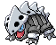

#304 - Aron
<table cellspacing="0" cellpadding="0"><tr><th colspan="1" align="center"></th><th colspan="1" align="center">Type</th><th colspan="1" align="center">Ability</th></tr><tr><td align="center";rowspan="1"></td><td align="center";rowspan="1"> </td><td rowspan="1">(1) Filter   (2) Rock Head   (HA) Sturdy</td></tr><tr><th colspan="3" align="center">Defenses</th></tr><tr><td align="right">Immune:</td><td colspan="2"></td></tr><tr><td align="right">0.25x Resist:</td><td colspan="2"></td></tr><tr><td align="right">0.5x Resist:</td><td colspan="2"></td></tr><tr><td align="right">Neutral:</td><td colspan="2"></td></tr><tr><td align="right">2x Weak:</td><td colspan="2"></td></tr><tr><td align="right">4x Weak:</td><td colspan="2"></td></tr></table>

## Evolutions
<table>
<tr><td rowspan="1"style="vertical-align: middle;">    <a href="../304">Aron</a> </td><td rowspan="1"style="vertical-align: middle; word-break:break-all;">Level 24</td><td rowspan="1"style="vertical-align: middle;">    <a href="../305">Lairon</a> </td><td rowspan="1"style="vertical-align: middle; word-break:break-all;">Level 40</td><td rowspan="1"style="vertical-align: middle;">    <a href="../306">Aggron</a> </td></tr>
</table>

## Stats
<table class="stat"><tr><td class="stat-icon-single"></td><td class="stat-single"><u>HP</u> 50</td><td class="stat-single"><u>ATK</u> 70</td><td class="stat-single"><u>DEF</u> 100</td><td class="stat-single"><u>SPA</u> 40</td><td class="stat-single"><u>SPD</u> 40</td><td class="stat-single"><u>SPE</u> 30</td><td class="stat-single"><u>BST</u> 330</td></tr></table>

## Wild Hold Items
- 5%: Hard Stone

## Level Up Moves
<table><th>Level</th><th>Name</th><th>Power</th><th>Accuracy</th><th>PP</th><th>Type</th><th>Damage Class</th><th>Effect</th>
<tr><td>1</td><td>Endure</td><td>None</td><td>None</td><td>10</td><td></td><td></td><td>Priority: 4. The user's HP cannot be lowered below 1 by any means for the remainder of this turn.</td></tr>
<tr><td>1</td><td>Harden</td><td>None</td><td>None</td><td>30</td><td></td><td></td><td>Priority: 0. Raises the user's Defense by one stage.</td></tr>
<tr><td>1</td><td>Tackle</td><td>50</td><td>100</td><td>30</td><td></td><td></td><td>Priority: 0. Inflicts regular damage.</td></tr>
<tr><td>4</td><td>Mud-Slap</td><td>30</td><td>100</td><td>20</td><td></td><td></td><td>Priority: 0. Has a 100% chance to lower the target's accuracy by one stage.</td></tr>
<tr><td>7</td><td>Headbutt</td><td>70</td><td>100</td><td>15</td><td></td><td></td><td>Priority: 0. Has a 30% chance to make the target flinch.</td></tr>
<tr><td>10</td><td>Rock Throw</td><td>50</td><td>90</td><td>15</td><td></td><td></td><td>Priority: 0. Inflicts regular damage.</td></tr>
<tr><td>13</td><td>Metal Claw</td><td>50</td><td>95</td><td>35</td><td></td><td></td><td>Priority: 0. Has a 10% chance to raise the user's Attack one stage.</td></tr>
<tr><td>16</td><td>Headbutt</td><td>70</td><td>100</td><td>15</td><td></td><td></td><td>Priority: 0. Has a 30% chance to make the target flinch.</td></tr>
<tr><td>19</td><td>Screech</td><td>None</td><td>85</td><td>40</td><td></td><td></td><td>Priority: 0. Lowers the target's Defense by two stages.</td></tr>
<tr><td>22</td><td>Endeavor</td><td>None</td><td>100</td><td>5</td><td></td><td></td><td>Priority: 0. Inflicts exactly enough damage to lower the target's HP to equal the user's.  If the target's HP is not higher than the user's, this move has no effect.  Type immunity applies, but other type effects are ignored.  This effect counts as damage for moves that respond to damage.</td></tr>
<tr><td>25</td><td>Autotomize</td><td>None</td><td>None</td><td>15</td><td></td><td></td><td>Priority: 0. Raises the user's Speed by two stages.  Halves the user's weight; this effect does not stack.</td></tr>
<tr><td>28</td><td>Curse</td><td>None</td><td>None</td><td>10</td><td></td><td></td><td>Priority: 0. If the user is a ghost: user pays half its max HP to place a curse on the target, damaging it for 1/4 its max HP every turn. Otherwise: Lowers the user's Speed by one stage, and raises its Attack and Defense by one stage each.  The curse effect is passed on by baton pass.  This move cannot be copied by mirror move.</td></tr>
<tr><td>31</td><td>Metal Burst</td><td>None</td><td>100</td><td>10</td><td></td><td></td><td>Priority: 0. Targets the last opposing Pokémon to hit the user with a damaging move this turn.  Inflicts 1.5× the damage that move did to the user. Type immunity applies, but other type effects are ignored.</td></tr>
<tr><td>34</td><td>Take Down</td><td>90</td><td>85</td><td>20</td><td></td><td></td><td>Priority: 0. User takes 1/4 the damage it inflicts in recoil.</td></tr>
<tr><td>37</td><td>Body Slam</td><td>85</td><td>100</td><td>15</td><td></td><td></td><td>Priority: 0. Has a 30% chance to paralyze the target.</td></tr>
<tr><td>41</td><td>Avalanche</td><td>60</td><td>100</td><td>10</td><td></td><td></td><td>Priority: -4. If the target damaged the user this turn and was the last to do so, this move has double power.  pain split does not count as damaging the user.</td></tr>
<tr><td>46</td><td>Iron Tail</td><td>100</td><td>75</td><td>15</td><td></td><td></td><td>Priority: 0. Has a 30% chance to lower the target's Defense by one stage.</td></tr>
<tr><td>49</td><td>Double-Edge</td><td>120</td><td>100</td><td>15</td><td></td><td></td><td>Priority: 0. User takes 1/3 the damage it inflicts in recoil.</td></tr>
<tr><td>52</td><td>Dragon Rush</td><td>100</td><td>80</td><td>10</td><td></td><td></td><td>Priority: 0. Has a 20% chance to make the target flinch.</td></tr>
<tr><td>55</td><td>Heavy Slam</td><td>None</td><td>100</td><td>10</td><td></td><td></td><td>Priority: 0. The greater the user's weight compared to the target's, the higher power this move has, to a maximum of 120.  User's weight                    | Power -------------------------------- | ----: Up to 2× the target's weight     |    40 Up to 3× the target's weight     |    60 Up to 4× the target's weight     |    80 Up to 5× the target's weight     |   100 More than 5× the target's weight |   120</td></tr>
</table>

## TM Moves
<table><th>Machine</th><th>Name</th><th>Power</th><th>Accuracy</th><th>PP</th><th>Type</th><th>Damage Class</th><th>Effect</th>
<tr><td>TM1</td><td>Hone Claws</td><td>None</td><td>None</td><td>15</td><td></td><td></td><td>Priority: 0. Raises the user's Attack and accuracy by one stage.</td></tr>
<tr><td>TM5</td><td>Roar</td><td>None</td><td>None</td><td>20</td><td></td><td></td><td>Priority: -6. Switches the target out for another of its trainer's Pokémon selected at random.  Wild battles end immediately.</td></tr>
<tr><td>TM6</td><td>Toxic</td><td>None</td><td>90</td><td>10</td><td></td><td></td><td>Priority: 0. Badly poisons the target.  Never misses when used by a poison-type Pokémon.</td></tr>
<tr><td>TM10</td><td>Hidden Power</td><td>60</td><td>100</td><td>15</td><td></td><td></td><td>Priority: 0. Power and type depend upon user's IVs. Power can range from 30 to 70.</td></tr>
<tr><td>TM11</td><td>Sunny Day</td><td>None</td><td>None</td><td>5</td><td></td><td></td><td>Priority: 0. Changes the weather to sunshine for five turns.</td></tr>
<tr><td>TM17</td><td>Protect</td><td>None</td><td>None</td><td>10</td><td></td><td></td><td>Priority: 4. No moves will hit the user for the remainder of this turn. If the user is last to act this turn, this move will fail. Success rate drops by 1/2 on successive attempts.</td></tr>
<tr><td>TM18</td><td>Rain Dance</td><td>None</td><td>None</td><td>5</td><td></td><td></td><td>Priority: 0. Changes the weather to rain for five turns, during which water moves inflict 50% extra damage, and fire moves inflict half damage.</td></tr>
<tr><td>TM21</td><td>Frustration</td><td>None</td><td>100</td><td>20</td><td></td><td></td><td>Priority: 0. Power increases inversely with happiness, given by `(255 - happiness) * 2 / 5`, to a maximum of 102.  Power bottoms out at 1.</td></tr>
<tr><td>TM26</td><td>Earthquake</td><td>100</td><td>100</td><td>10</td><td></td><td></td><td>Priority: 0. Inflicts regular damage.  If the target is in the first turn of dig, this move will hit with double power.</td></tr>
<tr><td>TM27</td><td>Return</td><td>None</td><td>100</td><td>20</td><td></td><td></td><td>Priority: 0. Power increases with happiness, given by `happiness * 2 / 5`, to a maximum of 102.  Power bottoms out at 1.</td></tr>
<tr><td>TM28</td><td>Dig</td><td>80</td><td>100</td><td>10</td><td></td><td></td><td>Priority: 0. User digs underground for one turn, becoming immune to attack, and hits on the second turn.  During the immune turn, earthquake, fissure, and magnitude still hit the user normally, and their power is doubled if appropriate.  The user may be hit during its immune turn if under the effect of lock on, mind reader, or no guard.  This move cannot be selected by sleep talk.</td></tr>
<tr><td>TM37</td><td>Sandstorm</td><td>None</td><td>None</td><td>10</td><td></td><td></td><td>Priority: 0. Changes the weather to a sandstorm for five turns.  Pokémon that are not ground, rock, or steel take 1/16 their max HP at the end of every turn.  Every rock Pokémon's original Special Defense is raised by 50% for the duration of this effect.</td></tr>
<tr><td>TM39</td><td>Rock Tomb</td><td>60</td><td>95</td><td>15</td><td></td><td></td><td>Priority: 0. Has a 100% chance to lower the target's Speed by one stage.</td></tr>
<tr><td>TM40</td><td>Aerial Ace</td><td>60</td><td>None</td><td>20</td><td></td><td></td><td>Priority: 0. Ignores accuracy and evasion modifiers.</td></tr>
<tr><td>TM42</td><td>Facade</td><td>70</td><td>100</td><td>20</td><td></td><td></td><td>Priority: 0. If the user is burned, paralyzed, or poisoned, this move has double power.</td></tr>
<tr><td>TM44</td><td>Rest</td><td>None</td><td>None</td><td>10</td><td></td><td></td><td>Priority: 0. User falls to sleep for two turns, replacing any existing non-volatile status ailments, and immediately regains all its HP.</td></tr>
<tr><td>TM65</td><td>Shadow Claw</td><td>70</td><td>100</td><td>90</td><td></td><td></td><td>Priority: 0. User's critical hit rate is one level higher when using this move.</td></tr>
<tr><td>TM69</td><td>Rock Polish</td><td>None</td><td>None</td><td>20</td><td></td><td></td><td>Priority: 0. Raises the user's Speed by two stages.</td></tr>
<tr><td>TM78</td><td>Bulldoze</td><td>60</td><td>100</td><td>20</td><td></td><td></td><td>Priority: 0. Has a 100% chance to lower the target's Speed by one stage.</td></tr>
<tr><td>TM80</td><td>Rock Slide</td><td>75</td><td>90</td><td>10</td><td></td><td></td><td>Priority: 0. Has a 30% chance to make the target flinch.</td></tr>
<tr><td>TM90</td><td>Substitute</td><td>None</td><td>None</td><td>10</td><td></td><td></td><td>Priority: 0. Transfers 1/4 the user's max HP into a doll that absorbs damage and causes most negative move effects to fail.</td></tr>
<tr><td>TM94</td><td>Rock Smash</td><td>55</td><td>100</td><td>15</td><td></td><td></td><td>Priority: 0. 100% chance to drop target's Def by one stage. Also boosted by the ability Iron Fist</td></tr>
<tr><td>HM1</td><td>Cut</td><td>50</td><td>95</td><td>30</td><td></td><td></td><td>Priority: 0. High Critical Ratio</td></tr>
<tr><td>HM4</td><td>Strength</td><td>85</td><td>100</td><td>10</td><td></td><td></td><td>Priority: 0. 10% Raise Attack</td></tr>
</table>

## Tutor Moves
<table><th>Name</th><th>Power</th><th>Accuracy</th><th>PP</th><th>Type</th><th>Damage Class</th><th>Effect</th>
<tr><td>Earth Power</td><td>90</td><td>100</td><td>10</td><td></td><td></td><td>Priority: 0. Has a 10% chance to lower the target's Special Defense by one stage.</td></tr>
<tr><td>Endeavor</td><td>None</td><td>100</td><td>5</td><td></td><td></td><td>Priority: 0. Inflicts exactly enough damage to lower the target's HP to equal the user's.  If the target's HP is not higher than the user's, this move has no effect.  Type immunity applies, but other type effects are ignored.  This effect counts as damage for moves that respond to damage.</td></tr>
<tr><td>Iron Defense</td><td>None</td><td>None</td><td>15</td><td></td><td></td><td>Priority: 0. Raises the user's Defense by two stages.</td></tr>
<tr><td>Iron Head</td><td>80</td><td>100</td><td>15</td><td></td><td></td><td>Priority: 0. Has a 30% chance to make the target flinch.</td></tr>
<tr><td>Iron Tail</td><td>100</td><td>75</td><td>15</td><td></td><td></td><td>Priority: 0. Has a 30% chance to lower the target's Defense by one stage.</td></tr>
<tr><td>Magnet Rise</td><td>None</td><td>None</td><td>10</td><td></td><td></td><td>Priority: 0. For five turns, the user is immune to ground moves.  If the user is under the effect of ingrain or has levitate, this move will fail.  This effect is temporarily disabled by and cannot be used during gravity.  This effect is passed on by baton pass.</td></tr>
<tr><td>Sleep Talk</td><td>None</td><td>None</td><td>10</td><td></td><td></td><td>Priority: 0. Only usable if the user is sleeping. Randomly selects and uses one of the user's other three moves. Use of the selected move requires and costs 0 PP.</td></tr>
<tr><td>Snore</td><td>50</td><td>100</td><td>15</td><td></td><td></td><td>Priority: 0. Only usable if the user is sleeping.   Has a 30% chance to make the target flinch.</td></tr>
<tr><td>Spite</td><td>None</td><td>100</td><td>10</td><td></td><td></td><td>Priority: 0. Lowers the PP of the target's last used move by 4.  If the target hasn't used a move since entering the field, if it tried to use a move this turn and failed, or if its last used move has 0 PP remaining, this move will fail.</td></tr>
<tr><td>Stealth Rock</td><td>None</td><td>None</td><td>20</td><td></td><td></td><td>Priority: 0. Spreads sharp rocks around the opposing field, damaging any Pokémon that enters the field for 1/8 its max HP.  This damage is affected by the entering Pokémon's susceptibility to rock moves.  rapid spin removes this effect from its user's side of the field.</td></tr>
<tr><td>Superpower</td><td>120</td><td>100</td><td>5</td><td></td><td></td><td>Priority: 0. Inflicts regular damage, then lowers the user's Attack and Defense by one stage each.</td></tr>
<tr><td>Uproar</td><td>90</td><td>100</td><td>10</td><td></td><td></td><td>Priority: 0. User is forced to use this move for 2–5 turns, selected at random. No Pokemon can sleep during the effect of this move. </td></tr>
</table>

## Encounter Locations

| Location | &nbsp; | &nbsp; | Level | Spawn Percent |
|: -- :|: -- :|: -- :|: -- :|: -- :|
| [Mistralton Cave] | 1F | Cave | 34-36 | 20.0 |
| [Mistralton Cave] | 2F | Cave | 35-37 | 20.0 |
| [Relic Passage] | Castelia City Exit | Dust Clouds | 19-20 | 20.0 |
| [Route 6] | Spring, Summer, Autumn | Hidden Grotto:  Mistralton Cave Entrance | ?? | 1.0 |
| [Route 6] | Winter | Hidden Grotto:  Mistralton Cave Entrance | ?? | 1.0 |

--8<-- "includes/abilities.md"

[Route 6]: ../../wildareas/Route_6/
[Relic Passage]: ../../wildareas/Relic_Passage/
[Mistralton Cave]: ../../wildareas/Mistralton_Cave/
