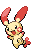

#311 - Plusle
<table cellspacing="0" cellpadding="0"><tr><th colspan="1" align="center"></th><th colspan="1" align="center">Type</th><th colspan="1" align="center">Ability</th></tr><tr><td align="center";rowspan="1"></td><td align="center";rowspan="1"></td><td rowspan="1">(1) Plus   (2) Lightningrod   (HA) Lightningrod</td></tr><tr><th colspan="3" align="center">Defenses</th></tr><tr><td align="right">Immune:</td><td colspan="2"></td></tr><tr><td align="right">0.25x Resist:</td><td colspan="2"></td></tr><tr><td align="right">0.5x Resist:</td><td colspan="2"></td></tr><tr><td align="right">Neutral:</td><td colspan="2"></td></tr><tr><td align="right">2x Weak:</td><td colspan="2"></td></tr><tr><td align="right">4x Weak:</td><td colspan="2"></td></tr></table>

## Stats
<table class="stat"><tr><td class="stat-icon-single"></td><td class="stat-single"><u>HP</u> 60</td><td class="stat-single"><u>ATK</u> 50</td><td  class="stat-single">            <u>DEF                +10</u>                     50</td><td  class="stat-single">            <u>SPA                +10</u>                     95</td><td  class="stat-single">            <u>SPD                +10</u>                     85</td><td  class="stat-single">            <u>SPE                +15</u>                     110</td><td  class="stat-single">            <u>BST                +45</u>                     450</td></tr></table>

## Level Up Moves
<table><th>Level</th><th>Name</th><th>Power</th><th>Accuracy</th><th>PP</th><th>Type</th><th>Damage Class</th><th>Effect</th>
<tr><td>1</td><td>Covet</td><td>60</td><td>100</td><td>20</td><td></td><td></td><td>Priority: 0. If the target is holding an item and the user is not, the user will permanently take the item.  Damage is still inflicted if an item cannot be taken.  Pokémon with sticky hold or multitype are immune to the item theft effect.  The target cannot recover its item with recycle.</td></tr>
<tr><td>1</td><td>Growl</td><td>None</td><td>100</td><td>40</td><td></td><td></td><td>Priority: 0. Lowers the target's Attack by one stage.</td></tr>
<tr><td>1</td><td>Quick Attack</td><td>40</td><td>100</td><td>20</td><td></td><td></td><td>Priority: 1. Inflicts regular damage.</td></tr>
<tr><td>4</td><td>Captivate</td><td>None</td><td>100</td><td>20</td><td></td><td></td><td>Priority: 0. Lowers the target's Special Attack by two stages.  If the user and target are the same gender, or either is genderless, this move will fail.</td></tr>
<tr><td>7</td><td>Spark</td><td>65</td><td>100</td><td>20</td><td></td><td></td><td>Priority: 0. Has a 30% chance to paralyze the target.</td></tr>
<tr><td>10</td><td>Bestow</td><td>None</td><td>None</td><td>15</td><td></td><td></td><td>Priority: 0. Transfers the user's held item to the target.  If the user has no held item, or the target already has a held item, this move will fail.</td></tr>
<tr><td>13</td><td>Swift</td><td>60</td><td>None</td><td>20</td><td></td><td></td><td>Priority: 0. Ignores accuracy and evasion modifiers.</td></tr>
<tr><td>16</td><td>Sing</td><td>None</td><td>55</td><td>15</td><td></td><td></td><td>Priority: 0. Puts the target to sleep.</td></tr>
<tr><td>19</td><td>Charm</td><td>None</td><td>100</td><td>20</td><td></td><td></td><td>Priority: 0. Lowers the target's Attack by two stages.</td></tr>
<tr><td>22</td><td>Nuzzle</td><td>20</td><td>100</td><td>20</td><td></td><td></td><td>Priority: 0. Has a 100% chance to paralyze the target.</td></tr>
<tr><td>25</td><td>Charge</td><td>None</td><td>None</td><td>20</td><td></td><td></td><td>Priority: 0. Raises the user's Special Defense by one stage.  If the user uses an electric move next turn, its power will be doubled.</td></tr>
<tr><td>28</td><td>Discharge</td><td>80</td><td>100</td><td>15</td><td></td><td></td><td>Priority: 0. Has a 30% chance to paralyze the target.</td></tr>
<tr><td>31</td><td>Helping Hand</td><td>None</td><td>None</td><td>20</td><td></td><td></td><td>Priority: 5. Boosts the power of the target's moves by 50% until the end of this turn.  This move cannot be copied by mirror move, nor selected by assist or metronome.</td></tr>
<tr><td>33</td><td>Wish</td><td>None</td><td>None</td><td>10</td><td></td><td></td><td>Priority: 0. At the end of the next turn, user will be healed for half its max HP.  If the user is switched out, its replacement will be healed instead for half of the user's max HP.  If the user faints or is forcefully switched by roar or whirlwind, this effect will not activate.</td></tr>
<tr><td>36</td><td>Electro Ball</td><td>None</td><td>100</td><td>10</td><td></td><td></td><td>Priority: 0. The greater the user's Speed compared to the target's, the higher power this move has, to a maximum of 150.  User's Speed                     | Power -------------------------------- | ----: Up to 2× the target's Speed      |    60 Up to 3× the target's Speed      |    80 Up to 4× the target's Speed      |   120 More than 4× the target's Speed  |   150</td></tr>
<tr><td>39</td><td>Magnet Rise</td><td>None</td><td>None</td><td>10</td><td></td><td></td><td>Priority: 0. For five turns, the user is immune to ground moves.  If the user is under the effect of ingrain or has levitate, this move will fail.  This effect is temporarily disabled by and cannot be used during gravity.  This effect is passed on by baton pass.</td></tr>
<tr><td>42</td><td>Fake Tears</td><td>None</td><td>100</td><td>20</td><td></td><td></td><td>Priority: 0. Lowers the target's Special Defense by two stages.</td></tr>
<tr><td>45</td><td>Entrainment</td><td>None</td><td>100</td><td>15</td><td></td><td></td><td>Priority: 0. Changes the target's ability to match the user's.  This effect ends when the target leaves battle.</td></tr>
<tr><td>48</td><td>Uproar</td><td>90</td><td>100</td><td>10</td><td></td><td></td><td>Priority: 0. User is forced to use this move for 2–5 turns, selected at random. No Pokemon can sleep during the effect of this move. </td></tr>
<tr><td>51</td><td>Switcheroo</td><td>None</td><td>100</td><td>10</td><td></td><td></td><td>Priority: 0. User and target permanently swap held items.  Works even if one of the Pokémon isn't holding anything.  If either Pokémon is holding mail, this move will fail.  If either Pokémon has multitype or sticky hold, this move will fail.  If this move results in a Pokémon obtaining choice band, choice scarf, or choice specs, and that Pokémon was the latter of the pair to move this turn, then the move it used this turn becomes its chosen forced move.  This applies even if both Pokémon had a choice item before this move was used.  If the first of the two Pokémon gains a choice item, it may select whatever choice move it wishes next turn.  Neither the user nor the target can recover its item with recycle.  This move cannot be selected by assist or metronome.</td></tr>
<tr><td>54</td><td>Nasty Plot</td><td>None</td><td>None</td><td>20</td><td></td><td></td><td>Priority: 0. Raises the user's Special Attack by two stages.</td></tr>
<tr><td>57</td><td>Baton Pass</td><td>None</td><td>None</td><td>40</td><td></td><td></td><td>Priority: 0. User switches out, and the trainer selects a replacement Pokémon from the party.  Stat changes, confusion, and persistent move effects are passed along to the replacement Pokémon.  The following move effects are passed:  * aqua ring * both the user's and target's effect of block, mean look, and spider web * the curse effect of curse * embargo * focus energy or an activated lansat berry * gastro acid * ingrain * being sapped by leech seed * being targeted by lock on or mind reader * magnet rise * perish song's counter * power trick * substitute; the doll's HP is unchanged  The replacement Pokémon does not trigger effects that respond to Pokémon switching in.</td></tr>
<tr><td>60</td><td>Last Resort</td><td>140</td><td>100</td><td>5</td><td></td><td></td><td>Priority: 0. This move can only be used if each of the user's other moves has been used at least once since the user entered the field.  If this is the user's only move, this move will fail.</td></tr>
</table>

## TM Moves
<table><th>Machine</th><th>Name</th><th>Power</th><th>Accuracy</th><th>PP</th><th>Type</th><th>Damage Class</th><th>Effect</th>
<tr><td>TM6</td><td>Toxic</td><td>None</td><td>90</td><td>10</td><td></td><td></td><td>Priority: 0. Badly poisons the target.  Never misses when used by a poison-type Pokémon.</td></tr>
<tr><td>TM10</td><td>Hidden Power</td><td>60</td><td>100</td><td>15</td><td></td><td></td><td>Priority: 0. Power and type depend upon user's IVs. Power can range from 30 to 70.</td></tr>
<tr><td>TM16</td><td>Light Screen</td><td>None</td><td>None</td><td>30</td><td></td><td></td><td>Priority: 0. Reduces damage from special attacks by half for five turns. In double battles, the reduction is 1/3.</td></tr>
<tr><td>TM17</td><td>Protect</td><td>None</td><td>None</td><td>10</td><td></td><td></td><td>Priority: 4. No moves will hit the user for the remainder of this turn. If the user is last to act this turn, this move will fail. Success rate drops by 1/2 on successive attempts.</td></tr>
<tr><td>TM18</td><td>Rain Dance</td><td>None</td><td>None</td><td>5</td><td></td><td></td><td>Priority: 0. Changes the weather to rain for five turns, during which water moves inflict 50% extra damage, and fire moves inflict half damage.</td></tr>
<tr><td>TM21</td><td>Frustration</td><td>None</td><td>100</td><td>20</td><td></td><td></td><td>Priority: 0. Power increases inversely with happiness, given by `(255 - happiness) * 2 / 5`, to a maximum of 102.  Power bottoms out at 1.</td></tr>
<tr><td>TM24</td><td>Thunderbolt</td><td>90</td><td>100</td><td>10</td><td></td><td></td><td>Priority: 0. Has a 10% chance to paralyze the target.</td></tr>
<tr><td>TM25</td><td>Thunder</td><td>110</td><td>70</td><td>5</td><td></td><td></td><td>Priority: 0. Has a 30% chance to paralyze the target.  During rain dance, this move has 100% accuracy.  During sunny day, this move has 50% accuracy.</td></tr>
<tr><td>TM27</td><td>Return</td><td>None</td><td>100</td><td>20</td><td></td><td></td><td>Priority: 0. Power increases with happiness, given by `happiness * 2 / 5`, to a maximum of 102.  Power bottoms out at 1.</td></tr>
<tr><td>TM29</td><td>Psychic</td><td>90</td><td>100</td><td>10</td><td></td><td></td><td>Priority: 0. Has a 10% chance to lower the target's Special Defense by one stage.</td></tr>
<tr><td>TM42</td><td>Facade</td><td>70</td><td>100</td><td>20</td><td></td><td></td><td>Priority: 0. If the user is burned, paralyzed, or poisoned, this move has double power.</td></tr>
<tr><td>TM44</td><td>Rest</td><td>None</td><td>None</td><td>10</td><td></td><td></td><td>Priority: 0. User falls to sleep for two turns, replacing any existing non-volatile status ailments, and immediately regains all its HP.</td></tr>
<tr><td>TM49</td><td>Echoed Voice</td><td>50</td><td>100</td><td>15</td><td></td><td></td><td>Priority: 0. If any friendly Pokémon used this move earlier this turn or on the previous turn, that use's power is added to this move's power, to a maximum of 200.</td></tr>
<tr><td>TM57</td><td>Charge Beam</td><td>50</td><td>90</td><td>15</td><td></td><td></td><td>Priority: 0. Has a 70% chance to raise the user's Special Attack by one stage.</td></tr>
<tr><td>TM70</td><td>Flash</td><td>None</td><td>100</td><td>20</td><td></td><td></td><td>Priority: 0. Lowers the target's accuracy by one stage.</td></tr>
<tr><td>TM72</td><td>Volt Switch</td><td>70</td><td>100</td><td>20</td><td></td><td></td><td>Priority: 0. Inflicts regular damage, then the user immediately switches out, and the trainer selects a replacement Pokémon from the party.  If the target faints from this attack, the user's trainer selects the new Pokémon to send out first.  If the user is the last Pokémon in its party that can battle, it will not switch out.  The user may be hit by pursuit when it switches out, if it has been targeted and pursuit has not yet been used.  This move may be used even if the user is under the effect of ingrain.  ingrain's effect will end.</td></tr>
<tr><td>TM73</td><td>Thunder Wave</td><td>None</td><td>90</td><td>20</td><td></td><td></td><td>Priority: 0. Paralyzes the target.</td></tr>
<tr><td>TM86</td><td>Grass Knot</td><td>None</td><td>100</td><td>20</td><td></td><td></td><td>Priority: 0. Power increases with the target's weight in kilograms, to a maximum of 120.</td></tr>
<tr><td>TM90</td><td>Substitute</td><td>None</td><td>None</td><td>10</td><td></td><td></td><td>Priority: 0. Transfers 1/4 the user's max HP into a doll that absorbs damage and causes most negative move effects to fail.</td></tr>
<tr><td>TM93</td><td>Wild Charge</td><td>90</td><td>100</td><td>10</td><td></td><td></td><td>Priority: 0. Inflicts regular damage without recoil.</td></tr>
</table>

## Tutor Moves
<table><th>Name</th><th>Power</th><th>Accuracy</th><th>PP</th><th>Type</th><th>Damage Class</th><th>Effect</th>
<tr><td>Helping Hand</td><td>None</td><td>None</td><td>20</td><td></td><td></td><td>Priority: 5. Boosts the power of the target's moves by 50% until the end of this turn.  This move cannot be copied by mirror move, nor selected by assist or metronome.</td></tr>
<tr><td>Iron Tail</td><td>100</td><td>75</td><td>15</td><td></td><td></td><td>Priority: 0. Has a 30% chance to lower the target's Defense by one stage.</td></tr>
<tr><td>Last Resort</td><td>140</td><td>100</td><td>5</td><td></td><td></td><td>Priority: 0. This move can only be used if each of the user's other moves has been used at least once since the user entered the field.  If this is the user's only move, this move will fail.</td></tr>
<tr><td>Magnet Rise</td><td>None</td><td>None</td><td>10</td><td></td><td></td><td>Priority: 0. For five turns, the user is immune to ground moves.  If the user is under the effect of ingrain or has levitate, this move will fail.  This effect is temporarily disabled by and cannot be used during gravity.  This effect is passed on by baton pass.</td></tr>
<tr><td>Signal Beam</td><td>75</td><td>100</td><td>15</td><td></td><td></td><td>Priority: 0. Has a 10% chance to confuse the target.</td></tr>
<tr><td>Sleep Talk</td><td>None</td><td>None</td><td>10</td><td></td><td></td><td>Priority: 0. Only usable if the user is sleeping. Randomly selects and uses one of the user's other three moves. Use of the selected move requires and costs 0 PP.</td></tr>
<tr><td>Snore</td><td>50</td><td>100</td><td>15</td><td></td><td></td><td>Priority: 0. Only usable if the user is sleeping.   Has a 30% chance to make the target flinch.</td></tr>
<tr><td>Thunder Punch</td><td>75</td><td>100</td><td>10</td><td></td><td></td><td>Priority: 0. Has a 10% chance to paralyze the target.</td></tr>
<tr><td>Uproar</td><td>90</td><td>100</td><td>10</td><td></td><td></td><td>Priority: 0. User is forced to use this move for 2–5 turns, selected at random. No Pokemon can sleep during the effect of this move. </td></tr>
</table>

## Encounter Locations

| Location | &nbsp; | Level | Spawn Percent |
|: -- :|: -- :|: -- :|: -- :|
| [Route 5] | Grass | 27-29 | 5.0 |

--8<-- "includes/abilities.md"

[Route 5]: ../../wildareas/Route_5/
