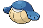

#320 - Wailmer
<table cellspacing="0" cellpadding="0"><tr><th colspan="1" align="center"></th><th colspan="1" align="center">Type</th><th colspan="1" align="center">Ability</th></tr><tr><td align="center";rowspan="1"></td><td align="center";rowspan="1"></td><td rowspan="1">(1) Water Veil   (2) Pressure   (HA) Pressure</td></tr><tr><th colspan="3" align="center">Defenses</th></tr><tr><td align="right">Immune:</td><td colspan="2"></td></tr><tr><td align="right">0.25x Resist:</td><td colspan="2"></td></tr><tr><td align="right">0.5x Resist:</td><td colspan="2"></td></tr><tr><td align="right">Neutral:</td><td colspan="2"></td></tr><tr><td align="right">2x Weak:</td><td colspan="2"></td></tr><tr><td align="right">4x Weak:</td><td colspan="2"></td></tr></table>

## Evolutions
<table>
<tr><td rowspan="1"style="vertical-align: middle;">    <a href="../320">Wailmer</a> </td><td rowspan="1"style="vertical-align: middle; word-break:break-all;">Level 40</td><td rowspan="1"style="vertical-align: middle;">    <a href="../321">Wailord</a> </td></tr>
</table>

## Stats
<table class="stat"><tr><td class="stat-icon-single"></td><td class="stat-single"><u>HP</u> 130</td><td class="stat-single"><u>ATK</u> 70</td><td class="stat-single"><u>DEF</u> 35</td><td class="stat-single"><u>SPA</u> 70</td><td class="stat-single"><u>SPD</u> 35</td><td class="stat-single"><u>SPE</u> 60</td><td class="stat-single"><u>BST</u> 400</td></tr></table>

## Level Up Moves
<table><th>Level</th><th>Name</th><th>Power</th><th>Accuracy</th><th>PP</th><th>Type</th><th>Damage Class</th><th>Effect</th>
<tr><td>1</td><td>Aqua Ring</td><td>None</td><td>None</td><td>20</td><td></td><td></td><td>Priority: 0. Restores 1/16 of the user's max HP at the end of each turn.  If the user leaves the field, this effect ends.  This effect is passed on by baton pass.</td></tr>
<tr><td>1</td><td>Growl</td><td>None</td><td>100</td><td>40</td><td></td><td></td><td>Priority: 0. Lowers the target's Attack by one stage.</td></tr>
<tr><td>1</td><td>Splash</td><td>None</td><td>None</td><td>40</td><td></td><td></td><td>Priority: 0. Does nothing.  This move cannot be used while gravity is in effect.</td></tr>
<tr><td>1</td><td>Water Gun</td><td>40</td><td>100</td><td>25</td><td></td><td></td><td>Priority: 0. Inflicts regular damage.</td></tr>
<tr><td>4</td><td>Mist</td><td>None</td><td>None</td><td>30</td><td></td><td></td><td>Priority: 0. Pokémon on the user's side of the field are immune to stat-lowering effects for five turns. Defog used by an opponent will end this effect.</td></tr>
<tr><td>7</td><td>Defense Curl</td><td>None</td><td>None</td><td>40</td><td></td><td></td><td>Priority: 0. Raises user's Defense by one stage.  After this move is used, the power of ice ball and rollout are doubled until the user leaves the field.</td></tr>
<tr><td>10</td><td>Rollout</td><td>40</td><td>90</td><td>20</td><td></td><td></td><td>Priority: 0. User is forced to use this move for five turns.  Power doubles every time this move is used in succession to a maximum of 16x, and resets to normal after the lock-in ends.</td></tr>
<tr><td>13</td><td>Whirlpool</td><td>35</td><td>85</td><td>15</td><td></td><td></td><td>Priority: 0. For the next 2–5 turns, the target cannot leave the field and is damaged for 1/16 its max HP at the end of each turn. Has a 3/8 chance each to hit 2 or 3 times, and a 1/8 chance each to hit 4 or 5 times.  Averages to 3 hits per use.  If the target is in the first turn of dive, this move will hit with double power.</td></tr>
<tr><td>16</td><td>Tickle</td><td>None</td><td>100</td><td>20</td><td></td><td></td><td>Priority: 0. Lowers the target's Attack and Defense by one stage.</td></tr>
<tr><td>19</td><td>Amnesia</td><td>None</td><td>None</td><td>20</td><td></td><td></td><td>Priority: 0. Raises the user's Special Defense by two stages.</td></tr>
<tr><td>22</td><td>Water Pulse</td><td>60</td><td>100</td><td>20</td><td></td><td></td><td>Priority: 0. Has a 20% chance to confuse the target.</td></tr>
<tr><td>25</td><td>Zen Headbutt</td><td>80</td><td>90</td><td>10</td><td></td><td></td><td>Priority: 0. Has a 20% chance to make the target flinch.</td></tr>
<tr><td>28</td><td>Body Slam</td><td>85</td><td>100</td><td>15</td><td></td><td></td><td>Priority: 0. Has a 30% chance to paralyze the target.</td></tr>
<tr><td>32</td><td>Heavy Slam</td><td>None</td><td>100</td><td>10</td><td></td><td></td><td>Priority: 0. The greater the user's weight compared to the target's, the higher power this move has, to a maximum of 120.  User's weight                    | Power -------------------------------- | ----: Up to 2× the target's weight     |    40 Up to 3× the target's weight     |    60 Up to 4× the target's weight     |    80 Up to 5× the target's weight     |   100 More than 5× the target's weight |   120</td></tr>
<tr><td>36</td><td>Brine</td><td>65</td><td>100</td><td>10</td><td></td><td></td><td>Priority: 0. If the target has less than half its max HP remaining, this move has double power.</td></tr>
<tr><td>40</td><td>Final Gambit</td><td>None</td><td>100</td><td>5</td><td></td><td></td><td>Priority: 0. Inflicts damage equal to the user's remaining HP.  User faints.</td></tr>
<tr><td>44</td><td>Curse</td><td>None</td><td>None</td><td>10</td><td></td><td></td><td>Priority: 0. If the user is a ghost: user pays half its max HP to place a curse on the target, damaging it for 1/4 its max HP every turn. Otherwise: Lowers the user's Speed by one stage, and raises its Attack and Defense by one stage each.  The curse effect is passed on by baton pass.  This move cannot be copied by mirror move.</td></tr>
<tr><td>48</td><td>Hyper Voice</td><td>90</td><td>100</td><td>10</td><td></td><td></td><td>Priority: 0. Inflicts regular damage.</td></tr>
<tr><td>52</td><td>Soak</td><td>None</td><td>100</td><td>20</td><td></td><td></td><td>Priority: 0. Changes the target to pure water-type until it leaves the field.  If the target has multitype, this move will fail.</td></tr>
<tr><td>56</td><td>Hydro Pump</td><td>110</td><td>80</td><td>5</td><td></td><td></td><td>Priority: 0. Inflicts regular damage.</td></tr>
<tr><td>60</td><td>Follow Me</td><td>None</td><td>None</td><td>20</td><td></td><td></td><td>Priority: 2. Until the end of this turn, any moves that opposing Pokémon target solely at the user's ally will instead target the user.   This effect takes priority over lightning rod and storm drain.  If the user's ally switches out, opposing Pokémon may still hit it with pursuit.</td></tr>
</table>

## TM Moves
<table><th>Machine</th><th>Name</th><th>Power</th><th>Accuracy</th><th>PP</th><th>Type</th><th>Damage Class</th><th>Effect</th>
<tr><td>TM5</td><td>Roar</td><td>None</td><td>None</td><td>20</td><td></td><td></td><td>Priority: -6. Switches the target out for another of its trainer's Pokémon selected at random.  Wild battles end immediately.</td></tr>
<tr><td>TM6</td><td>Toxic</td><td>None</td><td>90</td><td>10</td><td></td><td></td><td>Priority: 0. Badly poisons the target.  Never misses when used by a poison-type Pokémon.</td></tr>
<tr><td>TM7</td><td>Hail</td><td>None</td><td>None</td><td>10</td><td></td><td></td><td>Priority: 0. Changes the weather to hail for five turns, during which non-ice Pokémon are damaged for 1/16 their max HP at the end of every turn.</td></tr>
<tr><td>TM10</td><td>Hidden Power</td><td>60</td><td>100</td><td>15</td><td></td><td></td><td>Priority: 0. Power and type depend upon user's IVs. Power can range from 30 to 70.</td></tr>
<tr><td>TM13</td><td>Ice Beam</td><td>90</td><td>100</td><td>10</td><td></td><td></td><td>Priority: 0. Has a 10% chance to freeze the target.</td></tr>
<tr><td>TM14</td><td>Blizzard</td><td>110</td><td>70</td><td>5</td><td></td><td></td><td>Priority: 0. Has a 10% chance to freeze the target.  During hail, this move has 100% accuracy.</td></tr>
<tr><td>TM17</td><td>Protect</td><td>None</td><td>None</td><td>10</td><td></td><td></td><td>Priority: 4. No moves will hit the user for the remainder of this turn. If the user is last to act this turn, this move will fail. Success rate drops by 1/2 on successive attempts.</td></tr>
<tr><td>TM18</td><td>Rain Dance</td><td>None</td><td>None</td><td>5</td><td></td><td></td><td>Priority: 0. Changes the weather to rain for five turns, during which water moves inflict 50% extra damage, and fire moves inflict half damage.</td></tr>
<tr><td>TM21</td><td>Frustration</td><td>None</td><td>100</td><td>20</td><td></td><td></td><td>Priority: 0. Power increases inversely with happiness, given by `(255 - happiness) * 2 / 5`, to a maximum of 102.  Power bottoms out at 1.</td></tr>
<tr><td>TM26</td><td>Earthquake</td><td>100</td><td>100</td><td>10</td><td></td><td></td><td>Priority: 0. Inflicts regular damage.  If the target is in the first turn of dig, this move will hit with double power.</td></tr>
<tr><td>TM27</td><td>Return</td><td>None</td><td>100</td><td>20</td><td></td><td></td><td>Priority: 0. Power increases with happiness, given by `happiness * 2 / 5`, to a maximum of 102.  Power bottoms out at 1.</td></tr>
<tr><td>TM39</td><td>Rock Tomb</td><td>60</td><td>95</td><td>15</td><td></td><td></td><td>Priority: 0. Has a 100% chance to lower the target's Speed by one stage.</td></tr>
<tr><td>TM42</td><td>Facade</td><td>70</td><td>100</td><td>20</td><td></td><td></td><td>Priority: 0. If the user is burned, paralyzed, or poisoned, this move has double power.</td></tr>
<tr><td>TM44</td><td>Rest</td><td>None</td><td>None</td><td>10</td><td></td><td></td><td>Priority: 0. User falls to sleep for two turns, replacing any existing non-volatile status ailments, and immediately regains all its HP.</td></tr>
<tr><td>TM49</td><td>Echoed Voice</td><td>50</td><td>100</td><td>15</td><td></td><td></td><td>Priority: 0. If any friendly Pokémon used this move earlier this turn or on the previous turn, that use's power is added to this move's power, to a maximum of 200.</td></tr>
<tr><td>TM55</td><td>Scald</td><td>80</td><td>100</td><td>10</td><td></td><td></td><td>Priority: 0. Has a 30% chance to burn the target.</td></tr>
<tr><td>TM78</td><td>Bulldoze</td><td>60</td><td>100</td><td>20</td><td></td><td></td><td>Priority: 0. Has a 100% chance to lower the target's Speed by one stage.</td></tr>
<tr><td>TM90</td><td>Substitute</td><td>None</td><td>None</td><td>10</td><td></td><td></td><td>Priority: 0. Transfers 1/4 the user's max HP into a doll that absorbs damage and causes most negative move effects to fail.</td></tr>
<tr><td>TM94</td><td>Rock Smash</td><td>55</td><td>100</td><td>15</td><td></td><td></td><td>Priority: 0. 100% chance to drop target's Def by one stage. Also boosted by the ability Iron Fist</td></tr>
<tr><td>HM3</td><td>Surf</td><td>90</td><td>100</td><td>15</td><td></td><td></td><td>Priority: 0. Inflicts regular damage.  If the target is in the first turn of dive, this move will hit with double power.</td></tr>
<tr><td>HM4</td><td>Strength</td><td>85</td><td>100</td><td>10</td><td></td><td></td><td>Priority: 0. 10% Raise Attack</td></tr>
<tr><td>HM5</td><td>Waterfall</td><td>80</td><td>100</td><td>10</td><td></td><td></td><td>Priority: 0. Has a 20% chance to make the target flinch.</td></tr>
<tr><td>HM6</td><td>Dive</td><td>100</td><td>100</td><td>10</td><td></td><td></td><td>Priority: 0. User dives underwater for one turn, becoming immune to attack, and hits on the second turn.  During the immune turn, surf, and whirlpool still hit the user normally, and their power is doubled if appropriate.  The user may be hit during its immune turn if under the effect of lock on, mind reader, or no guard.  This move cannot be selected by sleep talk.</td></tr>
</table>

## Tutor Moves
<table><th>Name</th><th>Power</th><th>Accuracy</th><th>PP</th><th>Type</th><th>Damage Class</th><th>Effect</th>
<tr><td>Bounce</td><td>85</td><td>85</td><td>5</td><td></td><td></td><td>Priority: 0. User bounces high into the air for one turn, becoming immune to attack, and hits on the second turn.  Has a 30% chance to paralyze the target.  During the immune turn, gust, hurricane, sky uppercut, smack down, thunder, and twister still hit the user normally.  gust and twister also have double power against the user.  The damage from hail and sandstorm still applies during the immune turn.  The user may be hit during its immune turn if under the effect of lock on, mind reader, or no guard.  This move cannot be used while gravity is in effect.</td></tr>
<tr><td>Hyper Voice</td><td>90</td><td>100</td><td>10</td><td></td><td></td><td>Priority: 0. Inflicts regular damage.</td></tr>
<tr><td>Icy Wind</td><td>55</td><td>95</td><td>15</td><td></td><td></td><td>Priority: 0. Has a 100% chance to lower the target's Speed by one stage.</td></tr>
<tr><td>Sleep Talk</td><td>None</td><td>None</td><td>10</td><td></td><td></td><td>Priority: 0. Only usable if the user is sleeping. Randomly selects and uses one of the user's other three moves. Use of the selected move requires and costs 0 PP.</td></tr>
<tr><td>Snore</td><td>50</td><td>100</td><td>15</td><td></td><td></td><td>Priority: 0. Only usable if the user is sleeping.   Has a 30% chance to make the target flinch.</td></tr>
<tr><td>Zen Headbutt</td><td>80</td><td>90</td><td>10</td><td></td><td></td><td>Priority: 0. Has a 20% chance to make the target flinch.</td></tr>
</table>

## Encounter Locations

| Location | &nbsp; | &nbsp; | Level | Spawn Percent |
|: -- :|: -- :|: -- :|: -- :|: -- :|
| [Undella Bay] | Autumn, Spring, Summer | Surf | 40-46 | 10.0 |
| [Undella Bay] | Autumn, Spring, Summer | Surf, Rippling Water | 40-46 | 30.0 |
| [Undella Bay] | Winter | Surf | 40-46 | 10.0 |
| [Undella Bay] | Winter | Surf, Rippling Water | 40-46 | 30.0 |

--8<-- "includes/abilities.md"

[Undella Bay]: ../../wildareas/Undella_Bay/
