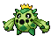

#332 - Cacturne
<table cellspacing="0" cellpadding="0"><tr><th colspan="1" align="center"></th><th colspan="1" align="center">Type</th><th colspan="1" align="center">Ability</th></tr><tr><td align="center";rowspan="1"></td><td align="center";rowspan="1"> </td><td rowspan="1">(1) Unnerve   (2) Water Absorb   (HA) Water Absorb</td></tr><tr><th colspan="3" align="center">Defenses</th></tr><tr><td align="right">Immune:</td><td colspan="2"></td></tr><tr><td align="right">0.25x Resist:</td><td colspan="2"></td></tr><tr><td align="right">0.5x Resist:</td><td colspan="2"></td></tr><tr><td align="right">Neutral:</td><td colspan="2"></td></tr><tr><td align="right">2x Weak:</td><td colspan="2"></td></tr><tr><td align="right">4x Weak:</td><td colspan="2"></td></tr></table>

## Evolutions
<table>
<tr><td rowspan="1"style="vertical-align: middle;">    <a href="../331">Cacnea</a> </td><td rowspan="1"style="vertical-align: middle; word-break:break-all;">Level 32</td><td rowspan="1"style="vertical-align: middle;">    <a href="../332">Cacturne</a> </td></tr>
</table>

## Stats
<table class="stat"><tr><td class="stat-icon-single"></td><td class="stat-single"><u>HP</u> 70</td><td class="stat-single"><u>ATK</u> 115</td><td class="stat-single"><u>DEF</u> 60</td><td class="stat-single"><u>SPA</u> 115</td><td class="stat-single"><u>SPD</u> 60</td><td class="stat-single"><u>SPE</u> 55</td><td class="stat-single"><u>BST</u> 475</td></tr></table>

## Wild Hold Items
- 5%: Sticky Barb

## Level Up Moves
<table><th>Level</th><th>Name</th><th>Power</th><th>Accuracy</th><th>PP</th><th>Type</th><th>Damage Class</th><th>Effect</th>
<tr><td>1</td><td>Absorb</td><td>35</td><td>100</td><td>25</td><td></td><td></td><td>Priority: 0. Drains half the damage inflicted to heal the user.</td></tr>
<tr><td>1</td><td>Poison Sting</td><td>30</td><td>100</td><td>20</td><td></td><td></td><td>Priority: 0. Has a 30% chance to poison the target.</td></tr>
<tr><td>1</td><td>Sand Attack</td><td>None</td><td>100</td><td>15</td><td></td><td></td><td>Priority: 0. Lowers the target's accuracy by one stage.</td></tr>
<tr><td>4</td><td>Cotton Spore</td><td>None</td><td>100</td><td>40</td><td></td><td></td><td>Priority: 0. Lowers the target's Speed by two stages.</td></tr>
<tr><td>7</td><td>Growth</td><td>None</td><td>None</td><td>20</td><td></td><td></td><td>Priority: 0. Raises the user's Attack and Special Attack by one stage each.  During sunny day, raises both stats by two stages.</td></tr>
<tr><td>10</td><td>Magical Leaf</td><td>60</td><td>None</td><td>20</td><td></td><td></td><td>Priority: 0. Ignores accuracy and evasion modifiers.</td></tr>
<tr><td>13</td><td>Leech Seed</td><td>None</td><td>90</td><td>10</td><td></td><td></td><td>Priority: 0. Plants a seed on the target that drains 1/8 of its max HP at the end of every turn and heals the user for the amount taken.</td></tr>
<tr><td>16</td><td>Disable</td><td>None</td><td>100</td><td>20</td><td></td><td></td><td>Priority: 0. Disables the target's last used move, preventing its use for 4–7 turns, selected at random, or until the target leaves the field.</td></tr>
<tr><td>18</td><td>Feint Attack</td><td>60</td><td>None</td><td>20</td><td></td><td></td><td>Priority: 0. Ignores accuracy and evasion modifiers.</td></tr>
<tr><td>20</td><td>Sandstorm</td><td>None</td><td>None</td><td>10</td><td></td><td></td><td>Priority: 0. Changes the weather to a sandstorm for five turns.  Pokémon that are not ground, rock, or steel take 1/16 their max HP at the end of every turn.  Every rock Pokémon's original Special Defense is raised by 50% for the duration of this effect.</td></tr>
<tr><td>22</td><td>Bullet Seed</td><td>25</td><td>100</td><td>30</td><td></td><td></td><td>Priority: 0. Hits 2–5 times in one turn.  Has a 3/8 chance each to hit 2 or 3 times, and a 1/8 chance each to hit 4 or 5 times.  Averages to 3 hits per use.</td></tr>
<tr><td>24</td><td>Destiny Bond</td><td>None</td><td>None</td><td>5</td><td></td><td></td><td>Priority: 0. If the user faints before its next move, the Pokémon that fainted it will automatically faint.  End-of-turn damage is ignored.</td></tr>
<tr><td>26</td><td>Mud Shot</td><td>55</td><td>95</td><td>15</td><td></td><td></td><td>Priority: 0. Has a 100% chance to lower the target's Speed by one stage.</td></tr>
<tr><td>28</td><td>Sucker Punch</td><td>70</td><td>100</td><td>5</td><td></td><td></td><td>Priority: 1. If the target has not selected a damaging move this turn, or if the target has already acted this turn, this move will fail.  This move is not affected by iron fist.</td></tr>
<tr><td>31</td><td>Energy Ball</td><td>90</td><td>100</td><td>10</td><td></td><td></td><td>Priority: 0. Has a 10% chance to lower the target's Special Defense by one stage.</td></tr>
<tr><td>32</td><td>Seed Bomb</td><td>80</td><td>100</td><td>15</td><td></td><td></td><td>Priority: 0. Inflicts regular damage.</td></tr>
<tr><td>35</td><td>Pin Missile</td><td>25</td><td>95</td><td>20</td><td></td><td></td><td>Priority: 0. Hits 2–5 times in one turn.  Has a 3/8 chance each to hit 2 or 3 times, and a 1/8 chance each to hit 4 or 5 times.  Averages to 3 hits per use.</td></tr>
<tr><td>38</td><td>Drain Punch</td><td>75</td><td>100</td><td>10</td><td></td><td></td><td>Priority: 0. Drains half the damage inflicted to heal the user.</td></tr>
<tr><td>42</td><td>Needle Arm</td><td>100</td><td>100</td><td>15</td><td></td><td></td><td>Priority: 0. Boosted by the ability Iron Fist</td></tr>
<tr><td>46</td><td>Synthesis</td><td>None</td><td>None</td><td>5</td><td></td><td></td><td>Priority: 0. Heals the user for half its max HP, plus modifiers from weather.</td></tr>
<tr><td>50</td><td>Scorching Sands</td><td>70</td><td>100</td><td>10</td><td></td><td></td><td>Priority: 0. Inflicts regular damage.</td></tr>
<tr><td>54</td><td>Foul Play</td><td>95</td><td>100</td><td>15</td><td></td><td></td><td>Priority: 0. Damage is calculated using the target's attacking stat rather than the user's.</td></tr>
<tr><td>58</td><td>Nasty Plot</td><td>None</td><td>None</td><td>20</td><td></td><td></td><td>Priority: 0. Raises the user's Special Attack by two stages.</td></tr>
<tr><td>62</td><td>Focus Punch</td><td>150</td><td>100</td><td>20</td><td></td><td></td><td>Priority: -3. If the user takes damage this turn before hitting, this move will fail.</td></tr>
<tr><td>66</td><td>Switcheroo</td><td>None</td><td>100</td><td>10</td><td></td><td></td><td>Priority: 0. User and target permanently swap held items.  Works even if one of the Pokémon isn't holding anything.  If either Pokémon is holding mail, this move will fail.  If either Pokémon has multitype or sticky hold, this move will fail.  If this move results in a Pokémon obtaining choice band, choice scarf, or choice specs, and that Pokémon was the latter of the pair to move this turn, then the move it used this turn becomes its chosen forced move.  This applies even if both Pokémon had a choice item before this move was used.  If the first of the two Pokémon gains a choice item, it may select whatever choice move it wishes next turn.  Neither the user nor the target can recover its item with recycle.  This move cannot be selected by assist or metronome.</td></tr>
</table>

## TM Moves
<table><th>Machine</th><th>Name</th><th>Power</th><th>Accuracy</th><th>PP</th><th>Type</th><th>Damage Class</th><th>Effect</th>
<tr><td>TM6</td><td>Toxic</td><td>None</td><td>90</td><td>10</td><td></td><td></td><td>Priority: 0. Badly poisons the target.  Never misses when used by a poison-type Pokémon.</td></tr>
<tr><td>TM9</td><td>Venoshock</td><td>65</td><td>100</td><td>15</td><td></td><td></td><td>Priority: 0. If the target is poisoned, this move has double power.</td></tr>
<tr><td>TM10</td><td>Hidden Power</td><td>60</td><td>100</td><td>15</td><td></td><td></td><td>Priority: 0. Power and type depend upon user's IVs. Power can range from 30 to 70.</td></tr>
<tr><td>TM11</td><td>Sunny Day</td><td>None</td><td>None</td><td>5</td><td></td><td></td><td>Priority: 0. Changes the weather to sunshine for five turns.</td></tr>
<tr><td>TM15</td><td>Hyper Beam</td><td>150</td><td>90</td><td>5</td><td></td><td></td><td>Priority: 0. User loses its next turn to "recharge", and cannot attack or switch out during that turn.</td></tr>
<tr><td>TM17</td><td>Protect</td><td>None</td><td>None</td><td>10</td><td></td><td></td><td>Priority: 4. No moves will hit the user for the remainder of this turn. If the user is last to act this turn, this move will fail. Success rate drops by 1/2 on successive attempts.</td></tr>
<tr><td>TM19</td><td>Giga Drain</td><td>80</td><td>100</td><td>10</td><td></td><td></td><td>Priority: 0. Drains half the damage inflicted to heal the user.</td></tr>
<tr><td>TM21</td><td>Frustration</td><td>None</td><td>100</td><td>20</td><td></td><td></td><td>Priority: 0. Power increases inversely with happiness, given by `(255 - happiness) * 2 / 5`, to a maximum of 102.  Power bottoms out at 1.</td></tr>
<tr><td>TM22</td><td>Solar Beam</td><td>120</td><td>100</td><td>10</td><td></td><td></td><td>Priority: 0. User charges for one turn before attacking.</td></tr>
<tr><td>TM27</td><td>Return</td><td>None</td><td>100</td><td>20</td><td></td><td></td><td>Priority: 0. Power increases with happiness, given by `happiness * 2 / 5`, to a maximum of 102.  Power bottoms out at 1.</td></tr>
<tr><td>TM31</td><td>Brick Break</td><td>75</td><td>100</td><td>15</td><td></td><td></td><td>Priority: 0. Destroys any light screen or reflect on the target's side of the field, then inflicts regular damage.</td></tr>
<tr><td>TM37</td><td>Sandstorm</td><td>None</td><td>None</td><td>10</td><td></td><td></td><td>Priority: 0. Changes the weather to a sandstorm for five turns.  Pokémon that are not ground, rock, or steel take 1/16 their max HP at the end of every turn.  Every rock Pokémon's original Special Defense is raised by 50% for the duration of this effect.</td></tr>
<tr><td>TM42</td><td>Facade</td><td>70</td><td>100</td><td>20</td><td></td><td></td><td>Priority: 0. If the user is burned, paralyzed, or poisoned, this move has double power.</td></tr>
<tr><td>TM44</td><td>Rest</td><td>None</td><td>None</td><td>10</td><td></td><td></td><td>Priority: 0. User falls to sleep for two turns, replacing any existing non-volatile status ailments, and immediately regains all its HP.</td></tr>
<tr><td>TM45</td><td>Power-Up Punch</td><td>50</td><td>100</td><td>20</td><td></td><td></td><td>Priority: 0. Raises the user's Attack by one stage.</td></tr>
<tr><td>TM47</td><td>Low Sweep</td><td>65</td><td>100</td><td>20</td><td></td><td></td><td>Priority: 0. Lowers the target's Speed by one stage.</td></tr>
<tr><td>TM52</td><td>Focus Blast</td><td>120</td><td>70</td><td>5</td><td></td><td></td><td>Priority: 0. Has a 10% chance to lower the target's Special Defense by one stage.</td></tr>
<tr><td>TM53</td><td>Energy Ball</td><td>90</td><td>100</td><td>10</td><td></td><td></td><td>Priority: 0. Has a 10% chance to lower the target's Special Defense by one stage.</td></tr>
<tr><td>TM63</td><td>Brutal Swing</td><td>60</td><td>100</td><td>20</td><td></td><td></td><td>Priority: 0. Inflicts regular damage.</td></tr>
<tr><td>TM67</td><td>Retaliate</td><td>70</td><td>100</td><td>5</td><td></td><td></td><td>Priority: 0. If a friendly Pokémon fainted on the previous turn, this move has double power.</td></tr>
<tr><td>TM68</td><td>Giga Impact</td><td>150</td><td>90</td><td>5</td><td></td><td></td><td>Priority: 0. User loses its next turn to "recharge", and cannot attack or switch out during that turn.</td></tr>
<tr><td>TM70</td><td>Flash</td><td>None</td><td>100</td><td>20</td><td></td><td></td><td>Priority: 0. Lowers the target's accuracy by one stage.</td></tr>
<tr><td>TM75</td><td>Swords Dance</td><td>None</td><td>None</td><td>20</td><td></td><td></td><td>Priority: 0. Raises the user's Attack by two stages.</td></tr>
<tr><td>TM84</td><td>Poison Jab</td><td>80</td><td>100</td><td>10</td><td></td><td></td><td>Priority: 0. Has a 30% chance to poison the target.</td></tr>
<tr><td>TM86</td><td>Grass Knot</td><td>None</td><td>100</td><td>20</td><td></td><td></td><td>Priority: 0. Power increases with the target's weight in kilograms, to a maximum of 120.</td></tr>
<tr><td>TM87</td><td>Rock Climb</td><td>80</td><td>95</td><td>10</td><td></td><td></td><td>Priority: 0. Has a 20% chance to confuse the target.</td></tr>
<tr><td>TM90</td><td>Substitute</td><td>None</td><td>None</td><td>10</td><td></td><td></td><td>Priority: 0. Transfers 1/4 the user's max HP into a doll that absorbs damage and causes most negative move effects to fail.</td></tr>
<tr><td>HM1</td><td>Cut</td><td>50</td><td>95</td><td>30</td><td></td><td></td><td>Priority: 0. High Critical Ratio</td></tr>
<tr><td>HM4</td><td>Strength</td><td>85</td><td>100</td><td>10</td><td></td><td></td><td>Priority: 0. 10% Raise Attack</td></tr>
</table>

## Tutor Moves
<table><th>Name</th><th>Power</th><th>Accuracy</th><th>PP</th><th>Type</th><th>Damage Class</th><th>Effect</th>
<tr><td>Block</td><td>None</td><td>None</td><td>5</td><td></td><td></td><td>Priority: 0. The target cannot switch out normally.</td></tr>
<tr><td>Dark Pulse</td><td>80</td><td>Never Miss</td><td>10</td><td></td><td></td><td>Priority: 0. Has a 20% chance to make the target flinch.</td></tr>
<tr><td>Drain Punch</td><td>75</td><td>100</td><td>10</td><td></td><td></td><td>Priority: 0. Drains half the damage inflicted to heal the user.</td></tr>
<tr><td>Foul Play</td><td>95</td><td>100</td><td>15</td><td></td><td></td><td>Priority: 0. Damage is calculated using the target's attacking stat rather than the user's.</td></tr>
<tr><td>Giga Drain</td><td>80</td><td>100</td><td>10</td><td></td><td></td><td>Priority: 0. Drains half the damage inflicted to heal the user.</td></tr>
<tr><td>Low Kick</td><td>None</td><td>100</td><td>20</td><td></td><td></td><td>Priority: 0. Power increases with the target's weight in kilograms, to a maximum of 120.  Target's weight | Power --------------- | ----: Up to 10kg      |    20 Up to 25kg      |    40 Up to 50kg      |    60 Up to 100kg     |    80 Up to 200kg     |   100 Above 200kg     |   120</td></tr>
<tr><td>Role Play</td><td>None</td><td>None</td><td>10</td><td></td><td></td><td>Priority: 0. User's ability is replaced with the target's until the user leaves the field.  Ignores accuracy and evasion modifiers.  If the target has flower gift, forecast, illusion, imposter, multitype, stance change, trace, wonder guard, or zen mode, this move will fail.</td></tr>
<tr><td>Seed Bomb</td><td>80</td><td>100</td><td>15</td><td></td><td></td><td>Priority: 0. Inflicts regular damage.</td></tr>
<tr><td>Sleep Talk</td><td>None</td><td>None</td><td>10</td><td></td><td></td><td>Priority: 0. Only usable if the user is sleeping. Randomly selects and uses one of the user's other three moves. Use of the selected move requires and costs 0 PP.</td></tr>
<tr><td>Snore</td><td>50</td><td>100</td><td>15</td><td></td><td></td><td>Priority: 0. Only usable if the user is sleeping.   Has a 30% chance to make the target flinch.</td></tr>
<tr><td>Spite</td><td>None</td><td>100</td><td>10</td><td></td><td></td><td>Priority: 0. Lowers the PP of the target's last used move by 4.  If the target hasn't used a move since entering the field, if it tried to use a move this turn and failed, or if its last used move has 0 PP remaining, this move will fail.</td></tr>
<tr><td>Superpower</td><td>120</td><td>100</td><td>5</td><td></td><td></td><td>Priority: 0. Inflicts regular damage, then lowers the user's Attack and Defense by one stage each.</td></tr>
<tr><td>Synthesis</td><td>None</td><td>None</td><td>5</td><td></td><td></td><td>Priority: 0. Heals the user for half its max HP, plus modifiers from weather.</td></tr>
<tr><td>Thunder Punch</td><td>75</td><td>100</td><td>10</td><td></td><td></td><td>Priority: 0. Has a 10% chance to paralyze the target.</td></tr>
<tr><td>Worry Seed</td><td>None</td><td>100</td><td>10</td><td></td><td></td><td>Priority: 0. Changes the target's ability to insomnia.  If the target's ability is truant or multitype, this move will fail.</td></tr>
</table>

## Encounter Locations

| Location | &nbsp; | &nbsp; | Level | Spawn Percent |
|: -- :|: -- :|: -- :|: -- :|: -- :|
| [Reversal Mountain] | Outside | Dark Grass (Doubles) | 40-43 | 10.0 |
| [Reversal Mountain] | Outside | Grass | 39-42 | 20.0 |
| [Reversal Mountain] | Outside | Shaking Grass | 40-43 | 30.0 |

--8<-- "includes/abilities.md"

[Reversal Mountain]: ../../wildareas/Reversal_Mountain/
