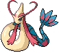

#350 - Milotic
<table cellspacing="0" cellpadding="0"><tr><th colspan="1" align="center"></th><th colspan="1" align="center">Type</th><th colspan="1" align="center">Ability</th></tr><tr><td align="center";rowspan="1"></td><td align="center";rowspan="1"></td><td rowspan="1">(1) Marvel Scale   (2) Marvel Scale   (HA) Cute Charm</td></tr><tr><th colspan="3" align="center">Defenses</th></tr><tr><td align="right">Immune:</td><td colspan="2"></td></tr><tr><td align="right">0.25x Resist:</td><td colspan="2"></td></tr><tr><td align="right">0.5x Resist:</td><td colspan="2"></td></tr><tr><td align="right">Neutral:</td><td colspan="2"></td></tr><tr><td align="right">2x Weak:</td><td colspan="2"></td></tr><tr><td align="right">4x Weak:</td><td colspan="2"></td></tr></table>

## Evolutions
<table>
<tr><td rowspan="1"style="vertical-align: middle;">    <a href="../349">Feebas</a> </td><td rowspan="1"style="vertical-align: middle; word-break:break-all;">Use Prism Scale</td><td rowspan="1"style="vertical-align: middle;">    <a href="../350">Milotic</a> </td></tr>
</table>

## Stats
<table class="stat"><tr><td class="stat-icon-single"></td><td class="stat-single"><u>HP</u> 95</td><td class="stat-single"><u>ATK</u> 60</td><td class="stat-single"><u>DEF</u> 79</td><td class="stat-single"><u>SPA</u> 100</td><td class="stat-single"><u>SPD</u> 125</td><td class="stat-single"><u>SPE</u> 81</td><td class="stat-single"><u>BST</u> 540</td></tr></table>

## Level Up Moves
<table><th>Level</th><th>Name</th><th>Power</th><th>Accuracy</th><th>PP</th><th>Type</th><th>Damage Class</th><th>Effect</th>
<tr><td>1</td><td>Mirror Coat</td><td>None</td><td>100</td><td>20</td><td></td><td></td><td>Priority: -5. Targets the last opposing Pokémon to hit the user with a special move this turn.  Inflicts twice the damage that move did to the user. Type immunity applies.</td></tr>
<tr><td>1</td><td>Refresh</td><td>None</td><td>None</td><td>20</td><td></td><td></td><td>Priority: 0. Removes a burn, paralysis, or poison from the user.</td></tr>
<tr><td>1</td><td>Tickle</td><td>None</td><td>100</td><td>20</td><td></td><td></td><td>Priority: 0. Lowers the target's Attack and Defense by one stage.</td></tr>
<tr><td>1</td><td>Wrap</td><td>15</td><td>90</td><td>20</td><td></td><td></td><td>Priority: 0. For the next 2–5 turns, the target cannot leave the field and is damaged for 1/16 its max HP at the end of each turn.    Has a 3/8 chance each to hit 2 or 3 times, and a 1/8 chance each to hit 4 or 5 times.</td></tr>
<tr><td>4</td><td>Whirlpool</td><td>35</td><td>85</td><td>15</td><td></td><td></td><td>Priority: 0. For the next 2–5 turns, the target cannot leave the field and is damaged for 1/16 its max HP at the end of each turn. Has a 3/8 chance each to hit 2 or 3 times, and a 1/8 chance each to hit 4 or 5 times.  Averages to 3 hits per use.  If the target is in the first turn of dive, this move will hit with double power.</td></tr>
<tr><td>7</td><td>Water Pulse</td><td>60</td><td>100</td><td>20</td><td></td><td></td><td>Priority: 0. Has a 20% chance to confuse the target.</td></tr>
<tr><td>11</td><td>Disarming Voice</td><td>40</td><td>None</td><td>15</td><td></td><td></td><td>Priority: 0. Ignores accuracy and evasion.</td></tr>
<tr><td>14</td><td>Twister</td><td>50</td><td>100</td><td>20</td><td></td><td></td><td>Priority: 0. Has a 20% chance to make each target flinch.  If the target is under the effect of bounce, fly, or sky drop, this move will hit with double power.</td></tr>
<tr><td>17</td><td>Aqua Ring</td><td>None</td><td>None</td><td>20</td><td></td><td></td><td>Priority: 0. Restores 1/16 of the user's max HP at the end of each turn.  If the user leaves the field, this effect ends.  This effect is passed on by baton pass.</td></tr>
<tr><td>21</td><td>Captivate</td><td>None</td><td>100</td><td>20</td><td></td><td></td><td>Priority: 0. Lowers the target's Special Attack by two stages.  If the user and target are the same gender, or either is genderless, this move will fail.</td></tr>
<tr><td>24</td><td>Dragon Tail</td><td>60</td><td>95</td><td>10</td><td></td><td></td><td>Priority: -6. Inflicts regular damage, then switches the target out for another of its trainer's Pokémon, selected at random.  If the target is under the effect of ingrain or suction cups, or it has a substitute, or its Trainer has no more usable Pokémon, it will not be switched out.  If the target is a wild Pokémon, the battle ends instead.</td></tr>
<tr><td>27</td><td>Recover</td><td>None</td><td>None</td><td>10</td><td></td><td></td><td>Priority: 0. Heals the user for half its max HP.</td></tr>
<tr><td>31</td><td>Aqua Tail</td><td>100</td><td>85</td><td>10</td><td></td><td></td><td>Priority: 0. Inflicts regular damage.</td></tr>
<tr><td>34</td><td>Dragon Breath</td><td>70</td><td>100</td><td>20</td><td></td><td></td><td>Priority: 0. Has a 30% chance to paralyze the target.</td></tr>
<tr><td>37</td><td>Safeguard</td><td>None</td><td>None</td><td>25</td><td></td><td></td><td>Priority: 0. Protects Pokémon on the user's side of the field from major status effects and confusion for five turns.  Does not cancel existing ailments.</td></tr>
<tr><td>41</td><td>Confuse Ray</td><td>None</td><td>100</td><td>10</td><td></td><td></td><td>Priority: 0. Confuses the target.</td></tr>
<tr><td>44</td><td>Brine</td><td>65</td><td>100</td><td>10</td><td></td><td></td><td>Priority: 0. If the target has less than half its max HP remaining, this move has double power.</td></tr>
<tr><td>47</td><td>Breaking Swipe</td><td>60</td><td>100</td><td>15</td><td></td><td></td><td>Priority: 0. Lowers the target's Attack by one stage.</td></tr>
<tr><td>50</td><td>Hypnosis</td><td>None</td><td>60</td><td>20</td><td></td><td></td><td>Priority: 0. Puts the target to sleep.</td></tr>
<tr><td>53</td><td>Haze</td><td>None</td><td>None</td><td>30</td><td></td><td></td><td>Priority: 0. Removes stat, accuracy, and evasion modifiers from every Pokémon on the field.</td></tr>
<tr><td>56</td><td>Dragon Pulse</td><td>90</td><td>None</td><td>10</td><td></td><td></td><td>Priority: 0. Bypasses accuracy checks</td></tr>
<tr><td>59</td><td>Coil</td><td>None</td><td>None</td><td>20</td><td></td><td></td><td>Priority: 0. Raises the user's Attack, Defense, and accuracy by one stage each.</td></tr>
<tr><td>62</td><td>Hydro Pump</td><td>110</td><td>80</td><td>5</td><td></td><td></td><td>Priority: 0. Inflicts regular damage.</td></tr>
</table>

## TM Moves
<table><th>Machine</th><th>Name</th><th>Power</th><th>Accuracy</th><th>PP</th><th>Type</th><th>Damage Class</th><th>Effect</th>
<tr><td>TM6</td><td>Toxic</td><td>None</td><td>90</td><td>10</td><td></td><td></td><td>Priority: 0. Badly poisons the target.  Never misses when used by a poison-type Pokémon.</td></tr>
<tr><td>TM7</td><td>Hail</td><td>None</td><td>None</td><td>10</td><td></td><td></td><td>Priority: 0. Changes the weather to hail for five turns, during which non-ice Pokémon are damaged for 1/16 their max HP at the end of every turn.</td></tr>
<tr><td>TM10</td><td>Hidden Power</td><td>60</td><td>100</td><td>15</td><td></td><td></td><td>Priority: 0. Power and type depend upon user's IVs. Power can range from 30 to 70.</td></tr>
<tr><td>TM13</td><td>Ice Beam</td><td>90</td><td>100</td><td>10</td><td></td><td></td><td>Priority: 0. Has a 10% chance to freeze the target.</td></tr>
<tr><td>TM14</td><td>Blizzard</td><td>110</td><td>70</td><td>5</td><td></td><td></td><td>Priority: 0. Has a 10% chance to freeze the target.  During hail, this move has 100% accuracy.</td></tr>
<tr><td>TM15</td><td>Hyper Beam</td><td>150</td><td>90</td><td>5</td><td></td><td></td><td>Priority: 0. User loses its next turn to "recharge", and cannot attack or switch out during that turn.</td></tr>
<tr><td>TM16</td><td>Light Screen</td><td>None</td><td>None</td><td>30</td><td></td><td></td><td>Priority: 0. Reduces damage from special attacks by half for five turns. In double battles, the reduction is 1/3.</td></tr>
<tr><td>TM17</td><td>Protect</td><td>None</td><td>None</td><td>10</td><td></td><td></td><td>Priority: 4. No moves will hit the user for the remainder of this turn. If the user is last to act this turn, this move will fail. Success rate drops by 1/2 on successive attempts.</td></tr>
<tr><td>TM18</td><td>Rain Dance</td><td>None</td><td>None</td><td>5</td><td></td><td></td><td>Priority: 0. Changes the weather to rain for five turns, during which water moves inflict 50% extra damage, and fire moves inflict half damage.</td></tr>
<tr><td>TM21</td><td>Frustration</td><td>None</td><td>100</td><td>20</td><td></td><td></td><td>Priority: 0. Power increases inversely with happiness, given by `(255 - happiness) * 2 / 5`, to a maximum of 102.  Power bottoms out at 1.</td></tr>
<tr><td>TM27</td><td>Return</td><td>None</td><td>100</td><td>20</td><td></td><td></td><td>Priority: 0. Power increases with happiness, given by `happiness * 2 / 5`, to a maximum of 102.  Power bottoms out at 1.</td></tr>
<tr><td>TM42</td><td>Facade</td><td>70</td><td>100</td><td>20</td><td></td><td></td><td>Priority: 0. If the user is burned, paralyzed, or poisoned, this move has double power.</td></tr>
<tr><td>TM44</td><td>Rest</td><td>None</td><td>None</td><td>10</td><td></td><td></td><td>Priority: 0. User falls to sleep for two turns, replacing any existing non-volatile status ailments, and immediately regains all its HP.</td></tr>
<tr><td>TM55</td><td>Scald</td><td>80</td><td>100</td><td>10</td><td></td><td></td><td>Priority: 0. Has a 30% chance to burn the target.</td></tr>
<tr><td>TM56</td><td>Weather Ball</td><td>50</td><td>100</td><td>10</td><td></td><td></td><td>Priority: 0. If a weather move is active, this move has double power, and its type becomes the type of the weather move.</td></tr>
<tr><td>TM63</td><td>Brutal Swing</td><td>60</td><td>100</td><td>20</td><td></td><td></td><td>Priority: 0. Inflicts regular damage.</td></tr>
<tr><td>TM68</td><td>Giga Impact</td><td>150</td><td>90</td><td>5</td><td></td><td></td><td>Priority: 0. User loses its next turn to "recharge", and cannot attack or switch out during that turn.</td></tr>
<tr><td>TM77</td><td>Psych Up</td><td>None</td><td>None</td><td>10</td><td></td><td></td><td>Priority: 0. Discards the user's stat changes and copies the target's.  This move cannot be copied by mirror move.</td></tr>
<tr><td>TM78</td><td>Bulldoze</td><td>60</td><td>100</td><td>20</td><td></td><td></td><td>Priority: 0. Has a 100% chance to lower the target's Speed by one stage.</td></tr>
<tr><td>TM82</td><td>Dragon Tail</td><td>60</td><td>95</td><td>10</td><td></td><td></td><td>Priority: -6. Inflicts regular damage, then switches the target out for another of its trainer's Pokémon, selected at random.  If the target is under the effect of ingrain or suction cups, or it has a substitute, or its Trainer has no more usable Pokémon, it will not be switched out.  If the target is a wild Pokémon, the battle ends instead.</td></tr>
<tr><td>TM90</td><td>Substitute</td><td>None</td><td>None</td><td>10</td><td></td><td></td><td>Priority: 0. Transfers 1/4 the user's max HP into a doll that absorbs damage and causes most negative move effects to fail.</td></tr>
<tr><td>HM3</td><td>Surf</td><td>90</td><td>100</td><td>15</td><td></td><td></td><td>Priority: 0. Inflicts regular damage.  If the target is in the first turn of dive, this move will hit with double power.</td></tr>
<tr><td>HM5</td><td>Waterfall</td><td>80</td><td>100</td><td>10</td><td></td><td></td><td>Priority: 0. Has a 20% chance to make the target flinch.</td></tr>
<tr><td>HM6</td><td>Dive</td><td>100</td><td>100</td><td>10</td><td></td><td></td><td>Priority: 0. User dives underwater for one turn, becoming immune to attack, and hits on the second turn.  During the immune turn, surf, and whirlpool still hit the user normally, and their power is doubled if appropriate.  The user may be hit during its immune turn if under the effect of lock on, mind reader, or no guard.  This move cannot be selected by sleep talk.</td></tr>
</table>

## Tutor Moves
<table><th>Name</th><th>Power</th><th>Accuracy</th><th>PP</th><th>Type</th><th>Damage Class</th><th>Effect</th>
<tr><td>Aqua Tail</td><td>100</td><td>85</td><td>10</td><td></td><td></td><td>Priority: 0. Inflicts regular damage.</td></tr>
<tr><td>Bind</td><td>15</td><td>85</td><td>20</td><td></td><td></td><td>Priority: 0. For the next 2–5 turns, the target cannot leave the field and is damaged for 1/16 its max HP at the end of each turn.</td></tr>
<tr><td>Dragon Pulse</td><td>90</td><td>None</td><td>10</td><td></td><td></td><td>Priority: 0. Bypasses accuracy checks</td></tr>
<tr><td>Icy Wind</td><td>55</td><td>95</td><td>15</td><td></td><td></td><td>Priority: 0. Has a 100% chance to lower the target's Speed by one stage.</td></tr>
<tr><td>Iron Head</td><td>80</td><td>100</td><td>15</td><td></td><td></td><td>Priority: 0. Has a 30% chance to make the target flinch.</td></tr>
<tr><td>Iron Tail</td><td>100</td><td>75</td><td>15</td><td></td><td></td><td>Priority: 0. Has a 30% chance to lower the target's Defense by one stage.</td></tr>
<tr><td>Magic Coat</td><td>None</td><td>None</td><td>15</td><td></td><td></td><td>Priority: 4. The first non-damaging move targeting the user this turn that inflicts major status effects, stat changes, or trapping effects will be reflected at its user.  defog, memento, and teeter dance are not reflected.  attract, flatter, gastro acid, leech seed, swagger, worry seed, and yawn are reflected.  This move cannot be copied by mirror move.</td></tr>
<tr><td>Sleep Talk</td><td>None</td><td>None</td><td>10</td><td></td><td></td><td>Priority: 0. Only usable if the user is sleeping. Randomly selects and uses one of the user's other three moves. Use of the selected move requires and costs 0 PP.</td></tr>
<tr><td>Snore</td><td>50</td><td>100</td><td>15</td><td></td><td></td><td>Priority: 0. Only usable if the user is sleeping.   Has a 30% chance to make the target flinch.</td></tr>
</table>

## Pre-Evolution Moves
| Species | Method | Move |
|: --- :|: --- :|: --- :|
| Feebas | Lvl 1 | Flail |
| Feebas | Lvl 1 | Splash |
| Feebas | Lvl 1 | Tackle |

## Encounter Locations

| Location | &nbsp; | Level | Spawn Percent |
|: -- :|: -- :|: -- :|: -- :|
| [Route 1] | Fish, Rippling Water | 65-75 | 5.0 |
| [The Nature Preserve] | Fish | 1-100 | 5.0 |

--8<-- "includes/abilities.md"

[The Nature Preserve]: ../../wildareas/The_Nature_Preserve/
[Route 1]: ../../wildareas/Route_1/
