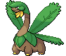

#357 - Tropius
<table cellspacing="0" cellpadding="0"><tr><th colspan="1" align="center"></th><th colspan="1" align="center">Type</th><th colspan="1" align="center">Ability</th></tr><tr><td align="center";rowspan="1"></td><td align="center";rowspan="1"> </td><td rowspan="1">(1) Chlorophyll   (2) Solar Power   (HA) Harvest</td></tr><tr><th colspan="3" align="center">Defenses</th></tr><tr><td align="right">Immune:</td><td colspan="2"></td></tr><tr><td align="right">0.25x Resist:</td><td colspan="2"></td></tr><tr><td align="right">0.5x Resist:</td><td colspan="2"></td></tr><tr><td align="right">Neutral:</td><td colspan="2"></td></tr><tr><td align="right">2x Weak:</td><td colspan="2"></td></tr><tr><td align="right">4x Weak:</td><td colspan="2"></td></tr></table>

## Stats
<table class="stat"><tr><td class="stat-icon-single"></td><td class="stat-single"><u>HP</u> 99</td><td  class="stat-single">            <u>ATK                +30</u>                     98</td><td class="stat-single"><u>DEF</u> 83</td><td  class="stat-single">            <u>SPA                +10</u>                     82</td><td class="stat-single"><u>SPD</u> 87</td><td class="stat-single"><u>SPE</u> 51</td><td  class="stat-single">            <u>BST                +40</u>                     500</td></tr></table>

## Level Up Moves
<table><th>Level</th><th>Name</th><th>Power</th><th>Accuracy</th><th>PP</th><th>Type</th><th>Damage Class</th><th>Effect</th>
<tr><td>1</td><td>Breaking Swipe</td><td>60</td><td>100</td><td>15</td><td></td><td></td><td>Priority: 0. Lowers the target's Attack by one stage.</td></tr>
<tr><td>1</td><td>Growth</td><td>None</td><td>None</td><td>20</td><td></td><td></td><td>Priority: 0. Raises the user's Attack and Special Attack by one stage each.  During sunny day, raises both stats by two stages.</td></tr>
<tr><td>1</td><td>Gust</td><td>40</td><td>100</td><td>25</td><td></td><td></td><td>Priority: 0. Inflicts regular damage.  If the target is under the effect of bounce, fly, or sky drop, this move will hit with double power.</td></tr>
<tr><td>1</td><td>Leer</td><td>None</td><td>100</td><td>30</td><td></td><td></td><td>Priority: 0. Lowers the target's Defense by one stage.</td></tr>
<tr><td>1</td><td>Razor Leaf</td><td>55</td><td>95</td><td>25</td><td></td><td></td><td>Priority: 0. User's critical hit rate is one level higher when using this move.</td></tr>
<tr><td>4</td><td>Headbutt</td><td>70</td><td>100</td><td>15</td><td></td><td></td><td>Priority: 0. Has a 30% chance to make the target flinch.</td></tr>
<tr><td>7</td><td>Whirlwind</td><td>None</td><td>Never Miss</td><td>20</td><td></td><td></td><td>Priority: -6. Switches the target out for another of its trainer's Pokémon selected at random.  Wild battles end immediately.</td></tr>
<tr><td>10</td><td>Stomp</td><td>65</td><td>100</td><td>20</td><td></td><td></td><td>Priority: 0. Has a 30% chance to make the target flinch.  Power is doubled against Pokémon that have used minimize since entering the field.</td></tr>
<tr><td>14</td><td>Magical Leaf</td><td>60</td><td>None</td><td>20</td><td></td><td></td><td>Priority: 0. Ignores accuracy and evasion modifiers.</td></tr>
<tr><td>18</td><td>Curse</td><td>None</td><td>None</td><td>10</td><td></td><td></td><td>Priority: 0. If the user is a ghost: user pays half its max HP to place a curse on the target, damaging it for 1/4 its max HP every turn. Otherwise: Lowers the user's Speed by one stage, and raises its Attack and Defense by one stage each.  The curse effect is passed on by baton pass.  This move cannot be copied by mirror move.</td></tr>
<tr><td>22</td><td>Bullet Seed</td><td>25</td><td>100</td><td>30</td><td></td><td></td><td>Priority: 0. Hits 2–5 times in one turn.  Has a 3/8 chance each to hit 2 or 3 times, and a 1/8 chance each to hit 4 or 5 times.  Averages to 3 hits per use.</td></tr>
<tr><td>26</td><td>Leaf Tornado</td><td>70</td><td>100</td><td>10</td><td></td><td></td><td>Priority: 0. Has a 30%  chance to drop target's Accuracy by one stage</td></tr>
<tr><td>30</td><td>Nature Power</td><td>None</td><td>None</td><td>20</td><td></td><td></td><td>Priority: 0. Uses another move chosen according to the terrain.</td></tr>
<tr><td>34</td><td>Air Slash</td><td>75</td><td>95</td><td>10</td><td></td><td></td><td>Priority: 0. Has a 30% chance to make the target flinch.</td></tr>
<tr><td>38</td><td>Dragon Dance</td><td>None</td><td>None</td><td>20</td><td></td><td></td><td>Priority: 0. Raises the user's Attack and Speed by one stage each.</td></tr>
<tr><td>42</td><td>Body Slam</td><td>85</td><td>100</td><td>15</td><td></td><td></td><td>Priority: 0. Has a 30% chance to paralyze the target.</td></tr>
<tr><td>46</td><td>Synthesis</td><td>None</td><td>None</td><td>5</td><td></td><td></td><td>Priority: 0. Heals the user for half its max HP, plus modifiers from weather.</td></tr>
<tr><td>50</td><td>Leaf Blade</td><td>90</td><td>100</td><td>15</td><td></td><td></td><td>Priority: 0. User's critical hit rate is one level higher when using this move.</td></tr>
<tr><td>54</td><td>Leech Seed</td><td>None</td><td>90</td><td>10</td><td></td><td></td><td>Priority: 0. Plants a seed on the target that drains 1/8 of its max HP at the end of every turn and heals the user for the amount taken.</td></tr>
<tr><td>58</td><td>Solar Beam</td><td>120</td><td>100</td><td>10</td><td></td><td></td><td>Priority: 0. User charges for one turn before attacking.</td></tr>
<tr><td>62</td><td>Leaf Storm</td><td>130</td><td>90</td><td>5</td><td></td><td></td><td>Priority: 0. Inflicts regular damage, then lowers the user's Special Attack by two stages.</td></tr>
<tr><td>66</td><td>Dual Wingbeat</td><td>40</td><td>90</td><td>10</td><td></td><td></td><td>Priority: 0. Inflicts regular damage.</td></tr>
</table>

## TM Moves
<table><th>Machine</th><th>Name</th><th>Power</th><th>Accuracy</th><th>PP</th><th>Type</th><th>Damage Class</th><th>Effect</th>
<tr><td>TM5</td><td>Roar</td><td>None</td><td>None</td><td>20</td><td></td><td></td><td>Priority: -6. Switches the target out for another of its trainer's Pokémon selected at random.  Wild battles end immediately.</td></tr>
<tr><td>TM6</td><td>Toxic</td><td>None</td><td>90</td><td>10</td><td></td><td></td><td>Priority: 0. Badly poisons the target.  Never misses when used by a poison-type Pokémon.</td></tr>
<tr><td>TM10</td><td>Hidden Power</td><td>60</td><td>100</td><td>15</td><td></td><td></td><td>Priority: 0. Power and type depend upon user's IVs. Power can range from 30 to 70.</td></tr>
<tr><td>TM11</td><td>Sunny Day</td><td>None</td><td>None</td><td>5</td><td></td><td></td><td>Priority: 0. Changes the weather to sunshine for five turns.</td></tr>
<tr><td>TM15</td><td>Hyper Beam</td><td>150</td><td>90</td><td>5</td><td></td><td></td><td>Priority: 0. User loses its next turn to "recharge", and cannot attack or switch out during that turn.</td></tr>
<tr><td>TM17</td><td>Protect</td><td>None</td><td>None</td><td>10</td><td></td><td></td><td>Priority: 4. No moves will hit the user for the remainder of this turn. If the user is last to act this turn, this move will fail. Success rate drops by 1/2 on successive attempts.</td></tr>
<tr><td>TM19</td><td>Giga Drain</td><td>80</td><td>100</td><td>10</td><td></td><td></td><td>Priority: 0. Drains half the damage inflicted to heal the user.</td></tr>
<tr><td>TM21</td><td>Frustration</td><td>None</td><td>100</td><td>20</td><td></td><td></td><td>Priority: 0. Power increases inversely with happiness, given by `(255 - happiness) * 2 / 5`, to a maximum of 102.  Power bottoms out at 1.</td></tr>
<tr><td>TM22</td><td>Solar Beam</td><td>120</td><td>100</td><td>10</td><td></td><td></td><td>Priority: 0. User charges for one turn before attacking.</td></tr>
<tr><td>TM26</td><td>Earthquake</td><td>100</td><td>100</td><td>10</td><td></td><td></td><td>Priority: 0. Inflicts regular damage.  If the target is in the first turn of dig, this move will hit with double power.</td></tr>
<tr><td>TM27</td><td>Return</td><td>None</td><td>100</td><td>20</td><td></td><td></td><td>Priority: 0. Power increases with happiness, given by `happiness * 2 / 5`, to a maximum of 102.  Power bottoms out at 1.</td></tr>
<tr><td>TM40</td><td>Aerial Ace</td><td>60</td><td>None</td><td>20</td><td></td><td></td><td>Priority: 0. Ignores accuracy and evasion modifiers.</td></tr>
<tr><td>TM42</td><td>Facade</td><td>70</td><td>100</td><td>20</td><td></td><td></td><td>Priority: 0. If the user is burned, paralyzed, or poisoned, this move has double power.</td></tr>
<tr><td>TM44</td><td>Rest</td><td>None</td><td>None</td><td>10</td><td></td><td></td><td>Priority: 0. User falls to sleep for two turns, replacing any existing non-volatile status ailments, and immediately regains all its HP.</td></tr>
<tr><td>TM53</td><td>Energy Ball</td><td>90</td><td>100</td><td>10</td><td></td><td></td><td>Priority: 0. Has a 10% chance to lower the target's Special Defense by one stage.</td></tr>
<tr><td>TM58</td><td>Hurricane</td><td>110</td><td>80</td><td>5</td><td></td><td></td><td>Priority: 0. Has a 30% chance to confuse the target.  This move can hit Pokémon under the effect of bounce, fly, or sky drop.  During rain dance, this move has 100% accuracy.  During sunny day, this move has 50% accuracy.</td></tr>
<tr><td>TM63</td><td>Brutal Swing</td><td>60</td><td>100</td><td>20</td><td></td><td></td><td>Priority: 0. Inflicts regular damage.</td></tr>
<tr><td>TM68</td><td>Giga Impact</td><td>150</td><td>90</td><td>5</td><td></td><td></td><td>Priority: 0. User loses its next turn to "recharge", and cannot attack or switch out during that turn.</td></tr>
<tr><td>TM70</td><td>Flash</td><td>None</td><td>100</td><td>20</td><td></td><td></td><td>Priority: 0. Lowers the target's accuracy by one stage.</td></tr>
<tr><td>TM75</td><td>Swords Dance</td><td>None</td><td>None</td><td>20</td><td></td><td></td><td>Priority: 0. Raises the user's Attack by two stages.</td></tr>
<tr><td>TM78</td><td>Bulldoze</td><td>60</td><td>100</td><td>20</td><td></td><td></td><td>Priority: 0. Has a 100% chance to lower the target's Speed by one stage.</td></tr>
<tr><td>TM86</td><td>Grass Knot</td><td>None</td><td>100</td><td>20</td><td></td><td></td><td>Priority: 0. Power increases with the target's weight in kilograms, to a maximum of 120.</td></tr>
<tr><td>TM90</td><td>Substitute</td><td>None</td><td>None</td><td>10</td><td></td><td></td><td>Priority: 0. Transfers 1/4 the user's max HP into a doll that absorbs damage and causes most negative move effects to fail.</td></tr>
<tr><td>TM94</td><td>Rock Smash</td><td>55</td><td>100</td><td>15</td><td></td><td></td><td>Priority: 0. 100% chance to drop target's Def by one stage. Also boosted by the ability Iron Fist</td></tr>
<tr><td>HM1</td><td>Cut</td><td>50</td><td>95</td><td>30</td><td></td><td></td><td>Priority: 0. High Critical Ratio</td></tr>
<tr><td>HM2</td><td>Fly</td><td>80</td><td>100</td><td>15</td><td></td><td></td><td>Priority: 0. User flies high into the air for one turn, becoming immune to attack, and hits on the second turn.  During the immune turn, gust (2x dmg), hurricane, sky uppercut, smack down, thunder, twister (2x dmg), and whirlwind still hit the user normally.  Gust and twister also have double power against the user.  The damage from hail and sandstorm still applies during the immune turn.  The user may be hit under the effect of lock on, mind reader, or no guard.  This move cannot be used while gravity is in effect.  This move cannot be selected by sleep talk.</td></tr>
<tr><td>HM4</td><td>Strength</td><td>85</td><td>100</td><td>10</td><td></td><td></td><td>Priority: 0. 10% Raise Attack</td></tr>
</table>

## Tutor Moves
<table><th>Name</th><th>Power</th><th>Accuracy</th><th>PP</th><th>Type</th><th>Damage Class</th><th>Effect</th>
<tr><td>Dragon Pulse</td><td>90</td><td>None</td><td>10</td><td></td><td></td><td>Priority: 0. Bypasses accuracy checks</td></tr>
<tr><td>Giga Drain</td><td>80</td><td>100</td><td>10</td><td></td><td></td><td>Priority: 0. Drains half the damage inflicted to heal the user.</td></tr>
<tr><td>Outrage</td><td>120</td><td>100</td><td>10</td><td></td><td></td><td>Priority: 0. User is forced to attack with this move for 2–3 turns,selected at random.  After the last hit, the user becomes confused.</td></tr>
<tr><td>Roost</td><td>None</td><td>None</td><td>10</td><td></td><td></td><td>Priority: 0. Heals the user for half its max HP.  If the user is flying, its flying type is ignored until the end of this turn.</td></tr>
<tr><td>Seed Bomb</td><td>80</td><td>100</td><td>15</td><td></td><td></td><td>Priority: 0. Inflicts regular damage.</td></tr>
<tr><td>Sleep Talk</td><td>None</td><td>None</td><td>10</td><td></td><td></td><td>Priority: 0. Only usable if the user is sleeping. Randomly selects and uses one of the user's other three moves. Use of the selected move requires and costs 0 PP.</td></tr>
<tr><td>Snore</td><td>50</td><td>100</td><td>15</td><td></td><td></td><td>Priority: 0. Only usable if the user is sleeping.   Has a 30% chance to make the target flinch.</td></tr>
<tr><td>Synthesis</td><td>None</td><td>None</td><td>5</td><td></td><td></td><td>Priority: 0. Heals the user for half its max HP, plus modifiers from weather.</td></tr>
<tr><td>Tailwind</td><td>None</td><td>None</td><td>15</td><td></td><td></td><td>Priority: 0. For the next three turns, all Pokémon on the user's side of the field have their original Speed doubled.  This effect remains if the user leaves the field.</td></tr>
<tr><td>Worry Seed</td><td>None</td><td>100</td><td>10</td><td></td><td></td><td>Priority: 0. Changes the target's ability to insomnia.  If the target's ability is truant or multitype, this move will fail.</td></tr>
</table>

## Encounter Locations

| Location | &nbsp; | Level | Spawn Percent |
|: -- :|: -- :|: -- :|: -- :|
| [Route 14] | Dark Grass (Doubles) | 42-46 | 10.0 |
| [Route 14] | Grass | 41-44 | 10.0 |
| [Route 18] | Dark Grass (Doubles) | 73 | 10.0 |
| [Route 18] | Grass | 67 | 10.0 |
| [Route 23] | Dark Grass (Doubles) | 59-62 | 10.0 |
| [Route 23] | Grass | 58-61 | 5.0 |

--8<-- "includes/abilities.md"

[Route 14]: ../../wildareas/Route_14/
[Route 18]: ../../wildareas/Route_18/
[Route 23]: ../../wildareas/Route_23/
