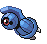

#374 - Beldum
<table cellspacing="0" cellpadding="0"><tr><th colspan="1" align="center"></th><th colspan="1" align="center">Type</th><th colspan="1" align="center">Ability</th></tr><tr><td align="center";rowspan="1"></td><td align="center";rowspan="1"> </td><td rowspan="1">(1) Clear Body   (2) Rock Head   (HA) Heavy Metal</td></tr><tr><th colspan="3" align="center">Defenses</th></tr><tr><td align="right">Immune:</td><td colspan="2"></td></tr><tr><td align="right">0.25x Resist:</td><td colspan="2"></td></tr><tr><td align="right">0.5x Resist:</td><td colspan="2"></td></tr><tr><td align="right">Neutral:</td><td colspan="2"></td></tr><tr><td align="right">2x Weak:</td><td colspan="2"></td></tr><tr><td align="right">4x Weak:</td><td colspan="2"></td></tr></table>

## Evolutions
<table>
<tr><td rowspan="1"style="vertical-align: middle;">    <a href="../374">Beldum</a> </td><td rowspan="1"style="vertical-align: middle; word-break:break-all;">Level 20</td><td rowspan="1"style="vertical-align: middle;">    <a href="../375">Metang</a> </td><td rowspan="1"style="vertical-align: middle; word-break:break-all;">Level 45</td><td rowspan="1"style="vertical-align: middle;">    <a href="../376">Metagross</a> </td></tr>
</table>

## Stats
<table class="stat"><tr><td class="stat-icon-single"></td><td class="stat-single"><u>HP</u> 40</td><td class="stat-single"><u>ATK</u> 55</td><td class="stat-single"><u>DEF</u> 80</td><td class="stat-single"><u>SPA</u> 35</td><td class="stat-single"><u>SPD</u> 60</td><td class="stat-single"><u>SPE</u> 30</td><td class="stat-single"><u>BST</u> 300</td></tr></table>

## Wild Hold Items
- 5%: Metal Coat

## Level Up Moves
<table><th>Level</th><th>Name</th><th>Power</th><th>Accuracy</th><th>PP</th><th>Type</th><th>Damage Class</th><th>Effect</th>
<tr><td>1</td><td>Confusion</td><td>50</td><td>100</td><td>20</td><td></td><td></td><td>Priority: 0. Has a 10% chance to confuse the target.</td></tr>
<tr><td>1</td><td>Headbutt</td><td>70</td><td>100</td><td>15</td><td></td><td></td><td>Priority: 0. Has a 30% chance to make the target flinch.</td></tr>
<tr><td>1</td><td>Iron Defense</td><td>None</td><td>None</td><td>15</td><td></td><td></td><td>Priority: 0. Raises the user's Defense by two stages.</td></tr>
<tr><td>1</td><td>Mirror Shot</td><td>65</td><td>85</td><td>10</td><td></td><td></td><td>Priority: 0. Has a 30% chance to lower the target's accuracy by one stage.</td></tr>
<tr><td>15</td><td>Take Down</td><td>90</td><td>85</td><td>20</td><td></td><td></td><td>Priority: 0. User takes 1/4 the damage it inflicts in recoil.</td></tr>
</table>

## Tutor Moves
<table><th>Name</th><th>Power</th><th>Accuracy</th><th>PP</th><th>Type</th><th>Damage Class</th><th>Effect</th>
<tr><td>Iron Defense</td><td>None</td><td>None</td><td>15</td><td></td><td></td><td>Priority: 0. Raises the user's Defense by two stages.</td></tr>
<tr><td>Iron Head</td><td>80</td><td>100</td><td>15</td><td></td><td></td><td>Priority: 0. Has a 30% chance to make the target flinch.</td></tr>
<tr><td>Zen Headbutt</td><td>80</td><td>90</td><td>10</td><td></td><td></td><td>Priority: 0. Has a 20% chance to make the target flinch.</td></tr>
</table>

## Encounter Locations

| Location | &nbsp; | &nbsp; | Level | Spawn Percent |
|: -- :|: -- :|: -- :|: -- :|: -- :|
| [Giants Chasm] | Plasma Airship Area | Hidden Grotto | ?? | 0.25 |
| [Virbank Complex - Inside] | Shaking Grass | &nbsp; | 16 | 10.0 |

--8<-- "includes/abilities.md"

[Giants Chasm]: ../../wildareas/Giants_Chasm/
[Virbank Complex - Inside]: ../../wildareas/Virbank_Complex_-_Inside/
