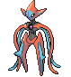
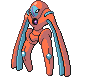
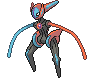

#386 - Deoxys
=== "Normal"
	<table cellspacing="0" cellpadding="0"><tr><th colspan="1" align="center">Normal</th><th colspan="1" align="center">Type</th><th colspan="1" align="center">Ability</th></tr><tr><td align="center";rowspan="1"></td><td align="center";rowspan="1"></td><td rowspan="1">(1) Moody   (2) Pressure</td></tr><tr><th colspan="3" align="center">Defenses</th></tr><tr><td align="right">Immune:</td><td colspan="2"></td></tr><tr><td align="right">0.25x Resist:</td><td colspan="2"></td></tr><tr><td align="right">0.5x Resist:</td><td colspan="2"></td></tr><tr><td align="right">Neutral:</td><td colspan="2"></td></tr><tr><td align="right">2x Weak:</td><td colspan="2"></td></tr><tr><td align="right">4x Weak:</td><td colspan="2"></td></tr></table>

=== "Attack"
	<table cellspacing="0" cellpadding="0"><tr><th colspan="1" align="center">Attack</th><th colspan="1" align="center">Type</th><th colspan="1" align="center">Ability</th></tr><tr><td align="center";rowspan="1"></td><td align="center";rowspan="1"></td><td rowspan="1">(1) Download   (2) Pressure</td></tr></table>

=== "Defense"
	<table cellspacing="0" cellpadding="0"><tr><th colspan="1" align="center">Defense</th><th colspan="1" align="center">Type</th><th colspan="1" align="center">Ability</th></tr><tr><td align="center";rowspan="1"></td><td align="center";rowspan="1"></td><td rowspan="1">(1) Regenerator   (2) Pressure</td></tr></table>

=== "Speed"
	<table cellspacing="0" cellpadding="0"><tr><th colspan="1" align="center">Speed</th><th colspan="1" align="center">Type</th><th colspan="1" align="center">Ability</th></tr><tr><td align="center";rowspan="1"></td><td align="center";rowspan="1"></td><td rowspan="1">(1) Inner Focus   (2) Pressure</td></tr></table>

&nbsp;

## Stats
<table class="stat"><tr><td class="stat-icon-single"></td><td class="stat-single"><u>HP</u> 50</td><td class="stat-single"><u>ATK</u> 150</td><td class="stat-single"><u>DEF</u> 50</td><td class="stat-single"><u>SPA</u> 150</td><td class="stat-single"><u>SPD</u> 50</td><td class="stat-single"><u>SPE</u> 150</td><td class="stat-single"><u>BST</u> 600</td></tr>
<tr><td class="stat-icon-single"></td><td class="stat-single"><u>HP</u> 50</td><td class="stat-single"><u>ATK</u> 180</td><td class="stat-single"><u>DEF</u> 20</td><td class="stat-single"><u>SPA</u> 180</td><td class="stat-single"><u>SPD</u> 20</td><td class="stat-single"><u>SPE</u> 150</td><td class="stat-single"><u>BST</u> 600</td></tr>
<tr><td class="stat-icon-single"></td><td class="stat-single"><u>HP</u> 50</td><td class="stat-single"><u>ATK</u> 70</td><td class="stat-single"><u>DEF</u> 160</td><td class="stat-single"><u>SPA</u> 70</td><td class="stat-single"><u>SPD</u> 160</td><td class="stat-single"><u>SPE</u> 90</td><td class="stat-single"><u>BST</u> 600</td></tr>
<tr><td class="stat-icon-single"></td><td class="stat-single"><u>HP</u> 50</td><td class="stat-single"><u>ATK</u> 95</td><td class="stat-single"><u>DEF</u> 90</td><td class="stat-single"><u>SPA</u> 95</td><td class="stat-single"><u>SPD</u> 90</td><td class="stat-single"><u>SPE</u> 180</td><td class="stat-single"><u>BST</u> 600</td></tr></table>

## Level Up Moves
<table><th>Form</th><th>Level</th><th>Name</th><th>Power</th><th>Accuracy</th><th>PP</th><th>Type</th><th>Damage Class</th><th>Effect</th>
<tr><td></td><td>1</td><td>Dark Pulse</td><td>80</td><td>Never Miss</td><td>10</td><td></td><td></td><td>Priority: 0. Has a 20% chance to make the target flinch.</td></tr>
<tr><td></td><td>1</td><td>Leer</td><td>None</td><td>100</td><td>30</td><td></td><td></td><td>Priority: 0. Lowers the target's Defense by one stage.</td></tr>
<tr><td></td><td>1</td><td>Meteor Mash</td><td>95</td><td>90</td><td>10</td><td></td><td></td><td>Priority: 0. Has a 20% chance to raise the user's Attack one stage.</td></tr>
<tr><td></td><td>1</td><td>Wrap</td><td>15</td><td>90</td><td>20</td><td></td><td></td><td>Priority: 0. For the next 2–5 turns, the target cannot leave the field and is damaged for 1/16 its max HP at the end of each turn.    Has a 3/8 chance each to hit 2 or 3 times, and a 1/8 chance each to hit 4 or 5 times.</td></tr>
<tr><td></td><td>6</td><td>Night Shade</td><td>None</td><td>100</td><td>15</td><td></td><td></td><td>Priority: 0. Inflicts damage equal to the user's level.  Type immunity applies, but other type effects are ignored.</td></tr>
<tr><td></td><td>10</td><td>Double Team</td><td>None</td><td>None</td><td>15</td><td></td><td></td><td>Priority: 0. Raises the user's evasion by one stage.</td></tr>
<tr><td></td><td>10</td><td>Teleport</td><td>None</td><td>None</td><td>20</td><td></td><td></td><td>Priority: -6. Does nothing.  Wild battles end immediately.</td></tr>
<tr><td></td><td>14</td><td>Knock Off</td><td>65</td><td>100</td><td>20</td><td></td><td></td><td>Priority: 0. Target loses its held item.</td></tr>
<tr><td></td><td>14</td><td>Taunt</td><td>None</td><td>100</td><td>20</td><td></td><td></td><td>Priority: 0. Target is forced to only use damaging moves for the next 3–5 turns, selected at random.</td></tr>
<tr><td></td><td>18</td><td>Pursuit</td><td>40</td><td>100</td><td>20</td><td></td><td></td><td>Priority: 0. If the target attempts to switch out this turn before the user acts, this move hits the target before it leaves and has double power.  This effect can still hit a Pokémon that switches out when it has a substitute up or when an ally has used follow me.</td></tr>
<tr><td></td><td>18</td><td>Spikes</td><td>None</td><td>None</td><td>20</td><td></td><td></td><td>Priority: 0. Scatters spikes around the opposing field, which damage opposing Pokémon that enter the field for 1/8 of their max HP.  Pokémon immune to ground moves are immune to this damage, except during gravity.  Up to three layers of spikes may be laid down, adding 1/16 to the damage done: two layers of spikes damage for 3/16 max HP, and three layers damage for 1/4 max HP.</td></tr>
<tr><td></td><td>22</td><td>Psychic</td><td>90</td><td>100</td><td>10</td><td></td><td></td><td>Priority: 0. Has a 10% chance to lower the target's Special Defense by one stage.</td></tr>
<tr><td></td><td>26</td><td>Snatch</td><td>None</td><td>None</td><td>10</td><td></td><td></td><td>Priority: 4. The next time a Pokémon uses a beneficial move on itself or itself and its ally this turn, the user of this move will steal the move and use it itself.  Moves which may be stolen by this move are identified by the "snatchable" flag.  If two Pokémon use this move on the same turn, the faster Pokémon will steal the first beneficial move, and the slower Pokémon will then steal it again—thus, only the slowest Pokémon using this move ultimately gains a stolen move's effect.  If the user steals psych up, it will target the Pokémon that used psych up.  If the user was the original target of psych up, and the Pokémon that originally used it's affected by pressure, it will only lose 1 PP.  This move cannot be copied by mirror move, nor selected by assist or metronome.</td></tr>
<tr><td></td><td>26</td><td>Superpower</td><td>120</td><td>100</td><td>5</td><td></td><td></td><td>Priority: 0. Inflicts regular damage, then lowers the user's Attack and Defense by one stage each.</td></tr>
<tr><td></td><td>26</td><td>Swift</td><td>60</td><td>None</td><td>20</td><td></td><td></td><td>Priority: 0. Ignores accuracy and evasion modifiers.</td></tr>
<tr><td></td><td>30</td><td>Psycho Shift</td><td>None</td><td>100</td><td>10</td><td></td><td></td><td>Priority: 0. If the user has a major status effect and the target does not, the user's status is transferred to the target.</td></tr>
<tr><td></td><td>34</td><td>Zen Headbutt</td><td>80</td><td>90</td><td>10</td><td></td><td></td><td>Priority: 0. Has a 20% chance to make the target flinch.</td></tr>
<tr><td></td><td>38</td><td>Agility</td><td>None</td><td>None</td><td>30</td><td></td><td></td><td>Priority: 0. Raises the user's Speed by two stages.</td></tr>
<tr><td></td><td>38</td><td>Amnesia</td><td>None</td><td>None</td><td>20</td><td></td><td></td><td>Priority: 0. Raises the user's Special Defense by two stages.</td></tr>
<tr><td></td><td>38</td><td>Cosmic Power</td><td>None</td><td>None</td><td>20</td><td></td><td></td><td>Priority: 0. Raises the user's Defense and Special Defense by one stage.</td></tr>
<tr><td></td><td>38</td><td>Iron Defense</td><td>None</td><td>None</td><td>15</td><td></td><td></td><td>Priority: 0. Raises the user's Defense by two stages.</td></tr>
<tr><td></td><td>42</td><td>Recover</td><td>None</td><td>None</td><td>10</td><td></td><td></td><td>Priority: 0. Heals the user for half its max HP.</td></tr>
<tr><td></td><td>42</td><td>Zap Cannon</td><td>120</td><td>50</td><td>5</td><td></td><td></td><td>Priority: 0. Has a 100% chance to paralyze the target.</td></tr>
<tr><td></td><td>46</td><td>Psycho Boost</td><td>140</td><td>90</td><td>5</td><td></td><td></td><td>Priority: 0. Inflicts regular damage, then lowers the user's Special Attack by two stages.</td></tr>
<tr><td></td><td>50</td><td>Counter</td><td>None</td><td>100</td><td>20</td><td></td><td></td><td>Priority: -5. Targets the last opposing Pokémon to hit the user with a physical move this turn.  Inflicts twice the damage that move did to the user.</td></tr>
<tr><td></td><td>50</td><td>Extreme Speed</td><td>80</td><td>100</td><td>5</td><td></td><td></td><td>Priority: 2. Inflicts regular damage.</td></tr>
<tr><td></td><td>50</td><td>Hyper Beam</td><td>150</td><td>90</td><td>5</td><td></td><td></td><td>Priority: 0. User loses its next turn to "recharge", and cannot attack or switch out during that turn.</td></tr>
<tr><td></td><td>50</td><td>Mirror Coat</td><td>None</td><td>100</td><td>20</td><td></td><td></td><td>Priority: -5. Targets the last opposing Pokémon to hit the user with a special move this turn.  Inflicts twice the damage that move did to the user. Type immunity applies.</td></tr>
</table>

## TM Moves
<table><th>Machine</th><th>Name</th><th>Power</th><th>Accuracy</th><th>PP</th><th>Type</th><th>Damage Class</th><th>Effect</th>
<tr><td>TM3</td><td>Psyshock</td><td>80</td><td>100</td><td>10</td><td></td><td></td><td>Priority: 0. Damage calculation always uses the target's Defense, regardless of this move's damage class.</td></tr>
<tr><td>TM4</td><td>Calm Mind</td><td>None</td><td>None</td><td>10</td><td></td><td></td><td>Priority: 0. Raises the user's Special Attack and Special Defense by one stage each.</td></tr>
<tr><td>TM6</td><td>Toxic</td><td>None</td><td>90</td><td>10</td><td></td><td></td><td>Priority: 0. Badly poisons the target.  Never misses when used by a poison-type Pokémon.</td></tr>
<tr><td>TM10</td><td>Hidden Power</td><td>60</td><td>100</td><td>15</td><td></td><td></td><td>Priority: 0. Power and type depend upon user's IVs. Power can range from 30 to 70.</td></tr>
<tr><td>TM11</td><td>Sunny Day</td><td>None</td><td>None</td><td>5</td><td></td><td></td><td>Priority: 0. Changes the weather to sunshine for five turns.</td></tr>
<tr><td>TM12</td><td>Taunt</td><td>None</td><td>100</td><td>20</td><td></td><td></td><td>Priority: 0. Target is forced to only use damaging moves for the next 3–5 turns, selected at random.</td></tr>
<tr><td>TM13</td><td>Ice Beam</td><td>90</td><td>100</td><td>10</td><td></td><td></td><td>Priority: 0. Has a 10% chance to freeze the target.</td></tr>
<tr><td>TM15</td><td>Hyper Beam</td><td>150</td><td>90</td><td>5</td><td></td><td></td><td>Priority: 0. User loses its next turn to "recharge", and cannot attack or switch out during that turn.</td></tr>
<tr><td>TM16</td><td>Light Screen</td><td>None</td><td>None</td><td>30</td><td></td><td></td><td>Priority: 0. Reduces damage from special attacks by half for five turns. In double battles, the reduction is 1/3.</td></tr>
<tr><td>TM17</td><td>Protect</td><td>None</td><td>None</td><td>10</td><td></td><td></td><td>Priority: 4. No moves will hit the user for the remainder of this turn. If the user is last to act this turn, this move will fail. Success rate drops by 1/2 on successive attempts.</td></tr>
<tr><td>TM18</td><td>Rain Dance</td><td>None</td><td>None</td><td>5</td><td></td><td></td><td>Priority: 0. Changes the weather to rain for five turns, during which water moves inflict 50% extra damage, and fire moves inflict half damage.</td></tr>
<tr><td>TM21</td><td>Frustration</td><td>None</td><td>100</td><td>20</td><td></td><td></td><td>Priority: 0. Power increases inversely with happiness, given by `(255 - happiness) * 2 / 5`, to a maximum of 102.  Power bottoms out at 1.</td></tr>
<tr><td>TM22</td><td>Solar Beam</td><td>120</td><td>100</td><td>10</td><td></td><td></td><td>Priority: 0. User charges for one turn before attacking.</td></tr>
<tr><td>TM24</td><td>Thunderbolt</td><td>90</td><td>100</td><td>10</td><td></td><td></td><td>Priority: 0. Has a 10% chance to paralyze the target.</td></tr>
<tr><td>TM25</td><td>Thunder</td><td>110</td><td>70</td><td>5</td><td></td><td></td><td>Priority: 0. Has a 30% chance to paralyze the target.  During rain dance, this move has 100% accuracy.  During sunny day, this move has 50% accuracy.</td></tr>
<tr><td>TM27</td><td>Return</td><td>None</td><td>100</td><td>20</td><td></td><td></td><td>Priority: 0. Power increases with happiness, given by `happiness * 2 / 5`, to a maximum of 102.  Power bottoms out at 1.</td></tr>
<tr><td>TM29</td><td>Psychic</td><td>90</td><td>100</td><td>10</td><td></td><td></td><td>Priority: 0. Has a 10% chance to lower the target's Special Defense by one stage.</td></tr>
<tr><td>TM30</td><td>Shadow Ball</td><td>80</td><td>100</td><td>10</td><td></td><td></td><td>Priority: 0. Has a 20% chance to lower the target's Special Defense by one stage.</td></tr>
<tr><td>TM31</td><td>Brick Break</td><td>75</td><td>100</td><td>15</td><td></td><td></td><td>Priority: 0. Destroys any light screen or reflect on the target's side of the field, then inflicts regular damage.</td></tr>
<tr><td>TM33</td><td>Reflect</td><td>None</td><td>None</td><td>20</td><td></td><td></td><td>Priority: 0. Reduces damage from physical attacks by half for five turns. In double battles, the reduction is 1/3.</td></tr>
<tr><td>TM39</td><td>Rock Tomb</td><td>60</td><td>95</td><td>15</td><td></td><td></td><td>Priority: 0. Has a 100% chance to lower the target's Speed by one stage.</td></tr>
<tr><td>TM40</td><td>Aerial Ace</td><td>60</td><td>None</td><td>20</td><td></td><td></td><td>Priority: 0. Ignores accuracy and evasion modifiers.</td></tr>
<tr><td>TM42</td><td>Facade</td><td>70</td><td>100</td><td>20</td><td></td><td></td><td>Priority: 0. If the user is burned, paralyzed, or poisoned, this move has double power.</td></tr>
<tr><td>TM44</td><td>Rest</td><td>None</td><td>None</td><td>10</td><td></td><td></td><td>Priority: 0. User falls to sleep for two turns, replacing any existing non-volatile status ailments, and immediately regains all its HP.</td></tr>
<tr><td>TM45</td><td>Power-Up Punch</td><td>50</td><td>100</td><td>20</td><td></td><td></td><td>Priority: 0. Raises the user's Attack by one stage.</td></tr>
<tr><td>TM47</td><td>Low Sweep</td><td>65</td><td>100</td><td>20</td><td></td><td></td><td>Priority: 0. Lowers the target's Speed by one stage.</td></tr>
<tr><td>TM52</td><td>Focus Blast</td><td>120</td><td>70</td><td>5</td><td></td><td></td><td>Priority: 0. Has a 10% chance to lower the target's Special Defense by one stage.</td></tr>
<tr><td>TM53</td><td>Energy Ball</td><td>90</td><td>100</td><td>10</td><td></td><td></td><td>Priority: 0. Has a 10% chance to lower the target's Special Defense by one stage.</td></tr>
<tr><td>TM57</td><td>Charge Beam</td><td>50</td><td>90</td><td>15</td><td></td><td></td><td>Priority: 0. Has a 70% chance to raise the user's Special Attack by one stage.</td></tr>
<tr><td>TM63</td><td>Brutal Swing</td><td>60</td><td>100</td><td>20</td><td></td><td></td><td>Priority: 0. Inflicts regular damage.</td></tr>
<tr><td>TM68</td><td>Giga Impact</td><td>150</td><td>90</td><td>5</td><td></td><td></td><td>Priority: 0. User loses its next turn to "recharge", and cannot attack or switch out during that turn.</td></tr>
<tr><td>TM70</td><td>Flash</td><td>None</td><td>100</td><td>20</td><td></td><td></td><td>Priority: 0. Lowers the target's accuracy by one stage.</td></tr>
<tr><td>TM73</td><td>Thunder Wave</td><td>None</td><td>90</td><td>20</td><td></td><td></td><td>Priority: 0. Paralyzes the target.</td></tr>
<tr><td>TM77</td><td>Psych Up</td><td>None</td><td>None</td><td>10</td><td></td><td></td><td>Priority: 0. Discards the user's stat changes and copies the target's.  This move cannot be copied by mirror move.</td></tr>
<tr><td>TM80</td><td>Rock Slide</td><td>75</td><td>90</td><td>10</td><td></td><td></td><td>Priority: 0. Has a 30% chance to make the target flinch.</td></tr>
<tr><td>TM83</td><td>Work Up</td><td>None</td><td>None</td><td>30</td><td></td><td></td><td>Priority: 0. Raises the user's Attack and Special Attack by one stage each.</td></tr>
<tr><td>TM84</td><td>Poison Jab</td><td>80</td><td>100</td><td>10</td><td></td><td></td><td>Priority: 0. Has a 30% chance to poison the target.</td></tr>
<tr><td>TM86</td><td>Grass Knot</td><td>None</td><td>100</td><td>20</td><td></td><td></td><td>Priority: 0. Power increases with the target's weight in kilograms, to a maximum of 120.</td></tr>
<tr><td>TM90</td><td>Substitute</td><td>None</td><td>None</td><td>10</td><td></td><td></td><td>Priority: 0. Transfers 1/4 the user's max HP into a doll that absorbs damage and causes most negative move effects to fail.</td></tr>
<tr><td>TM91</td><td>Flash Cannon</td><td>90</td><td>100</td><td>10</td><td></td><td></td><td>Priority: 0. Has a 10% chance to lower the target's Special Defense by one stage.</td></tr>
<tr><td>TM92</td><td>Trick Room</td><td>None</td><td>None</td><td>5</td><td></td><td></td><td>Priority: -7. For five turns (including this one), slower Pokémon will act before faster Pokémon.  Move priority is not affected.  Using this move when its effect is already active will end the effect.</td></tr>
<tr><td>TM94</td><td>Rock Smash</td><td>55</td><td>100</td><td>15</td><td></td><td></td><td>Priority: 0. 100% chance to drop target's Def by one stage. Also boosted by the ability Iron Fist</td></tr>
<tr><td>HM1</td><td>Cut</td><td>50</td><td>95</td><td>30</td><td></td><td></td><td>Priority: 0. High Critical Ratio</td></tr>
<tr><td>HM4</td><td>Strength</td><td>85</td><td>100</td><td>10</td><td></td><td></td><td>Priority: 0. 10% Raise Attack</td></tr>
</table>

## Tutor Moves
<table><th>Form</th><th>Name</th><th>Power</th><th>Accuracy</th><th>PP</th><th>Type</th><th>Damage Class</th><th>Effect</th>
<tr><td></td><td>Bind</td><td>15</td><td>85</td><td>20</td><td></td><td></td><td>Priority: 0. For the next 2–5 turns, the target cannot leave the field and is damaged for 1/16 its max HP at the end of each turn.</td></tr>
<tr><td></td><td>Drain Punch</td><td>75</td><td>100</td><td>10</td><td></td><td></td><td>Priority: 0. Drains half the damage inflicted to heal the user.</td></tr>
<tr><td></td><td>Fire Punch</td><td>75</td><td>100</td><td>10</td><td></td><td></td><td>Priority: 0. Has a 10% chance to burn the target.</td></tr>
<tr><td></td><td>Gravity</td><td>None</td><td>None</td><td>5</td><td></td><td></td><td>Priority: 0. For five turns (including this one), all immunities to ground moves are disabled.  For the duration of this effect, the evasion of every Pokémon on the field is lowered by two stages.  Cancels the effects of bounce, fly, and sky drop.  Specifically, flying Pokémon and those with levitate or that have used magnet rise are no longer immune to ground attacks, arena trap, spikes, or toxic spikes.  bounce, fly, sky drop, high jump kick, jump kick, and splash cannot be used while this move is in effect.  *Bug*: If this move is used during a double or triple battle while Pokémon are under the effect of sky drop, Sky Drop's effect is not correctly canceled on its target, and it remains high in the air indefinitely.  As Sky Drop prevents the target from acting, the only way to subsequently remove it from the field is to faint it.</td></tr>
<tr><td></td><td>Ice Punch</td><td>75</td><td>100</td><td>10</td><td></td><td></td><td>Priority: 0. Has a 10% chance to freeze the target.</td></tr>
<tr><td></td><td>Icy Wind</td><td>55</td><td>95</td><td>15</td><td></td><td></td><td>Priority: 0. Has a 100% chance to lower the target's Speed by one stage.</td></tr>
<tr><td></td><td>Iron Defense</td><td>None</td><td>None</td><td>15</td><td></td><td></td><td>Priority: 0. Raises the user's Defense by two stages.</td></tr>
<tr><td></td><td>Knock Off</td><td>65</td><td>100</td><td>20</td><td></td><td></td><td>Priority: 0. Target loses its held item.</td></tr>
<tr><td></td><td>Low Kick</td><td>None</td><td>100</td><td>20</td><td></td><td></td><td>Priority: 0. Power increases with the target's weight in kilograms, to a maximum of 120.  Target's weight | Power --------------- | ----: Up to 10kg      |    20 Up to 25kg      |    40 Up to 50kg      |    60 Up to 100kg     |    80 Up to 200kg     |   100 Above 200kg     |   120</td></tr>
<tr><td></td><td>Magic Coat</td><td>None</td><td>None</td><td>15</td><td></td><td></td><td>Priority: 4. The first non-damaging move targeting the user this turn that inflicts major status effects, stat changes, or trapping effects will be reflected at its user.  defog, memento, and teeter dance are not reflected.  attract, flatter, gastro acid, leech seed, swagger, worry seed, and yawn are reflected.  This move cannot be copied by mirror move.</td></tr>
<tr><td></td><td>Recycle</td><td>None</td><td>None</td><td>10</td><td></td><td></td><td>Priority: 0. User recovers the last item consumed by the user or a Pokémon in its position on the field.  The item must be used again before it can be recovered by this move again.  If the user is holding an item, this move fails.  Items taken or given away by covet, knock off, switcheroo, thief, or trick may not be recovered.</td></tr>
<tr><td></td><td>Role Play</td><td>None</td><td>None</td><td>10</td><td></td><td></td><td>Priority: 0. User's ability is replaced with the target's until the user leaves the field.  Ignores accuracy and evasion modifiers.  If the target has flower gift, forecast, illusion, imposter, multitype, stance change, trace, wonder guard, or zen mode, this move will fail.</td></tr>
<tr><td></td><td>Signal Beam</td><td>75</td><td>100</td><td>15</td><td></td><td></td><td>Priority: 0. Has a 10% chance to confuse the target.</td></tr>
<tr><td></td><td>Skill Swap</td><td>None</td><td>None</td><td>10</td><td></td><td></td><td>Priority: 0. User and target switch abilities.  Ignores accuracy and evasion modifiers.  If either Pokémon has multitype or wonder guard, this move will fail.</td></tr>
<tr><td></td><td>Sleep Talk</td><td>None</td><td>None</td><td>10</td><td></td><td></td><td>Priority: 0. Only usable if the user is sleeping. Randomly selects and uses one of the user's other three moves. Use of the selected move requires and costs 0 PP.</td></tr>
<tr><td></td><td>Snatch</td><td>None</td><td>None</td><td>10</td><td></td><td></td><td>Priority: 4. The next time a Pokémon uses a beneficial move on itself or itself and its ally this turn, the user of this move will steal the move and use it itself.  Moves which may be stolen by this move are identified by the "snatchable" flag.  If two Pokémon use this move on the same turn, the faster Pokémon will steal the first beneficial move, and the slower Pokémon will then steal it again—thus, only the slowest Pokémon using this move ultimately gains a stolen move's effect.  If the user steals psych up, it will target the Pokémon that used psych up.  If the user was the original target of psych up, and the Pokémon that originally used it's affected by pressure, it will only lose 1 PP.  This move cannot be copied by mirror move, nor selected by assist or metronome.</td></tr>
<tr><td></td><td>Snore</td><td>50</td><td>100</td><td>15</td><td></td><td></td><td>Priority: 0. Only usable if the user is sleeping.   Has a 30% chance to make the target flinch.</td></tr>
<tr><td></td><td>Stealth Rock</td><td>None</td><td>None</td><td>20</td><td></td><td></td><td>Priority: 0. Spreads sharp rocks around the opposing field, damaging any Pokémon that enters the field for 1/8 its max HP.  This damage is affected by the entering Pokémon's susceptibility to rock moves.  rapid spin removes this effect from its user's side of the field.</td></tr>
<tr><td></td><td>Superpower</td><td>120</td><td>100</td><td>5</td><td></td><td></td><td>Priority: 0. Inflicts regular damage, then lowers the user's Attack and Defense by one stage each.</td></tr>
<tr><td></td><td>Thunder Punch</td><td>75</td><td>100</td><td>10</td><td></td><td></td><td>Priority: 0. Has a 10% chance to paralyze the target.</td></tr>
<tr><td></td><td>Trick</td><td>None</td><td>100</td><td>10</td><td></td><td></td><td>Priority: 0. User and target permanently swap held items.</td></tr>
<tr><td></td><td>Wonder Room</td><td>None</td><td>None</td><td>10</td><td></td><td></td><td>Priority: 0. For five turns (including this one), every Pokémon's Defense and Special Defense are swapped.</td></tr>
<tr><td></td><td>Zen Headbutt</td><td>80</td><td>90</td><td>10</td><td></td><td></td><td>Priority: 0. Has a 20% chance to make the target flinch.</td></tr>
</table>
--8<-- "includes/abilities.md"

