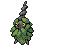

#413 - Wormadam
=== "Wormadam"
	<table cellspacing="0" cellpadding="0"><tr><th colspan="1" align="center"></th><th colspan="1" align="center">Type</th><th colspan="1" align="center">Ability</th></tr><tr><td align="center";rowspan="1"></td><td align="center";rowspan="1"> </td><td rowspan="1">(1) Shield Dust   (2) Overcoat   (HA) Overcoat</td></tr><tr><th colspan="3" align="center">Defenses</th></tr><tr><td align="right">Immune:</td><td colspan="2"></td></tr><tr><td align="right">0.25x Resist:</td><td colspan="2"></td></tr><tr><td align="right">0.5x Resist:</td><td colspan="2"></td></tr><tr><td align="right">Neutral:</td><td colspan="2"></td></tr><tr><td align="right">2x Weak:</td><td colspan="2"></td></tr><tr><td align="right">4x Weak:</td><td colspan="2"></td></tr></table>

=== "Sandy"
	<table cellspacing="0" cellpadding="0"><tr><th colspan="1" align="center">Sandy</th><th colspan="1" align="center">Type</th><th colspan="1" align="center">Ability</th></tr><tr><td align="center";rowspan="1"></td><td align="center";rowspan="1"> </td><td rowspan="1">(1) Rough Skin   (2) Overcoat   (HA) Overcoat</td></tr><tr><th colspan="3" align="center">Defenses</th></tr><tr><td align="right">Immune:</td><td colspan="2"></td></tr><tr><td align="right">0.25x Resist:</td><td colspan="2"></td></tr><tr><td align="right">0.5x Resist:</td><td colspan="2"></td></tr><tr><td align="right">Neutral:</td><td colspan="2"></td></tr><tr><td align="right">2x Weak:</td><td colspan="2"></td></tr><tr><td align="right">4x Weak:</td><td colspan="2"></td></tr></table>

=== "Trash"
	<table cellspacing="0" cellpadding="0"><tr><th colspan="1" align="center">Trash</th><th colspan="1" align="center">Type</th><th colspan="1" align="center">Ability</th></tr><tr><td align="center";rowspan="1"></td><td align="center";rowspan="1"> </td><td rowspan="1">(1) Wonder Skin   (2) Overcoat   (HA) Overcoat</td></tr><tr><th colspan="3" align="center">Defenses</th></tr><tr><td align="right">Immune:</td><td colspan="2"></td></tr><tr><td align="right">0.25x Resist:</td><td colspan="2"></td></tr><tr><td align="right">0.5x Resist:</td><td colspan="2"></td></tr><tr><td align="right">Neutral:</td><td colspan="2"></td></tr><tr><td align="right">2x Weak:</td><td colspan="2"></td></tr><tr><td align="right">4x Weak:</td><td colspan="2"></td></tr></table>

&nbsp;

## Evolutions
<table>
<tr><td rowspan="2"style="vertical-align: middle;">    <a href="../412">Burmy</a> </td><td rowspan="1"style="vertical-align: middle; word-break:break-all;">Male, Level 25</td><td rowspan="1"style="vertical-align: middle;">    <a href="../414">Mothim</a> </td></tr>
<tr><td rowspan="1"style="vertical-align: middle; word-break:break-all;">Female, Level 25</td><td rowspan="1"style="vertical-align: middle;">    <a href="../413">Wormadam</a> </td></tr>
</table>

## Stats
<table class="stat"><tr><td class="stat-icon-single"></td><td  class="stat-single">            <u>HP                +6</u>                     66</td><td class="stat-single"><u>ATK</u> 59</td><td class="stat-single"><u>DEF</u> 85</td><td  class="stat-single">            <u>SPA                +20</u>                     99</td><td class="stat-single"><u>SPD</u> 105</td><td class="stat-single"><u>SPE</u> 36</td><td  class="stat-single">            <u>BST                +26</u>                     450</td></tr>
<tr><td class="stat-icon-single"></td><td  class="stat-single">            <u>HP                +6</u>                     66</td><td  class="stat-single">            <u>ATK                +20</u>                     99</td><td class="stat-single"><u>DEF</u> 105</td><td class="stat-single"><u>SPA</u> 59</td><td class="stat-single"><u>SPD</u> 85</td><td class="stat-single"><u>SPE</u> 36</td><td  class="stat-single">            <u>BST                +26</u>                     450</td></tr>
<tr><td class="stat-icon-single"></td><td  class="stat-single">            <u>HP                +6</u>                     66</td><td  class="stat-single">            <u>ATK                +8</u>                     77</td><td  class="stat-single">            <u>DEF                +2</u>                     97</td><td  class="stat-single">            <u>SPA                +8</u>                     77</td><td  class="stat-single">            <u>SPD                +2</u>                     97</td><td class="stat-single"><u>SPE</u> 36</td><td  class="stat-single">            <u>BST                +26</u>                     450</td></tr></table>

## Wild Hold Items
- 5%: SilverPowder

## Level Up Moves
<table><th>Form</th><th>Level</th><th>Name</th><th>Power</th><th>Accuracy</th><th>PP</th><th>Type</th><th>Damage Class</th><th>Effect</th>
<tr><td></td><td>1</td><td>Bug Bite</td><td>60</td><td>100</td><td>20</td><td></td><td></td><td>Priority: 0. If the target is holding a berry, the user takes the berry and uses it immediately.  If the target is holding a jaboca berry or rowap berry, the berry is still removed, but has no effect.  If this move is super effective and the target is holding a berry that can reduce this move's damage, it will do so, and will not be stolen.</td></tr>
<tr><td></td><td>1</td><td>Electroweb</td><td>55</td><td>95</td><td>15</td><td></td><td></td><td>Priority: 0. Lowers the target's Speed by one stage.</td></tr>
<tr><td></td><td>1</td><td>Hidden Power</td><td>60</td><td>100</td><td>15</td><td></td><td></td><td>Priority: 0. Power and type depend upon user's IVs. Power can range from 30 to 70.</td></tr>
<tr><td></td><td>1</td><td>Protect</td><td>None</td><td>None</td><td>10</td><td></td><td></td><td>Priority: 4. No moves will hit the user for the remainder of this turn. If the user is last to act this turn, this move will fail. Success rate drops by 1/2 on successive attempts.</td></tr>
<tr><td></td><td>1</td><td>Rapid Spin</td><td>50</td><td>100</td><td>40</td><td></td><td></td><td>Priority: 0. Removes leech seed from the user, frees the user from bind, clamp, fire spin, magma storm, sand tomb, whirlpool, and wrap, and clears spikes, stealth rock, and toxic spikes from the user's side of the field.  If this move misses or has no effect, its effect doesn't activate.</td></tr>
<tr><td></td><td>1</td><td>String Shot</td><td>None</td><td>95</td><td>40</td><td></td><td></td><td>Priority: 0. Lowers the target's Speed by two stages.</td></tr>
<tr><td></td><td>1</td><td>Struggle Bug</td><td>50</td><td>100</td><td>20</td><td></td><td></td><td>Priority: 0. Has a 100% chance to lower the target's Special Attack by one stage.</td></tr>
<tr><td></td><td>1</td><td>Tackle</td><td>50</td><td>100</td><td>30</td><td></td><td></td><td>Priority: 0. Inflicts regular damage.</td></tr>
<tr><td></td><td>25</td><td>Leaf Tornado</td><td>70</td><td>100</td><td>10</td><td></td><td></td><td>Priority: 0. Has a 30%  chance to drop target's Accuracy by one stage</td></tr>
<tr><td></td><td>25</td><td>Mirror Shot</td><td>65</td><td>85</td><td>10</td><td></td><td></td><td>Priority: 0. Has a 30% chance to lower the target's accuracy by one stage.</td></tr>
<tr><td></td><td>25</td><td>Mud Bomb</td><td>65</td><td>85</td><td>10</td><td></td><td></td><td>Priority: 0. Has a 30% chance to lower the target's accuracy by one stage.</td></tr>
<tr><td></td><td>27</td><td>Sucker Punch</td><td>70</td><td>100</td><td>5</td><td></td><td></td><td>Priority: 1. If the target has not selected a damaging move this turn, or if the target has already acted this turn, this move will fail.  This move is not affected by iron fist.</td></tr>
<tr><td></td><td>29</td><td>Ally Switch</td><td>None</td><td>None</td><td>15</td><td></td><td></td><td>Priority: 2. User switches position on the field with the friendly Pokémon opposite it.  If the user is in the middle position in a triple battle, or there are no other friendly Pokémon, this move will fail.</td></tr>
<tr><td></td><td>29</td><td>Rage Powder</td><td>None</td><td>None</td><td>20</td><td></td><td></td><td>Priority: 2. Until the end of this turn, any moves that opposing Pokémon target solely at the user's ally will instead target the user.  This effect takes priority over lightning rod and storm drain.  If the user's ally switches out, opposing Pokémon may still hit it with pursuit.</td></tr>
<tr><td></td><td>29</td><td>Rock Blast</td><td>25</td><td>90</td><td>10</td><td></td><td></td><td>Priority: 0. Hits 2–5 times in one turn.  Has a 3/8 chance each to hit 2 or 3 times, and a 1/8 chance each to hit 4 or 5 times.  Averages to 3 hits per use.</td></tr>
<tr><td></td><td>32</td><td>Spikes</td><td>None</td><td>None</td><td>20</td><td></td><td></td><td>Priority: 0. Scatters spikes around the opposing field, which damage opposing Pokémon that enter the field for 1/8 of their max HP.  Pokémon immune to ground moves are immune to this damage, except during gravity.  Up to three layers of spikes may be laid down, adding 1/16 to the damage done: two layers of spikes damage for 3/16 max HP, and three layers damage for 1/4 max HP.</td></tr>
<tr><td></td><td>32</td><td>Stealth Rock</td><td>None</td><td>None</td><td>20</td><td></td><td></td><td>Priority: 0. Spreads sharp rocks around the opposing field, damaging any Pokémon that enters the field for 1/8 its max HP.  This damage is affected by the entering Pokémon's susceptibility to rock moves.  rapid spin removes this effect from its user's side of the field.</td></tr>
<tr><td></td><td>32</td><td>Toxic Spikes</td><td>None</td><td>None</td><td>20</td><td></td><td></td><td>Priority: 0. Scatters poisoned spikes around the opposing field, which poison opposing Pokémon that enter the field.  A second layer of these spikes may be laid down, in which case Pokémon will be badly poisoned instead.  Pokémon immune to either ground moves or being poisoned are immune to this effect.  Pokémon otherwise immune to ground moves are affected during gravity.  If a poison Pokémon not immune to ground moves enters a field covered with poisoned spikes, the spikes are removed.  rapid spin will remove this effect from its user's side of the field.  defog will remove this effect from its target's side of the field.  This move does not trigger synchronize, unless the Pokémon with synchronize was forced to enter the field by another effect such as roar.  Pokémon entering the field due to baton pass are not affected by this effect.</td></tr>
<tr><td></td><td>35</td><td>Growth</td><td>None</td><td>None</td><td>20</td><td></td><td></td><td>Priority: 0. Raises the user's Attack and Special Attack by one stage each.  During sunny day, raises both stats by two stages.</td></tr>
<tr><td></td><td>38</td><td>Bulldoze</td><td>60</td><td>100</td><td>20</td><td></td><td></td><td>Priority: 0. Has a 100% chance to lower the target's Speed by one stage.</td></tr>
<tr><td></td><td>38</td><td>Energy Ball</td><td>90</td><td>100</td><td>10</td><td></td><td></td><td>Priority: 0. Has a 10% chance to lower the target's Special Defense by one stage.</td></tr>
<tr><td></td><td>38</td><td>Iron Head</td><td>80</td><td>100</td><td>15</td><td></td><td></td><td>Priority: 0. Has a 30% chance to make the target flinch.</td></tr>
<tr><td></td><td>41</td><td>Bug Buzz</td><td>90</td><td>100</td><td>10</td><td></td><td></td><td>Priority: 0. Has a 10% chance to lower the target's Special Defense by one stage.</td></tr>
<tr><td></td><td>44</td><td>Psychic</td><td>90</td><td>100</td><td>10</td><td></td><td></td><td>Priority: 0. Has a 10% chance to lower the target's Special Defense by one stage.</td></tr>
<tr><td></td><td>44</td><td>Zen Headbutt</td><td>80</td><td>90</td><td>10</td><td></td><td></td><td>Priority: 0. Has a 20% chance to make the target flinch.</td></tr>
<tr><td></td><td>48</td><td>Captivate</td><td>None</td><td>100</td><td>20</td><td></td><td></td><td>Priority: 0. Lowers the target's Special Attack by two stages.  If the user and target are the same gender, or either is genderless, this move will fail.</td></tr>
<tr><td></td><td>52</td><td>Endeavor</td><td>None</td><td>100</td><td>5</td><td></td><td></td><td>Priority: 0. Inflicts exactly enough damage to lower the target's HP to equal the user's.  If the target's HP is not higher than the user's, this move has no effect.  Type immunity applies, but other type effects are ignored.  This effect counts as damage for moves that respond to damage.</td></tr>
<tr><td></td><td>56</td><td>Quiver Dance</td><td>None</td><td>None</td><td>20</td><td></td><td></td><td>Priority: 0. Raises the user's Special Attack, Special Defense, and Speed by one stage each.</td></tr>
<tr><td></td><td>60</td><td>Earthquake</td><td>100</td><td>100</td><td>10</td><td></td><td></td><td>Priority: 0. Inflicts regular damage.  If the target is in the first turn of dig, this move will hit with double power.</td></tr>
<tr><td></td><td>60</td><td>Leaf Storm</td><td>130</td><td>90</td><td>5</td><td></td><td></td><td>Priority: 0. Inflicts regular damage, then lowers the user's Special Attack by two stages.</td></tr>
<tr><td></td><td>60</td><td>Metal Burst</td><td>None</td><td>100</td><td>10</td><td></td><td></td><td>Priority: 0. Targets the last opposing Pokémon to hit the user with a damaging move this turn.  Inflicts 1.5× the damage that move did to the user. Type immunity applies, but other type effects are ignored.</td></tr>
</table>

## TM Moves
<table><th>Form</th><th>Machine</th><th>Name</th><th>Power</th><th>Accuracy</th><th>PP</th><th>Type</th><th>Damage Class</th><th>Effect</th>
<tr><td></td><td>TM6</td><td>Toxic</td><td>None</td><td>90</td><td>10</td><td></td><td></td><td>Priority: 0. Badly poisons the target.  Never misses when used by a poison-type Pokémon.</td></tr>
<tr><td></td><td>TM9</td><td>Venoshock</td><td>65</td><td>100</td><td>15</td><td></td><td></td><td>Priority: 0. If the target is poisoned, this move has double power.</td></tr>
<tr><td></td><td>TM10</td><td>Hidden Power</td><td>60</td><td>100</td><td>15</td><td></td><td></td><td>Priority: 0. Power and type depend upon user's IVs. Power can range from 30 to 70.</td></tr>
<tr><td></td><td>TM11</td><td>Sunny Day</td><td>None</td><td>None</td><td>5</td><td></td><td></td><td>Priority: 0. Changes the weather to sunshine for five turns.</td></tr>
<tr><td></td><td>TM15</td><td>Hyper Beam</td><td>150</td><td>90</td><td>5</td><td></td><td></td><td>Priority: 0. User loses its next turn to "recharge", and cannot attack or switch out during that turn.</td></tr>
<tr><td></td><td>TM17</td><td>Protect</td><td>None</td><td>None</td><td>10</td><td></td><td></td><td>Priority: 4. No moves will hit the user for the remainder of this turn. If the user is last to act this turn, this move will fail. Success rate drops by 1/2 on successive attempts.</td></tr>
<tr><td></td><td>TM18</td><td>Rain Dance</td><td>None</td><td>None</td><td>5</td><td></td><td></td><td>Priority: 0. Changes the weather to rain for five turns, during which water moves inflict 50% extra damage, and fire moves inflict half damage.</td></tr>
<tr><td></td><td>TM19</td><td>Giga Drain</td><td>80</td><td>100</td><td>10</td><td></td><td></td><td>Priority: 0. Drains half the damage inflicted to heal the user.</td></tr>
<tr><td></td><td>TM21</td><td>Frustration</td><td>None</td><td>100</td><td>20</td><td></td><td></td><td>Priority: 0. Power increases inversely with happiness, given by `(255 - happiness) * 2 / 5`, to a maximum of 102.  Power bottoms out at 1.</td></tr>
<tr><td></td><td>TM22</td><td>Solar Beam</td><td>120</td><td>100</td><td>10</td><td></td><td></td><td>Priority: 0. User charges for one turn before attacking.</td></tr>
<tr><td></td><td>TM26</td><td>Earthquake</td><td>100</td><td>100</td><td>10</td><td></td><td></td><td>Priority: 0. Inflicts regular damage.  If the target is in the first turn of dig, this move will hit with double power.</td></tr>
<tr><td></td><td>TM27</td><td>Return</td><td>None</td><td>100</td><td>20</td><td></td><td></td><td>Priority: 0. Power increases with happiness, given by `happiness * 2 / 5`, to a maximum of 102.  Power bottoms out at 1.</td></tr>
<tr><td></td><td>TM28</td><td>Dig</td><td>80</td><td>100</td><td>10</td><td></td><td></td><td>Priority: 0. User digs underground for one turn, becoming immune to attack, and hits on the second turn.  During the immune turn, earthquake, fissure, and magnitude still hit the user normally, and their power is doubled if appropriate.  The user may be hit during its immune turn if under the effect of lock on, mind reader, or no guard.  This move cannot be selected by sleep talk.</td></tr>
<tr><td></td><td>TM29</td><td>Psychic</td><td>90</td><td>100</td><td>10</td><td></td><td></td><td>Priority: 0. Has a 10% chance to lower the target's Special Defense by one stage.</td></tr>
<tr><td></td><td>TM30</td><td>Shadow Ball</td><td>80</td><td>100</td><td>10</td><td></td><td></td><td>Priority: 0. Has a 20% chance to lower the target's Special Defense by one stage.</td></tr>
<tr><td></td><td>TM37</td><td>Sandstorm</td><td>None</td><td>None</td><td>10</td><td></td><td></td><td>Priority: 0. Changes the weather to a sandstorm for five turns.  Pokémon that are not ground, rock, or steel take 1/16 their max HP at the end of every turn.  Every rock Pokémon's original Special Defense is raised by 50% for the duration of this effect.</td></tr>
<tr><td></td><td>TM39</td><td>Rock Tomb</td><td>60</td><td>95</td><td>15</td><td></td><td></td><td>Priority: 0. Has a 100% chance to lower the target's Speed by one stage.</td></tr>
<tr><td></td><td>TM41</td><td>Infestation</td><td>20</td><td>100</td><td>20</td><td></td><td></td><td>Priority: 0. For the next 2–5 turns, the target cannot leave the field and is damaged for 1/16 its max HP at the end of each turn.  The user continues to use other moves during this time.  If the user leaves the field, this effect ends.  Has a 3/8 chance each to hit 2 or 3 times, and a 1/8 chance each to hit 4 or 5 times.  Averages to 3 hits per use.</td></tr>
<tr><td></td><td>TM42</td><td>Facade</td><td>70</td><td>100</td><td>20</td><td></td><td></td><td>Priority: 0. If the user is burned, paralyzed, or poisoned, this move has double power.</td></tr>
<tr><td></td><td>TM44</td><td>Rest</td><td>None</td><td>None</td><td>10</td><td></td><td></td><td>Priority: 0. User falls to sleep for two turns, replacing any existing non-volatile status ailments, and immediately regains all its HP.</td></tr>
<tr><td></td><td>TM53</td><td>Energy Ball</td><td>90</td><td>100</td><td>10</td><td></td><td></td><td>Priority: 0. Has a 10% chance to lower the target's Special Defense by one stage.</td></tr>
<tr><td></td><td>TM68</td><td>Giga Impact</td><td>150</td><td>90</td><td>5</td><td></td><td></td><td>Priority: 0. User loses its next turn to "recharge", and cannot attack or switch out during that turn.</td></tr>
<tr><td></td><td>TM70</td><td>Flash</td><td>None</td><td>100</td><td>20</td><td></td><td></td><td>Priority: 0. Lowers the target's accuracy by one stage.</td></tr>
<tr><td></td><td>TM74</td><td>Gyro Ball</td><td>None</td><td>100</td><td>5</td><td></td><td></td><td>Priority: 0. Power increases with the target's current Speed compared to the user, given by `1 + 25 * target Speed / user Speed`, capped at 150.</td></tr>
<tr><td></td><td>TM76</td><td>Bug Buzz</td><td>90</td><td>100</td><td>10</td><td></td><td></td><td>Priority: 0. Has a 10% chance to lower the target's Special Defense by one stage.</td></tr>
<tr><td></td><td>TM77</td><td>Psych Up</td><td>None</td><td>None</td><td>10</td><td></td><td></td><td>Priority: 0. Discards the user's stat changes and copies the target's.  This move cannot be copied by mirror move.</td></tr>
<tr><td></td><td>TM78</td><td>Bulldoze</td><td>60</td><td>100</td><td>20</td><td></td><td></td><td>Priority: 0. Has a 100% chance to lower the target's Speed by one stage.</td></tr>
<tr><td></td><td>TM86</td><td>Grass Knot</td><td>None</td><td>100</td><td>20</td><td></td><td></td><td>Priority: 0. Power increases with the target's weight in kilograms, to a maximum of 120.</td></tr>
<tr><td></td><td>TM90</td><td>Substitute</td><td>None</td><td>None</td><td>10</td><td></td><td></td><td>Priority: 0. Transfers 1/4 the user's max HP into a doll that absorbs damage and causes most negative move effects to fail.</td></tr>
<tr><td></td><td>TM91</td><td>Flash Cannon</td><td>90</td><td>100</td><td>10</td><td></td><td></td><td>Priority: 0. Has a 10% chance to lower the target's Special Defense by one stage.</td></tr>
</table>

## Tutor Moves
<table><th>Form</th><th>Name</th><th>Power</th><th>Accuracy</th><th>PP</th><th>Type</th><th>Damage Class</th><th>Effect</th>
<tr><td></td><td>Bug Bite</td><td>60</td><td>100</td><td>20</td><td></td><td></td><td>Priority: 0. If the target is holding a berry, the user takes the berry and uses it immediately.  If the target is holding a jaboca berry or rowap berry, the berry is still removed, but has no effect.  If this move is super effective and the target is holding a berry that can reduce this move's damage, it will do so, and will not be stolen.</td></tr>
<tr><td></td><td>Earth Power</td><td>90</td><td>100</td><td>10</td><td></td><td></td><td>Priority: 0. Has a 10% chance to lower the target's Special Defense by one stage.</td></tr>
<tr><td></td><td>Electroweb</td><td>55</td><td>95</td><td>15</td><td></td><td></td><td>Priority: 0. Lowers the target's Speed by one stage.</td></tr>
<tr><td></td><td>Endeavor</td><td>None</td><td>100</td><td>5</td><td></td><td></td><td>Priority: 0. Inflicts exactly enough damage to lower the target's HP to equal the user's.  If the target's HP is not higher than the user's, this move has no effect.  Type immunity applies, but other type effects are ignored.  This effect counts as damage for moves that respond to damage.</td></tr>
<tr><td></td><td>Giga Drain</td><td>80</td><td>100</td><td>10</td><td></td><td></td><td>Priority: 0. Drains half the damage inflicted to heal the user.</td></tr>
<tr><td></td><td>Gunk Shot</td><td>120</td><td>80</td><td>5</td><td></td><td></td><td>Priority: 0. Has a 30% chance to poison the target.</td></tr>
<tr><td></td><td>Iron Defense</td><td>None</td><td>None</td><td>15</td><td></td><td></td><td>Priority: 0. Raises the user's Defense by two stages.</td></tr>
<tr><td></td><td>Iron Head</td><td>80</td><td>100</td><td>15</td><td></td><td></td><td>Priority: 0. Has a 30% chance to make the target flinch.</td></tr>
<tr><td></td><td>Magnet Rise</td><td>None</td><td>None</td><td>10</td><td></td><td></td><td>Priority: 0. For five turns, the user is immune to ground moves.  If the user is under the effect of ingrain or has levitate, this move will fail.  This effect is temporarily disabled by and cannot be used during gravity.  This effect is passed on by baton pass.</td></tr>
<tr><td></td><td>Seed Bomb</td><td>80</td><td>100</td><td>15</td><td></td><td></td><td>Priority: 0. Inflicts regular damage.</td></tr>
<tr><td></td><td>Signal Beam</td><td>75</td><td>100</td><td>15</td><td></td><td></td><td>Priority: 0. Has a 10% chance to confuse the target.</td></tr>
<tr><td></td><td>Skill Swap</td><td>None</td><td>None</td><td>10</td><td></td><td></td><td>Priority: 0. User and target switch abilities.  Ignores accuracy and evasion modifiers.  If either Pokémon has multitype or wonder guard, this move will fail.</td></tr>
<tr><td></td><td>Sleep Talk</td><td>None</td><td>None</td><td>10</td><td></td><td></td><td>Priority: 0. Only usable if the user is sleeping. Randomly selects and uses one of the user's other three moves. Use of the selected move requires and costs 0 PP.</td></tr>
<tr><td></td><td>Snore</td><td>50</td><td>100</td><td>15</td><td></td><td></td><td>Priority: 0. Only usable if the user is sleeping.   Has a 30% chance to make the target flinch.</td></tr>
<tr><td></td><td>Stealth Rock</td><td>None</td><td>None</td><td>20</td><td></td><td></td><td>Priority: 0. Spreads sharp rocks around the opposing field, damaging any Pokémon that enters the field for 1/8 its max HP.  This damage is affected by the entering Pokémon's susceptibility to rock moves.  rapid spin removes this effect from its user's side of the field.</td></tr>
<tr><td></td><td>Synthesis</td><td>None</td><td>None</td><td>5</td><td></td><td></td><td>Priority: 0. Heals the user for half its max HP, plus modifiers from weather.</td></tr>
<tr><td></td><td>Uproar</td><td>90</td><td>100</td><td>10</td><td></td><td></td><td>Priority: 0. User is forced to use this move for 2–5 turns, selected at random. No Pokemon can sleep during the effect of this move. </td></tr>
<tr><td></td><td>Worry Seed</td><td>None</td><td>100</td><td>10</td><td></td><td></td><td>Priority: 0. Changes the target's ability to insomnia.  If the target's ability is truant or multitype, this move will fail.</td></tr>
</table>

## Encounter Locations

| Location | &nbsp; | Level | Spawn Percent |
|: -- :|: -- :|: -- :|: -- :|
| [Pinwheel Forest - Outside] | Dark Grass (Doubles) | 68 | 10.0 |
| [Pinwheel Forest - Outside] | Hidden Grotto: Challenger's Rock | ?? | 2.0 |

--8<-- "includes/abilities.md"

[Pinwheel Forest - Outside]: ../../wildareas/Pinwheel_Forest_-_Outside/
