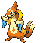

#418 - Buizel
<table cellspacing="0" cellpadding="0"><tr><th colspan="1" align="center"></th><th colspan="1" align="center">Type</th><th colspan="1" align="center">Ability</th></tr><tr><td align="center";rowspan="1"></td><td align="center";rowspan="1"></td><td rowspan="1">(1) Swift Swim   (2) Water Veil   (HA) Water Veil</td></tr><tr><th colspan="3" align="center">Defenses</th></tr><tr><td align="right">Immune:</td><td colspan="2"></td></tr><tr><td align="right">0.25x Resist:</td><td colspan="2"></td></tr><tr><td align="right">0.5x Resist:</td><td colspan="2"></td></tr><tr><td align="right">Neutral:</td><td colspan="2"></td></tr><tr><td align="right">2x Weak:</td><td colspan="2"></td></tr><tr><td align="right">4x Weak:</td><td colspan="2"></td></tr></table>

## Evolutions
<table>
<tr><td rowspan="1"style="vertical-align: middle;">    <a href="../418">Buizel</a> </td><td rowspan="1"style="vertical-align: middle; word-break:break-all;">Level 26</td><td rowspan="1"style="vertical-align: middle;">    <a href="../419">Floatzel</a> </td></tr>
</table>

## Stats
<table class="stat"><tr><td class="stat-icon-single"></td><td class="stat-single"><u>HP</u> 55</td><td class="stat-single"><u>ATK</u> 65</td><td class="stat-single"><u>DEF</u> 35</td><td class="stat-single"><u>SPA</u> 60</td><td class="stat-single"><u>SPD</u> 30</td><td class="stat-single"><u>SPE</u> 85</td><td class="stat-single"><u>BST</u> 330</td></tr></table>

## Level Up Moves
<table><th>Level</th><th>Name</th><th>Power</th><th>Accuracy</th><th>PP</th><th>Type</th><th>Damage Class</th><th>Effect</th>
<tr><td>1</td><td>Growl</td><td>None</td><td>100</td><td>40</td><td></td><td></td><td>Priority: 0. Lowers the target's Attack by one stage.</td></tr>
<tr><td>1</td><td>Tackle</td><td>50</td><td>100</td><td>30</td><td></td><td></td><td>Priority: 0. Inflicts regular damage.</td></tr>
<tr><td>1</td><td>Tail Whip</td><td>None</td><td>100</td><td>30</td><td></td><td></td><td>Priority: 0. Lowers the target's Defense by one stage.</td></tr>
<tr><td>4</td><td>Mud-Slap</td><td>30</td><td>100</td><td>20</td><td></td><td></td><td>Priority: 0. Has a 100% chance to lower the target's accuracy by one stage.</td></tr>
<tr><td>7</td><td>Fury Cutter</td><td>30</td><td>95</td><td>20</td><td></td><td></td><td>Priority: 0. Power doubles after every time this move is used, whether consecutively or not, maxing out at 16x.  If this move misses or the user leaves the field, power resets.</td></tr>
<tr><td>10</td><td>Water Gun</td><td>40</td><td>100</td><td>25</td><td></td><td></td><td>Priority: 0. Inflicts regular damage.</td></tr>
<tr><td>12</td><td>Fury Swipes</td><td>18</td><td>80</td><td>15</td><td></td><td></td><td>Priority: 0. Hits 2–5 times in one turn.  Has a 3/8 chance each to hit 2 or 3 times, and a 1/8 chance each to hit 4 or 5 times.  Averages to 3 hits per use.</td></tr>
<tr><td>14</td><td>Whirlpool</td><td>35</td><td>85</td><td>15</td><td></td><td></td><td>Priority: 0. For the next 2–5 turns, the target cannot leave the field and is damaged for 1/16 its max HP at the end of each turn. Has a 3/8 chance each to hit 2 or 3 times, and a 1/8 chance each to hit 4 or 5 times.  Averages to 3 hits per use.  If the target is in the first turn of dive, this move will hit with double power.</td></tr>
<tr><td>16</td><td>Aqua Jet</td><td>40</td><td>100</td><td>20</td><td></td><td></td><td>Priority: 1. Inflicts regular damage.</td></tr>
<tr><td>18</td><td>Soak</td><td>None</td><td>100</td><td>20</td><td></td><td></td><td>Priority: 0. Changes the target to pure water-type until it leaves the field.  If the target has multitype, this move will fail.</td></tr>
<tr><td>20</td><td>Water Pulse</td><td>60</td><td>100</td><td>20</td><td></td><td></td><td>Priority: 0. Has a 20% chance to confuse the target.</td></tr>
<tr><td>22</td><td>Sonic Boom</td><td>None</td><td>90</td><td>20</td><td></td><td></td><td>Priority: 0. Inflicts exactly 20 damage.</td></tr>
<tr><td>25</td><td>Helping Hand</td><td>None</td><td>None</td><td>20</td><td></td><td></td><td>Priority: 5. Boosts the power of the target's moves by 50% until the end of this turn.  This move cannot be copied by mirror move, nor selected by assist or metronome.</td></tr>
<tr><td>28</td><td>Headbutt</td><td>70</td><td>100</td><td>15</td><td></td><td></td><td>Priority: 0. Has a 30% chance to make the target flinch.</td></tr>
<tr><td>31</td><td>Aqua Tail</td><td>100</td><td>85</td><td>10</td><td></td><td></td><td>Priority: 0. Inflicts regular damage.</td></tr>
<tr><td>34</td><td>Double Hit</td><td>35</td><td>90</td><td>10</td><td></td><td></td><td>Priority: 0. Hits twice in one turn.</td></tr>
<tr><td>37</td><td>Ice Fang</td><td>65</td><td>95</td><td>15</td><td></td><td></td><td>Priority: 0. Has a 10% chance to freeze the target and a separate 10% chance to make the target flinch.</td></tr>
<tr><td>40</td><td>Tail Slap</td><td>25</td><td>85</td><td>10</td><td></td><td></td><td>Priority: 0. Hits 2–5 times in one turn.  Has a 3/8 chance each to hit 2 or 3 times, and a 1/8 chance each to hit 4 or 5 times.  Averages to 3 hits per use.</td></tr>
<tr><td>44</td><td>Lunge</td><td>80</td><td>100</td><td>15</td><td></td><td></td><td>Priority: 0. Lowers the target's Attack by one stage.</td></tr>
<tr><td>48</td><td>Agility</td><td>None</td><td>None</td><td>30</td><td></td><td></td><td>Priority: 0. Raises the user's Speed by two stages.</td></tr>
<tr><td>52</td><td>Switcheroo</td><td>None</td><td>100</td><td>10</td><td></td><td></td><td>Priority: 0. User and target permanently swap held items.  Works even if one of the Pokémon isn't holding anything.  If either Pokémon is holding mail, this move will fail.  If either Pokémon has multitype or sticky hold, this move will fail.  If this move results in a Pokémon obtaining choice band, choice scarf, or choice specs, and that Pokémon was the latter of the pair to move this turn, then the move it used this turn becomes its chosen forced move.  This applies even if both Pokémon had a choice item before this move was used.  If the first of the two Pokémon gains a choice item, it may select whatever choice move it wishes next turn.  Neither the user nor the target can recover its item with recycle.  This move cannot be selected by assist or metronome.</td></tr>
<tr><td>56</td><td>Hydro Pump</td><td>110</td><td>80</td><td>5</td><td></td><td></td><td>Priority: 0. Inflicts regular damage.</td></tr>
</table>

## TM Moves
<table><th>Machine</th><th>Name</th><th>Power</th><th>Accuracy</th><th>PP</th><th>Type</th><th>Damage Class</th><th>Effect</th>
<tr><td>TM6</td><td>Toxic</td><td>None</td><td>90</td><td>10</td><td></td><td></td><td>Priority: 0. Badly poisons the target.  Never misses when used by a poison-type Pokémon.</td></tr>
<tr><td>TM7</td><td>Hail</td><td>None</td><td>None</td><td>10</td><td></td><td></td><td>Priority: 0. Changes the weather to hail for five turns, during which non-ice Pokémon are damaged for 1/16 their max HP at the end of every turn.</td></tr>
<tr><td>TM8</td><td>Bulk Up</td><td>None</td><td>None</td><td>10</td><td></td><td></td><td>Priority: 0. Raises the user's Attack and Defense by one stage each.</td></tr>
<tr><td>TM10</td><td>Hidden Power</td><td>60</td><td>100</td><td>15</td><td></td><td></td><td>Priority: 0. Power and type depend upon user's IVs. Power can range from 30 to 70.</td></tr>
<tr><td>TM13</td><td>Ice Beam</td><td>90</td><td>100</td><td>10</td><td></td><td></td><td>Priority: 0. Has a 10% chance to freeze the target.</td></tr>
<tr><td>TM14</td><td>Blizzard</td><td>110</td><td>70</td><td>5</td><td></td><td></td><td>Priority: 0. Has a 10% chance to freeze the target.  During hail, this move has 100% accuracy.</td></tr>
<tr><td>TM17</td><td>Protect</td><td>None</td><td>None</td><td>10</td><td></td><td></td><td>Priority: 4. No moves will hit the user for the remainder of this turn. If the user is last to act this turn, this move will fail. Success rate drops by 1/2 on successive attempts.</td></tr>
<tr><td>TM18</td><td>Rain Dance</td><td>None</td><td>None</td><td>5</td><td></td><td></td><td>Priority: 0. Changes the weather to rain for five turns, during which water moves inflict 50% extra damage, and fire moves inflict half damage.</td></tr>
<tr><td>TM21</td><td>Frustration</td><td>None</td><td>100</td><td>20</td><td></td><td></td><td>Priority: 0. Power increases inversely with happiness, given by `(255 - happiness) * 2 / 5`, to a maximum of 102.  Power bottoms out at 1.</td></tr>
<tr><td>TM27</td><td>Return</td><td>None</td><td>100</td><td>20</td><td></td><td></td><td>Priority: 0. Power increases with happiness, given by `happiness * 2 / 5`, to a maximum of 102.  Power bottoms out at 1.</td></tr>
<tr><td>TM28</td><td>Dig</td><td>80</td><td>100</td><td>10</td><td></td><td></td><td>Priority: 0. User digs underground for one turn, becoming immune to attack, and hits on the second turn.  During the immune turn, earthquake, fissure, and magnitude still hit the user normally, and their power is doubled if appropriate.  The user may be hit during its immune turn if under the effect of lock on, mind reader, or no guard.  This move cannot be selected by sleep talk.</td></tr>
<tr><td>TM31</td><td>Brick Break</td><td>75</td><td>100</td><td>15</td><td></td><td></td><td>Priority: 0. Destroys any light screen or reflect on the target's side of the field, then inflicts regular damage.</td></tr>
<tr><td>TM39</td><td>Rock Tomb</td><td>60</td><td>95</td><td>15</td><td></td><td></td><td>Priority: 0. Has a 100% chance to lower the target's Speed by one stage.</td></tr>
<tr><td>TM42</td><td>Facade</td><td>70</td><td>100</td><td>20</td><td></td><td></td><td>Priority: 0. If the user is burned, paralyzed, or poisoned, this move has double power.</td></tr>
<tr><td>TM44</td><td>Rest</td><td>None</td><td>None</td><td>10</td><td></td><td></td><td>Priority: 0. User falls to sleep for two turns, replacing any existing non-volatile status ailments, and immediately regains all its HP.</td></tr>
<tr><td>TM45</td><td>Power-Up Punch</td><td>50</td><td>100</td><td>20</td><td></td><td></td><td>Priority: 0. Raises the user's Attack by one stage.</td></tr>
<tr><td>TM49</td><td>Echoed Voice</td><td>50</td><td>100</td><td>15</td><td></td><td></td><td>Priority: 0. If any friendly Pokémon used this move earlier this turn or on the previous turn, that use's power is added to this move's power, to a maximum of 200.</td></tr>
<tr><td>TM51</td><td>Wave Crash</td><td>110</td><td>100</td><td>5</td><td></td><td></td><td>Priority: 0. Damages user 1/3 recoil damage</td></tr>
<tr><td>TM55</td><td>Scald</td><td>80</td><td>100</td><td>10</td><td></td><td></td><td>Priority: 0. Has a 30% chance to burn the target.</td></tr>
<tr><td>TM90</td><td>Substitute</td><td>None</td><td>None</td><td>10</td><td></td><td></td><td>Priority: 0. Transfers 1/4 the user's max HP into a doll that absorbs damage and causes most negative move effects to fail.</td></tr>
<tr><td>TM94</td><td>Rock Smash</td><td>55</td><td>100</td><td>15</td><td></td><td></td><td>Priority: 0. 100% chance to drop target's Def by one stage. Also boosted by the ability Iron Fist</td></tr>
<tr><td>HM1</td><td>Cut</td><td>50</td><td>95</td><td>30</td><td></td><td></td><td>Priority: 0. High Critical Ratio</td></tr>
<tr><td>HM3</td><td>Surf</td><td>90</td><td>100</td><td>15</td><td></td><td></td><td>Priority: 0. Inflicts regular damage.  If the target is in the first turn of dive, this move will hit with double power.</td></tr>
<tr><td>HM4</td><td>Strength</td><td>85</td><td>100</td><td>10</td><td></td><td></td><td>Priority: 0. 10% Raise Attack</td></tr>
<tr><td>HM5</td><td>Waterfall</td><td>80</td><td>100</td><td>10</td><td></td><td></td><td>Priority: 0. Has a 20% chance to make the target flinch.</td></tr>
<tr><td>HM6</td><td>Dive</td><td>100</td><td>100</td><td>10</td><td></td><td></td><td>Priority: 0. User dives underwater for one turn, becoming immune to attack, and hits on the second turn.  During the immune turn, surf, and whirlpool still hit the user normally, and their power is doubled if appropriate.  The user may be hit during its immune turn if under the effect of lock on, mind reader, or no guard.  This move cannot be selected by sleep talk.</td></tr>
</table>

## Tutor Moves
<table><th>Name</th><th>Power</th><th>Accuracy</th><th>PP</th><th>Type</th><th>Damage Class</th><th>Effect</th>
<tr><td>Aqua Tail</td><td>100</td><td>85</td><td>10</td><td></td><td></td><td>Priority: 0. Inflicts regular damage.</td></tr>
<tr><td>Ice Punch</td><td>75</td><td>100</td><td>10</td><td></td><td></td><td>Priority: 0. Has a 10% chance to freeze the target.</td></tr>
<tr><td>Icy Wind</td><td>55</td><td>95</td><td>15</td><td></td><td></td><td>Priority: 0. Has a 100% chance to lower the target's Speed by one stage.</td></tr>
<tr><td>Iron Tail</td><td>100</td><td>75</td><td>15</td><td></td><td></td><td>Priority: 0. Has a 30% chance to lower the target's Defense by one stage.</td></tr>
<tr><td>Sleep Talk</td><td>None</td><td>None</td><td>10</td><td></td><td></td><td>Priority: 0. Only usable if the user is sleeping. Randomly selects and uses one of the user's other three moves. Use of the selected move requires and costs 0 PP.</td></tr>
<tr><td>Snore</td><td>50</td><td>100</td><td>15</td><td></td><td></td><td>Priority: 0. Only usable if the user is sleeping.   Has a 30% chance to make the target flinch.</td></tr>
</table>

## Encounter Locations

| Location | &nbsp; | &nbsp; | Level | Spawn Percent |
|: -- :|: -- :|: -- :|: -- :|: -- :|
| [Lostlorn Forest] | Surf | &nbsp; | 24-26 | 60.0 |
| [Lostlorn Forest] | Surf | &nbsp; | 29-31 | 10.0 |
| [Lostlorn Forest] | Surf, Rippling Water | &nbsp; | 34-36 | 60.0 |
| [Route 11] | Surf | &nbsp; | 48-53 | 60.0 |
| [Route 11] | Surf, Rippling Water | &nbsp; | 48-53 | 60.0 |
| [Route 14] | Surf | &nbsp; | 40-46 | 30.0 |
| [Route 14] | Surf, Rippling Water | &nbsp; | 40-46 | 60.0 |
| [Victory Road] | Lower Mountainside | Surf | 60-70 | 60.0 |
| [Victory Road] | Lower Mountainside | Surf, Rippling Water | 60-70 | 60.0 |
| [Virbank Complex - Outside] | Grass | &nbsp; | 14-15 | 5.0 |

--8<-- "includes/abilities.md"

[Virbank Complex - Outside]: ../../wildareas/Virbank_Complex_-_Outside/
[Route 14]: ../../wildareas/Route_14/
[Lostlorn Forest]: ../../wildareas/Lostlorn_Forest/
[Route 11]: ../../wildareas/Route_11/
[Victory Road]: ../../wildareas/Victory_Road/
