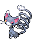

#431 - Glameow
<table cellspacing="0" cellpadding="0"><tr><th colspan="1" align="center"></th><th colspan="1" align="center">Type</th><th colspan="1" align="center">Ability</th></tr><tr><td align="center";rowspan="1"></td><td align="center";rowspan="1"></td><td rowspan="1">(1) Limber   (2) Own Tempo   (HA) Keen Eye</td></tr><tr><th colspan="3" align="center">Defenses</th></tr><tr><td align="right">Immune:</td><td colspan="2"></td></tr><tr><td align="right">0.25x Resist:</td><td colspan="2"></td></tr><tr><td align="right">0.5x Resist:</td><td colspan="2"></td></tr><tr><td align="right">Neutral:</td><td colspan="2"></td></tr><tr><td align="right">2x Weak:</td><td colspan="2"></td></tr><tr><td align="right">4x Weak:</td><td colspan="2"></td></tr></table>

## Evolutions
<table>
<tr><td rowspan="1"style="vertical-align: middle;">    <a href="../431">Glameow</a> </td><td rowspan="1"style="vertical-align: middle; word-break:break-all;">Level 26</td><td rowspan="1"style="vertical-align: middle;">    <a href="../432">Purugly</a> </td></tr>
</table>

## Stats
<table class="stat"><tr><td class="stat-icon-single"></td><td  class="stat-single">            <u>HP                +1</u>                     50</td><td  class="stat-single">            <u>ATK                +10</u>                     65</td><td  class="stat-single">            <u>DEF                +3</u>                     45</td><td  class="stat-single">            <u>SPA                +3</u>                     45</td><td  class="stat-single">            <u>SPD                +3</u>                     40</td><td  class="stat-single">            <u>SPE                +5</u>                     90</td><td  class="stat-single">            <u>BST                +25</u>                     335</td></tr></table>

## Wild Hold Items
- 5%: Cheri Berry

## Level Up Moves
<table><th>Level</th><th>Name</th><th>Power</th><th>Accuracy</th><th>PP</th><th>Type</th><th>Damage Class</th><th>Effect</th>
<tr><td>1</td><td>Bite</td><td>60</td><td>100</td><td>20</td><td></td><td></td><td>Priority: 0. Has a 30% chance to make the target flinch.</td></tr>
<tr><td>1</td><td>Growl</td><td>None</td><td>100</td><td>40</td><td></td><td></td><td>Priority: 0. Lowers the target's Attack by one stage.</td></tr>
<tr><td>1</td><td>Quick Attack</td><td>40</td><td>100</td><td>20</td><td></td><td></td><td>Priority: 1. Inflicts regular damage.</td></tr>
<tr><td>1</td><td>Scratch</td><td>40</td><td>100</td><td>35</td><td></td><td></td><td>Priority: 0. Inflicts regular damage.</td></tr>
<tr><td>4</td><td>Feint Attack</td><td>60</td><td>None</td><td>20</td><td></td><td></td><td>Priority: 0. Ignores accuracy and evasion modifiers.</td></tr>
<tr><td>7</td><td>Fury Swipes</td><td>18</td><td>80</td><td>15</td><td></td><td></td><td>Priority: 0. Hits 2–5 times in one turn.  Has a 3/8 chance each to hit 2 or 3 times, and a 1/8 chance each to hit 4 or 5 times.  Averages to 3 hits per use.</td></tr>
<tr><td>10</td><td>Hypnosis</td><td>None</td><td>60</td><td>20</td><td></td><td></td><td>Priority: 0. Puts the target to sleep.</td></tr>
<tr><td>13</td><td>Charm</td><td>None</td><td>100</td><td>20</td><td></td><td></td><td>Priority: 0. Lowers the target's Attack by two stages.</td></tr>
<tr><td>16</td><td>Knock Off</td><td>65</td><td>100</td><td>20</td><td></td><td></td><td>Priority: 0. Target loses its held item.</td></tr>
<tr><td>19</td><td>Fake Out</td><td>40</td><td>100</td><td>10</td><td></td><td></td><td>Priority: 3. Causes the target to flinch.  Can only be used on the user's first turn after entering the field.</td></tr>
<tr><td>22</td><td>Slash</td><td>70</td><td>100</td><td>15</td><td></td><td></td><td>Priority: 0. User's critical hit rate is one level higher when using this move.</td></tr>
<tr><td>25</td><td>Aerial Ace</td><td>60</td><td>None</td><td>20</td><td></td><td></td><td>Priority: 0. Ignores accuracy and evasion modifiers.</td></tr>
<tr><td>28</td><td>U-turn</td><td>70</td><td>100</td><td>20</td><td></td><td></td><td>Priority: 0. Inflicts regular damage, then the user immediately switches out, and the trainer selects a replacement Pokémon from the party.  If the target faints from this attack, the user's trainer selects the new Pokémon to send out first.  If the user is the last Pokémon in its party that can battle, it will not switch out.  The user may be hit by pursuit when it switches out, if it has been targeted and pursuit has not yet been used.  This move may be used even if the user is under the effect of ingrain.</td></tr>
<tr><td>32</td><td>Flail</td><td>None</td><td>100</td><td>15</td><td></td><td></td><td>Priority: 0. Power varies inversely with the user's proportional remaining HP.  64 * current HP / max HP | Power -----------------------: | ----:  0– 1                    |  200  2– 5                    |  150  6–12                    |  100 13–21                    |   80 22–42                    |   40 43–64                    |   20</td></tr>
<tr><td>36</td><td>Covet</td><td>60</td><td>100</td><td>20</td><td></td><td></td><td>Priority: 0. If the target is holding an item and the user is not, the user will permanently take the item.  Damage is still inflicted if an item cannot be taken.  Pokémon with sticky hold or multitype are immune to the item theft effect.  The target cannot recover its item with recycle.</td></tr>
<tr><td>40</td><td>Sucker Punch</td><td>70</td><td>100</td><td>5</td><td></td><td></td><td>Priority: 1. If the target has not selected a damaging move this turn, or if the target has already acted this turn, this move will fail.  This move is not affected by iron fist.</td></tr>
<tr><td>44</td><td>Foul Play</td><td>95</td><td>100</td><td>15</td><td></td><td></td><td>Priority: 0. Damage is calculated using the target's attacking stat rather than the user's.</td></tr>
<tr><td>48</td><td>Body Slam</td><td>85</td><td>100</td><td>15</td><td></td><td></td><td>Priority: 0. Has a 30% chance to paralyze the target.</td></tr>
<tr><td>52</td><td>Play Rough</td><td>90</td><td>90</td><td>10</td><td></td><td></td><td>Priority: 0. Has a 10% chance to lower the target's Attack by one stage.</td></tr>
<tr><td>56</td><td>Crunch</td><td>80</td><td>100</td><td>10</td><td></td><td></td><td>Priority: 0. Has a 20% chance to lower the target's Defense by one stage.</td></tr>
<tr><td>60</td><td>Last Resort</td><td>140</td><td>100</td><td>5</td><td></td><td></td><td>Priority: 0. This move can only be used if each of the user's other moves has been used at least once since the user entered the field.  If this is the user's only move, this move will fail.</td></tr>
</table>

## TM Moves
<table><th>Machine</th><th>Name</th><th>Power</th><th>Accuracy</th><th>PP</th><th>Type</th><th>Damage Class</th><th>Effect</th>
<tr><td>TM1</td><td>Hone Claws</td><td>None</td><td>None</td><td>15</td><td></td><td></td><td>Priority: 0. Raises the user's Attack and accuracy by one stage.</td></tr>
<tr><td>TM6</td><td>Toxic</td><td>None</td><td>90</td><td>10</td><td></td><td></td><td>Priority: 0. Badly poisons the target.  Never misses when used by a poison-type Pokémon.</td></tr>
<tr><td>TM10</td><td>Hidden Power</td><td>60</td><td>100</td><td>15</td><td></td><td></td><td>Priority: 0. Power and type depend upon user's IVs. Power can range from 30 to 70.</td></tr>
<tr><td>TM11</td><td>Sunny Day</td><td>None</td><td>None</td><td>5</td><td></td><td></td><td>Priority: 0. Changes the weather to sunshine for five turns.</td></tr>
<tr><td>TM12</td><td>Taunt</td><td>None</td><td>100</td><td>20</td><td></td><td></td><td>Priority: 0. Target is forced to only use damaging moves for the next 3–5 turns, selected at random.</td></tr>
<tr><td>TM17</td><td>Protect</td><td>None</td><td>None</td><td>10</td><td></td><td></td><td>Priority: 4. No moves will hit the user for the remainder of this turn. If the user is last to act this turn, this move will fail. Success rate drops by 1/2 on successive attempts.</td></tr>
<tr><td>TM18</td><td>Rain Dance</td><td>None</td><td>None</td><td>5</td><td></td><td></td><td>Priority: 0. Changes the weather to rain for five turns, during which water moves inflict 50% extra damage, and fire moves inflict half damage.</td></tr>
<tr><td>TM21</td><td>Frustration</td><td>None</td><td>100</td><td>20</td><td></td><td></td><td>Priority: 0. Power increases inversely with happiness, given by `(255 - happiness) * 2 / 5`, to a maximum of 102.  Power bottoms out at 1.</td></tr>
<tr><td>TM24</td><td>Thunderbolt</td><td>90</td><td>100</td><td>10</td><td></td><td></td><td>Priority: 0. Has a 10% chance to paralyze the target.</td></tr>
<tr><td>TM25</td><td>Thunder</td><td>110</td><td>70</td><td>5</td><td></td><td></td><td>Priority: 0. Has a 30% chance to paralyze the target.  During rain dance, this move has 100% accuracy.  During sunny day, this move has 50% accuracy.</td></tr>
<tr><td>TM27</td><td>Return</td><td>None</td><td>100</td><td>20</td><td></td><td></td><td>Priority: 0. Power increases with happiness, given by `happiness * 2 / 5`, to a maximum of 102.  Power bottoms out at 1.</td></tr>
<tr><td>TM28</td><td>Dig</td><td>80</td><td>100</td><td>10</td><td></td><td></td><td>Priority: 0. User digs underground for one turn, becoming immune to attack, and hits on the second turn.  During the immune turn, earthquake, fissure, and magnitude still hit the user normally, and their power is doubled if appropriate.  The user may be hit during its immune turn if under the effect of lock on, mind reader, or no guard.  This move cannot be selected by sleep talk.</td></tr>
<tr><td>TM30</td><td>Shadow Ball</td><td>80</td><td>100</td><td>10</td><td></td><td></td><td>Priority: 0. Has a 20% chance to lower the target's Special Defense by one stage.</td></tr>
<tr><td>TM40</td><td>Aerial Ace</td><td>60</td><td>None</td><td>20</td><td></td><td></td><td>Priority: 0. Ignores accuracy and evasion modifiers.</td></tr>
<tr><td>TM42</td><td>Facade</td><td>70</td><td>100</td><td>20</td><td></td><td></td><td>Priority: 0. If the user is burned, paralyzed, or poisoned, this move has double power.</td></tr>
<tr><td>TM44</td><td>Rest</td><td>None</td><td>None</td><td>10</td><td></td><td></td><td>Priority: 0. User falls to sleep for two turns, replacing any existing non-volatile status ailments, and immediately regains all its HP.</td></tr>
<tr><td>TM49</td><td>Echoed Voice</td><td>50</td><td>100</td><td>15</td><td></td><td></td><td>Priority: 0. If any friendly Pokémon used this move earlier this turn or on the previous turn, that use's power is added to this move's power, to a maximum of 200.</td></tr>
<tr><td>TM65</td><td>Shadow Claw</td><td>70</td><td>100</td><td>90</td><td></td><td></td><td>Priority: 0. User's critical hit rate is one level higher when using this move.</td></tr>
<tr><td>TM67</td><td>Retaliate</td><td>70</td><td>100</td><td>5</td><td></td><td></td><td>Priority: 0. If a friendly Pokémon fainted on the previous turn, this move has double power.</td></tr>
<tr><td>TM70</td><td>Flash</td><td>None</td><td>100</td><td>20</td><td></td><td></td><td>Priority: 0. Lowers the target's accuracy by one stage.</td></tr>
<tr><td>TM77</td><td>Psych Up</td><td>None</td><td>None</td><td>10</td><td></td><td></td><td>Priority: 0. Discards the user's stat changes and copies the target's.  This move cannot be copied by mirror move.</td></tr>
<tr><td>TM83</td><td>Work Up</td><td>None</td><td>None</td><td>30</td><td></td><td></td><td>Priority: 0. Raises the user's Attack and Special Attack by one stage each.</td></tr>
<tr><td>TM89</td><td>U-turn</td><td>70</td><td>100</td><td>20</td><td></td><td></td><td>Priority: 0. Inflicts regular damage, then the user immediately switches out, and the trainer selects a replacement Pokémon from the party.  If the target faints from this attack, the user's trainer selects the new Pokémon to send out first.  If the user is the last Pokémon in its party that can battle, it will not switch out.  The user may be hit by pursuit when it switches out, if it has been targeted and pursuit has not yet been used.  This move may be used even if the user is under the effect of ingrain.</td></tr>
<tr><td>TM90</td><td>Substitute</td><td>None</td><td>None</td><td>10</td><td></td><td></td><td>Priority: 0. Transfers 1/4 the user's max HP into a doll that absorbs damage and causes most negative move effects to fail.</td></tr>
<tr><td>HM1</td><td>Cut</td><td>50</td><td>95</td><td>30</td><td></td><td></td><td>Priority: 0. High Critical Ratio</td></tr>
</table>

## Tutor Moves
<table><th>Name</th><th>Power</th><th>Accuracy</th><th>PP</th><th>Type</th><th>Damage Class</th><th>Effect</th>
<tr><td>Covet</td><td>60</td><td>100</td><td>20</td><td></td><td></td><td>Priority: 0. If the target is holding an item and the user is not, the user will permanently take the item.  Damage is still inflicted if an item cannot be taken.  Pokémon with sticky hold or multitype are immune to the item theft effect.  The target cannot recover its item with recycle.</td></tr>
<tr><td>Foul Play</td><td>95</td><td>100</td><td>15</td><td></td><td></td><td>Priority: 0. Damage is calculated using the target's attacking stat rather than the user's.</td></tr>
<tr><td>Hyper Voice</td><td>90</td><td>100</td><td>10</td><td></td><td></td><td>Priority: 0. Inflicts regular damage.</td></tr>
<tr><td>Iron Tail</td><td>100</td><td>75</td><td>15</td><td></td><td></td><td>Priority: 0. Has a 30% chance to lower the target's Defense by one stage.</td></tr>
<tr><td>Knock Off</td><td>65</td><td>100</td><td>20</td><td></td><td></td><td>Priority: 0. Target loses its held item.</td></tr>
<tr><td>Last Resort</td><td>140</td><td>100</td><td>5</td><td></td><td></td><td>Priority: 0. This move can only be used if each of the user's other moves has been used at least once since the user entered the field.  If this is the user's only move, this move will fail.</td></tr>
<tr><td>Sleep Talk</td><td>None</td><td>None</td><td>10</td><td></td><td></td><td>Priority: 0. Only usable if the user is sleeping. Randomly selects and uses one of the user's other three moves. Use of the selected move requires and costs 0 PP.</td></tr>
<tr><td>Snatch</td><td>None</td><td>None</td><td>10</td><td></td><td></td><td>Priority: 4. The next time a Pokémon uses a beneficial move on itself or itself and its ally this turn, the user of this move will steal the move and use it itself.  Moves which may be stolen by this move are identified by the "snatchable" flag.  If two Pokémon use this move on the same turn, the faster Pokémon will steal the first beneficial move, and the slower Pokémon will then steal it again—thus, only the slowest Pokémon using this move ultimately gains a stolen move's effect.  If the user steals psych up, it will target the Pokémon that used psych up.  If the user was the original target of psych up, and the Pokémon that originally used it's affected by pressure, it will only lose 1 PP.  This move cannot be copied by mirror move, nor selected by assist or metronome.</td></tr>
<tr><td>Snore</td><td>50</td><td>100</td><td>15</td><td></td><td></td><td>Priority: 0. Only usable if the user is sleeping.   Has a 30% chance to make the target flinch.</td></tr>
<tr><td>Super Fang</td><td>None</td><td>90</td><td>10</td><td></td><td></td><td>Priority: 0. Inflicts typeless damage equal to half the target's remaining HP.</td></tr>
</table>

## Encounter Locations

| Location | &nbsp; | Level | Spawn Percent |
|: -- :|: -- :|: -- :|: -- :|
| [Route 16] | Grass | 27-29 | 10.0 |

--8<-- "includes/abilities.md"

[Route 16]: ../../wildareas/Route_16/
