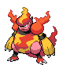

#467 - Magmortar
<table cellspacing="0" cellpadding="0"><tr><th colspan="1" align="center"></th><th colspan="1" align="center">Type</th><th colspan="1" align="center">Ability</th></tr><tr><td align="center";rowspan="1"></td><td align="center";rowspan="1"></td><td rowspan="1">(1) Flame Body   (2) Vital Spirit   (HA) Vital Spirit</td></tr><tr><th colspan="3" align="center">Defenses</th></tr><tr><td align="right">Immune:</td><td colspan="2"></td></tr><tr><td align="right">0.25x Resist:</td><td colspan="2"></td></tr><tr><td align="right">0.5x Resist:</td><td colspan="2"></td></tr><tr><td align="right">Neutral:</td><td colspan="2"></td></tr><tr><td align="right">2x Weak:</td><td colspan="2"></td></tr><tr><td align="right">4x Weak:</td><td colspan="2"></td></tr></table>

## Evolutions
<table>
<tr><td rowspan="1"style="vertical-align: middle;">    <a href="../240">Magby</a> </td><td rowspan="1"style="vertical-align: middle; word-break:break-all;">Level 29</td><td rowspan="1"style="vertical-align: middle;">    <a href="../126">Magmar</a> </td><td rowspan="1"style="vertical-align: middle; word-break:break-all;">Use Magmarizer</td><td rowspan="1"style="vertical-align: middle;">    <a href="../467">Magmortar</a> </td></tr>
</table>

## Stats
<table class="stat"><tr><td class="stat-icon-single"></td><td class="stat-single"><u>HP</u> 75</td><td class="stat-single"><u>ATK</u> 95</td><td  class="stat-single">            <u>DEF                -5</u>                     62</td><td  class="stat-single">            <u>SPA                +5</u>                     130</td><td  class="stat-single">            <u>SPD                -10</u>                     85</td><td  class="stat-single">            <u>SPE                +10</u>                     93</td><td class="stat-single"><u>BST</u> 540</td></tr></table>

## Wild Hold Items
- 5%: Magmarizer

## Level Up Moves
<table><th>Level</th><th>Name</th><th>Power</th><th>Accuracy</th><th>PP</th><th>Type</th><th>Damage Class</th><th>Effect</th>
<tr><td>1</td><td>Ember</td><td>40</td><td>100</td><td>25</td><td></td><td></td><td>Priority: 0. Has a 10% chance to burn the target.</td></tr>
<tr><td>1</td><td>Follow Me</td><td>None</td><td>None</td><td>20</td><td></td><td></td><td>Priority: 2. Until the end of this turn, any moves that opposing Pokémon target solely at the user's ally will instead target the user.   This effect takes priority over lightning rod and storm drain.  If the user's ally switches out, opposing Pokémon may still hit it with pursuit.</td></tr>
<tr><td>1</td><td>Helping Hand</td><td>None</td><td>None</td><td>20</td><td></td><td></td><td>Priority: 5. Boosts the power of the target's moves by 50% until the end of this turn.  This move cannot be copied by mirror move, nor selected by assist or metronome.</td></tr>
<tr><td>1</td><td>Smokescreen</td><td>None</td><td>100</td><td>20</td><td></td><td></td><td>Priority: 0. Lowers the target's accuracy by one stage.</td></tr>
<tr><td>5</td><td>Clear Smog</td><td>50</td><td>None</td><td>15</td><td></td><td></td><td>Priority: 0. All of the target's stat modifiers are reset to zero.</td></tr>
<tr><td>8</td><td>Fire Spin</td><td>35</td><td>85</td><td>15</td><td></td><td></td><td>Priority: 0. For the next 2–5 turns, the target cannot leave the field and is damaged for 1/16 its max HP at the end of each turn.  Has a 3/8 chance each to hit 2 or 3 times, and a 1/8 chance each to hit 4 or 5 times.</td></tr>
<tr><td>10</td><td>Feint Attack</td><td>60</td><td>None</td><td>20</td><td></td><td></td><td>Priority: 0. Ignores accuracy and evasion modifiers.</td></tr>
<tr><td>12</td><td>Mach Punch</td><td>40</td><td>100</td><td>20</td><td></td><td></td><td>Priority: 1. Inflicts regular damage.</td></tr>
<tr><td>14</td><td>Flame Wheel</td><td>75</td><td>100</td><td>20</td><td></td><td></td><td>Priority: 0. Has a 10% chance to burn the target.  Frozen Pokémon may use this move, in which case they will thaw.</td></tr>
<tr><td>16</td><td>Confuse Ray</td><td>None</td><td>100</td><td>10</td><td></td><td></td><td>Priority: 0. Confuses the target.</td></tr>
<tr><td>18</td><td>Flame Burst</td><td>70</td><td>100</td><td>15</td><td></td><td></td><td>Priority: 0. If this move successfully hits the target, any Pokémon adjacent to the target are damaged for 1/16 their max HP.</td></tr>
<tr><td>21</td><td>Screech</td><td>None</td><td>85</td><td>40</td><td></td><td></td><td>Priority: 0. Lowers the target's Defense by two stages.</td></tr>
<tr><td>24</td><td>Fire Punch</td><td>75</td><td>100</td><td>10</td><td></td><td></td><td>Priority: 0. Has a 10% chance to burn the target.</td></tr>
<tr><td>27</td><td>Will-O-Wisp</td><td>None</td><td>85</td><td>15</td><td></td><td></td><td>Priority: 0. Burns the target.</td></tr>
<tr><td>32</td><td>Lava Plume</td><td>80</td><td>100</td><td>15</td><td></td><td></td><td>Priority: 0. Has a 30% chance to burn the target.</td></tr>
<tr><td>35</td><td>Cross Chop</td><td>100</td><td>80</td><td>5</td><td></td><td></td><td>Priority: 0. User's critical hit rate is one level higher when using this move.</td></tr>
<tr><td>39</td><td>Belly Drum</td><td>None</td><td>None</td><td>10</td><td></td><td></td><td>Priority: 0. User pays half its max HP to raise its Attack to +6 stages.  If the user cannot pay the HP cost, this move will fail.</td></tr>
<tr><td>43</td><td>Sludge Bomb</td><td>90</td><td>100</td><td>10</td><td></td><td></td><td>Priority: 0. Has a 30% chance to poison the target.</td></tr>
<tr><td>47</td><td>Scorching Sands</td><td>70</td><td>100</td><td>10</td><td></td><td></td><td>Priority: 0. Inflicts regular damage.</td></tr>
<tr><td>51</td><td>Flare Blitz</td><td>120</td><td>100</td><td>15</td><td></td><td></td><td>Priority: 0. User takes 1/3 the damage it inflicts in recoil.  Has a 10% chance to burn the target.  Frozen Pokémon may use this move, in which case they will thaw.</td></tr>
<tr><td>55</td><td>Dynamic Punch</td><td>100</td><td>50</td><td>5</td><td></td><td></td><td>Priority: 0. Has a 100% chance to confuse the target.</td></tr>
<tr><td>59</td><td>Solar Beam</td><td>120</td><td>100</td><td>10</td><td></td><td></td><td>Priority: 0. User charges for one turn before attacking.</td></tr>
<tr><td>63</td><td>Giga Impact</td><td>150</td><td>90</td><td>5</td><td></td><td></td><td>Priority: 0. User loses its next turn to "recharge", and cannot attack or switch out during that turn.</td></tr>
<tr><td>67</td><td>Moonblast</td><td>95</td><td>100</td><td>15</td><td></td><td></td><td>Priority: 0. Has a 30% chance to lower the target's Special Attack by one stage.</td></tr>
<tr><td>71</td><td>Magma Storm</td><td>120</td><td>75</td><td>5</td><td></td><td></td><td>Priority: 0. For the next 2–5 turns, the target cannot leave the field and is damaged for 1/16 its max HP at the end of each turn.  Has a 3/8 chance each to hit 2 or 3 times, and a 1/8 chance each to hit 4 or 5 times.  Averages to 3 hits per use.</td></tr>
</table>

## TM Moves
<table><th>Machine</th><th>Name</th><th>Power</th><th>Accuracy</th><th>PP</th><th>Type</th><th>Damage Class</th><th>Effect</th>
<tr><td>TM6</td><td>Toxic</td><td>None</td><td>90</td><td>10</td><td></td><td></td><td>Priority: 0. Badly poisons the target.  Never misses when used by a poison-type Pokémon.</td></tr>
<tr><td>TM10</td><td>Hidden Power</td><td>60</td><td>100</td><td>15</td><td></td><td></td><td>Priority: 0. Power and type depend upon user's IVs. Power can range from 30 to 70.</td></tr>
<tr><td>TM11</td><td>Sunny Day</td><td>None</td><td>None</td><td>5</td><td></td><td></td><td>Priority: 0. Changes the weather to sunshine for five turns.</td></tr>
<tr><td>TM12</td><td>Taunt</td><td>None</td><td>100</td><td>20</td><td></td><td></td><td>Priority: 0. Target is forced to only use damaging moves for the next 3–5 turns, selected at random.</td></tr>
<tr><td>TM15</td><td>Hyper Beam</td><td>150</td><td>90</td><td>5</td><td></td><td></td><td>Priority: 0. User loses its next turn to "recharge", and cannot attack or switch out during that turn.</td></tr>
<tr><td>TM17</td><td>Protect</td><td>None</td><td>None</td><td>10</td><td></td><td></td><td>Priority: 4. No moves will hit the user for the remainder of this turn. If the user is last to act this turn, this move will fail. Success rate drops by 1/2 on successive attempts.</td></tr>
<tr><td>TM20</td><td>Tri Attack</td><td>80</td><td>100</td><td>10</td><td></td><td></td><td>Priority: 0. Has a 20% chance to burn, freeze, or paralyze the target.  One of these effects is selected at random; they do not each have independent chances to occur.</td></tr>
<tr><td>TM21</td><td>Frustration</td><td>None</td><td>100</td><td>20</td><td></td><td></td><td>Priority: 0. Power increases inversely with happiness, given by `(255 - happiness) * 2 / 5`, to a maximum of 102.  Power bottoms out at 1.</td></tr>
<tr><td>TM22</td><td>Solar Beam</td><td>120</td><td>100</td><td>10</td><td></td><td></td><td>Priority: 0. User charges for one turn before attacking.</td></tr>
<tr><td>TM24</td><td>Thunderbolt</td><td>90</td><td>100</td><td>10</td><td></td><td></td><td>Priority: 0. Has a 10% chance to paralyze the target.</td></tr>
<tr><td>TM26</td><td>Earthquake</td><td>100</td><td>100</td><td>10</td><td></td><td></td><td>Priority: 0. Inflicts regular damage.  If the target is in the first turn of dig, this move will hit with double power.</td></tr>
<tr><td>TM27</td><td>Return</td><td>None</td><td>100</td><td>20</td><td></td><td></td><td>Priority: 0. Power increases with happiness, given by `happiness * 2 / 5`, to a maximum of 102.  Power bottoms out at 1.</td></tr>
<tr><td>TM29</td><td>Psychic</td><td>90</td><td>100</td><td>10</td><td></td><td></td><td>Priority: 0. Has a 10% chance to lower the target's Special Defense by one stage.</td></tr>
<tr><td>TM31</td><td>Brick Break</td><td>75</td><td>100</td><td>15</td><td></td><td></td><td>Priority: 0. Destroys any light screen or reflect on the target's side of the field, then inflicts regular damage.</td></tr>
<tr><td>TM35</td><td>Flamethrower</td><td>90</td><td>100</td><td>10</td><td></td><td></td><td>Priority: 0. Has a 10% chance to burn the target.</td></tr>
<tr><td>TM36</td><td>Sludge Bomb</td><td>90</td><td>100</td><td>10</td><td></td><td></td><td>Priority: 0. Has a 30% chance to poison the target.</td></tr>
<tr><td>TM38</td><td>Fire Blast</td><td>110</td><td>85</td><td>5</td><td></td><td></td><td>Priority: 0. Has a 10% chance to burn the target.</td></tr>
<tr><td>TM39</td><td>Rock Tomb</td><td>60</td><td>95</td><td>15</td><td></td><td></td><td>Priority: 0. Has a 100% chance to lower the target's Speed by one stage.</td></tr>
<tr><td>TM41</td><td>Infestation</td><td>20</td><td>100</td><td>20</td><td></td><td></td><td>Priority: 0. For the next 2–5 turns, the target cannot leave the field and is damaged for 1/16 its max HP at the end of each turn.  The user continues to use other moves during this time.  If the user leaves the field, this effect ends.  Has a 3/8 chance each to hit 2 or 3 times, and a 1/8 chance each to hit 4 or 5 times.  Averages to 3 hits per use.</td></tr>
<tr><td>TM42</td><td>Facade</td><td>70</td><td>100</td><td>20</td><td></td><td></td><td>Priority: 0. If the user is burned, paralyzed, or poisoned, this move has double power.</td></tr>
<tr><td>TM43</td><td>Flame Charge</td><td>60</td><td>100</td><td>20</td><td></td><td></td><td>Priority: 0. Raises the user's Speed by one stage.</td></tr>
<tr><td>TM44</td><td>Rest</td><td>None</td><td>None</td><td>10</td><td></td><td></td><td>Priority: 0. User falls to sleep for two turns, replacing any existing non-volatile status ailments, and immediately regains all its HP.</td></tr>
<tr><td>TM45</td><td>Power-Up Punch</td><td>50</td><td>100</td><td>20</td><td></td><td></td><td>Priority: 0. Raises the user's Attack by one stage.</td></tr>
<tr><td>TM46</td><td>Aura Sphere</td><td>90</td><td>None</td><td>20</td><td></td><td></td><td>Priority: 0. Ignores accuracy and evasion modifiers.</td></tr>
<tr><td>TM47</td><td>Low Sweep</td><td>65</td><td>100</td><td>20</td><td></td><td></td><td>Priority: 0. Lowers the target's Speed by one stage.</td></tr>
<tr><td>TM48</td><td>Mystical Fire</td><td>75</td><td>100</td><td>10</td><td></td><td></td><td>Priority: 0. Has a 100% chance to lower the target's Special Attack by one stage.</td></tr>
<tr><td>TM50</td><td>Overheat</td><td>130</td><td>90</td><td>5</td><td></td><td></td><td>Priority: 0. Inflicts regular damage, then lowers the user's Special Attack by two stages.</td></tr>
<tr><td>TM52</td><td>Focus Blast</td><td>120</td><td>70</td><td>5</td><td></td><td></td><td>Priority: 0. Has a 10% chance to lower the target's Special Defense by one stage.</td></tr>
<tr><td>TM56</td><td>Weather Ball</td><td>50</td><td>100</td><td>10</td><td></td><td></td><td>Priority: 0. If a weather move is active, this move has double power, and its type becomes the type of the weather move.</td></tr>
<tr><td>TM59</td><td>Incinerate</td><td>60</td><td>100</td><td>15</td><td></td><td></td><td>Priority: 0. If the target is holding a berry, it's destroyed and cannot be used in response to this move.</td></tr>
<tr><td>TM61</td><td>Will-O-Wisp</td><td>None</td><td>85</td><td>15</td><td></td><td></td><td>Priority: 0. Burns the target.</td></tr>
<tr><td>TM68</td><td>Giga Impact</td><td>150</td><td>90</td><td>5</td><td></td><td></td><td>Priority: 0. User loses its next turn to "recharge", and cannot attack or switch out during that turn.</td></tr>
<tr><td>TM78</td><td>Bulldoze</td><td>60</td><td>100</td><td>20</td><td></td><td></td><td>Priority: 0. Has a 100% chance to lower the target's Speed by one stage.</td></tr>
<tr><td>TM80</td><td>Rock Slide</td><td>75</td><td>90</td><td>10</td><td></td><td></td><td>Priority: 0. Has a 30% chance to make the target flinch.</td></tr>
<tr><td>TM87</td><td>Rock Climb</td><td>80</td><td>95</td><td>10</td><td></td><td></td><td>Priority: 0. Has a 20% chance to confuse the target.</td></tr>
<tr><td>TM90</td><td>Substitute</td><td>None</td><td>None</td><td>10</td><td></td><td></td><td>Priority: 0. Transfers 1/4 the user's max HP into a doll that absorbs damage and causes most negative move effects to fail.</td></tr>
<tr><td>TM94</td><td>Rock Smash</td><td>55</td><td>100</td><td>15</td><td></td><td></td><td>Priority: 0. 100% chance to drop target's Def by one stage. Also boosted by the ability Iron Fist</td></tr>
<tr><td>HM4</td><td>Strength</td><td>85</td><td>100</td><td>10</td><td></td><td></td><td>Priority: 0. 10% Raise Attack</td></tr>
</table>

## Tutor Moves
<table><th>Name</th><th>Power</th><th>Accuracy</th><th>PP</th><th>Type</th><th>Damage Class</th><th>Effect</th>
<tr><td>Covet</td><td>60</td><td>100</td><td>20</td><td></td><td></td><td>Priority: 0. If the target is holding an item and the user is not, the user will permanently take the item.  Damage is still inflicted if an item cannot be taken.  Pokémon with sticky hold or multitype are immune to the item theft effect.  The target cannot recover its item with recycle.</td></tr>
<tr><td>Dual Chop</td><td>40</td><td>90</td><td>15</td><td></td><td></td><td>Priority: 0. Hits twice in one turn.</td></tr>
<tr><td>Fire Punch</td><td>75</td><td>100</td><td>10</td><td></td><td></td><td>Priority: 0. Has a 10% chance to burn the target.</td></tr>
<tr><td>Heat Wave</td><td>100</td><td>90</td><td>10</td><td></td><td></td><td>Priority: 0. Has a 10% chance to burn the target.</td></tr>
<tr><td>Helping Hand</td><td>None</td><td>None</td><td>20</td><td></td><td></td><td>Priority: 5. Boosts the power of the target's moves by 50% until the end of this turn.  This move cannot be copied by mirror move, nor selected by assist or metronome.</td></tr>
<tr><td>Iron Tail</td><td>100</td><td>75</td><td>15</td><td></td><td></td><td>Priority: 0. Has a 30% chance to lower the target's Defense by one stage.</td></tr>
<tr><td>Low Kick</td><td>None</td><td>100</td><td>20</td><td></td><td></td><td>Priority: 0. Power increases with the target's weight in kilograms, to a maximum of 120.  Target's weight | Power --------------- | ----: Up to 10kg      |    20 Up to 25kg      |    40 Up to 50kg      |    60 Up to 100kg     |    80 Up to 200kg     |   100 Above 200kg     |   120</td></tr>
<tr><td>Sleep Talk</td><td>None</td><td>None</td><td>10</td><td></td><td></td><td>Priority: 0. Only usable if the user is sleeping. Randomly selects and uses one of the user's other three moves. Use of the selected move requires and costs 0 PP.</td></tr>
<tr><td>Snore</td><td>50</td><td>100</td><td>15</td><td></td><td></td><td>Priority: 0. Only usable if the user is sleeping.   Has a 30% chance to make the target flinch.</td></tr>
<tr><td>Thunder Punch</td><td>75</td><td>100</td><td>10</td><td></td><td></td><td>Priority: 0. Has a 10% chance to paralyze the target.</td></tr>
</table>

## Pre-Evolution Moves
| Species | Method | Move |
|: --- :|: --- :|: --- :|
| Magby | Lvl 1 | Leer |
| Magby | Tutor | Uproar |
| Magmar | Lvl 1 | Smog |

--8<-- "includes/abilities.md"

