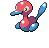

#474 - Porygon
<table cellspacing="0" cellpadding="0"><tr><th colspan="1" align="center"></th><th colspan="1" align="center">Type</th><th colspan="1" align="center">Ability</th></tr><tr><td align="center";rowspan="1"></td><td align="center";rowspan="1"></td><td rowspan="1">(1) Adaptability   (2) Download   (HA) Analytic</td></tr><tr><th colspan="3" align="center">Defenses</th></tr><tr><td align="right">Immune:</td><td colspan="2"></td></tr><tr><td align="right">0.25x Resist:</td><td colspan="2"></td></tr><tr><td align="right">0.5x Resist:</td><td colspan="2"></td></tr><tr><td align="right">Neutral:</td><td colspan="2"></td></tr><tr><td align="right">2x Weak:</td><td colspan="2"></td></tr><tr><td align="right">4x Weak:</td><td colspan="2"></td></tr></table>

## Evolutions
<table>
<tr><td rowspan="1"style="vertical-align: middle;">    <a href="../137">Porygon</a> </td><td rowspan="1"style="vertical-align: middle; word-break:break-all;">Use Up-Grade</td><td rowspan="1"style="vertical-align: middle;">    <a href="../233">Porygon2</a> </td><td rowspan="1"style="vertical-align: middle; word-break:break-all;">Use Dubious Disc</td><td rowspan="1"style="vertical-align: middle;">    <a href="../474">Porygon-Z</a> </td></tr>
</table>

## Stats
<table class="stat"><tr><td class="stat-icon-single"></td><td class="stat-single"><u>HP</u> 85</td><td class="stat-single"><u>ATK</u> 80</td><td class="stat-single"><u>DEF</u> 70</td><td class="stat-single"><u>SPA</u> 135</td><td class="stat-single"><u>SPD</u> 75</td><td class="stat-single"><u>SPE</u> 90</td><td class="stat-single"><u>BST</u> 535</td></tr></table>

## Level Up Moves
<table><th>Level</th><th>Name</th><th>Power</th><th>Accuracy</th><th>PP</th><th>Type</th><th>Damage Class</th><th>Effect</th>
<tr><td>1</td><td>Conversion</td><td>None</td><td>None</td><td>30</td><td></td><td></td><td>Priority: 0. User's type changes to the type of one of its moves, selected at random.  hidden power and weather ball are treated as normal.  Only moves with a different type are eligible, and curse is never eligible.  If the user has no suitable moves, this move will fail.</td></tr>
<tr><td>1</td><td>Conversion 2</td><td>None</td><td>None</td><td>30</td><td></td><td></td><td>Priority: 0. Changes the user's type to a type either resistant or immune to the last damaging move that hit it.  The new type is selected at random and cannot be a type the user already is.  If there is no eligible new type, this move will fail.</td></tr>
<tr><td>1</td><td>Last Resort</td><td>140</td><td>100</td><td>5</td><td></td><td></td><td>Priority: 0. This move can only be used if each of the user's other moves has been used at least once since the user entered the field.  If this is the user's only move, this move will fail.</td></tr>
<tr><td>1</td><td>Tackle</td><td>50</td><td>100</td><td>30</td><td></td><td></td><td>Priority: 0. Inflicts regular damage.</td></tr>
<tr><td>4</td><td>Thunder Shock</td><td>40</td><td>100</td><td>25</td><td></td><td></td><td>Priority: 0. Has a 10% chance to paralyze the target.</td></tr>
<tr><td>7</td><td>Swift</td><td>60</td><td>None</td><td>20</td><td></td><td></td><td>Priority: 0. Ignores accuracy and evasion modifiers.</td></tr>
<tr><td>10</td><td>Spark</td><td>65</td><td>100</td><td>20</td><td></td><td></td><td>Priority: 0. Has a 30% chance to paralyze the target.</td></tr>
<tr><td>13</td><td>Confusion</td><td>50</td><td>100</td><td>20</td><td></td><td></td><td>Priority: 0. Has a 10% chance to confuse the target.</td></tr>
<tr><td>16</td><td>Signal Beam</td><td>75</td><td>100</td><td>15</td><td></td><td></td><td>Priority: 0. Has a 10% chance to confuse the target.</td></tr>
<tr><td>19</td><td>Charge Beam</td><td>50</td><td>90</td><td>15</td><td></td><td></td><td>Priority: 0. Has a 70% chance to raise the user's Special Attack by one stage.</td></tr>
<tr><td>22</td><td>Wonder Room</td><td>None</td><td>None</td><td>10</td><td></td><td></td><td>Priority: 0. For five turns (including this one), every Pokémon's Defense and Special Defense are swapped.</td></tr>
<tr><td>25</td><td>Psybeam</td><td>65</td><td>100</td><td>20</td><td></td><td></td><td>Priority: 0. Has a 10% chance to confuse the target.</td></tr>
<tr><td>28</td><td>Recycle</td><td>None</td><td>None</td><td>10</td><td></td><td></td><td>Priority: 0. User recovers the last item consumed by the user or a Pokémon in its position on the field.  The item must be used again before it can be recovered by this move again.  If the user is holding an item, this move fails.  Items taken or given away by covet, knock off, switcheroo, thief, or trick may not be recovered.</td></tr>
<tr><td>31</td><td>Tri Attack</td><td>80</td><td>100</td><td>10</td><td></td><td></td><td>Priority: 0. Has a 20% chance to burn, freeze, or paralyze the target.  One of these effects is selected at random; they do not each have independent chances to occur.</td></tr>
<tr><td>34</td><td>Trick</td><td>None</td><td>100</td><td>10</td><td></td><td></td><td>Priority: 0. User and target permanently swap held items.</td></tr>
<tr><td>37</td><td>Discharge</td><td>80</td><td>100</td><td>15</td><td></td><td></td><td>Priority: 0. Has a 30% chance to paralyze the target.</td></tr>
<tr><td>40</td><td>Agility</td><td>None</td><td>None</td><td>30</td><td></td><td></td><td>Priority: 0. Raises the user's Speed by two stages.</td></tr>
<tr><td>44</td><td>Magnet Rise</td><td>None</td><td>None</td><td>10</td><td></td><td></td><td>Priority: 0. For five turns, the user is immune to ground moves.  If the user is under the effect of ingrain or has levitate, this move will fail.  This effect is temporarily disabled by and cannot be used during gravity.  This effect is passed on by baton pass.</td></tr>
<tr><td>48</td><td>Recover</td><td>None</td><td>None</td><td>10</td><td></td><td></td><td>Priority: 0. Heals the user for half its max HP.</td></tr>
<tr><td>52</td><td>Lock-On</td><td>None</td><td>None</td><td>5</td><td></td><td></td><td>Priority: 0. If the user targets the same target again before the end of the next turn, the move it uses is guaranteed to hit.</td></tr>
<tr><td>56</td><td>Foul Play</td><td>95</td><td>100</td><td>15</td><td></td><td></td><td>Priority: 0. Damage is calculated using the target's attacking stat rather than the user's.</td></tr>
<tr><td>60</td><td>Nasty Plot</td><td>None</td><td>None</td><td>20</td><td></td><td></td><td>Priority: 0. Raises the user's Special Attack by two stages.</td></tr>
<tr><td>64</td><td>Zap Cannon</td><td>120</td><td>50</td><td>5</td><td></td><td></td><td>Priority: 0. Has a 100% chance to paralyze the target.</td></tr>
<tr><td>68</td><td>Hyper Beam</td><td>150</td><td>90</td><td>5</td><td></td><td></td><td>Priority: 0. User loses its next turn to "recharge", and cannot attack or switch out during that turn.</td></tr>
</table>

## TM Moves
<table><th>Machine</th><th>Name</th><th>Power</th><th>Accuracy</th><th>PP</th><th>Type</th><th>Damage Class</th><th>Effect</th>
<tr><td>TM3</td><td>Psyshock</td><td>80</td><td>100</td><td>10</td><td></td><td></td><td>Priority: 0. Damage calculation always uses the target's Defense, regardless of this move's damage class.</td></tr>
<tr><td>TM6</td><td>Toxic</td><td>None</td><td>90</td><td>10</td><td></td><td></td><td>Priority: 0. Badly poisons the target.  Never misses when used by a poison-type Pokémon.</td></tr>
<tr><td>TM10</td><td>Hidden Power</td><td>60</td><td>100</td><td>15</td><td></td><td></td><td>Priority: 0. Power and type depend upon user's IVs. Power can range from 30 to 70.</td></tr>
<tr><td>TM11</td><td>Sunny Day</td><td>None</td><td>None</td><td>5</td><td></td><td></td><td>Priority: 0. Changes the weather to sunshine for five turns.</td></tr>
<tr><td>TM13</td><td>Ice Beam</td><td>90</td><td>100</td><td>10</td><td></td><td></td><td>Priority: 0. Has a 10% chance to freeze the target.</td></tr>
<tr><td>TM14</td><td>Blizzard</td><td>110</td><td>70</td><td>5</td><td></td><td></td><td>Priority: 0. Has a 10% chance to freeze the target.  During hail, this move has 100% accuracy.</td></tr>
<tr><td>TM15</td><td>Hyper Beam</td><td>150</td><td>90</td><td>5</td><td></td><td></td><td>Priority: 0. User loses its next turn to "recharge", and cannot attack or switch out during that turn.</td></tr>
<tr><td>TM17</td><td>Protect</td><td>None</td><td>None</td><td>10</td><td></td><td></td><td>Priority: 4. No moves will hit the user for the remainder of this turn. If the user is last to act this turn, this move will fail. Success rate drops by 1/2 on successive attempts.</td></tr>
<tr><td>TM18</td><td>Rain Dance</td><td>None</td><td>None</td><td>5</td><td></td><td></td><td>Priority: 0. Changes the weather to rain for five turns, during which water moves inflict 50% extra damage, and fire moves inflict half damage.</td></tr>
<tr><td>TM20</td><td>Tri Attack</td><td>80</td><td>100</td><td>10</td><td></td><td></td><td>Priority: 0. Has a 20% chance to burn, freeze, or paralyze the target.  One of these effects is selected at random; they do not each have independent chances to occur.</td></tr>
<tr><td>TM21</td><td>Frustration</td><td>None</td><td>100</td><td>20</td><td></td><td></td><td>Priority: 0. Power increases inversely with happiness, given by `(255 - happiness) * 2 / 5`, to a maximum of 102.  Power bottoms out at 1.</td></tr>
<tr><td>TM22</td><td>Solar Beam</td><td>120</td><td>100</td><td>10</td><td></td><td></td><td>Priority: 0. User charges for one turn before attacking.</td></tr>
<tr><td>TM24</td><td>Thunderbolt</td><td>90</td><td>100</td><td>10</td><td></td><td></td><td>Priority: 0. Has a 10% chance to paralyze the target.</td></tr>
<tr><td>TM25</td><td>Thunder</td><td>110</td><td>70</td><td>5</td><td></td><td></td><td>Priority: 0. Has a 30% chance to paralyze the target.  During rain dance, this move has 100% accuracy.  During sunny day, this move has 50% accuracy.</td></tr>
<tr><td>TM27</td><td>Return</td><td>None</td><td>100</td><td>20</td><td></td><td></td><td>Priority: 0. Power increases with happiness, given by `happiness * 2 / 5`, to a maximum of 102.  Power bottoms out at 1.</td></tr>
<tr><td>TM29</td><td>Psychic</td><td>90</td><td>100</td><td>10</td><td></td><td></td><td>Priority: 0. Has a 10% chance to lower the target's Special Defense by one stage.</td></tr>
<tr><td>TM30</td><td>Shadow Ball</td><td>80</td><td>100</td><td>10</td><td></td><td></td><td>Priority: 0. Has a 20% chance to lower the target's Special Defense by one stage.</td></tr>
<tr><td>TM40</td><td>Aerial Ace</td><td>60</td><td>None</td><td>20</td><td></td><td></td><td>Priority: 0. Ignores accuracy and evasion modifiers.</td></tr>
<tr><td>TM42</td><td>Facade</td><td>70</td><td>100</td><td>20</td><td></td><td></td><td>Priority: 0. If the user is burned, paralyzed, or poisoned, this move has double power.</td></tr>
<tr><td>TM44</td><td>Rest</td><td>None</td><td>None</td><td>10</td><td></td><td></td><td>Priority: 0. User falls to sleep for two turns, replacing any existing non-volatile status ailments, and immediately regains all its HP.</td></tr>
<tr><td>TM57</td><td>Charge Beam</td><td>50</td><td>90</td><td>15</td><td></td><td></td><td>Priority: 0. Has a 70% chance to raise the user's Special Attack by one stage.</td></tr>
<tr><td>TM68</td><td>Giga Impact</td><td>150</td><td>90</td><td>5</td><td></td><td></td><td>Priority: 0. User loses its next turn to "recharge", and cannot attack or switch out during that turn.</td></tr>
<tr><td>TM70</td><td>Flash</td><td>None</td><td>100</td><td>20</td><td></td><td></td><td>Priority: 0. Lowers the target's accuracy by one stage.</td></tr>
<tr><td>TM73</td><td>Thunder Wave</td><td>None</td><td>90</td><td>20</td><td></td><td></td><td>Priority: 0. Paralyzes the target.</td></tr>
<tr><td>TM77</td><td>Psych Up</td><td>None</td><td>None</td><td>10</td><td></td><td></td><td>Priority: 0. Discards the user's stat changes and copies the target's.  This move cannot be copied by mirror move.</td></tr>
<tr><td>TM90</td><td>Substitute</td><td>None</td><td>None</td><td>10</td><td></td><td></td><td>Priority: 0. Transfers 1/4 the user's max HP into a doll that absorbs damage and causes most negative move effects to fail.</td></tr>
<tr><td>TM92</td><td>Trick Room</td><td>None</td><td>None</td><td>5</td><td></td><td></td><td>Priority: -7. For five turns (including this one), slower Pokémon will act before faster Pokémon.  Move priority is not affected.  Using this move when its effect is already active will end the effect.</td></tr>
</table>

## Tutor Moves
<table><th>Name</th><th>Power</th><th>Accuracy</th><th>PP</th><th>Type</th><th>Damage Class</th><th>Effect</th>
<tr><td>Dark Pulse</td><td>80</td><td>Never Miss</td><td>10</td><td></td><td></td><td>Priority: 0. Has a 20% chance to make the target flinch.</td></tr>
<tr><td>Electroweb</td><td>55</td><td>95</td><td>15</td><td></td><td></td><td>Priority: 0. Lowers the target's Speed by one stage.</td></tr>
<tr><td>Foul Play</td><td>95</td><td>100</td><td>15</td><td></td><td></td><td>Priority: 0. Damage is calculated using the target's attacking stat rather than the user's.</td></tr>
<tr><td>Gravity</td><td>None</td><td>None</td><td>5</td><td></td><td></td><td>Priority: 0. For five turns (including this one), all immunities to ground moves are disabled.  For the duration of this effect, the evasion of every Pokémon on the field is lowered by two stages.  Cancels the effects of bounce, fly, and sky drop.  Specifically, flying Pokémon and those with levitate or that have used magnet rise are no longer immune to ground attacks, arena trap, spikes, or toxic spikes.  bounce, fly, sky drop, high jump kick, jump kick, and splash cannot be used while this move is in effect.  *Bug*: If this move is used during a double or triple battle while Pokémon are under the effect of sky drop, Sky Drop's effect is not correctly canceled on its target, and it remains high in the air indefinitely.  As Sky Drop prevents the target from acting, the only way to subsequently remove it from the field is to faint it.</td></tr>
<tr><td>Icy Wind</td><td>55</td><td>95</td><td>15</td><td></td><td></td><td>Priority: 0. Has a 100% chance to lower the target's Speed by one stage.</td></tr>
<tr><td>Iron Tail</td><td>100</td><td>75</td><td>15</td><td></td><td></td><td>Priority: 0. Has a 30% chance to lower the target's Defense by one stage.</td></tr>
<tr><td>Last Resort</td><td>140</td><td>100</td><td>5</td><td></td><td></td><td>Priority: 0. This move can only be used if each of the user's other moves has been used at least once since the user entered the field.  If this is the user's only move, this move will fail.</td></tr>
<tr><td>Magic Coat</td><td>None</td><td>None</td><td>15</td><td></td><td></td><td>Priority: 4. The first non-damaging move targeting the user this turn that inflicts major status effects, stat changes, or trapping effects will be reflected at its user.  defog, memento, and teeter dance are not reflected.  attract, flatter, gastro acid, leech seed, swagger, worry seed, and yawn are reflected.  This move cannot be copied by mirror move.</td></tr>
<tr><td>Magnet Rise</td><td>None</td><td>None</td><td>10</td><td></td><td></td><td>Priority: 0. For five turns, the user is immune to ground moves.  If the user is under the effect of ingrain or has levitate, this move will fail.  This effect is temporarily disabled by and cannot be used during gravity.  This effect is passed on by baton pass.</td></tr>
<tr><td>Pain Split</td><td>None</td><td>None</td><td>20</td><td></td><td></td><td>Priority: 0. Changes the user's and target's remaining HP to the average of their current remaining HP.</td></tr>
<tr><td>Recycle</td><td>None</td><td>None</td><td>10</td><td></td><td></td><td>Priority: 0. User recovers the last item consumed by the user or a Pokémon in its position on the field.  The item must be used again before it can be recovered by this move again.  If the user is holding an item, this move fails.  Items taken or given away by covet, knock off, switcheroo, thief, or trick may not be recovered.</td></tr>
<tr><td>Signal Beam</td><td>75</td><td>100</td><td>15</td><td></td><td></td><td>Priority: 0. Has a 10% chance to confuse the target.</td></tr>
<tr><td>Sleep Talk</td><td>None</td><td>None</td><td>10</td><td></td><td></td><td>Priority: 0. Only usable if the user is sleeping. Randomly selects and uses one of the user's other three moves. Use of the selected move requires and costs 0 PP.</td></tr>
<tr><td>Snore</td><td>50</td><td>100</td><td>15</td><td></td><td></td><td>Priority: 0. Only usable if the user is sleeping.   Has a 30% chance to make the target flinch.</td></tr>
<tr><td>Trick</td><td>None</td><td>100</td><td>10</td><td></td><td></td><td>Priority: 0. User and target permanently swap held items.</td></tr>
<tr><td>Uproar</td><td>90</td><td>100</td><td>10</td><td></td><td></td><td>Priority: 0. User is forced to use this move for 2–5 turns, selected at random. No Pokemon can sleep during the effect of this move. </td></tr>
<tr><td>Wonder Room</td><td>None</td><td>None</td><td>10</td><td></td><td></td><td>Priority: 0. For five turns (including this one), every Pokémon's Defense and Special Defense are swapped.</td></tr>
<tr><td>Zen Headbutt</td><td>80</td><td>90</td><td>10</td><td></td><td></td><td>Priority: 0. Has a 20% chance to make the target flinch.</td></tr>
</table>

## Encounter Locations

| Location | &nbsp; | &nbsp; | Level | Spawn Percent |
|: -- :|: -- :|: -- :|: -- :|: -- :|
| [Giants Chasm] | Plasma Airship Area | Hidden Grotto | ?? | 1.0 |
| [P2 Laboratory] | Shaking Grass | &nbsp; | 63 | 10.0 |
| [Virbank Complex - Inside] | Shaking Grass | &nbsp; | 16 | 10.0 |

--8<-- "includes/abilities.md"

[P2 Laboratory]: ../../wildareas/P2_Laboratory/
[Giants Chasm]: ../../wildareas/Giants_Chasm/
[Virbank Complex - Inside]: ../../wildareas/Virbank_Complex_-_Inside/
