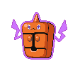
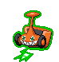

#479 - Rotom
=== "Rotom"
	<table cellspacing="0" cellpadding="0"><tr><th colspan="1" align="center"></th><th colspan="1" align="center">Type</th><th colspan="1" align="center">Ability</th></tr><tr><td align="center";rowspan="1"></td><td align="center";rowspan="1"> </td><td rowspan="1">(1) Levitate</td></tr><tr><th colspan="3" align="center">Defenses</th></tr><tr><td align="right">Immune:</td><td colspan="2"></td></tr><tr><td align="right">0.25x Resist:</td><td colspan="2"></td></tr><tr><td align="right">0.5x Resist:</td><td colspan="2"></td></tr><tr><td align="right">Neutral:</td><td colspan="2"></td></tr><tr><td align="right">2x Weak:</td><td colspan="2"></td></tr><tr><td align="right">4x Weak:</td><td colspan="2"></td></tr></table>

=== "Heat"
	<table cellspacing="0" cellpadding="0"><tr><th colspan="1" align="center">Heat</th><th colspan="1" align="center">Type</th></tr><tr><td align="center";rowspan="1"></td><td align="center";rowspan="1"> </td></tr><tr><th colspan="2" align="center">Defenses</th></tr><tr><td align="right">Immune:</td><td colspan="1"></td></tr><tr><td align="right">0.25x Resist:</td><td colspan="1"></td></tr><tr><td align="right">0.5x Resist:</td><td colspan="1"></td></tr><tr><td align="right">Neutral:</td><td colspan="1"></td></tr><tr><td align="right">2x Weak:</td><td colspan="1"></td></tr><tr><td align="right">4x Weak:</td><td colspan="1"></td></tr></table>

=== "Wash"
	<table cellspacing="0" cellpadding="0"><tr><th colspan="1" align="center">Wash</th><th colspan="1" align="center">Type</th></tr><tr><td align="center";rowspan="1"></td><td align="center";rowspan="1"> </td></tr><tr><th colspan="2" align="center">Defenses</th></tr><tr><td align="right">Immune:</td><td colspan="1"></td></tr><tr><td align="right">0.25x Resist:</td><td colspan="1"></td></tr><tr><td align="right">0.5x Resist:</td><td colspan="1"></td></tr><tr><td align="right">Neutral:</td><td colspan="1"></td></tr><tr><td align="right">2x Weak:</td><td colspan="1"></td></tr><tr><td align="right">4x Weak:</td><td colspan="1"></td></tr></table>

=== "Frost"
	<table cellspacing="0" cellpadding="0"><tr><th colspan="1" align="center">Frost</th><th colspan="1" align="center">Type</th></tr><tr><td align="center";rowspan="1"></td><td align="center";rowspan="1"> </td></tr><tr><th colspan="2" align="center">Defenses</th></tr><tr><td align="right">Immune:</td><td colspan="1"></td></tr><tr><td align="right">0.25x Resist:</td><td colspan="1"></td></tr><tr><td align="right">0.5x Resist:</td><td colspan="1"></td></tr><tr><td align="right">Neutral:</td><td colspan="1"></td></tr><tr><td align="right">2x Weak:</td><td colspan="1"></td></tr><tr><td align="right">4x Weak:</td><td colspan="1"></td></tr></table>

=== "Fan"
	<table cellspacing="0" cellpadding="0"><tr><th colspan="1" align="center">Fan</th><th colspan="1" align="center">Type</th><th colspan="1" align="center">Ability</th></tr><tr><td align="center";rowspan="1"></td><td align="center";rowspan="1"> </td><td rowspan="1">(1) Motor Drive</td></tr><tr><th colspan="3" align="center">Defenses</th></tr><tr><td align="right">Immune:</td><td colspan="2"></td></tr><tr><td align="right">0.25x Resist:</td><td colspan="2"></td></tr><tr><td align="right">0.5x Resist:</td><td colspan="2"></td></tr><tr><td align="right">Neutral:</td><td colspan="2"></td></tr><tr><td align="right">2x Weak:</td><td colspan="2"></td></tr><tr><td align="right">4x Weak:</td><td colspan="2"></td></tr></table>

=== "Mow"
	<table cellspacing="0" cellpadding="0"><tr><th colspan="1" align="center">Mow</th><th colspan="1" align="center">Type</th></tr><tr><td align="center";rowspan="1"></td><td align="center";rowspan="1"> </td></tr><tr><th colspan="2" align="center">Defenses</th></tr><tr><td align="right">Immune:</td><td colspan="1"></td></tr><tr><td align="right">0.25x Resist:</td><td colspan="1"></td></tr><tr><td align="right">0.5x Resist:</td><td colspan="1"></td></tr><tr><td align="right">Neutral:</td><td colspan="1"></td></tr><tr><td align="right">2x Weak:</td><td colspan="1"></td></tr><tr><td align="right">4x Weak:</td><td colspan="1"></td></tr></table>

&nbsp;

## Stats
<table class="stat"><tr><td class="stat-icon-single"></td><td class="stat-single"><u>HP</u> 50</td><td class="stat-single"><u>ATK</u> 50</td><td class="stat-single"><u>DEF</u> 77</td><td class="stat-single"><u>SPA</u> 95</td><td class="stat-single"><u>SPD</u> 77</td><td  class="stat-single">            <u>SPE                +10</u>                     101</td><td  class="stat-single">            <u>BST                +10</u>                     450</td></tr>
<tr><td class="stat-icon-single"></td><td class="stat-single"><u>HP</u> 50</td><td class="stat-single"><u>ATK</u> 65</td><td class="stat-single"><u>DEF</u> 107</td><td class="stat-single"><u>SPA</u> 105</td><td class="stat-single"><u>SPD</u> 107</td><td class="stat-single"><u>SPE</u> 86</td><td class="stat-single"><u>BST</u> 520</td></tr></table>

## Level Up Moves
<table><th>Form</th><th>Level</th><th>Name</th><th>Power</th><th>Accuracy</th><th>PP</th><th>Type</th><th>Damage Class</th><th>Effect</th>
<tr><td></td><td>1</td><td>Astonish</td><td>35</td><td>100</td><td>15</td><td></td><td></td><td>Priority: 0. Has a 30% chance to make the target flinch.</td></tr>
<tr><td></td><td>1</td><td>Nasty Plot</td><td>None</td><td>None</td><td>20</td><td></td><td></td><td>Priority: 0. Raises the user's Special Attack by two stages.</td></tr>
<tr><td></td><td>1</td><td>Thunder Shock</td><td>40</td><td>100</td><td>25</td><td></td><td></td><td>Priority: 0. Has a 10% chance to paralyze the target.</td></tr>
<tr><td></td><td>1</td><td>Thunder Wave</td><td>None</td><td>90</td><td>20</td><td></td><td></td><td>Priority: 0. Paralyzes the target.</td></tr>
<tr><td></td><td>1</td><td>Trick</td><td>None</td><td>100</td><td>10</td><td></td><td></td><td>Priority: 0. User and target permanently swap held items.</td></tr>
<tr><td></td><td>4</td><td>Thunder Shock</td><td>40</td><td>100</td><td>25</td><td></td><td></td><td>Priority: 0. Has a 10% chance to paralyze the target.</td></tr>
<tr><td></td><td>7</td><td>Confuse Ray</td><td>None</td><td>100</td><td>10</td><td></td><td></td><td>Priority: 0. Confuses the target.</td></tr>
<tr><td></td><td>10</td><td>Shock Wave</td><td>60</td><td>None</td><td>20</td><td></td><td></td><td>Priority: 0. Ignores accuracy and evasion modifiers.</td></tr>
<tr><td></td><td>13</td><td>Double Team</td><td>None</td><td>None</td><td>15</td><td></td><td></td><td>Priority: 0. Raises the user's evasion by one stage.</td></tr>
<tr><td></td><td>16</td><td>Ominous Wind</td><td>60</td><td>100</td><td>5</td><td></td><td></td><td>Priority: 0. Has a 10% chance to raise all of the user's stats one stage.</td></tr>
<tr><td></td><td>19</td><td>Uproar</td><td>90</td><td>100</td><td>10</td><td></td><td></td><td>Priority: 0. User is forced to use this move for 2–5 turns, selected at random. No Pokemon can sleep during the effect of this move. </td></tr>
<tr><td></td><td>22</td><td>Substitute</td><td>None</td><td>None</td><td>10</td><td></td><td></td><td>Priority: 0. Transfers 1/4 the user's max HP into a doll that absorbs damage and causes most negative move effects to fail.</td></tr>
<tr><td></td><td>25</td><td>Charge Beam</td><td>50</td><td>90</td><td>15</td><td></td><td></td><td>Priority: 0. Has a 70% chance to raise the user's Special Attack by one stage.</td></tr>
<tr><td></td><td>28</td><td>Will-O-Wisp</td><td>None</td><td>85</td><td>15</td><td></td><td></td><td>Priority: 0. Burns the target.</td></tr>
<tr><td></td><td>31</td><td>Electro Ball</td><td>None</td><td>100</td><td>10</td><td></td><td></td><td>Priority: 0. The greater the user's Speed compared to the target's, the higher power this move has, to a maximum of 150.  User's Speed                     | Power -------------------------------- | ----: Up to 2× the target's Speed      |    60 Up to 3× the target's Speed      |    80 Up to 4× the target's Speed      |   120 More than 4× the target's Speed  |   150</td></tr>
<tr><td></td><td>34</td><td>Hex</td><td>65</td><td>100</td><td>15</td><td></td><td></td><td>Priority: 0. If the target has a major status ailment, this move has double power.</td></tr>
<tr><td></td><td>37</td><td>Charge</td><td>None</td><td>None</td><td>20</td><td></td><td></td><td>Priority: 0. Raises the user's Special Defense by one stage.  If the user uses an electric move next turn, its power will be doubled.</td></tr>
<tr><td></td><td>40</td><td>Discharge</td><td>80</td><td>100</td><td>15</td><td></td><td></td><td>Priority: 0. Has a 30% chance to paralyze the target.</td></tr>
<tr><td></td><td>43</td><td>Dark Pulse</td><td>80</td><td>Never Miss</td><td>10</td><td></td><td></td><td>Priority: 0. Has a 20% chance to make the target flinch.</td></tr>
<tr><td></td><td>46</td><td>Pain Split</td><td>None</td><td>None</td><td>20</td><td></td><td></td><td>Priority: 0. Changes the user's and target's remaining HP to the average of their current remaining HP.</td></tr>
<tr><td></td><td>50</td><td>Shadow Ball</td><td>80</td><td>100</td><td>10</td><td></td><td></td><td>Priority: 0. Has a 20% chance to lower the target's Special Defense by one stage.</td></tr>
<tr><td></td><td>55</td><td>Thunderbolt</td><td>90</td><td>100</td><td>10</td><td></td><td></td><td>Priority: 0. Has a 10% chance to paralyze the target.</td></tr>
<tr><td></td><td>60</td><td>Stored Power</td><td>20</td><td>100</td><td>10</td><td></td><td></td><td>Priority: 0. Power is increased by 100% its original value for every stage any of the user's stats have been raised.  Accuracy, evasion, and lowered stats do not affect this move's power.  For a Pokémon with all five stats modified to +6, this move's power is 31×.</td></tr>
</table>

## TM Moves
<table><th>Machine</th><th>Name</th><th>Power</th><th>Accuracy</th><th>PP</th><th>Type</th><th>Damage Class</th><th>Effect</th>
<tr><td>TM6</td><td>Toxic</td><td>None</td><td>90</td><td>10</td><td></td><td></td><td>Priority: 0. Badly poisons the target.  Never misses when used by a poison-type Pokémon.</td></tr>
<tr><td>TM10</td><td>Hidden Power</td><td>60</td><td>100</td><td>15</td><td></td><td></td><td>Priority: 0. Power and type depend upon user's IVs. Power can range from 30 to 70.</td></tr>
<tr><td>TM11</td><td>Sunny Day</td><td>None</td><td>None</td><td>5</td><td></td><td></td><td>Priority: 0. Changes the weather to sunshine for five turns.</td></tr>
<tr><td>TM16</td><td>Light Screen</td><td>None</td><td>None</td><td>30</td><td></td><td></td><td>Priority: 0. Reduces damage from special attacks by half for five turns. In double battles, the reduction is 1/3.</td></tr>
<tr><td>TM17</td><td>Protect</td><td>None</td><td>None</td><td>10</td><td></td><td></td><td>Priority: 4. No moves will hit the user for the remainder of this turn. If the user is last to act this turn, this move will fail. Success rate drops by 1/2 on successive attempts.</td></tr>
<tr><td>TM18</td><td>Rain Dance</td><td>None</td><td>None</td><td>5</td><td></td><td></td><td>Priority: 0. Changes the weather to rain for five turns, during which water moves inflict 50% extra damage, and fire moves inflict half damage.</td></tr>
<tr><td>TM21</td><td>Frustration</td><td>None</td><td>100</td><td>20</td><td></td><td></td><td>Priority: 0. Power increases inversely with happiness, given by `(255 - happiness) * 2 / 5`, to a maximum of 102.  Power bottoms out at 1.</td></tr>
<tr><td>TM24</td><td>Thunderbolt</td><td>90</td><td>100</td><td>10</td><td></td><td></td><td>Priority: 0. Has a 10% chance to paralyze the target.</td></tr>
<tr><td>TM25</td><td>Thunder</td><td>110</td><td>70</td><td>5</td><td></td><td></td><td>Priority: 0. Has a 30% chance to paralyze the target.  During rain dance, this move has 100% accuracy.  During sunny day, this move has 50% accuracy.</td></tr>
<tr><td>TM27</td><td>Return</td><td>None</td><td>100</td><td>20</td><td></td><td></td><td>Priority: 0. Power increases with happiness, given by `happiness * 2 / 5`, to a maximum of 102.  Power bottoms out at 1.</td></tr>
<tr><td>TM30</td><td>Shadow Ball</td><td>80</td><td>100</td><td>10</td><td></td><td></td><td>Priority: 0. Has a 20% chance to lower the target's Special Defense by one stage.</td></tr>
<tr><td>TM33</td><td>Reflect</td><td>None</td><td>None</td><td>20</td><td></td><td></td><td>Priority: 0. Reduces damage from physical attacks by half for five turns. In double battles, the reduction is 1/3.</td></tr>
<tr><td>TM42</td><td>Facade</td><td>70</td><td>100</td><td>20</td><td></td><td></td><td>Priority: 0. If the user is burned, paralyzed, or poisoned, this move has double power.</td></tr>
<tr><td>TM44</td><td>Rest</td><td>None</td><td>None</td><td>10</td><td></td><td></td><td>Priority: 0. User falls to sleep for two turns, replacing any existing non-volatile status ailments, and immediately regains all its HP.</td></tr>
<tr><td>TM57</td><td>Charge Beam</td><td>50</td><td>90</td><td>15</td><td></td><td></td><td>Priority: 0. Has a 70% chance to raise the user's Special Attack by one stage.</td></tr>
<tr><td>TM61</td><td>Will-O-Wisp</td><td>None</td><td>85</td><td>15</td><td></td><td></td><td>Priority: 0. Burns the target.</td></tr>
<tr><td>TM70</td><td>Flash</td><td>None</td><td>100</td><td>20</td><td></td><td></td><td>Priority: 0. Lowers the target's accuracy by one stage.</td></tr>
<tr><td>TM72</td><td>Volt Switch</td><td>70</td><td>100</td><td>20</td><td></td><td></td><td>Priority: 0. Inflicts regular damage, then the user immediately switches out, and the trainer selects a replacement Pokémon from the party.  If the target faints from this attack, the user's trainer selects the new Pokémon to send out first.  If the user is the last Pokémon in its party that can battle, it will not switch out.  The user may be hit by pursuit when it switches out, if it has been targeted and pursuit has not yet been used.  This move may be used even if the user is under the effect of ingrain.  ingrain's effect will end.</td></tr>
<tr><td>TM73</td><td>Thunder Wave</td><td>None</td><td>90</td><td>20</td><td></td><td></td><td>Priority: 0. Paralyzes the target.</td></tr>
<tr><td>TM77</td><td>Psych Up</td><td>None</td><td>None</td><td>10</td><td></td><td></td><td>Priority: 0. Discards the user's stat changes and copies the target's.  This move cannot be copied by mirror move.</td></tr>
<tr><td>TM90</td><td>Substitute</td><td>None</td><td>None</td><td>10</td><td></td><td></td><td>Priority: 0. Transfers 1/4 the user's max HP into a doll that absorbs damage and causes most negative move effects to fail.</td></tr>
</table>

## Tutor Moves
<table><th>Name</th><th>Power</th><th>Accuracy</th><th>PP</th><th>Type</th><th>Damage Class</th><th>Effect</th>
<tr><td>Dark Pulse</td><td>80</td><td>Never Miss</td><td>10</td><td></td><td></td><td>Priority: 0. Has a 20% chance to make the target flinch.</td></tr>
<tr><td>Electroweb</td><td>55</td><td>95</td><td>15</td><td></td><td></td><td>Priority: 0. Lowers the target's Speed by one stage.</td></tr>
<tr><td>Pain Split</td><td>None</td><td>None</td><td>20</td><td></td><td></td><td>Priority: 0. Changes the user's and target's remaining HP to the average of their current remaining HP.</td></tr>
<tr><td>Signal Beam</td><td>75</td><td>100</td><td>15</td><td></td><td></td><td>Priority: 0. Has a 10% chance to confuse the target.</td></tr>
<tr><td>Sleep Talk</td><td>None</td><td>None</td><td>10</td><td></td><td></td><td>Priority: 0. Only usable if the user is sleeping. Randomly selects and uses one of the user's other three moves. Use of the selected move requires and costs 0 PP.</td></tr>
<tr><td>Snatch</td><td>None</td><td>None</td><td>10</td><td></td><td></td><td>Priority: 4. The next time a Pokémon uses a beneficial move on itself or itself and its ally this turn, the user of this move will steal the move and use it itself.  Moves which may be stolen by this move are identified by the "snatchable" flag.  If two Pokémon use this move on the same turn, the faster Pokémon will steal the first beneficial move, and the slower Pokémon will then steal it again—thus, only the slowest Pokémon using this move ultimately gains a stolen move's effect.  If the user steals psych up, it will target the Pokémon that used psych up.  If the user was the original target of psych up, and the Pokémon that originally used it's affected by pressure, it will only lose 1 PP.  This move cannot be copied by mirror move, nor selected by assist or metronome.</td></tr>
<tr><td>Snore</td><td>50</td><td>100</td><td>15</td><td></td><td></td><td>Priority: 0. Only usable if the user is sleeping.   Has a 30% chance to make the target flinch.</td></tr>
<tr><td>Spite</td><td>None</td><td>100</td><td>10</td><td></td><td></td><td>Priority: 0. Lowers the PP of the target's last used move by 4.  If the target hasn't used a move since entering the field, if it tried to use a move this turn and failed, or if its last used move has 0 PP remaining, this move will fail.</td></tr>
<tr><td>Trick</td><td>None</td><td>100</td><td>10</td><td></td><td></td><td>Priority: 0. User and target permanently swap held items.</td></tr>
<tr><td>Uproar</td><td>90</td><td>100</td><td>10</td><td></td><td></td><td>Priority: 0. User is forced to use this move for 2–5 turns, selected at random. No Pokemon can sleep during the effect of this move. </td></tr>
</table>
--8<-- "includes/abilities.md"

