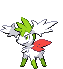

#492 - Shaymin
=== "Land"
	<table cellspacing="0" cellpadding="0"><tr><th colspan="1" align="center">Land</th><th colspan="1" align="center">Type</th><th colspan="1" align="center">Ability</th></tr><tr><td align="center";rowspan="1"></td><td align="center";rowspan="1"></td><td rowspan="1">(1) Natural Cure</td></tr><tr><th colspan="3" align="center">Defenses</th></tr><tr><td align="right">Immune:</td><td colspan="2"></td></tr><tr><td align="right">0.25x Resist:</td><td colspan="2"></td></tr><tr><td align="right">0.5x Resist:</td><td colspan="2"></td></tr><tr><td align="right">Neutral:</td><td colspan="2"></td></tr><tr><td align="right">2x Weak:</td><td colspan="2"></td></tr><tr><td align="right">4x Weak:</td><td colspan="2"></td></tr></table>

=== "Sky"
	<table cellspacing="0" cellpadding="0"><tr><th colspan="1" align="center">Sky</th><th colspan="1" align="center">Type</th><th colspan="1" align="center">Ability</th></tr><tr><td align="center";rowspan="1"></td><td align="center";rowspan="1"> </td><td rowspan="1">(1) Serene Grace</td></tr><tr><th colspan="3" align="center">Defenses</th></tr><tr><td align="right">Immune:</td><td colspan="2"></td></tr><tr><td align="right">0.25x Resist:</td><td colspan="2"></td></tr><tr><td align="right">0.5x Resist:</td><td colspan="2"></td></tr><tr><td align="right">Neutral:</td><td colspan="2"></td></tr><tr><td align="right">2x Weak:</td><td colspan="2"></td></tr><tr><td align="right">4x Weak:</td><td colspan="2"></td></tr></table>

&nbsp;

## Stats
<table class="stat"><tr><td class="stat-icon-single"></td><td class="stat-single"><u>HP</u> 100</td><td class="stat-single"><u>ATK</u> 100</td><td class="stat-single"><u>DEF</u> 100</td><td class="stat-single"><u>SPA</u> 100</td><td class="stat-single"><u>SPD</u> 100</td><td class="stat-single"><u>SPE</u> 100</td><td class="stat-single"><u>BST</u> 600</td></tr>
<tr><td class="stat-icon-single"></td><td class="stat-single"><u>HP</u> 100</td><td class="stat-single"><u>ATK</u> 103</td><td class="stat-single"><u>DEF</u> 75</td><td class="stat-single"><u>SPA</u> 120</td><td class="stat-single"><u>SPD</u> 75</td><td class="stat-single"><u>SPE</u> 127</td><td class="stat-single"><u>BST</u> 600</td></tr></table>

## Wild Hold Items
<table><tr><th> Land

</th><th> Sky

</th></tr>
<tr><td>- 50%: Starf Berry - 5%: Starf Berry </td><td>- 50%: Lum Berry - 5%: Lum Berry </td></tr>
</table>

## Level Up Moves
<table><th>Form</th><th>Level</th><th>Name</th><th>Power</th><th>Accuracy</th><th>PP</th><th>Type</th><th>Damage Class</th><th>Effect</th>
<tr><td></td><td>1</td><td>Growth</td><td>None</td><td>None</td><td>20</td><td></td><td></td><td>Priority: 0. Raises the user's Attack and Special Attack by one stage each.  During sunny day, raises both stats by two stages.</td></tr>
<tr><td></td><td>1</td><td>Healing Wish</td><td>None</td><td>None</td><td>10</td><td></td><td></td><td>Priority: 0. User faints.  Its replacement's HP is fully restored, and any major status effect is removed.  If the replacement Pokémon is immediately fainted by a switch-in effect, the next replacement is healed by this move instead.</td></tr>
<tr><td></td><td>6</td><td>Magical Leaf</td><td>60</td><td>None</td><td>20</td><td></td><td></td><td>Priority: 0. Ignores accuracy and evasion modifiers.</td></tr>
<tr><td></td><td>10</td><td>Leech Seed</td><td>None</td><td>90</td><td>10</td><td></td><td></td><td>Priority: 0. Plants a seed on the target that drains 1/8 of its max HP at the end of every turn and heals the user for the amount taken.</td></tr>
<tr><td></td><td>14</td><td>Quick Attack</td><td>40</td><td>100</td><td>20</td><td></td><td></td><td>Priority: 1. Inflicts regular damage.</td></tr>
<tr><td></td><td>14</td><td>Synthesis</td><td>None</td><td>None</td><td>5</td><td></td><td></td><td>Priority: 0. Heals the user for half its max HP, plus modifiers from weather.</td></tr>
<tr><td></td><td>18</td><td>Zen Headbutt</td><td>80</td><td>90</td><td>10</td><td></td><td></td><td>Priority: 0. Has a 20% chance to make the target flinch.</td></tr>
<tr><td></td><td>22</td><td>Natural Gift</td><td>None</td><td>100</td><td>15</td><td></td><td></td><td>Priority: 0. Power and type are determined by the user's held berry.  The berry is consumed.  If the user is not holding a berry, this move will fail.</td></tr>
<tr><td></td><td>26</td><td>Recover</td><td>None</td><td>None</td><td>10</td><td></td><td></td><td>Priority: 0. Heals the user for half its max HP.</td></tr>
<tr><td></td><td>30</td><td>Aromatherapy</td><td>None</td><td>None</td><td>5</td><td></td><td></td><td>Priority: 0. Removes major status effects and confusion from every Pokémon in the user's party.</td></tr>
<tr><td></td><td>34</td><td>Sleep Powder</td><td>None</td><td>75</td><td>15</td><td></td><td></td><td>Priority: 0. Puts the target to sleep.</td></tr>
<tr><td></td><td>38</td><td>Air Slash</td><td>75</td><td>95</td><td>10</td><td></td><td></td><td>Priority: 0. Has a 30% chance to make the target flinch.</td></tr>
<tr><td></td><td>38</td><td>Earth Power</td><td>90</td><td>100</td><td>10</td><td></td><td></td><td>Priority: 0. Has a 10% chance to lower the target's Special Defense by one stage.</td></tr>
<tr><td></td><td>42</td><td>Draining Kiss</td><td>70</td><td>100</td><td>10</td><td></td><td></td><td>Priority: 0. Deals regular damage.  Drains 75% of the damage inflicted to heal the user.</td></tr>
<tr><td></td><td>46</td><td>Leaf Storm</td><td>130</td><td>90</td><td>5</td><td></td><td></td><td>Priority: 0. Inflicts regular damage, then lowers the user's Special Attack by two stages.</td></tr>
<tr><td></td><td>50</td><td>Seed Flare</td><td>120</td><td>85</td><td>5</td><td></td><td></td><td>Priority: 0. Has a 40% chance to lower the target's Special Defense by two stages.</td></tr>
</table>

## TM Moves
<table><th>Machine</th><th>Name</th><th>Power</th><th>Accuracy</th><th>PP</th><th>Type</th><th>Damage Class</th><th>Effect</th>
<tr><td>TM6</td><td>Toxic</td><td>None</td><td>90</td><td>10</td><td></td><td></td><td>Priority: 0. Badly poisons the target.  Never misses when used by a poison-type Pokémon.</td></tr>
<tr><td>TM10</td><td>Hidden Power</td><td>60</td><td>100</td><td>15</td><td></td><td></td><td>Priority: 0. Power and type depend upon user's IVs. Power can range from 30 to 70.</td></tr>
<tr><td>TM11</td><td>Sunny Day</td><td>None</td><td>None</td><td>5</td><td></td><td></td><td>Priority: 0. Changes the weather to sunshine for five turns.</td></tr>
<tr><td>TM15</td><td>Hyper Beam</td><td>150</td><td>90</td><td>5</td><td></td><td></td><td>Priority: 0. User loses its next turn to "recharge", and cannot attack or switch out during that turn.</td></tr>
<tr><td>TM17</td><td>Protect</td><td>None</td><td>None</td><td>10</td><td></td><td></td><td>Priority: 4. No moves will hit the user for the remainder of this turn. If the user is last to act this turn, this move will fail. Success rate drops by 1/2 on successive attempts.</td></tr>
<tr><td>TM19</td><td>Giga Drain</td><td>80</td><td>100</td><td>10</td><td></td><td></td><td>Priority: 0. Drains half the damage inflicted to heal the user.</td></tr>
<tr><td>TM21</td><td>Frustration</td><td>None</td><td>100</td><td>20</td><td></td><td></td><td>Priority: 0. Power increases inversely with happiness, given by `(255 - happiness) * 2 / 5`, to a maximum of 102.  Power bottoms out at 1.</td></tr>
<tr><td>TM22</td><td>Solar Beam</td><td>120</td><td>100</td><td>10</td><td></td><td></td><td>Priority: 0. User charges for one turn before attacking.</td></tr>
<tr><td>TM27</td><td>Return</td><td>None</td><td>100</td><td>20</td><td></td><td></td><td>Priority: 0. Power increases with happiness, given by `happiness * 2 / 5`, to a maximum of 102.  Power bottoms out at 1.</td></tr>
<tr><td>TM29</td><td>Psychic</td><td>90</td><td>100</td><td>10</td><td></td><td></td><td>Priority: 0. Has a 10% chance to lower the target's Special Defense by one stage.</td></tr>
<tr><td>TM32</td><td>Dazzling Gleam</td><td>80</td><td>100</td><td>10</td><td></td><td></td><td>Priority: 0. Inflicts regular damage.</td></tr>
<tr><td>TM42</td><td>Facade</td><td>70</td><td>100</td><td>20</td><td></td><td></td><td>Priority: 0. If the user is burned, paralyzed, or poisoned, this move has double power.</td></tr>
<tr><td>TM44</td><td>Rest</td><td>None</td><td>None</td><td>10</td><td></td><td></td><td>Priority: 0. User falls to sleep for two turns, replacing any existing non-volatile status ailments, and immediately regains all its HP.</td></tr>
<tr><td>TM53</td><td>Energy Ball</td><td>90</td><td>100</td><td>10</td><td></td><td></td><td>Priority: 0. Has a 10% chance to lower the target's Special Defense by one stage.</td></tr>
<tr><td>TM68</td><td>Giga Impact</td><td>150</td><td>90</td><td>5</td><td></td><td></td><td>Priority: 0. User loses its next turn to "recharge", and cannot attack or switch out during that turn.</td></tr>
<tr><td>TM70</td><td>Flash</td><td>None</td><td>100</td><td>20</td><td></td><td></td><td>Priority: 0. Lowers the target's accuracy by one stage.</td></tr>
<tr><td>TM75</td><td>Swords Dance</td><td>None</td><td>None</td><td>20</td><td></td><td></td><td>Priority: 0. Raises the user's Attack by two stages.</td></tr>
<tr><td>TM77</td><td>Psych Up</td><td>None</td><td>None</td><td>10</td><td></td><td></td><td>Priority: 0. Discards the user's stat changes and copies the target's.  This move cannot be copied by mirror move.</td></tr>
<tr><td>TM86</td><td>Grass Knot</td><td>None</td><td>100</td><td>20</td><td></td><td></td><td>Priority: 0. Power increases with the target's weight in kilograms, to a maximum of 120.</td></tr>
<tr><td>TM90</td><td>Substitute</td><td>None</td><td>None</td><td>10</td><td></td><td></td><td>Priority: 0. Transfers 1/4 the user's max HP into a doll that absorbs damage and causes most negative move effects to fail.</td></tr>
</table>

## Tutor Moves
<table><th>Form</th><th>Name</th><th>Power</th><th>Accuracy</th><th>PP</th><th>Type</th><th>Damage Class</th><th>Effect</th>
<tr><td></td><td>Covet</td><td>60</td><td>100</td><td>20</td><td></td><td></td><td>Priority: 0. If the target is holding an item and the user is not, the user will permanently take the item.  Damage is still inflicted if an item cannot be taken.  Pokémon with sticky hold or multitype are immune to the item theft effect.  The target cannot recover its item with recycle.</td></tr>
<tr><td></td><td>Earth Power</td><td>90</td><td>100</td><td>10</td><td></td><td></td><td>Priority: 0. Has a 10% chance to lower the target's Special Defense by one stage.</td></tr>
<tr><td></td><td>Endeavor</td><td>None</td><td>100</td><td>5</td><td></td><td></td><td>Priority: 0. Inflicts exactly enough damage to lower the target's HP to equal the user's.  If the target's HP is not higher than the user's, this move has no effect.  Type immunity applies, but other type effects are ignored.  This effect counts as damage for moves that respond to damage.</td></tr>
<tr><td></td><td>Giga Drain</td><td>80</td><td>100</td><td>10</td><td></td><td></td><td>Priority: 0. Drains half the damage inflicted to heal the user.</td></tr>
<tr><td></td><td>Last Resort</td><td>140</td><td>100</td><td>5</td><td></td><td></td><td>Priority: 0. This move can only be used if each of the user's other moves has been used at least once since the user entered the field.  If this is the user's only move, this move will fail.</td></tr>
<tr><td></td><td>Seed Bomb</td><td>80</td><td>100</td><td>15</td><td></td><td></td><td>Priority: 0. Inflicts regular damage.</td></tr>
<tr><td></td><td>Sleep Talk</td><td>None</td><td>None</td><td>10</td><td></td><td></td><td>Priority: 0. Only usable if the user is sleeping. Randomly selects and uses one of the user's other three moves. Use of the selected move requires and costs 0 PP.</td></tr>
<tr><td></td><td>Snore</td><td>50</td><td>100</td><td>15</td><td></td><td></td><td>Priority: 0. Only usable if the user is sleeping.   Has a 30% chance to make the target flinch.</td></tr>
<tr><td></td><td>Synthesis</td><td>None</td><td>None</td><td>5</td><td></td><td></td><td>Priority: 0. Heals the user for half its max HP, plus modifiers from weather.</td></tr>
<tr><td></td><td>Tailwind</td><td>None</td><td>None</td><td>15</td><td></td><td></td><td>Priority: 0. For the next three turns, all Pokémon on the user's side of the field have their original Speed doubled.  This effect remains if the user leaves the field.</td></tr>
<tr><td></td><td>Worry Seed</td><td>None</td><td>100</td><td>10</td><td></td><td></td><td>Priority: 0. Changes the target's ability to insomnia.  If the target's ability is truant or multitype, this move will fail.</td></tr>
<tr><td></td><td>Zen Headbutt</td><td>80</td><td>90</td><td>10</td><td></td><td></td><td>Priority: 0. Has a 20% chance to make the target flinch.</td></tr>
</table>
--8<-- "includes/abilities.md"

