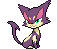

#509 - Purrloin
<table cellspacing="0" cellpadding="0"><tr><th colspan="1" align="center"></th><th colspan="1" align="center">Type</th><th colspan="1" align="center">Ability</th></tr><tr><td align="center";rowspan="1"></td><td align="center";rowspan="1"></td><td rowspan="1">(1) Prankster   (2) Unburden   (HA) Prankster</td></tr><tr><th colspan="3" align="center">Defenses</th></tr><tr><td align="right">Immune:</td><td colspan="2"></td></tr><tr><td align="right">0.25x Resist:</td><td colspan="2"></td></tr><tr><td align="right">0.5x Resist:</td><td colspan="2"></td></tr><tr><td align="right">Neutral:</td><td colspan="2"></td></tr><tr><td align="right">2x Weak:</td><td colspan="2"></td></tr><tr><td align="right">4x Weak:</td><td colspan="2"></td></tr></table>

## Evolutions
<table>
<tr><td rowspan="1"style="vertical-align: middle;">    <a href="../509">Purrloin</a> </td><td rowspan="1"style="vertical-align: middle; word-break:break-all;">Level 20</td><td rowspan="1"style="vertical-align: middle;">    <a href="../510">Liepard</a> </td></tr>
</table>

## Stats
<table class="stat"><tr><td class="stat-icon-single"></td><td class="stat-single"><u>HP</u> 41</td><td class="stat-single"><u>ATK</u> 50</td><td class="stat-single"><u>DEF</u> 37</td><td class="stat-single"><u>SPA</u> 50</td><td class="stat-single"><u>SPD</u> 37</td><td class="stat-single"><u>SPE</u> 66</td><td class="stat-single"><u>BST</u> 281</td></tr></table>

## Level Up Moves
<table><th>Level</th><th>Name</th><th>Power</th><th>Accuracy</th><th>PP</th><th>Type</th><th>Damage Class</th><th>Effect</th>
<tr><td>1</td><td>Growl</td><td>None</td><td>100</td><td>40</td><td></td><td></td><td>Priority: 0. Lowers the target's Attack by one stage.</td></tr>
<tr><td>1</td><td>Sand Attack</td><td>None</td><td>100</td><td>15</td><td></td><td></td><td>Priority: 0. Lowers the target's accuracy by one stage.</td></tr>
<tr><td>1</td><td>Scratch</td><td>40</td><td>100</td><td>35</td><td></td><td></td><td>Priority: 0. Inflicts regular damage.</td></tr>
<tr><td>4</td><td>Pursuit</td><td>40</td><td>100</td><td>20</td><td></td><td></td><td>Priority: 0. If the target attempts to switch out this turn before the user acts, this move hits the target before it leaves and has double power.  This effect can still hit a Pokémon that switches out when it has a substitute up or when an ally has used follow me.</td></tr>
<tr><td>6</td><td>Pay Day</td><td>40</td><td>100</td><td>20</td><td></td><td></td><td>Priority: 0. After the battle ends, the winner receives five times the user's level in extra money for each time this move was used.</td></tr>
<tr><td>8</td><td>Assist</td><td>None</td><td>None</td><td>20</td><td></td><td></td><td>Priority: 0. Uses a move from another Pokémon in the user's party, both selected at random.  Moves from fainted Pokémon can be used.  If there are no eligible Pokémon or moves, this move will fail.  This move will not select assist, chatter, circle throw, copycat, counter, covet, destiny bond, detect, dig, dive, dragon tail, endure, feint, fly focus punch, follow me, helping hand, me first, metronome, mimic, mirror coat, mirror move, phantom force protect, quick guard, roar shadow force, sketch, sleep talk, snatch, struggle, switcheroo, thief, trick, whirlwind, or wide guard.</td></tr>
<tr><td>10</td><td>Fake Out</td><td>40</td><td>100</td><td>10</td><td></td><td></td><td>Priority: 3. Causes the target to flinch.  Can only be used on the user's first turn after entering the field.</td></tr>
<tr><td>12</td><td>Feint Attack</td><td>60</td><td>None</td><td>20</td><td></td><td></td><td>Priority: 0. Ignores accuracy and evasion modifiers.</td></tr>
<tr><td>14</td><td>Captivate</td><td>None</td><td>100</td><td>20</td><td></td><td></td><td>Priority: 0. Lowers the target's Special Attack by two stages.  If the user and target are the same gender, or either is genderless, this move will fail.</td></tr>
<tr><td>16</td><td>Torment</td><td>None</td><td>100</td><td>15</td><td></td><td></td><td>Priority: 0. Prevents the target from attempting to use the same move twice in a row.</td></tr>
<tr><td>18</td><td>Fake Tears</td><td>None</td><td>100</td><td>20</td><td></td><td></td><td>Priority: 0. Lowers the target's Special Defense by two stages.</td></tr>
<tr><td>20</td><td>Assurance</td><td>60</td><td>100</td><td>10</td><td></td><td></td><td>Priority: 0. If the target takes damage this turn for any reason before this move is used, this move has double power.</td></tr>
<tr><td>22</td><td>Hone Claws</td><td>None</td><td>None</td><td>15</td><td></td><td></td><td>Priority: 0. Raises the user's Attack and accuracy by one stage.</td></tr>
<tr><td>24</td><td>Trick</td><td>None</td><td>100</td><td>10</td><td></td><td></td><td>Priority: 0. User and target permanently swap held items.</td></tr>
<tr><td>26</td><td>Quash</td><td>None</td><td>100</td><td>15</td><td></td><td></td><td>Priority: 0. Forces the target to act last this turn, regardless of Speed or move priority.  If the target has already acted this turn, this move will fail.</td></tr>
<tr><td>28</td><td>Night Slash</td><td>70</td><td>100</td><td>15</td><td></td><td></td><td>Priority: 0. User's critical hit rate is one level higher when using this move.</td></tr>
<tr><td>28</td><td>Slash</td><td>70</td><td>100</td><td>15</td><td></td><td></td><td>Priority: 0. User's critical hit rate is one level higher when using this move.</td></tr>
<tr><td>31</td><td>Psycho Cut</td><td>90</td><td>100</td><td>10</td><td></td><td></td><td>Priority: 0. User's critical hit rate is one level higher when using this move.</td></tr>
<tr><td>34</td><td>Yawn</td><td>None</td><td>None</td><td>10</td><td></td><td></td><td>Priority: 0. Puts the target to sleep at the end of the next turn.  Ignores accuracy and evasion modifiers.</td></tr>
<tr><td>37</td><td>Spite</td><td>None</td><td>100</td><td>10</td><td></td><td></td><td>Priority: 0. Lowers the PP of the target's last used move by 4.  If the target hasn't used a move since entering the field, if it tried to use a move this turn and failed, or if its last used move has 0 PP remaining, this move will fail.</td></tr>
<tr><td>41</td><td>Sucker Punch</td><td>70</td><td>100</td><td>5</td><td></td><td></td><td>Priority: 1. If the target has not selected a damaging move this turn, or if the target has already acted this turn, this move will fail.  This move is not affected by iron fist.</td></tr>
<tr><td>45</td><td>Play Rough</td><td>90</td><td>90</td><td>10</td><td></td><td></td><td>Priority: 0. Has a 10% chance to lower the target's Attack by one stage.</td></tr>
<tr><td>49</td><td>Copycat</td><td>None</td><td>None</td><td>20</td><td></td><td></td><td>Priority: 0. Uses the last move that was used successfully by any Pokémon, including the user.  This move cannot copy itself, nor roar nor whirlwind.</td></tr>
<tr><td>53</td><td>Foul Play</td><td>95</td><td>100</td><td>15</td><td></td><td></td><td>Priority: 0. Damage is calculated using the target's attacking stat rather than the user's.</td></tr>
<tr><td>57</td><td>Nasty Plot</td><td>None</td><td>None</td><td>20</td><td></td><td></td><td>Priority: 0. Raises the user's Special Attack by two stages.</td></tr>
</table>

## TM Moves
<table><th>Machine</th><th>Name</th><th>Power</th><th>Accuracy</th><th>PP</th><th>Type</th><th>Damage Class</th><th>Effect</th>
<tr><td>TM1</td><td>Hone Claws</td><td>None</td><td>None</td><td>15</td><td></td><td></td><td>Priority: 0. Raises the user's Attack and accuracy by one stage.</td></tr>
<tr><td>TM6</td><td>Toxic</td><td>None</td><td>90</td><td>10</td><td></td><td></td><td>Priority: 0. Badly poisons the target.  Never misses when used by a poison-type Pokémon.</td></tr>
<tr><td>TM10</td><td>Hidden Power</td><td>60</td><td>100</td><td>15</td><td></td><td></td><td>Priority: 0. Power and type depend upon user's IVs. Power can range from 30 to 70.</td></tr>
<tr><td>TM11</td><td>Sunny Day</td><td>None</td><td>None</td><td>5</td><td></td><td></td><td>Priority: 0. Changes the weather to sunshine for five turns.</td></tr>
<tr><td>TM12</td><td>Taunt</td><td>None</td><td>100</td><td>20</td><td></td><td></td><td>Priority: 0. Target is forced to only use damaging moves for the next 3–5 turns, selected at random.</td></tr>
<tr><td>TM17</td><td>Protect</td><td>None</td><td>None</td><td>10</td><td></td><td></td><td>Priority: 4. No moves will hit the user for the remainder of this turn. If the user is last to act this turn, this move will fail. Success rate drops by 1/2 on successive attempts.</td></tr>
<tr><td>TM18</td><td>Rain Dance</td><td>None</td><td>None</td><td>5</td><td></td><td></td><td>Priority: 0. Changes the weather to rain for five turns, during which water moves inflict 50% extra damage, and fire moves inflict half damage.</td></tr>
<tr><td>TM21</td><td>Frustration</td><td>None</td><td>100</td><td>20</td><td></td><td></td><td>Priority: 0. Power increases inversely with happiness, given by `(255 - happiness) * 2 / 5`, to a maximum of 102.  Power bottoms out at 1.</td></tr>
<tr><td>TM27</td><td>Return</td><td>None</td><td>100</td><td>20</td><td></td><td></td><td>Priority: 0. Power increases with happiness, given by `happiness * 2 / 5`, to a maximum of 102.  Power bottoms out at 1.</td></tr>
<tr><td>TM30</td><td>Shadow Ball</td><td>80</td><td>100</td><td>10</td><td></td><td></td><td>Priority: 0. Has a 20% chance to lower the target's Special Defense by one stage.</td></tr>
<tr><td>TM40</td><td>Aerial Ace</td><td>60</td><td>None</td><td>20</td><td></td><td></td><td>Priority: 0. Ignores accuracy and evasion modifiers.</td></tr>
<tr><td>TM42</td><td>Facade</td><td>70</td><td>100</td><td>20</td><td></td><td></td><td>Priority: 0. If the user is burned, paralyzed, or poisoned, this move has double power.</td></tr>
<tr><td>TM44</td><td>Rest</td><td>None</td><td>None</td><td>10</td><td></td><td></td><td>Priority: 0. User falls to sleep for two turns, replacing any existing non-volatile status ailments, and immediately regains all its HP.</td></tr>
<tr><td>TM49</td><td>Echoed Voice</td><td>50</td><td>100</td><td>15</td><td></td><td></td><td>Priority: 0. If any friendly Pokémon used this move earlier this turn or on the previous turn, that use's power is added to this move's power, to a maximum of 200.</td></tr>
<tr><td>TM60</td><td>Quash</td><td>None</td><td>100</td><td>15</td><td></td><td></td><td>Priority: 0. Forces the target to act last this turn, regardless of Speed or move priority.  If the target has already acted this turn, this move will fail.</td></tr>
<tr><td>TM65</td><td>Shadow Claw</td><td>70</td><td>100</td><td>90</td><td></td><td></td><td>Priority: 0. User's critical hit rate is one level higher when using this move.</td></tr>
<tr><td>TM73</td><td>Thunder Wave</td><td>None</td><td>90</td><td>20</td><td></td><td></td><td>Priority: 0. Paralyzes the target.</td></tr>
<tr><td>TM77</td><td>Psych Up</td><td>None</td><td>None</td><td>10</td><td></td><td></td><td>Priority: 0. Discards the user's stat changes and copies the target's.  This move cannot be copied by mirror move.</td></tr>
<tr><td>TM85</td><td>Play Rough</td><td>90</td><td>90</td><td>10</td><td></td><td></td><td>Priority: 0. Has a 10% chance to lower the target's Attack by one stage.</td></tr>
<tr><td>TM86</td><td>Grass Knot</td><td>None</td><td>100</td><td>20</td><td></td><td></td><td>Priority: 0. Power increases with the target's weight in kilograms, to a maximum of 120.</td></tr>
<tr><td>TM89</td><td>U-turn</td><td>70</td><td>100</td><td>20</td><td></td><td></td><td>Priority: 0. Inflicts regular damage, then the user immediately switches out, and the trainer selects a replacement Pokémon from the party.  If the target faints from this attack, the user's trainer selects the new Pokémon to send out first.  If the user is the last Pokémon in its party that can battle, it will not switch out.  The user may be hit by pursuit when it switches out, if it has been targeted and pursuit has not yet been used.  This move may be used even if the user is under the effect of ingrain.</td></tr>
<tr><td>TM90</td><td>Substitute</td><td>None</td><td>None</td><td>10</td><td></td><td></td><td>Priority: 0. Transfers 1/4 the user's max HP into a doll that absorbs damage and causes most negative move effects to fail.</td></tr>
<tr><td>TM95</td><td>Snarl</td><td>55</td><td>100</td><td>15</td><td></td><td></td><td>Priority: 0. Has a 100% chance to lower the target's Special Attack by one stage.</td></tr>
<tr><td>HM1</td><td>Cut</td><td>50</td><td>95</td><td>30</td><td></td><td></td><td>Priority: 0. High Critical Ratio</td></tr>
</table>

## Tutor Moves
<table><th>Name</th><th>Power</th><th>Accuracy</th><th>PP</th><th>Type</th><th>Damage Class</th><th>Effect</th>
<tr><td>Covet</td><td>60</td><td>100</td><td>20</td><td></td><td></td><td>Priority: 0. If the target is holding an item and the user is not, the user will permanently take the item.  Damage is still inflicted if an item cannot be taken.  Pokémon with sticky hold or multitype are immune to the item theft effect.  The target cannot recover its item with recycle.</td></tr>
<tr><td>Dark Pulse</td><td>80</td><td>Never Miss</td><td>10</td><td></td><td></td><td>Priority: 0. Has a 20% chance to make the target flinch.</td></tr>
<tr><td>Foul Play</td><td>95</td><td>100</td><td>15</td><td></td><td></td><td>Priority: 0. Damage is calculated using the target's attacking stat rather than the user's.</td></tr>
<tr><td>Gunk Shot</td><td>120</td><td>80</td><td>5</td><td></td><td></td><td>Priority: 0. Has a 30% chance to poison the target.</td></tr>
<tr><td>Hyper Voice</td><td>90</td><td>100</td><td>10</td><td></td><td></td><td>Priority: 0. Inflicts regular damage.</td></tr>
<tr><td>Iron Tail</td><td>100</td><td>75</td><td>15</td><td></td><td></td><td>Priority: 0. Has a 30% chance to lower the target's Defense by one stage.</td></tr>
<tr><td>Knock Off</td><td>65</td><td>100</td><td>20</td><td></td><td></td><td>Priority: 0. Target loses its held item.</td></tr>
<tr><td>Role Play</td><td>None</td><td>None</td><td>10</td><td></td><td></td><td>Priority: 0. User's ability is replaced with the target's until the user leaves the field.  Ignores accuracy and evasion modifiers.  If the target has flower gift, forecast, illusion, imposter, multitype, stance change, trace, wonder guard, or zen mode, this move will fail.</td></tr>
<tr><td>Seed Bomb</td><td>80</td><td>100</td><td>15</td><td></td><td></td><td>Priority: 0. Inflicts regular damage.</td></tr>
<tr><td>Sleep Talk</td><td>None</td><td>None</td><td>10</td><td></td><td></td><td>Priority: 0. Only usable if the user is sleeping. Randomly selects and uses one of the user's other three moves. Use of the selected move requires and costs 0 PP.</td></tr>
<tr><td>Snatch</td><td>None</td><td>None</td><td>10</td><td></td><td></td><td>Priority: 4. The next time a Pokémon uses a beneficial move on itself or itself and its ally this turn, the user of this move will steal the move and use it itself.  Moves which may be stolen by this move are identified by the "snatchable" flag.  If two Pokémon use this move on the same turn, the faster Pokémon will steal the first beneficial move, and the slower Pokémon will then steal it again—thus, only the slowest Pokémon using this move ultimately gains a stolen move's effect.  If the user steals psych up, it will target the Pokémon that used psych up.  If the user was the original target of psych up, and the Pokémon that originally used it's affected by pressure, it will only lose 1 PP.  This move cannot be copied by mirror move, nor selected by assist or metronome.</td></tr>
<tr><td>Snore</td><td>50</td><td>100</td><td>15</td><td></td><td></td><td>Priority: 0. Only usable if the user is sleeping.   Has a 30% chance to make the target flinch.</td></tr>
<tr><td>Spite</td><td>None</td><td>100</td><td>10</td><td></td><td></td><td>Priority: 0. Lowers the PP of the target's last used move by 4.  If the target hasn't used a move since entering the field, if it tried to use a move this turn and failed, or if its last used move has 0 PP remaining, this move will fail.</td></tr>
<tr><td>Trick</td><td>None</td><td>100</td><td>10</td><td></td><td></td><td>Priority: 0. User and target permanently swap held items.</td></tr>
</table>

## Encounter Locations

| Location | &nbsp; | Level | Spawn Percent |
|: -- :|: -- :|: -- :|: -- :|
| [Route 19] | Grass | 03-05 | 20.0 |

--8<-- "includes/abilities.md"

[Route 19]: ../../wildareas/Route_19/
