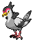

#520 - Tranquill
<table cellspacing="0" cellpadding="0"><tr><th colspan="1" align="center"></th><th colspan="1" align="center">Type</th><th colspan="1" align="center">Ability</th></tr><tr><td align="center";rowspan="1"></td><td align="center";rowspan="1"> </td><td rowspan="1">(1) Unaware   (2) Super Luck   (HA) Rivalry</td></tr><tr><th colspan="3" align="center">Defenses</th></tr><tr><td align="right">Immune:</td><td colspan="2"></td></tr><tr><td align="right">0.25x Resist:</td><td colspan="2"></td></tr><tr><td align="right">0.5x Resist:</td><td colspan="2"></td></tr><tr><td align="right">Neutral:</td><td colspan="2"></td></tr><tr><td align="right">2x Weak:</td><td colspan="2"></td></tr><tr><td align="right">4x Weak:</td><td colspan="2"></td></tr></table>

## Evolutions
<table>
<tr><td rowspan="1"style="vertical-align: middle;">    <a href="../519">Pidove</a> </td><td rowspan="1"style="vertical-align: middle; word-break:break-all;">Level 21</td><td rowspan="1"style="vertical-align: middle;">    <a href="../520">Tranquill</a> </td><td rowspan="1"style="vertical-align: middle; word-break:break-all;">Level 32</td><td rowspan="1"style="vertical-align: middle;">    <a href="../521">Unfezant</a> </td></tr>
</table>

## Stats
<table class="stat"><tr><td class="stat-icon-single"></td><td  class="stat-single">            <u>HP                +3</u>                     65</td><td  class="stat-single">            <u>ATK                -27</u>                     50</td><td  class="stat-single">            <u>DEF                +3</u>                     65</td><td  class="stat-single">            <u>SPA                +27</u>                     77</td><td class="stat-single"><u>SPD</u> 42</td><td  class="stat-single">            <u>SPE                +1</u>                     66</td><td  class="stat-single">            <u>BST                +7</u>                     365</td></tr></table>

## Level Up Moves
<table><th>Level</th><th>Name</th><th>Power</th><th>Accuracy</th><th>PP</th><th>Type</th><th>Damage Class</th><th>Effect</th>
<tr><td>1</td><td>Growl</td><td>None</td><td>100</td><td>40</td><td></td><td></td><td>Priority: 0. Lowers the target's Attack by one stage.</td></tr>
<tr><td>1</td><td>Gust</td><td>40</td><td>100</td><td>25</td><td></td><td></td><td>Priority: 0. Inflicts regular damage.  If the target is under the effect of bounce, fly, or sky drop, this move will hit with double power.</td></tr>
<tr><td>1</td><td>Mud-Slap</td><td>30</td><td>100</td><td>20</td><td></td><td></td><td>Priority: 0. Has a 100% chance to lower the target's accuracy by one stage.</td></tr>
<tr><td>4</td><td>Leer</td><td>None</td><td>100</td><td>30</td><td></td><td></td><td>Priority: 0. Lowers the target's Defense by one stage.</td></tr>
<tr><td>6</td><td>Quick Attack</td><td>40</td><td>100</td><td>20</td><td></td><td></td><td>Priority: 1. Inflicts regular damage.</td></tr>
<tr><td>8</td><td>Hypnosis</td><td>None</td><td>60</td><td>20</td><td></td><td></td><td>Priority: 0. Puts the target to sleep.</td></tr>
<tr><td>10</td><td>Swift</td><td>60</td><td>None</td><td>20</td><td></td><td></td><td>Priority: 0. Ignores accuracy and evasion modifiers.</td></tr>
<tr><td>12</td><td>Air Cutter</td><td>60</td><td>95</td><td>15</td><td></td><td></td><td>Priority: 0. User's critical hit rate is one level higher when using this move.</td></tr>
<tr><td>14</td><td>Taunt</td><td>None</td><td>100</td><td>20</td><td></td><td></td><td>Priority: 0. Target is forced to only use damaging moves for the next 3–5 turns, selected at random.</td></tr>
<tr><td>16</td><td>Focus Energy</td><td>None</td><td>None</td><td>20</td><td></td><td></td><td>Priority: 0. User's critical hit rate is two levels higher until it leaves the field.  If the user has already used focus energy since entering the field, this move will fail.  This effect is passed on by baton pass.</td></tr>
<tr><td>18</td><td>Tailwind</td><td>None</td><td>None</td><td>15</td><td></td><td></td><td>Priority: 0. For the next three turns, all Pokémon on the user's side of the field have their original Speed doubled.  This effect remains if the user leaves the field.</td></tr>
<tr><td>21</td><td>Uproar</td><td>90</td><td>100</td><td>10</td><td></td><td></td><td>Priority: 0. User is forced to use this move for 2–5 turns, selected at random. No Pokemon can sleep during the effect of this move. </td></tr>
<tr><td>22</td><td>Morning Sun</td><td>None</td><td>None</td><td>5</td><td></td><td></td><td>Priority: 0. Heals the user for half its max HP.  During sunny day, the healing is increased to 2/3 max HP.  During hail, rain dance, or sandstorm, the healing is decreased to 1/4 max HP.</td></tr>
<tr><td>25</td><td>Dual Wingbeat</td><td>40</td><td>90</td><td>10</td><td></td><td></td><td>Priority: 0. Inflicts regular damage.</td></tr>
<tr><td>28</td><td>Wish</td><td>None</td><td>None</td><td>10</td><td></td><td></td><td>Priority: 0. At the end of the next turn, user will be healed for half its max HP.  If the user is switched out, its replacement will be healed instead for half of the user's max HP.  If the user faints or is forcefully switched by roar or whirlwind, this effect will not activate.</td></tr>
<tr><td>32</td><td>Steel Wing</td><td>70</td><td>90</td><td>25</td><td></td><td></td><td>Priority: 0. Has a 10% chance to raise the user's Defense one stage.</td></tr>
<tr><td>36</td><td>Air Slash</td><td>75</td><td>95</td><td>10</td><td></td><td></td><td>Priority: 0. Has a 30% chance to make the target flinch.</td></tr>
<tr><td>40</td><td>Lucky Chant</td><td>None</td><td>None</td><td>30</td><td></td><td></td><td>Priority: 0. For five turns, opposing Pokémon cannot score critical hits.</td></tr>
<tr><td>44</td><td>Agility</td><td>None</td><td>None</td><td>30</td><td></td><td></td><td>Priority: 0. Raises the user's Speed by two stages.</td></tr>
<tr><td>48</td><td>Detect</td><td>None</td><td>None</td><td>5</td><td></td><td></td><td>Priority: 4. No moves will hit the user for the remainder of this turn.  If the user is last to act this turn, this move will fail.  If the user successfully used detect, endure, protect, quick guard, or wide guard on the last turn, this move has a 50% chance to fail.</td></tr>
<tr><td>52</td><td>Brave Bird</td><td>120</td><td>100</td><td>15</td><td></td><td></td><td>Priority: 0. User takes 1/3 the damage it inflicts in recoil.</td></tr>
<tr><td>56</td><td>Sky Attack</td><td>140</td><td>90</td><td>5</td><td></td><td></td><td>Priority: 0. User charges for one turn before attacking.  Critical hit chance is one level higher than normal.  Has a 30% chance to make the target flinch.  This move cannot be selected by sleep talk.</td></tr>
</table>

## TM Moves
<table><th>Machine</th><th>Name</th><th>Power</th><th>Accuracy</th><th>PP</th><th>Type</th><th>Damage Class</th><th>Effect</th>
<tr><td>TM6</td><td>Toxic</td><td>None</td><td>90</td><td>10</td><td></td><td></td><td>Priority: 0. Badly poisons the target.  Never misses when used by a poison-type Pokémon.</td></tr>
<tr><td>TM10</td><td>Hidden Power</td><td>60</td><td>100</td><td>15</td><td></td><td></td><td>Priority: 0. Power and type depend upon user's IVs. Power can range from 30 to 70.</td></tr>
<tr><td>TM11</td><td>Sunny Day</td><td>None</td><td>None</td><td>5</td><td></td><td></td><td>Priority: 0. Changes the weather to sunshine for five turns.</td></tr>
<tr><td>TM12</td><td>Taunt</td><td>None</td><td>100</td><td>20</td><td></td><td></td><td>Priority: 0. Target is forced to only use damaging moves for the next 3–5 turns, selected at random.</td></tr>
<tr><td>TM17</td><td>Protect</td><td>None</td><td>None</td><td>10</td><td></td><td></td><td>Priority: 4. No moves will hit the user for the remainder of this turn. If the user is last to act this turn, this move will fail. Success rate drops by 1/2 on successive attempts.</td></tr>
<tr><td>TM18</td><td>Rain Dance</td><td>None</td><td>None</td><td>5</td><td></td><td></td><td>Priority: 0. Changes the weather to rain for five turns, during which water moves inflict 50% extra damage, and fire moves inflict half damage.</td></tr>
<tr><td>TM21</td><td>Frustration</td><td>None</td><td>100</td><td>20</td><td></td><td></td><td>Priority: 0. Power increases inversely with happiness, given by `(255 - happiness) * 2 / 5`, to a maximum of 102.  Power bottoms out at 1.</td></tr>
<tr><td>TM27</td><td>Return</td><td>None</td><td>100</td><td>20</td><td></td><td></td><td>Priority: 0. Power increases with happiness, given by `happiness * 2 / 5`, to a maximum of 102.  Power bottoms out at 1.</td></tr>
<tr><td>TM40</td><td>Aerial Ace</td><td>60</td><td>None</td><td>20</td><td></td><td></td><td>Priority: 0. Ignores accuracy and evasion modifiers.</td></tr>
<tr><td>TM42</td><td>Facade</td><td>70</td><td>100</td><td>20</td><td></td><td></td><td>Priority: 0. If the user is burned, paralyzed, or poisoned, this move has double power.</td></tr>
<tr><td>TM44</td><td>Rest</td><td>None</td><td>None</td><td>10</td><td></td><td></td><td>Priority: 0. User falls to sleep for two turns, replacing any existing non-volatile status ailments, and immediately regains all its HP.</td></tr>
<tr><td>TM49</td><td>Echoed Voice</td><td>50</td><td>100</td><td>15</td><td></td><td></td><td>Priority: 0. If any friendly Pokémon used this move earlier this turn or on the previous turn, that use's power is added to this move's power, to a maximum of 200.</td></tr>
<tr><td>TM58</td><td>Hurricane</td><td>110</td><td>80</td><td>5</td><td></td><td></td><td>Priority: 0. Has a 30% chance to confuse the target.  This move can hit Pokémon under the effect of bounce, fly, or sky drop.  During rain dance, this move has 100% accuracy.  During sunny day, this move has 50% accuracy.</td></tr>
<tr><td>TM83</td><td>Work Up</td><td>None</td><td>None</td><td>30</td><td></td><td></td><td>Priority: 0. Raises the user's Attack and Special Attack by one stage each.</td></tr>
<tr><td>TM88</td><td>Pluck</td><td>60</td><td>100</td><td>20</td><td></td><td></td><td>Priority: 0. If the target is holding a berry, this move has double power, and the user takes the berry and uses it immediately.  If the target is holding a jaboca berry or rowap berry, the berry is still removed, but has no effect.  If this move is super effective and the target is holding a berry that can reduce this move's damage, it will do so, and will not be stolen.</td></tr>
<tr><td>TM89</td><td>U-turn</td><td>70</td><td>100</td><td>20</td><td></td><td></td><td>Priority: 0. Inflicts regular damage, then the user immediately switches out, and the trainer selects a replacement Pokémon from the party.  If the target faints from this attack, the user's trainer selects the new Pokémon to send out first.  If the user is the last Pokémon in its party that can battle, it will not switch out.  The user may be hit by pursuit when it switches out, if it has been targeted and pursuit has not yet been used.  This move may be used even if the user is under the effect of ingrain.</td></tr>
<tr><td>TM90</td><td>Substitute</td><td>None</td><td>None</td><td>10</td><td></td><td></td><td>Priority: 0. Transfers 1/4 the user's max HP into a doll that absorbs damage and causes most negative move effects to fail.</td></tr>
<tr><td>HM2</td><td>Fly</td><td>80</td><td>100</td><td>15</td><td></td><td></td><td>Priority: 0. User flies high into the air for one turn, becoming immune to attack, and hits on the second turn.  During the immune turn, gust (2x dmg), hurricane, sky uppercut, smack down, thunder, twister (2x dmg), and whirlwind still hit the user normally.  Gust and twister also have double power against the user.  The damage from hail and sandstorm still applies during the immune turn.  The user may be hit under the effect of lock on, mind reader, or no guard.  This move cannot be used while gravity is in effect.  This move cannot be selected by sleep talk.</td></tr>
</table>

## Tutor Moves
<table><th>Name</th><th>Power</th><th>Accuracy</th><th>PP</th><th>Type</th><th>Damage Class</th><th>Effect</th>
<tr><td>Heat Wave</td><td>100</td><td>90</td><td>10</td><td></td><td></td><td>Priority: 0. Has a 10% chance to burn the target.</td></tr>
<tr><td>Roost</td><td>None</td><td>None</td><td>10</td><td></td><td></td><td>Priority: 0. Heals the user for half its max HP.  If the user is flying, its flying type is ignored until the end of this turn.</td></tr>
<tr><td>Sky Attack</td><td>140</td><td>90</td><td>5</td><td></td><td></td><td>Priority: 0. User charges for one turn before attacking.  Critical hit chance is one level higher than normal.  Has a 30% chance to make the target flinch.  This move cannot be selected by sleep talk.</td></tr>
<tr><td>Sleep Talk</td><td>None</td><td>None</td><td>10</td><td></td><td></td><td>Priority: 0. Only usable if the user is sleeping. Randomly selects and uses one of the user's other three moves. Use of the selected move requires and costs 0 PP.</td></tr>
<tr><td>Snore</td><td>50</td><td>100</td><td>15</td><td></td><td></td><td>Priority: 0. Only usable if the user is sleeping.   Has a 30% chance to make the target flinch.</td></tr>
<tr><td>Tailwind</td><td>None</td><td>None</td><td>15</td><td></td><td></td><td>Priority: 0. For the next three turns, all Pokémon on the user's side of the field have their original Speed doubled.  This effect remains if the user leaves the field.</td></tr>
<tr><td>Uproar</td><td>90</td><td>100</td><td>10</td><td></td><td></td><td>Priority: 0. User is forced to use this move for 2–5 turns, selected at random. No Pokemon can sleep during the effect of this move. </td></tr>
</table>

## Encounter Locations

| Location | &nbsp; | &nbsp; | Level | Spawn Percent |
|: -- :|: -- :|: -- :|: -- :|: -- :|
| [Dragonspiral Tower] | Spring, Summer, Autumn | Dark Grass (Doubles) | 67 | 20.0 |
| [Dragonspiral Tower] | Spring, Summer, Autumn | Dark Grass (Doubles) | 68 | 20.0 |
| [Dragonspiral Tower] | Spring, Summer, Autumn | Grass | 63 | 20.0 |
| [Dragonspiral Tower] | Spring, Summer, Autumn | Grass | 64 | 20.0 |
| [Route 3] | Dark Grass (Doubles) | &nbsp; | 68 | 20.0 |
| [Route 3] | Grass | &nbsp; | 64 | 20.0 |
| [Route 6] | Spring, Summer, Autumn | Dark Grass (Doubles) | 32-36 | 10.0 |
| [Route 6] | Spring, Summer, Autumn | Grass | 32-36 | 5.0 |
| [Victory Road] | Lower Mountainside | Dark Grass (Doubles) | 60-65 | 20.0 |
| [Victory Road] | Lower Mountainside | Grass | 59-62 | 20.0 |

--8<-- "includes/abilities.md"

[Dragonspiral Tower]: ../../wildareas/Dragonspiral_Tower/
[Route 3]: ../../wildareas/Route_3/
[Route 6]: ../../wildareas/Route_6/
[Victory Road]: ../../wildareas/Victory_Road/
