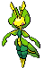

#542 - Leavanny
<table cellspacing="0" cellpadding="0"><tr><th colspan="1" align="center"></th><th colspan="1" align="center">Type</th><th colspan="1" align="center">Ability</th></tr><tr><td align="center";rowspan="1"></td><td align="center";rowspan="1"> </td><td rowspan="1">(1) Swarm   (2) Chlorophyll   (HA) Overcoat</td></tr><tr><th colspan="3" align="center">Defenses</th></tr><tr><td align="right">Immune:</td><td colspan="2"></td></tr><tr><td align="right">0.25x Resist:</td><td colspan="2"></td></tr><tr><td align="right">0.5x Resist:</td><td colspan="2"></td></tr><tr><td align="right">Neutral:</td><td colspan="2"></td></tr><tr><td align="right">2x Weak:</td><td colspan="2"></td></tr><tr><td align="right">4x Weak:</td><td colspan="2"></td></tr></table>

## Evolutions
<table>
<tr><td rowspan="1"style="vertical-align: middle;">    <a href="../540">Sewaddle</a> </td><td rowspan="1"style="vertical-align: middle; word-break:break-all;">Level 21</td><td rowspan="1"style="vertical-align: middle;">    <a href="../541">Swadloon</a> </td><td rowspan="1"style="vertical-align: middle; word-break:break-all;">Happiness</td><td rowspan="1"style="vertical-align: middle;">    <a href="../542">Leavanny</a> </td></tr>
</table>

## Stats
<table class="stat"><tr><td class="stat-icon-single"></td><td class="stat-single"><u>HP</u> 75</td><td class="stat-single"><u>ATK</u> 103</td><td class="stat-single"><u>DEF</u> 80</td><td class="stat-single"><u>SPA</u> 70</td><td  class="stat-single">            <u>SPD                +10</u>                     80</td><td class="stat-single"><u>SPE</u> 92</td><td  class="stat-single">            <u>BST                +10</u>                     500</td></tr></table>

## Wild Hold Items
- 5%: Mental Herb

## Level Up Moves
<table><th>Level</th><th>Name</th><th>Power</th><th>Accuracy</th><th>PP</th><th>Type</th><th>Damage Class</th><th>Effect</th>
<tr><td>1</td><td>String Shot</td><td>None</td><td>95</td><td>40</td><td></td><td></td><td>Priority: 0. Lowers the target's Speed by two stages.</td></tr>
<tr><td>1</td><td>Synthesis</td><td>None</td><td>None</td><td>5</td><td></td><td></td><td>Priority: 0. Heals the user for half its max HP, plus modifiers from weather.</td></tr>
<tr><td>1</td><td>Tackle</td><td>50</td><td>100</td><td>30</td><td></td><td></td><td>Priority: 0. Inflicts regular damage.</td></tr>
<tr><td>4</td><td>Struggle Bug</td><td>50</td><td>100</td><td>20</td><td></td><td></td><td>Priority: 0. Has a 100% chance to lower the target's Special Attack by one stage.</td></tr>
<tr><td>7</td><td>Electroweb</td><td>55</td><td>95</td><td>15</td><td></td><td></td><td>Priority: 0. Lowers the target's Speed by one stage.</td></tr>
<tr><td>9</td><td>Razor Leaf</td><td>55</td><td>95</td><td>25</td><td></td><td></td><td>Priority: 0. User's critical hit rate is one level higher when using this move.</td></tr>
<tr><td>11</td><td>Bug Bite</td><td>60</td><td>100</td><td>20</td><td></td><td></td><td>Priority: 0. If the target is holding a berry, the user takes the berry and uses it immediately.  If the target is holding a jaboca berry or rowap berry, the berry is still removed, but has no effect.  If this move is super effective and the target is holding a berry that can reduce this move's damage, it will do so, and will not be stolen.</td></tr>
<tr><td>14</td><td>Hone Claws</td><td>None</td><td>None</td><td>15</td><td></td><td></td><td>Priority: 0. Raises the user's Attack and accuracy by one stage.</td></tr>
<tr><td>17</td><td>Worry Seed</td><td>None</td><td>100</td><td>10</td><td></td><td></td><td>Priority: 0. Changes the target's ability to insomnia.  If the target's ability is truant or multitype, this move will fail.</td></tr>
<tr><td>20</td><td>Psychic Fangs</td><td>85</td><td>100</td><td>10</td><td></td><td></td><td>Priority: 0. Destroys any light screen or reflect on the target's side of the field, then inflicts regular damage.</td></tr>
<tr><td>22</td><td>Silver Wind</td><td>60</td><td>100</td><td>5</td><td></td><td></td><td>Priority: 0. Has a 10% chance to raise all of the user's stats one stage.</td></tr>
<tr><td>24</td><td>Air Slash</td><td>75</td><td>95</td><td>10</td><td></td><td></td><td>Priority: 0. Has a 30% chance to make the target flinch.</td></tr>
<tr><td>26</td><td>Night Slash</td><td>70</td><td>100</td><td>15</td><td></td><td></td><td>Priority: 0. User's critical hit rate is one level higher when using this move.</td></tr>
<tr><td>26</td><td>Slash</td><td>70</td><td>100</td><td>15</td><td></td><td></td><td>Priority: 0. User's critical hit rate is one level higher when using this move.</td></tr>
<tr><td>29</td><td>Helping Hand</td><td>None</td><td>None</td><td>20</td><td></td><td></td><td>Priority: 5. Boosts the power of the target's moves by 50% until the end of this turn.  This move cannot be copied by mirror move, nor selected by assist or metronome.</td></tr>
<tr><td>32</td><td>Grass Whistle</td><td>None</td><td>65</td><td>15</td><td></td><td></td><td>Priority: 0. Puts the target to sleep.</td></tr>
<tr><td>36</td><td>Me First</td><td>None</td><td>None</td><td>20</td><td></td><td></td><td>Priority: 0. If the target has selected a damaging move this turn, the user will copy that move and use it against the target, with a 50% increase in power.  If the target moves before the user, this move will fail.</td></tr>
<tr><td>40</td><td>Leaf Blade</td><td>90</td><td>100</td><td>15</td><td></td><td></td><td>Priority: 0. User's critical hit rate is one level higher when using this move.</td></tr>
<tr><td>44</td><td>Agility</td><td>None</td><td>None</td><td>30</td><td></td><td></td><td>Priority: 0. Raises the user's Speed by two stages.</td></tr>
<tr><td>48</td><td>Lunge</td><td>80</td><td>100</td><td>15</td><td></td><td></td><td>Priority: 0. Lowers the target's Attack by one stage.</td></tr>
<tr><td>52</td><td>Heal Bell</td><td>None</td><td>None</td><td>5</td><td></td><td></td><td>Priority: 0. Removes major status effects and confusion from every Pokémon in the user's party.</td></tr>
<tr><td>56</td><td>Camouflage</td><td>None</td><td>None</td><td>20</td><td></td><td></td><td>Priority: 0. User's type changes according to the terrain.  Terrain        | New type -------------- | -------------- Building       | normal Cave           | rock Desert         | ground Grass          | grass Mountain       | rock Ocean          | water Pond           | water Road           | ground Snow           | ice Tall grass     | grass  In Pokémon Battle Revolution:  Terrain        | New type -------------- | -------------- Courtyard      | normal Crystal        | rock Gateway        | water Magma          | rock Main Street    | normal Neon           | normal Stargazer      | rock Sunny Park     | grass Sunset         | ground Waterfall      | grass</td></tr>
<tr><td>60</td><td>Entrainment</td><td>None</td><td>100</td><td>15</td><td></td><td></td><td>Priority: 0. Changes the target's ability to match the user's.  This effect ends when the target leaves battle.</td></tr>
<tr><td>64</td><td>Baton Pass</td><td>None</td><td>None</td><td>40</td><td></td><td></td><td>Priority: 0. User switches out, and the trainer selects a replacement Pokémon from the party.  Stat changes, confusion, and persistent move effects are passed along to the replacement Pokémon.  The following move effects are passed:  * aqua ring * both the user's and target's effect of block, mean look, and spider web * the curse effect of curse * embargo * focus energy or an activated lansat berry * gastro acid * ingrain * being sapped by leech seed * being targeted by lock on or mind reader * magnet rise * perish song's counter * power trick * substitute; the doll's HP is unchanged  The replacement Pokémon does not trigger effects that respond to Pokémon switching in.</td></tr>
</table>

## TM Moves
<table><th>Machine</th><th>Name</th><th>Power</th><th>Accuracy</th><th>PP</th><th>Type</th><th>Damage Class</th><th>Effect</th>
<tr><td>TM1</td><td>Hone Claws</td><td>None</td><td>None</td><td>15</td><td></td><td></td><td>Priority: 0. Raises the user's Attack and accuracy by one stage.</td></tr>
<tr><td>TM4</td><td>Calm Mind</td><td>None</td><td>None</td><td>10</td><td></td><td></td><td>Priority: 0. Raises the user's Special Attack and Special Defense by one stage each.</td></tr>
<tr><td>TM6</td><td>Toxic</td><td>None</td><td>90</td><td>10</td><td></td><td></td><td>Priority: 0. Badly poisons the target.  Never misses when used by a poison-type Pokémon.</td></tr>
<tr><td>TM10</td><td>Hidden Power</td><td>60</td><td>100</td><td>15</td><td></td><td></td><td>Priority: 0. Power and type depend upon user's IVs. Power can range from 30 to 70.</td></tr>
<tr><td>TM11</td><td>Sunny Day</td><td>None</td><td>None</td><td>5</td><td></td><td></td><td>Priority: 0. Changes the weather to sunshine for five turns.</td></tr>
<tr><td>TM15</td><td>Hyper Beam</td><td>150</td><td>90</td><td>5</td><td></td><td></td><td>Priority: 0. User loses its next turn to "recharge", and cannot attack or switch out during that turn.</td></tr>
<tr><td>TM16</td><td>Light Screen</td><td>None</td><td>None</td><td>30</td><td></td><td></td><td>Priority: 0. Reduces damage from special attacks by half for five turns. In double battles, the reduction is 1/3.</td></tr>
<tr><td>TM17</td><td>Protect</td><td>None</td><td>None</td><td>10</td><td></td><td></td><td>Priority: 4. No moves will hit the user for the remainder of this turn. If the user is last to act this turn, this move will fail. Success rate drops by 1/2 on successive attempts.</td></tr>
<tr><td>TM19</td><td>Giga Drain</td><td>80</td><td>100</td><td>10</td><td></td><td></td><td>Priority: 0. Drains half the damage inflicted to heal the user.</td></tr>
<tr><td>TM21</td><td>Frustration</td><td>None</td><td>100</td><td>20</td><td></td><td></td><td>Priority: 0. Power increases inversely with happiness, given by `(255 - happiness) * 2 / 5`, to a maximum of 102.  Power bottoms out at 1.</td></tr>
<tr><td>TM22</td><td>Solar Beam</td><td>120</td><td>100</td><td>10</td><td></td><td></td><td>Priority: 0. User charges for one turn before attacking.</td></tr>
<tr><td>TM27</td><td>Return</td><td>None</td><td>100</td><td>20</td><td></td><td></td><td>Priority: 0. Power increases with happiness, given by `happiness * 2 / 5`, to a maximum of 102.  Power bottoms out at 1.</td></tr>
<tr><td>TM33</td><td>Reflect</td><td>None</td><td>None</td><td>20</td><td></td><td></td><td>Priority: 0. Reduces damage from physical attacks by half for five turns. In double battles, the reduction is 1/3.</td></tr>
<tr><td>TM40</td><td>Aerial Ace</td><td>60</td><td>None</td><td>20</td><td></td><td></td><td>Priority: 0. Ignores accuracy and evasion modifiers.</td></tr>
<tr><td>TM41</td><td>Infestation</td><td>20</td><td>100</td><td>20</td><td></td><td></td><td>Priority: 0. For the next 2–5 turns, the target cannot leave the field and is damaged for 1/16 its max HP at the end of each turn.  The user continues to use other moves during this time.  If the user leaves the field, this effect ends.  Has a 3/8 chance each to hit 2 or 3 times, and a 1/8 chance each to hit 4 or 5 times.  Averages to 3 hits per use.</td></tr>
<tr><td>TM42</td><td>Facade</td><td>70</td><td>100</td><td>20</td><td></td><td></td><td>Priority: 0. If the user is burned, paralyzed, or poisoned, this move has double power.</td></tr>
<tr><td>TM44</td><td>Rest</td><td>None</td><td>None</td><td>10</td><td></td><td></td><td>Priority: 0. User falls to sleep for two turns, replacing any existing non-volatile status ailments, and immediately regains all its HP.</td></tr>
<tr><td>TM53</td><td>Energy Ball</td><td>90</td><td>100</td><td>10</td><td></td><td></td><td>Priority: 0. Has a 10% chance to lower the target's Special Defense by one stage.</td></tr>
<tr><td>TM54</td><td>False Swipe</td><td>40</td><td>100</td><td>30</td><td></td><td></td><td>Priority: 0. Will not reduce the target's HP below 1.</td></tr>
<tr><td>TM65</td><td>Shadow Claw</td><td>70</td><td>100</td><td>90</td><td></td><td></td><td>Priority: 0. User's critical hit rate is one level higher when using this move.</td></tr>
<tr><td>TM67</td><td>Retaliate</td><td>70</td><td>100</td><td>5</td><td></td><td></td><td>Priority: 0. If a friendly Pokémon fainted on the previous turn, this move has double power.</td></tr>
<tr><td>TM68</td><td>Giga Impact</td><td>150</td><td>90</td><td>5</td><td></td><td></td><td>Priority: 0. User loses its next turn to "recharge", and cannot attack or switch out during that turn.</td></tr>
<tr><td>TM70</td><td>Flash</td><td>None</td><td>100</td><td>20</td><td></td><td></td><td>Priority: 0. Lowers the target's accuracy by one stage.</td></tr>
<tr><td>TM75</td><td>Swords Dance</td><td>None</td><td>None</td><td>20</td><td></td><td></td><td>Priority: 0. Raises the user's Attack by two stages.</td></tr>
<tr><td>TM76</td><td>Bug Buzz</td><td>90</td><td>100</td><td>10</td><td></td><td></td><td>Priority: 0. Has a 10% chance to lower the target's Special Defense by one stage.</td></tr>
<tr><td>TM81</td><td>X-Scissor</td><td>80</td><td>100</td><td>10</td><td></td><td></td><td>Priority: 0. The user's critical hit rate is boosted one stage when using this move.</td></tr>
<tr><td>TM84</td><td>Poison Jab</td><td>80</td><td>100</td><td>10</td><td></td><td></td><td>Priority: 0. Has a 30% chance to poison the target.</td></tr>
<tr><td>TM85</td><td>Play Rough</td><td>90</td><td>90</td><td>10</td><td></td><td></td><td>Priority: 0. Has a 10% chance to lower the target's Attack by one stage.</td></tr>
<tr><td>TM86</td><td>Grass Knot</td><td>None</td><td>100</td><td>20</td><td></td><td></td><td>Priority: 0. Power increases with the target's weight in kilograms, to a maximum of 120.</td></tr>
<tr><td>TM90</td><td>Substitute</td><td>None</td><td>None</td><td>10</td><td></td><td></td><td>Priority: 0. Transfers 1/4 the user's max HP into a doll that absorbs damage and causes most negative move effects to fail.</td></tr>
<tr><td>HM1</td><td>Cut</td><td>50</td><td>95</td><td>30</td><td></td><td></td><td>Priority: 0. High Critical Ratio</td></tr>
</table>

## Tutor Moves
<table><th>Name</th><th>Power</th><th>Accuracy</th><th>PP</th><th>Type</th><th>Damage Class</th><th>Effect</th>
<tr><td>Bug Bite</td><td>60</td><td>100</td><td>20</td><td></td><td></td><td>Priority: 0. If the target is holding a berry, the user takes the berry and uses it immediately.  If the target is holding a jaboca berry or rowap berry, the berry is still removed, but has no effect.  If this move is super effective and the target is holding a berry that can reduce this move's damage, it will do so, and will not be stolen.</td></tr>
<tr><td>Electroweb</td><td>55</td><td>95</td><td>15</td><td></td><td></td><td>Priority: 0. Lowers the target's Speed by one stage.</td></tr>
<tr><td>Giga Drain</td><td>80</td><td>100</td><td>10</td><td></td><td></td><td>Priority: 0. Drains half the damage inflicted to heal the user.</td></tr>
<tr><td>Heal Bell</td><td>None</td><td>None</td><td>5</td><td></td><td></td><td>Priority: 0. Removes major status effects and confusion from every Pokémon in the user's party.</td></tr>
<tr><td>Helping Hand</td><td>None</td><td>None</td><td>20</td><td></td><td></td><td>Priority: 5. Boosts the power of the target's moves by 50% until the end of this turn.  This move cannot be copied by mirror move, nor selected by assist or metronome.</td></tr>
<tr><td>Iron Defense</td><td>None</td><td>None</td><td>15</td><td></td><td></td><td>Priority: 0. Raises the user's Defense by two stages.</td></tr>
<tr><td>Knock Off</td><td>65</td><td>100</td><td>20</td><td></td><td></td><td>Priority: 0. Target loses its held item.</td></tr>
<tr><td>Magic Coat</td><td>None</td><td>None</td><td>15</td><td></td><td></td><td>Priority: 4. The first non-damaging move targeting the user this turn that inflicts major status effects, stat changes, or trapping effects will be reflected at its user.  defog, memento, and teeter dance are not reflected.  attract, flatter, gastro acid, leech seed, swagger, worry seed, and yawn are reflected.  This move cannot be copied by mirror move.</td></tr>
<tr><td>Seed Bomb</td><td>80</td><td>100</td><td>15</td><td></td><td></td><td>Priority: 0. Inflicts regular damage.</td></tr>
<tr><td>Signal Beam</td><td>75</td><td>100</td><td>15</td><td></td><td></td><td>Priority: 0. Has a 10% chance to confuse the target.</td></tr>
<tr><td>Sleep Talk</td><td>None</td><td>None</td><td>10</td><td></td><td></td><td>Priority: 0. Only usable if the user is sleeping. Randomly selects and uses one of the user's other three moves. Use of the selected move requires and costs 0 PP.</td></tr>
<tr><td>Snore</td><td>50</td><td>100</td><td>15</td><td></td><td></td><td>Priority: 0. Only usable if the user is sleeping.   Has a 30% chance to make the target flinch.</td></tr>
<tr><td>Synthesis</td><td>None</td><td>None</td><td>5</td><td></td><td></td><td>Priority: 0. Heals the user for half its max HP, plus modifiers from weather.</td></tr>
<tr><td>Worry Seed</td><td>None</td><td>100</td><td>10</td><td></td><td></td><td>Priority: 0. Changes the target's ability to insomnia.  If the target's ability is truant or multitype, this move will fail.</td></tr>
</table>

## Pre-Evolution Moves
| Species | Method | Move |
|: --- :|: --- :|: --- :|
| Sewaddle | Lvl 25 | Endure |
| Sewaddle | Lvl 43 | Flail |

--8<-- "includes/abilities.md"

