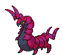

#544 - Whirlipede
<table cellspacing="0" cellpadding="0"><tr><th colspan="1" align="center"></th><th colspan="1" align="center">Type</th><th colspan="1" align="center">Ability</th></tr><tr><td align="center";rowspan="1"></td><td align="center";rowspan="1"> </td><td rowspan="1">(1) Speed Boost   (2) Poison Point   (HA) Swarm</td></tr><tr><th colspan="3" align="center">Defenses</th></tr><tr><td align="right">Immune:</td><td colspan="2"></td></tr><tr><td align="right">0.25x Resist:</td><td colspan="2"></td></tr><tr><td align="right">0.5x Resist:</td><td colspan="2"></td></tr><tr><td align="right">Neutral:</td><td colspan="2"></td></tr><tr><td align="right">2x Weak:</td><td colspan="2"></td></tr><tr><td align="right">4x Weak:</td><td colspan="2"></td></tr></table>

## Evolutions
<table>
<tr><td rowspan="1"style="vertical-align: middle;">    <a href="../543">Venipede</a> </td><td rowspan="1"style="vertical-align: middle; word-break:break-all;">Level 20</td><td rowspan="1"style="vertical-align: middle;">    <a href="../544">Whirlipede</a> </td><td rowspan="1"style="vertical-align: middle; word-break:break-all;">Level 30</td><td rowspan="1"style="vertical-align: middle;">    <a href="../545">Scolipede</a> </td></tr>
</table>

## Stats
<table class="stat"><tr><td class="stat-icon-single"></td><td class="stat-single"><u>HP</u> 40</td><td class="stat-single"><u>ATK</u> 55</td><td class="stat-single"><u>DEF</u> 99</td><td class="stat-single"><u>SPA</u> 40</td><td class="stat-single"><u>SPD</u> 79</td><td class="stat-single"><u>SPE</u> 47</td><td class="stat-single"><u>BST</u> 360</td></tr></table>

## Wild Hold Items
- 5%: Poison Barb

## Level Up Moves
<table><th>Level</th><th>Name</th><th>Power</th><th>Accuracy</th><th>PP</th><th>Type</th><th>Damage Class</th><th>Effect</th>
<tr><td>1</td><td>Defense Curl</td><td>None</td><td>None</td><td>40</td><td></td><td></td><td>Priority: 0. Raises user's Defense by one stage.  After this move is used, the power of ice ball and rollout are doubled until the user leaves the field.</td></tr>
<tr><td>1</td><td>Poison Sting</td><td>30</td><td>100</td><td>20</td><td></td><td></td><td>Priority: 0. Has a 30% chance to poison the target.</td></tr>
<tr><td>4</td><td>Rollout</td><td>40</td><td>90</td><td>20</td><td></td><td></td><td>Priority: 0. User is forced to use this move for five turns.  Power doubles every time this move is used in succession to a maximum of 16x, and resets to normal after the lock-in ends.</td></tr>
<tr><td>8</td><td>Protect</td><td>None</td><td>None</td><td>10</td><td></td><td></td><td>Priority: 4. No moves will hit the user for the remainder of this turn. If the user is last to act this turn, this move will fail. Success rate drops by 1/2 on successive attempts.</td></tr>
<tr><td>12</td><td>Poison Fang</td><td>65</td><td>95</td><td>15</td><td></td><td></td><td>Priority: 0. 50% chance to toxic poison target</td></tr>
<tr><td>14</td><td>Screech</td><td>None</td><td>85</td><td>40</td><td></td><td></td><td>Priority: 0. Lowers the target's Defense by two stages.</td></tr>
<tr><td>16</td><td>Bite</td><td>60</td><td>100</td><td>20</td><td></td><td></td><td>Priority: 0. Has a 30% chance to make the target flinch.</td></tr>
<tr><td>18</td><td>Bug Bite</td><td>60</td><td>100</td><td>20</td><td></td><td></td><td>Priority: 0. If the target is holding a berry, the user takes the berry and uses it immediately.  If the target is holding a jaboca berry or rowap berry, the berry is still removed, but has no effect.  If this move is super effective and the target is holding a berry that can reduce this move's damage, it will do so, and will not be stolen.</td></tr>
<tr><td>20</td><td>Coil</td><td>None</td><td>None</td><td>20</td><td></td><td></td><td>Priority: 0. Raises the user's Attack, Defense, and accuracy by one stage each.</td></tr>
<tr><td>20</td><td>Iron Defense</td><td>None</td><td>None</td><td>15</td><td></td><td></td><td>Priority: 0. Raises the user's Defense by two stages.</td></tr>
<tr><td>23</td><td>Fury Cutter</td><td>30</td><td>95</td><td>20</td><td></td><td></td><td>Priority: 0. Power doubles after every time this move is used, whether consecutively or not, maxing out at 16x.  If this move misses or the user leaves the field, power resets.</td></tr>
<tr><td>26</td><td>Payback</td><td>50</td><td>100</td><td>10</td><td></td><td></td><td>Priority: 0. If the target uses a move or switches out this turn before this move is used, this move has double power.</td></tr>
<tr><td>29</td><td>Pin Missile</td><td>25</td><td>95</td><td>20</td><td></td><td></td><td>Priority: 0. Hits 2–5 times in one turn.  Has a 3/8 chance each to hit 2 or 3 times, and a 1/8 chance each to hit 4 or 5 times.  Averages to 3 hits per use.</td></tr>
<tr><td>30</td><td>Agility</td><td>None</td><td>None</td><td>30</td><td></td><td></td><td>Priority: 0. Raises the user's Speed by two stages.</td></tr>
<tr><td>34</td><td>Spikes</td><td>None</td><td>None</td><td>20</td><td></td><td></td><td>Priority: 0. Scatters spikes around the opposing field, which damage opposing Pokémon that enter the field for 1/8 of their max HP.  Pokémon immune to ground moves are immune to this damage, except during gravity.  Up to three layers of spikes may be laid down, adding 1/16 to the damage done: two layers of spikes damage for 3/16 max HP, and three layers damage for 1/4 max HP.</td></tr>
<tr><td>34</td><td>Toxic Spikes</td><td>None</td><td>None</td><td>20</td><td></td><td></td><td>Priority: 0. Scatters poisoned spikes around the opposing field, which poison opposing Pokémon that enter the field.  A second layer of these spikes may be laid down, in which case Pokémon will be badly poisoned instead.  Pokémon immune to either ground moves or being poisoned are immune to this effect.  Pokémon otherwise immune to ground moves are affected during gravity.  If a poison Pokémon not immune to ground moves enters a field covered with poisoned spikes, the spikes are removed.  rapid spin will remove this effect from its user's side of the field.  defog will remove this effect from its target's side of the field.  This move does not trigger synchronize, unless the Pokémon with synchronize was forced to enter the field by another effect such as roar.  Pokémon entering the field due to baton pass are not affected by this effect.</td></tr>
<tr><td>38</td><td>Smart Strike</td><td>70</td><td>None</td><td>10</td><td></td><td></td><td>Priority: 0. Ignores accuracy and evasion modifiers.</td></tr>
<tr><td>42</td><td>Poison Tail</td><td>80</td><td>100</td><td>10</td><td></td><td></td><td>Priority: 0. User's critical hit rate is one level higher when using this move. Has a 10% chance to poison the target.</td></tr>
<tr><td>46</td><td>Steamroller</td><td>100</td><td>90</td><td>10</td><td></td><td></td><td>Priority: 0. Has a 30% chance to make the target flinch.  Power is doubled against Pokémon that have used minimize since entering the field.</td></tr>
<tr><td>50</td><td>Take Down</td><td>90</td><td>85</td><td>20</td><td></td><td></td><td>Priority: 0. User takes 1/4 the damage it inflicts in recoil.</td></tr>
<tr><td>55</td><td>Lunge</td><td>80</td><td>100</td><td>15</td><td></td><td></td><td>Priority: 0. Lowers the target's Attack by one stage.</td></tr>
</table>

## TM Moves
<table><th>Machine</th><th>Name</th><th>Power</th><th>Accuracy</th><th>PP</th><th>Type</th><th>Damage Class</th><th>Effect</th>
<tr><td>TM6</td><td>Toxic</td><td>None</td><td>90</td><td>10</td><td></td><td></td><td>Priority: 0. Badly poisons the target.  Never misses when used by a poison-type Pokémon.</td></tr>
<tr><td>TM9</td><td>Venoshock</td><td>65</td><td>100</td><td>15</td><td></td><td></td><td>Priority: 0. If the target is poisoned, this move has double power.</td></tr>
<tr><td>TM10</td><td>Hidden Power</td><td>60</td><td>100</td><td>15</td><td></td><td></td><td>Priority: 0. Power and type depend upon user's IVs. Power can range from 30 to 70.</td></tr>
<tr><td>TM11</td><td>Sunny Day</td><td>None</td><td>None</td><td>5</td><td></td><td></td><td>Priority: 0. Changes the weather to sunshine for five turns.</td></tr>
<tr><td>TM17</td><td>Protect</td><td>None</td><td>None</td><td>10</td><td></td><td></td><td>Priority: 4. No moves will hit the user for the remainder of this turn. If the user is last to act this turn, this move will fail. Success rate drops by 1/2 on successive attempts.</td></tr>
<tr><td>TM21</td><td>Frustration</td><td>None</td><td>100</td><td>20</td><td></td><td></td><td>Priority: 0. Power increases inversely with happiness, given by `(255 - happiness) * 2 / 5`, to a maximum of 102.  Power bottoms out at 1.</td></tr>
<tr><td>TM22</td><td>Solar Beam</td><td>120</td><td>100</td><td>10</td><td></td><td></td><td>Priority: 0. User charges for one turn before attacking.</td></tr>
<tr><td>TM27</td><td>Return</td><td>None</td><td>100</td><td>20</td><td></td><td></td><td>Priority: 0. Power increases with happiness, given by `happiness * 2 / 5`, to a maximum of 102.  Power bottoms out at 1.</td></tr>
<tr><td>TM36</td><td>Sludge Bomb</td><td>90</td><td>100</td><td>10</td><td></td><td></td><td>Priority: 0. Has a 30% chance to poison the target.</td></tr>
<tr><td>TM41</td><td>Infestation</td><td>20</td><td>100</td><td>20</td><td></td><td></td><td>Priority: 0. For the next 2–5 turns, the target cannot leave the field and is damaged for 1/16 its max HP at the end of each turn.  The user continues to use other moves during this time.  If the user leaves the field, this effect ends.  Has a 3/8 chance each to hit 2 or 3 times, and a 1/8 chance each to hit 4 or 5 times.  Averages to 3 hits per use.</td></tr>
<tr><td>TM42</td><td>Facade</td><td>70</td><td>100</td><td>20</td><td></td><td></td><td>Priority: 0. If the user is burned, paralyzed, or poisoned, this move has double power.</td></tr>
<tr><td>TM44</td><td>Rest</td><td>None</td><td>None</td><td>10</td><td></td><td></td><td>Priority: 0. User falls to sleep for two turns, replacing any existing non-volatile status ailments, and immediately regains all its HP.</td></tr>
<tr><td>TM74</td><td>Gyro Ball</td><td>None</td><td>100</td><td>5</td><td></td><td></td><td>Priority: 0. Power increases with the target's current Speed compared to the user, given by `1 + 25 * target Speed / user Speed`, capped at 150.</td></tr>
<tr><td>TM76</td><td>Bug Buzz</td><td>90</td><td>100</td><td>10</td><td></td><td></td><td>Priority: 0. Has a 10% chance to lower the target's Special Defense by one stage.</td></tr>
<tr><td>TM84</td><td>Poison Jab</td><td>80</td><td>100</td><td>10</td><td></td><td></td><td>Priority: 0. Has a 30% chance to poison the target.</td></tr>
<tr><td>TM87</td><td>Rock Climb</td><td>80</td><td>95</td><td>10</td><td></td><td></td><td>Priority: 0. Has a 20% chance to confuse the target.</td></tr>
<tr><td>TM90</td><td>Substitute</td><td>None</td><td>None</td><td>10</td><td></td><td></td><td>Priority: 0. Transfers 1/4 the user's max HP into a doll that absorbs damage and causes most negative move effects to fail.</td></tr>
<tr><td>TM94</td><td>Rock Smash</td><td>55</td><td>100</td><td>15</td><td></td><td></td><td>Priority: 0. 100% chance to drop target's Def by one stage. Also boosted by the ability Iron Fist</td></tr>
</table>

## Tutor Moves
<table><th>Name</th><th>Power</th><th>Accuracy</th><th>PP</th><th>Type</th><th>Damage Class</th><th>Effect</th>
<tr><td>Bug Bite</td><td>60</td><td>100</td><td>20</td><td></td><td></td><td>Priority: 0. If the target is holding a berry, the user takes the berry and uses it immediately.  If the target is holding a jaboca berry or rowap berry, the berry is still removed, but has no effect.  If this move is super effective and the target is holding a berry that can reduce this move's damage, it will do so, and will not be stolen.</td></tr>
<tr><td>Endeavor</td><td>None</td><td>100</td><td>5</td><td></td><td></td><td>Priority: 0. Inflicts exactly enough damage to lower the target's HP to equal the user's.  If the target's HP is not higher than the user's, this move has no effect.  Type immunity applies, but other type effects are ignored.  This effect counts as damage for moves that respond to damage.</td></tr>
<tr><td>Iron Defense</td><td>None</td><td>None</td><td>15</td><td></td><td></td><td>Priority: 0. Raises the user's Defense by two stages.</td></tr>
<tr><td>Sleep Talk</td><td>None</td><td>None</td><td>10</td><td></td><td></td><td>Priority: 0. Only usable if the user is sleeping. Randomly selects and uses one of the user's other three moves. Use of the selected move requires and costs 0 PP.</td></tr>
<tr><td>Snore</td><td>50</td><td>100</td><td>15</td><td></td><td></td><td>Priority: 0. Only usable if the user is sleeping.   Has a 30% chance to make the target flinch.</td></tr>
</table>

## Encounter Locations

| Location | &nbsp; | Level | Spawn Percent |
|: -- :|: -- :|: -- :|: -- :|
| [Pinwheel Forest - Inside] | Dark Grass (Doubles) | 68 | 20.0 |
| [Pinwheel Forest - Inside] | Grass | 64 | 20.0 |

--8<-- "includes/abilities.md"

[Pinwheel Forest - Inside]: ../../wildareas/Pinwheel_Forest_-_Inside/
