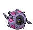

#545 - Scolipede
<table cellspacing="0" cellpadding="0"><tr><th colspan="1" align="center"></th><th colspan="1" align="center">Type</th><th colspan="1" align="center">Ability</th></tr><tr><td align="center";rowspan="1"></td><td align="center";rowspan="1"> </td><td rowspan="1">(1) Speed Boost   (2) Poison Point   (HA) Swarm</td></tr><tr><th colspan="3" align="center">Defenses</th></tr><tr><td align="right">Immune:</td><td colspan="2"></td></tr><tr><td align="right">0.25x Resist:</td><td colspan="2"></td></tr><tr><td align="right">0.5x Resist:</td><td colspan="2"></td></tr><tr><td align="right">Neutral:</td><td colspan="2"></td></tr><tr><td align="right">2x Weak:</td><td colspan="2"></td></tr><tr><td align="right">4x Weak:</td><td colspan="2"></td></tr></table>

## Evolutions
<table>
<tr><td rowspan="1"style="vertical-align: middle;">    <a href="../543">Venipede</a> </td><td rowspan="1"style="vertical-align: middle; word-break:break-all;">Level 20</td><td rowspan="1"style="vertical-align: middle;">    <a href="../544">Whirlipede</a> </td><td rowspan="1"style="vertical-align: middle; word-break:break-all;">Level 30</td><td rowspan="1"style="vertical-align: middle;">    <a href="../545">Scolipede</a> </td></tr>
</table>

## Stats
<table class="stat"><tr><td class="stat-icon-single"></td><td class="stat-single"><u>HP</u> 60</td><td  class="stat-single">            <u>ATK                +10</u>                     100</td><td class="stat-single"><u>DEF</u> 89</td><td class="stat-single"><u>SPA</u> 55</td><td class="stat-single"><u>SPD</u> 69</td><td class="stat-single"><u>SPE</u> 112</td><td  class="stat-single">            <u>BST                +10</u>                     485</td></tr></table>

## Wild Hold Items
- 5%: Poison Barb

## Level Up Moves
<table><th>Level</th><th>Name</th><th>Power</th><th>Accuracy</th><th>PP</th><th>Type</th><th>Damage Class</th><th>Effect</th>
<tr><td>1</td><td>Double-Edge</td><td>120</td><td>100</td><td>15</td><td></td><td></td><td>Priority: 0. User takes 1/3 the damage it inflicts in recoil.</td></tr>
<tr><td>1</td><td>Pursuit</td><td>40</td><td>100</td><td>20</td><td></td><td></td><td>Priority: 0. If the target attempts to switch out this turn before the user acts, this move hits the target before it leaves and has double power.  This effect can still hit a Pokémon that switches out when it has a substitute up or when an ally has used follow me.</td></tr>
<tr><td>4</td><td>Rollout</td><td>40</td><td>90</td><td>20</td><td></td><td></td><td>Priority: 0. User is forced to use this move for five turns.  Power doubles every time this move is used in succession to a maximum of 16x, and resets to normal after the lock-in ends.</td></tr>
<tr><td>8</td><td>Protect</td><td>None</td><td>None</td><td>10</td><td></td><td></td><td>Priority: 4. No moves will hit the user for the remainder of this turn. If the user is last to act this turn, this move will fail. Success rate drops by 1/2 on successive attempts.</td></tr>
<tr><td>12</td><td>Poison Fang</td><td>65</td><td>95</td><td>15</td><td></td><td></td><td>Priority: 0. 50% chance to toxic poison target</td></tr>
<tr><td>14</td><td>Screech</td><td>None</td><td>85</td><td>40</td><td></td><td></td><td>Priority: 0. Lowers the target's Defense by two stages.</td></tr>
<tr><td>16</td><td>Bite</td><td>60</td><td>100</td><td>20</td><td></td><td></td><td>Priority: 0. Has a 30% chance to make the target flinch.</td></tr>
<tr><td>18</td><td>Bug Bite</td><td>60</td><td>100</td><td>20</td><td></td><td></td><td>Priority: 0. If the target is holding a berry, the user takes the berry and uses it immediately.  If the target is holding a jaboca berry or rowap berry, the berry is still removed, but has no effect.  If this move is super effective and the target is holding a berry that can reduce this move's damage, it will do so, and will not be stolen.</td></tr>
<tr><td>20</td><td>Coil</td><td>None</td><td>None</td><td>20</td><td></td><td></td><td>Priority: 0. Raises the user's Attack, Defense, and accuracy by one stage each.</td></tr>
<tr><td>20</td><td>Iron Defense</td><td>None</td><td>None</td><td>15</td><td></td><td></td><td>Priority: 0. Raises the user's Defense by two stages.</td></tr>
<tr><td>23</td><td>Fury Cutter</td><td>30</td><td>95</td><td>20</td><td></td><td></td><td>Priority: 0. Power doubles after every time this move is used, whether consecutively or not, maxing out at 16x.  If this move misses or the user leaves the field, power resets.</td></tr>
<tr><td>27</td><td>Pin Missile</td><td>25</td><td>95</td><td>20</td><td></td><td></td><td>Priority: 0. Hits 2–5 times in one turn.  Has a 3/8 chance each to hit 2 or 3 times, and a 1/8 chance each to hit 4 or 5 times.  Averages to 3 hits per use.</td></tr>
<tr><td>30</td><td>Agility</td><td>None</td><td>None</td><td>30</td><td></td><td></td><td>Priority: 0. Raises the user's Speed by two stages.</td></tr>
<tr><td>32</td><td>Twineedle</td><td>40</td><td>100</td><td>20</td><td></td><td></td><td>Priority: 0. Hits twice in the same turn.  Has a 20% chance to poison the target.</td></tr>
<tr><td>36</td><td>Spikes</td><td>None</td><td>None</td><td>20</td><td></td><td></td><td>Priority: 0. Scatters spikes around the opposing field, which damage opposing Pokémon that enter the field for 1/8 of their max HP.  Pokémon immune to ground moves are immune to this damage, except during gravity.  Up to three layers of spikes may be laid down, adding 1/16 to the damage done: two layers of spikes damage for 3/16 max HP, and three layers damage for 1/4 max HP.</td></tr>
<tr><td>36</td><td>Toxic Spikes</td><td>None</td><td>None</td><td>20</td><td></td><td></td><td>Priority: 0. Scatters poisoned spikes around the opposing field, which poison opposing Pokémon that enter the field.  A second layer of these spikes may be laid down, in which case Pokémon will be badly poisoned instead.  Pokémon immune to either ground moves or being poisoned are immune to this effect.  Pokémon otherwise immune to ground moves are affected during gravity.  If a poison Pokémon not immune to ground moves enters a field covered with poisoned spikes, the spikes are removed.  rapid spin will remove this effect from its user's side of the field.  defog will remove this effect from its target's side of the field.  This move does not trigger synchronize, unless the Pokémon with synchronize was forced to enter the field by another effect such as roar.  Pokémon entering the field due to baton pass are not affected by this effect.</td></tr>
<tr><td>40</td><td>Smart Strike</td><td>70</td><td>None</td><td>10</td><td></td><td></td><td>Priority: 0. Ignores accuracy and evasion modifiers.</td></tr>
<tr><td>44</td><td>Poison Tail</td><td>80</td><td>100</td><td>10</td><td></td><td></td><td>Priority: 0. User's critical hit rate is one level higher when using this move. Has a 10% chance to poison the target.</td></tr>
<tr><td>48</td><td>Steamroller</td><td>100</td><td>90</td><td>10</td><td></td><td></td><td>Priority: 0. Has a 30% chance to make the target flinch.  Power is doubled against Pokémon that have used minimize since entering the field.</td></tr>
<tr><td>52</td><td>Take Down</td><td>90</td><td>85</td><td>20</td><td></td><td></td><td>Priority: 0. User takes 1/4 the damage it inflicts in recoil.</td></tr>
<tr><td>56</td><td>Cross Poison</td><td>90</td><td>100</td><td>15</td><td></td><td></td><td>Priority: 0. User's critical hit rate is one level higher when using this move. Has a 10% chance to poison the target.</td></tr>
<tr><td>60</td><td>Lunge</td><td>80</td><td>100</td><td>15</td><td></td><td></td><td>Priority: 0. Lowers the target's Attack by one stage.</td></tr>
<tr><td>64</td><td>Endeavor</td><td>None</td><td>100</td><td>5</td><td></td><td></td><td>Priority: 0. Inflicts exactly enough damage to lower the target's HP to equal the user's.  If the target's HP is not higher than the user's, this move has no effect.  Type immunity applies, but other type effects are ignored.  This effect counts as damage for moves that respond to damage.</td></tr>
<tr><td>68</td><td>Megahorn</td><td>120</td><td>85</td><td>10</td><td></td><td></td><td>Priority: 0. Inflicts regular damage.</td></tr>
<tr><td>72</td><td>Baton Pass</td><td>None</td><td>None</td><td>40</td><td></td><td></td><td>Priority: 0. User switches out, and the trainer selects a replacement Pokémon from the party.  Stat changes, confusion, and persistent move effects are passed along to the replacement Pokémon.  The following move effects are passed:  * aqua ring * both the user's and target's effect of block, mean look, and spider web * the curse effect of curse * embargo * focus energy or an activated lansat berry * gastro acid * ingrain * being sapped by leech seed * being targeted by lock on or mind reader * magnet rise * perish song's counter * power trick * substitute; the doll's HP is unchanged  The replacement Pokémon does not trigger effects that respond to Pokémon switching in.</td></tr>
</table>

## TM Moves
<table><th>Machine</th><th>Name</th><th>Power</th><th>Accuracy</th><th>PP</th><th>Type</th><th>Damage Class</th><th>Effect</th>
<tr><td>TM6</td><td>Toxic</td><td>None</td><td>90</td><td>10</td><td></td><td></td><td>Priority: 0. Badly poisons the target.  Never misses when used by a poison-type Pokémon.</td></tr>
<tr><td>TM9</td><td>Venoshock</td><td>65</td><td>100</td><td>15</td><td></td><td></td><td>Priority: 0. If the target is poisoned, this move has double power.</td></tr>
<tr><td>TM10</td><td>Hidden Power</td><td>60</td><td>100</td><td>15</td><td></td><td></td><td>Priority: 0. Power and type depend upon user's IVs. Power can range from 30 to 70.</td></tr>
<tr><td>TM11</td><td>Sunny Day</td><td>None</td><td>None</td><td>5</td><td></td><td></td><td>Priority: 0. Changes the weather to sunshine for five turns.</td></tr>
<tr><td>TM15</td><td>Hyper Beam</td><td>150</td><td>90</td><td>5</td><td></td><td></td><td>Priority: 0. User loses its next turn to "recharge", and cannot attack or switch out during that turn.</td></tr>
<tr><td>TM17</td><td>Protect</td><td>None</td><td>None</td><td>10</td><td></td><td></td><td>Priority: 4. No moves will hit the user for the remainder of this turn. If the user is last to act this turn, this move will fail. Success rate drops by 1/2 on successive attempts.</td></tr>
<tr><td>TM21</td><td>Frustration</td><td>None</td><td>100</td><td>20</td><td></td><td></td><td>Priority: 0. Power increases inversely with happiness, given by `(255 - happiness) * 2 / 5`, to a maximum of 102.  Power bottoms out at 1.</td></tr>
<tr><td>TM22</td><td>Solar Beam</td><td>120</td><td>100</td><td>10</td><td></td><td></td><td>Priority: 0. User charges for one turn before attacking.</td></tr>
<tr><td>TM26</td><td>Earthquake</td><td>100</td><td>100</td><td>10</td><td></td><td></td><td>Priority: 0. Inflicts regular damage.  If the target is in the first turn of dig, this move will hit with double power.</td></tr>
<tr><td>TM27</td><td>Return</td><td>None</td><td>100</td><td>20</td><td></td><td></td><td>Priority: 0. Power increases with happiness, given by `happiness * 2 / 5`, to a maximum of 102.  Power bottoms out at 1.</td></tr>
<tr><td>TM28</td><td>Dig</td><td>80</td><td>100</td><td>10</td><td></td><td></td><td>Priority: 0. User digs underground for one turn, becoming immune to attack, and hits on the second turn.  During the immune turn, earthquake, fissure, and magnitude still hit the user normally, and their power is doubled if appropriate.  The user may be hit during its immune turn if under the effect of lock on, mind reader, or no guard.  This move cannot be selected by sleep talk.</td></tr>
<tr><td>TM36</td><td>Sludge Bomb</td><td>90</td><td>100</td><td>10</td><td></td><td></td><td>Priority: 0. Has a 30% chance to poison the target.</td></tr>
<tr><td>TM39</td><td>Rock Tomb</td><td>60</td><td>95</td><td>15</td><td></td><td></td><td>Priority: 0. Has a 100% chance to lower the target's Speed by one stage.</td></tr>
<tr><td>TM41</td><td>Infestation</td><td>20</td><td>100</td><td>20</td><td></td><td></td><td>Priority: 0. For the next 2–5 turns, the target cannot leave the field and is damaged for 1/16 its max HP at the end of each turn.  The user continues to use other moves during this time.  If the user leaves the field, this effect ends.  Has a 3/8 chance each to hit 2 or 3 times, and a 1/8 chance each to hit 4 or 5 times.  Averages to 3 hits per use.</td></tr>
<tr><td>TM42</td><td>Facade</td><td>70</td><td>100</td><td>20</td><td></td><td></td><td>Priority: 0. If the user is burned, paralyzed, or poisoned, this move has double power.</td></tr>
<tr><td>TM44</td><td>Rest</td><td>None</td><td>None</td><td>10</td><td></td><td></td><td>Priority: 0. User falls to sleep for two turns, replacing any existing non-volatile status ailments, and immediately regains all its HP.</td></tr>
<tr><td>TM68</td><td>Giga Impact</td><td>150</td><td>90</td><td>5</td><td></td><td></td><td>Priority: 0. User loses its next turn to "recharge", and cannot attack or switch out during that turn.</td></tr>
<tr><td>TM74</td><td>Gyro Ball</td><td>None</td><td>100</td><td>5</td><td></td><td></td><td>Priority: 0. Power increases with the target's current Speed compared to the user, given by `1 + 25 * target Speed / user Speed`, capped at 150.</td></tr>
<tr><td>TM75</td><td>Swords Dance</td><td>None</td><td>None</td><td>20</td><td></td><td></td><td>Priority: 0. Raises the user's Attack by two stages.</td></tr>
<tr><td>TM76</td><td>Bug Buzz</td><td>90</td><td>100</td><td>10</td><td></td><td></td><td>Priority: 0. Has a 10% chance to lower the target's Special Defense by one stage.</td></tr>
<tr><td>TM78</td><td>Bulldoze</td><td>60</td><td>100</td><td>20</td><td></td><td></td><td>Priority: 0. Has a 100% chance to lower the target's Speed by one stage.</td></tr>
<tr><td>TM80</td><td>Rock Slide</td><td>75</td><td>90</td><td>10</td><td></td><td></td><td>Priority: 0. Has a 30% chance to make the target flinch.</td></tr>
<tr><td>TM81</td><td>X-Scissor</td><td>80</td><td>100</td><td>10</td><td></td><td></td><td>Priority: 0. The user's critical hit rate is boosted one stage when using this move.</td></tr>
<tr><td>TM83</td><td>Work Up</td><td>None</td><td>None</td><td>30</td><td></td><td></td><td>Priority: 0. Raises the user's Attack and Special Attack by one stage each.</td></tr>
<tr><td>TM84</td><td>Poison Jab</td><td>80</td><td>100</td><td>10</td><td></td><td></td><td>Priority: 0. Has a 30% chance to poison the target.</td></tr>
<tr><td>TM87</td><td>Rock Climb</td><td>80</td><td>95</td><td>10</td><td></td><td></td><td>Priority: 0. Has a 20% chance to confuse the target.</td></tr>
<tr><td>TM90</td><td>Substitute</td><td>None</td><td>None</td><td>10</td><td></td><td></td><td>Priority: 0. Transfers 1/4 the user's max HP into a doll that absorbs damage and causes most negative move effects to fail.</td></tr>
<tr><td>TM94</td><td>Rock Smash</td><td>55</td><td>100</td><td>15</td><td></td><td></td><td>Priority: 0. 100% chance to drop target's Def by one stage. Also boosted by the ability Iron Fist</td></tr>
<tr><td>HM1</td><td>Cut</td><td>50</td><td>95</td><td>30</td><td></td><td></td><td>Priority: 0. High Critical Ratio</td></tr>
<tr><td>HM4</td><td>Strength</td><td>85</td><td>100</td><td>10</td><td></td><td></td><td>Priority: 0. 10% Raise Attack</td></tr>
</table>

## Tutor Moves
<table><th>Name</th><th>Power</th><th>Accuracy</th><th>PP</th><th>Type</th><th>Damage Class</th><th>Effect</th>
<tr><td>Aqua Tail</td><td>100</td><td>85</td><td>10</td><td></td><td></td><td>Priority: 0. Inflicts regular damage.</td></tr>
<tr><td>Bug Bite</td><td>60</td><td>100</td><td>20</td><td></td><td></td><td>Priority: 0. If the target is holding a berry, the user takes the berry and uses it immediately.  If the target is holding a jaboca berry or rowap berry, the berry is still removed, but has no effect.  If this move is super effective and the target is holding a berry that can reduce this move's damage, it will do so, and will not be stolen.</td></tr>
<tr><td>Endeavor</td><td>None</td><td>100</td><td>5</td><td></td><td></td><td>Priority: 0. Inflicts exactly enough damage to lower the target's HP to equal the user's.  If the target's HP is not higher than the user's, this move has no effect.  Type immunity applies, but other type effects are ignored.  This effect counts as damage for moves that respond to damage.</td></tr>
<tr><td>Iron Defense</td><td>None</td><td>None</td><td>15</td><td></td><td></td><td>Priority: 0. Raises the user's Defense by two stages.</td></tr>
<tr><td>Iron Tail</td><td>100</td><td>75</td><td>15</td><td></td><td></td><td>Priority: 0. Has a 30% chance to lower the target's Defense by one stage.</td></tr>
<tr><td>Sleep Talk</td><td>None</td><td>None</td><td>10</td><td></td><td></td><td>Priority: 0. Only usable if the user is sleeping. Randomly selects and uses one of the user's other three moves. Use of the selected move requires and costs 0 PP.</td></tr>
<tr><td>Snatch</td><td>None</td><td>None</td><td>10</td><td></td><td></td><td>Priority: 4. The next time a Pokémon uses a beneficial move on itself or itself and its ally this turn, the user of this move will steal the move and use it itself.  Moves which may be stolen by this move are identified by the "snatchable" flag.  If two Pokémon use this move on the same turn, the faster Pokémon will steal the first beneficial move, and the slower Pokémon will then steal it again—thus, only the slowest Pokémon using this move ultimately gains a stolen move's effect.  If the user steals psych up, it will target the Pokémon that used psych up.  If the user was the original target of psych up, and the Pokémon that originally used it's affected by pressure, it will only lose 1 PP.  This move cannot be copied by mirror move, nor selected by assist or metronome.</td></tr>
<tr><td>Snore</td><td>50</td><td>100</td><td>15</td><td></td><td></td><td>Priority: 0. Only usable if the user is sleeping.   Has a 30% chance to make the target flinch.</td></tr>
<tr><td>Superpower</td><td>120</td><td>100</td><td>5</td><td></td><td></td><td>Priority: 0. Inflicts regular damage, then lowers the user's Attack and Defense by one stage each.</td></tr>
</table>

## Pre-Evolution Moves
| Species | Method | Move |
|: --- :|: --- :|: --- :|
| Whirlipede | Lvl 1 | Defense Curl |
| Whirlipede | Lvl 26 | Payback |
| Whirlipede | Lvl 1 | Poison Sting |

## Encounter Locations

| Location | &nbsp; | Level | Spawn Percent |
|: -- :|: -- :|: -- :|: -- :|
| [Pinwheel Forest - Inside] | Hidden Grotto: Deep in the Woods | ?? | 0.5 |
| [Pinwheel Forest - Inside] | Shaking Grass | 68 | 5.0 |

--8<-- "includes/abilities.md"

[Pinwheel Forest - Inside]: ../../wildareas/Pinwheel_Forest_-_Inside/
