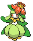

#549 - Lilligant
<table cellspacing="0" cellpadding="0"><tr><th colspan="1" align="center"></th><th colspan="1" align="center">Type</th><th colspan="1" align="center">Ability</th></tr><tr><td align="center";rowspan="1"></td><td align="center";rowspan="1"></td><td rowspan="1">(1) Chlorophyll   (2) Own Tempo   (HA) Leaf Guard</td></tr><tr><th colspan="3" align="center">Defenses</th></tr><tr><td align="right">Immune:</td><td colspan="2"></td></tr><tr><td align="right">0.25x Resist:</td><td colspan="2"></td></tr><tr><td align="right">0.5x Resist:</td><td colspan="2"></td></tr><tr><td align="right">Neutral:</td><td colspan="2"></td></tr><tr><td align="right">2x Weak:</td><td colspan="2"></td></tr><tr><td align="right">4x Weak:</td><td colspan="2"></td></tr></table>

## Evolutions
<table>
<tr><td rowspan="1"style="vertical-align: middle;">    <a href="../548">Petilil</a> </td><td rowspan="1"style="vertical-align: middle; word-break:break-all;">Use Sun Stone</td><td rowspan="1"style="vertical-align: middle;">    <a href="../549">Lilligant</a> </td></tr>
</table>

## Stats
<table class="stat"><tr><td class="stat-icon-single"></td><td class="stat-single"><u>HP</u> 70</td><td class="stat-single"><u>ATK</u> 60</td><td class="stat-single"><u>DEF</u> 75</td><td  class="stat-single">            <u>SPA                +5</u>                     115</td><td class="stat-single"><u>SPD</u> 75</td><td  class="stat-single">            <u>SPE                +5</u>                     95</td><td  class="stat-single">            <u>BST                +10</u>                     490</td></tr></table>

## Level Up Moves
<table><th>Level</th><th>Name</th><th>Power</th><th>Accuracy</th><th>PP</th><th>Type</th><th>Damage Class</th><th>Effect</th>
<tr><td>1</td><td>Growth</td><td>None</td><td>None</td><td>20</td><td></td><td></td><td>Priority: 0. Raises the user's Attack and Special Attack by one stage each.  During sunny day, raises both stats by two stages.</td></tr>
<tr><td>1</td><td>Healing Wish</td><td>None</td><td>None</td><td>10</td><td></td><td></td><td>Priority: 0. User faints.  Its replacement's HP is fully restored, and any major status effect is removed.  If the replacement Pokémon is immediately fainted by a switch-in effect, the next replacement is healed by this move instead.</td></tr>
<tr><td>1</td><td>Poison Powder</td><td>None</td><td>75</td><td>20</td><td></td><td></td><td>Priority: 0. Poisons the target.</td></tr>
<tr><td>1</td><td>Sleep Powder</td><td>None</td><td>75</td><td>15</td><td></td><td></td><td>Priority: 0. Puts the target to sleep.</td></tr>
<tr><td>1</td><td>Stun Spore</td><td>None</td><td>90</td><td>20</td><td></td><td></td><td>Priority: 0. Paralyzes the target.</td></tr>
<tr><td>25</td><td>Petal Dance</td><td>120</td><td>100</td><td>10</td><td></td><td></td><td>Priority: 0. User is forced to attack with this move for 2–3 turns.  After the last hit, the user becomes confused. Safeguard does not protect against the confusion from this move.</td></tr>
<tr><td>35</td><td>Extrasensory</td><td>80</td><td>100</td><td>15</td><td></td><td></td><td>Priority: 0. Has a 10% chance to make the target flinch.</td></tr>
<tr><td>40</td><td>Helping Hand</td><td>None</td><td>None</td><td>20</td><td></td><td></td><td>Priority: 5. Boosts the power of the target's moves by 50% until the end of this turn.  This move cannot be copied by mirror move, nor selected by assist or metronome.</td></tr>
<tr><td>50</td><td>Quiver Dance</td><td>None</td><td>None</td><td>20</td><td></td><td></td><td>Priority: 0. Raises the user's Special Attack, Special Defense, and Speed by one stage each.</td></tr>
<tr><td>55</td><td>Fiery Dance</td><td>80</td><td>100</td><td>10</td><td></td><td></td><td>Priority: 0. Has a 50% chance to raise the user's Special Attack by one stage.</td></tr>
</table>

## TM Moves
<table><th>Machine</th><th>Name</th><th>Power</th><th>Accuracy</th><th>PP</th><th>Type</th><th>Damage Class</th><th>Effect</th>
<tr><td>TM6</td><td>Toxic</td><td>None</td><td>90</td><td>10</td><td></td><td></td><td>Priority: 0. Badly poisons the target.  Never misses when used by a poison-type Pokémon.</td></tr>
<tr><td>TM10</td><td>Hidden Power</td><td>60</td><td>100</td><td>15</td><td></td><td></td><td>Priority: 0. Power and type depend upon user's IVs. Power can range from 30 to 70.</td></tr>
<tr><td>TM11</td><td>Sunny Day</td><td>None</td><td>None</td><td>5</td><td></td><td></td><td>Priority: 0. Changes the weather to sunshine for five turns.</td></tr>
<tr><td>TM15</td><td>Hyper Beam</td><td>150</td><td>90</td><td>5</td><td></td><td></td><td>Priority: 0. User loses its next turn to "recharge", and cannot attack or switch out during that turn.</td></tr>
<tr><td>TM16</td><td>Light Screen</td><td>None</td><td>None</td><td>30</td><td></td><td></td><td>Priority: 0. Reduces damage from special attacks by half for five turns. In double battles, the reduction is 1/3.</td></tr>
<tr><td>TM17</td><td>Protect</td><td>None</td><td>None</td><td>10</td><td></td><td></td><td>Priority: 4. No moves will hit the user for the remainder of this turn. If the user is last to act this turn, this move will fail. Success rate drops by 1/2 on successive attempts.</td></tr>
<tr><td>TM19</td><td>Giga Drain</td><td>80</td><td>100</td><td>10</td><td></td><td></td><td>Priority: 0. Drains half the damage inflicted to heal the user.</td></tr>
<tr><td>TM21</td><td>Frustration</td><td>None</td><td>100</td><td>20</td><td></td><td></td><td>Priority: 0. Power increases inversely with happiness, given by `(255 - happiness) * 2 / 5`, to a maximum of 102.  Power bottoms out at 1.</td></tr>
<tr><td>TM22</td><td>Solar Beam</td><td>120</td><td>100</td><td>10</td><td></td><td></td><td>Priority: 0. User charges for one turn before attacking.</td></tr>
<tr><td>TM27</td><td>Return</td><td>None</td><td>100</td><td>20</td><td></td><td></td><td>Priority: 0. Power increases with happiness, given by `happiness * 2 / 5`, to a maximum of 102.  Power bottoms out at 1.</td></tr>
<tr><td>TM42</td><td>Facade</td><td>70</td><td>100</td><td>20</td><td></td><td></td><td>Priority: 0. If the user is burned, paralyzed, or poisoned, this move has double power.</td></tr>
<tr><td>TM44</td><td>Rest</td><td>None</td><td>None</td><td>10</td><td></td><td></td><td>Priority: 0. User falls to sleep for two turns, replacing any existing non-volatile status ailments, and immediately regains all its HP.</td></tr>
<tr><td>TM53</td><td>Energy Ball</td><td>90</td><td>100</td><td>10</td><td></td><td></td><td>Priority: 0. Has a 10% chance to lower the target's Special Defense by one stage.</td></tr>
<tr><td>TM68</td><td>Giga Impact</td><td>150</td><td>90</td><td>5</td><td></td><td></td><td>Priority: 0. User loses its next turn to "recharge", and cannot attack or switch out during that turn.</td></tr>
<tr><td>TM70</td><td>Flash</td><td>None</td><td>100</td><td>20</td><td></td><td></td><td>Priority: 0. Lowers the target's accuracy by one stage.</td></tr>
<tr><td>TM75</td><td>Swords Dance</td><td>None</td><td>None</td><td>20</td><td></td><td></td><td>Priority: 0. Raises the user's Attack by two stages.</td></tr>
<tr><td>TM86</td><td>Grass Knot</td><td>None</td><td>100</td><td>20</td><td></td><td></td><td>Priority: 0. Power increases with the target's weight in kilograms, to a maximum of 120.</td></tr>
<tr><td>TM90</td><td>Substitute</td><td>None</td><td>None</td><td>10</td><td></td><td></td><td>Priority: 0. Transfers 1/4 the user's max HP into a doll that absorbs damage and causes most negative move effects to fail.</td></tr>
<tr><td>HM1</td><td>Cut</td><td>50</td><td>95</td><td>30</td><td></td><td></td><td>Priority: 0. High Critical Ratio</td></tr>
</table>

## Tutor Moves
<table><th>Name</th><th>Power</th><th>Accuracy</th><th>PP</th><th>Type</th><th>Damage Class</th><th>Effect</th>
<tr><td>After You</td><td>None</td><td>None</td><td>15</td><td></td><td></td><td>Priority: 0. The target will act next this turn, regardless of Speed or move priority. If the target has already acted this turn, this move will fail.</td></tr>
<tr><td>Covet</td><td>60</td><td>100</td><td>20</td><td></td><td></td><td>Priority: 0. If the target is holding an item and the user is not, the user will permanently take the item.  Damage is still inflicted if an item cannot be taken.  Pokémon with sticky hold or multitype are immune to the item theft effect.  The target cannot recover its item with recycle.</td></tr>
<tr><td>Giga Drain</td><td>80</td><td>100</td><td>10</td><td></td><td></td><td>Priority: 0. Drains half the damage inflicted to heal the user.</td></tr>
<tr><td>Heal Bell</td><td>None</td><td>None</td><td>5</td><td></td><td></td><td>Priority: 0. Removes major status effects and confusion from every Pokémon in the user's party.</td></tr>
<tr><td>Helping Hand</td><td>None</td><td>None</td><td>20</td><td></td><td></td><td>Priority: 5. Boosts the power of the target's moves by 50% until the end of this turn.  This move cannot be copied by mirror move, nor selected by assist or metronome.</td></tr>
<tr><td>Role Play</td><td>None</td><td>None</td><td>10</td><td></td><td></td><td>Priority: 0. User's ability is replaced with the target's until the user leaves the field.  Ignores accuracy and evasion modifiers.  If the target has flower gift, forecast, illusion, imposter, multitype, stance change, trace, wonder guard, or zen mode, this move will fail.</td></tr>
<tr><td>Seed Bomb</td><td>80</td><td>100</td><td>15</td><td></td><td></td><td>Priority: 0. Inflicts regular damage.</td></tr>
<tr><td>Sleep Talk</td><td>None</td><td>None</td><td>10</td><td></td><td></td><td>Priority: 0. Only usable if the user is sleeping. Randomly selects and uses one of the user's other three moves. Use of the selected move requires and costs 0 PP.</td></tr>
<tr><td>Snore</td><td>50</td><td>100</td><td>15</td><td></td><td></td><td>Priority: 0. Only usable if the user is sleeping.   Has a 30% chance to make the target flinch.</td></tr>
<tr><td>Synthesis</td><td>None</td><td>None</td><td>5</td><td></td><td></td><td>Priority: 0. Heals the user for half its max HP, plus modifiers from weather.</td></tr>
<tr><td>Worry Seed</td><td>None</td><td>100</td><td>10</td><td></td><td></td><td>Priority: 0. Changes the target's ability to insomnia.  If the target's ability is truant or multitype, this move will fail.</td></tr>
</table>

## Pre-Evolution Moves
| Species | Method | Move |
|: --- :|: --- :|: --- :|
| Petilil | Lvl 1 | Absorb |
| Petilil | Lvl 19 | Aromatherapy |
| Petilil | Lvl 31 | Charm |
| Petilil | Lvl 34 | Entrainment |
| Petilil | Lvl 1 | Focus Energy |
| Petilil | Lvl 41 | Ingrain |
| Petilil | Lvl 57 | Leaf Storm |
| Petilil | Lvl 25 | Leech Seed |
| Petilil | Lvl 16 | Mega Drain |
| Petilil | Lvl 4 | Razor Leaf |
| Petilil | Lvl 37 | Recover |

## Encounter Locations

| Location | &nbsp; | Level | Spawn Percent |
|: -- :|: -- :|: -- :|: -- :|
| [Abundant Shrine] | Shaking Grass | 42-46 | 10.0 |

--8<-- "includes/abilities.md"

[Abundant Shrine]: ../../wildareas/Abundant_Shrine/
