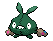

#569 - Garbodor
<table cellspacing="0" cellpadding="0"><tr><th colspan="1" align="center"></th><th colspan="1" align="center">Type</th><th colspan="1" align="center">Ability</th></tr><tr><td align="center";rowspan="1"></td><td align="center";rowspan="1"></td><td rowspan="1">(1) Aftermath   (2) Stench   (HA) Sticky Hold</td></tr><tr><th colspan="3" align="center">Defenses</th></tr><tr><td align="right">Immune:</td><td colspan="2"></td></tr><tr><td align="right">0.25x Resist:</td><td colspan="2"></td></tr><tr><td align="right">0.5x Resist:</td><td colspan="2"></td></tr><tr><td align="right">Neutral:</td><td colspan="2"></td></tr><tr><td align="right">2x Weak:</td><td colspan="2"></td></tr><tr><td align="right">4x Weak:</td><td colspan="2"></td></tr></table>

## Evolutions
<table>
<tr><td rowspan="1"style="vertical-align: middle;">    <a href="../568">Trubbish</a> </td><td rowspan="1"style="vertical-align: middle; word-break:break-all;">Level 36</td><td rowspan="1"style="vertical-align: middle;">    <a href="../569">Garbodor</a> </td></tr>
</table>

## Stats
<table class="stat"><tr><td class="stat-icon-single"></td><td  class="stat-single">            <u>HP                +20</u>                     100</td><td class="stat-single"><u>ATK</u> 95</td><td class="stat-single"><u>DEF</u> 82</td><td class="stat-single"><u>SPA</u> 60</td><td class="stat-single"><u>SPD</u> 82</td><td class="stat-single"><u>SPE</u> 75</td><td  class="stat-single">            <u>BST                +20</u>                     494</td></tr></table>

## Wild Hold Items
- 50%: Black Sludge
- 5%: Nugget
- 1%: Big Nugget

## Level Up Moves
<table><th>Level</th><th>Name</th><th>Power</th><th>Accuracy</th><th>PP</th><th>Type</th><th>Damage Class</th><th>Effect</th>
<tr><td>1</td><td>Autotomize</td><td>None</td><td>None</td><td>15</td><td></td><td></td><td>Priority: 0. Raises the user's Speed by two stages.  Halves the user's weight; this effect does not stack.</td></tr>
<tr><td>1</td><td>Metal Claw</td><td>50</td><td>95</td><td>35</td><td></td><td></td><td>Priority: 0. Has a 10% chance to raise the user's Attack one stage.</td></tr>
<tr><td>1</td><td>Spite</td><td>None</td><td>100</td><td>10</td><td></td><td></td><td>Priority: 0. Lowers the PP of the target's last used move by 4.  If the target hasn't used a move since entering the field, if it tried to use a move this turn and failed, or if its last used move has 0 PP remaining, this move will fail.</td></tr>
<tr><td>1</td><td>Wide Guard</td><td>None</td><td>None</td><td>10</td><td></td><td></td><td>Priority: 3. Moves with multiple targets will not hit friendly Pokémon for the remainder of this turn.  If the user is last to act this turn, this move will fail.  This move cannot be selected by assist or metronome.</td></tr>
<tr><td>4</td><td>Mud-Slap</td><td>30</td><td>100</td><td>20</td><td></td><td></td><td>Priority: 0. Has a 100% chance to lower the target's accuracy by one stage.</td></tr>
<tr><td>7</td><td>Curse</td><td>None</td><td>None</td><td>10</td><td></td><td></td><td>Priority: 0. If the user is a ghost: user pays half its max HP to place a curse on the target, damaging it for 1/4 its max HP every turn. Otherwise: Lowers the user's Speed by one stage, and raises its Attack and Defense by one stage each.  The curse effect is passed on by baton pass.  This move cannot be copied by mirror move.</td></tr>
<tr><td>10</td><td>Rock Blast</td><td>25</td><td>90</td><td>10</td><td></td><td></td><td>Priority: 0. Hits 2–5 times in one turn.  Has a 3/8 chance each to hit 2 or 3 times, and a 1/8 chance each to hit 4 or 5 times.  Averages to 3 hits per use.</td></tr>
<tr><td>13</td><td>Acid Spray</td><td>40</td><td>100</td><td>20</td><td></td><td></td><td>Priority: 0. Lowers the target's Special Defense by two stages.</td></tr>
<tr><td>16</td><td>Toxic</td><td>None</td><td>90</td><td>10</td><td></td><td></td><td>Priority: 0. Badly poisons the target.  Never misses when used by a poison-type Pokémon.</td></tr>
<tr><td>19</td><td>Rollout</td><td>40</td><td>90</td><td>20</td><td></td><td></td><td>Priority: 0. User is forced to use this move for five turns.  Power doubles every time this move is used in succession to a maximum of 16x, and resets to normal after the lock-in ends.</td></tr>
<tr><td>22</td><td>Clear Smog</td><td>50</td><td>None</td><td>15</td><td></td><td></td><td>Priority: 0. All of the target's stat modifiers are reset to zero.</td></tr>
<tr><td>25</td><td>Fling</td><td>None</td><td>100</td><td>10</td><td></td><td></td><td>Priority: 0. Power and type are determined by the user's held item.  The item is consumed.  If the user is not holding an item, or its item has no set type and power, this move will fail.  This move ignores sticky hold.  If the user is under the effect of embargo, this move will fail.</td></tr>
<tr><td>28</td><td>Sludge</td><td>70</td><td>100</td><td>15</td><td></td><td></td><td>Priority: 0. Has a 30% chance to poison the target.</td></tr>
<tr><td>31</td><td>Recycle</td><td>None</td><td>None</td><td>10</td><td></td><td></td><td>Priority: 0. User recovers the last item consumed by the user or a Pokémon in its position on the field.  The item must be used again before it can be recovered by this move again.  If the user is holding an item, this move fails.  Items taken or given away by covet, knock off, switcheroo, thief, or trick may not be recovered.</td></tr>
<tr><td>34</td><td>Stockpile</td><td>None</td><td>None</td><td>20</td><td></td><td></td><td>Priority: 0. Raises the user's Defense and Special Defense by one stage each.  Stores energy for use with spit up and swallow.  Up to three levels of energy can be stored, and all are lost if the user leaves the field.  Energy is still stored even if the stat boosts cannot be applied.  If the user uses baton pass, the stat boosts are passed as normal, but the stored energy is not.</td></tr>
<tr><td>34</td><td>Swallow</td><td>None</td><td>None</td><td>10</td><td></td><td></td><td>Priority: 0. Heals the user depending on the amount of energy stored by stockpile: 1/4 its max HP after one use, 1/2 its max HP after two uses, or fully after three uses.  Stored energy is consumed, and the user's Defense and Special Defense are reset to what they would be if stockpile had not been used.  If the user has no energy stored, this move will fail.</td></tr>
<tr><td>36</td><td>Spikes</td><td>None</td><td>None</td><td>20</td><td></td><td></td><td>Priority: 0. Scatters spikes around the opposing field, which damage opposing Pokémon that enter the field for 1/8 of their max HP.  Pokémon immune to ground moves are immune to this damage, except during gravity.  Up to three layers of spikes may be laid down, adding 1/16 to the damage done: two layers of spikes damage for 3/16 max HP, and three layers damage for 1/4 max HP.</td></tr>
<tr><td>36</td><td>Toxic Spikes</td><td>None</td><td>None</td><td>20</td><td></td><td></td><td>Priority: 0. Scatters poisoned spikes around the opposing field, which poison opposing Pokémon that enter the field.  A second layer of these spikes may be laid down, in which case Pokémon will be badly poisoned instead.  Pokémon immune to either ground moves or being poisoned are immune to this effect.  Pokémon otherwise immune to ground moves are affected during gravity.  If a poison Pokémon not immune to ground moves enters a field covered with poisoned spikes, the spikes are removed.  rapid spin will remove this effect from its user's side of the field.  defog will remove this effect from its target's side of the field.  This move does not trigger synchronize, unless the Pokémon with synchronize was forced to enter the field by another effect such as roar.  Pokémon entering the field due to baton pass are not affected by this effect.</td></tr>
<tr><td>39</td><td>Cross Poison</td><td>90</td><td>100</td><td>15</td><td></td><td></td><td>Priority: 0. User's critical hit rate is one level higher when using this move. Has a 10% chance to poison the target.</td></tr>
<tr><td>42</td><td>Body Slam</td><td>85</td><td>100</td><td>15</td><td></td><td></td><td>Priority: 0. Has a 30% chance to paralyze the target.</td></tr>
<tr><td>45</td><td>Pain Split</td><td>None</td><td>None</td><td>20</td><td></td><td></td><td>Priority: 0. Changes the user's and target's remaining HP to the average of their current remaining HP.</td></tr>
<tr><td>49</td><td>Amnesia</td><td>None</td><td>None</td><td>20</td><td></td><td></td><td>Priority: 0. Raises the user's Special Defense by two stages.</td></tr>
<tr><td>53</td><td>Payback</td><td>50</td><td>100</td><td>10</td><td></td><td></td><td>Priority: 0. If the target uses a move or switches out this turn before this move is used, this move has double power.</td></tr>
<tr><td>58</td><td>Double-Edge</td><td>120</td><td>100</td><td>15</td><td></td><td></td><td>Priority: 0. User takes 1/3 the damage it inflicts in recoil.</td></tr>
<tr><td>62</td><td>Self-Destruct</td><td>200</td><td>100</td><td>5</td><td></td><td></td><td>Priority: 0. User faints, even if the attack fails or misses.  Inflicts regular damage.</td></tr>
</table>

## TM Moves
<table><th>Machine</th><th>Name</th><th>Power</th><th>Accuracy</th><th>PP</th><th>Type</th><th>Damage Class</th><th>Effect</th>
<tr><td>TM6</td><td>Toxic</td><td>None</td><td>90</td><td>10</td><td></td><td></td><td>Priority: 0. Badly poisons the target.  Never misses when used by a poison-type Pokémon.</td></tr>
<tr><td>TM9</td><td>Venoshock</td><td>65</td><td>100</td><td>15</td><td></td><td></td><td>Priority: 0. If the target is poisoned, this move has double power.</td></tr>
<tr><td>TM10</td><td>Hidden Power</td><td>60</td><td>100</td><td>15</td><td></td><td></td><td>Priority: 0. Power and type depend upon user's IVs. Power can range from 30 to 70.</td></tr>
<tr><td>TM11</td><td>Sunny Day</td><td>None</td><td>None</td><td>5</td><td></td><td></td><td>Priority: 0. Changes the weather to sunshine for five turns.</td></tr>
<tr><td>TM15</td><td>Hyper Beam</td><td>150</td><td>90</td><td>5</td><td></td><td></td><td>Priority: 0. User loses its next turn to "recharge", and cannot attack or switch out during that turn.</td></tr>
<tr><td>TM17</td><td>Protect</td><td>None</td><td>None</td><td>10</td><td></td><td></td><td>Priority: 4. No moves will hit the user for the remainder of this turn. If the user is last to act this turn, this move will fail. Success rate drops by 1/2 on successive attempts.</td></tr>
<tr><td>TM18</td><td>Rain Dance</td><td>None</td><td>None</td><td>5</td><td></td><td></td><td>Priority: 0. Changes the weather to rain for five turns, during which water moves inflict 50% extra damage, and fire moves inflict half damage.</td></tr>
<tr><td>TM19</td><td>Giga Drain</td><td>80</td><td>100</td><td>10</td><td></td><td></td><td>Priority: 0. Drains half the damage inflicted to heal the user.</td></tr>
<tr><td>TM21</td><td>Frustration</td><td>None</td><td>100</td><td>20</td><td></td><td></td><td>Priority: 0. Power increases inversely with happiness, given by `(255 - happiness) * 2 / 5`, to a maximum of 102.  Power bottoms out at 1.</td></tr>
<tr><td>TM22</td><td>Solar Beam</td><td>120</td><td>100</td><td>10</td><td></td><td></td><td>Priority: 0. User charges for one turn before attacking.</td></tr>
<tr><td>TM23</td><td>Smack Down</td><td>50</td><td>100</td><td>15</td><td></td><td></td><td>Priority: 0. Removes the target's immunity to ground-type damage.  This effect removes any existing Ground immunity due to levitate, magnet rise, or telekinesis, and causes the target's flying type to be ignored when it takes Ground damage.  If the target isn't immune to Ground damage, this move will fail.  This move can hit Pokémon under the effect of bounce, fly, or sky drop, and ends the effect of Bounce or Fly.</td></tr>
<tr><td>TM24</td><td>Thunderbolt</td><td>90</td><td>100</td><td>10</td><td></td><td></td><td>Priority: 0. Has a 10% chance to paralyze the target.</td></tr>
<tr><td>TM27</td><td>Return</td><td>None</td><td>100</td><td>20</td><td></td><td></td><td>Priority: 0. Power increases with happiness, given by `happiness * 2 / 5`, to a maximum of 102.  Power bottoms out at 1.</td></tr>
<tr><td>TM29</td><td>Psychic</td><td>90</td><td>100</td><td>10</td><td></td><td></td><td>Priority: 0. Has a 10% chance to lower the target's Special Defense by one stage.</td></tr>
<tr><td>TM34</td><td>Sludge Wave</td><td>95</td><td>100</td><td>10</td><td></td><td></td><td>Priority: 0. Has a 10% chance to poison the target.</td></tr>
<tr><td>TM36</td><td>Sludge Bomb</td><td>90</td><td>100</td><td>10</td><td></td><td></td><td>Priority: 0. Has a 30% chance to poison the target.</td></tr>
<tr><td>TM41</td><td>Infestation</td><td>20</td><td>100</td><td>20</td><td></td><td></td><td>Priority: 0. For the next 2–5 turns, the target cannot leave the field and is damaged for 1/16 its max HP at the end of each turn.  The user continues to use other moves during this time.  If the user leaves the field, this effect ends.  Has a 3/8 chance each to hit 2 or 3 times, and a 1/8 chance each to hit 4 or 5 times.  Averages to 3 hits per use.</td></tr>
<tr><td>TM42</td><td>Facade</td><td>70</td><td>100</td><td>20</td><td></td><td></td><td>Priority: 0. If the user is burned, paralyzed, or poisoned, this move has double power.</td></tr>
<tr><td>TM44</td><td>Rest</td><td>None</td><td>None</td><td>10</td><td></td><td></td><td>Priority: 0. User falls to sleep for two turns, replacing any existing non-volatile status ailments, and immediately regains all its HP.</td></tr>
<tr><td>TM52</td><td>Focus Blast</td><td>120</td><td>70</td><td>5</td><td></td><td></td><td>Priority: 0. Has a 10% chance to lower the target's Special Defense by one stage.</td></tr>
<tr><td>TM64</td><td>Explosion</td><td>250</td><td>100</td><td>5</td><td></td><td></td><td>Priority: 0. User faints, even if the attack fails or misses.  Inflicts regular damage.</td></tr>
<tr><td>TM68</td><td>Giga Impact</td><td>150</td><td>90</td><td>5</td><td></td><td></td><td>Priority: 0. User loses its next turn to "recharge", and cannot attack or switch out during that turn.</td></tr>
<tr><td>TM69</td><td>Rock Polish</td><td>None</td><td>None</td><td>20</td><td></td><td></td><td>Priority: 0. Raises the user's Speed by two stages.</td></tr>
<tr><td>TM90</td><td>Substitute</td><td>None</td><td>None</td><td>10</td><td></td><td></td><td>Priority: 0. Transfers 1/4 the user's max HP into a doll that absorbs damage and causes most negative move effects to fail.</td></tr>
</table>

## Tutor Moves
<table><th>Name</th><th>Power</th><th>Accuracy</th><th>PP</th><th>Type</th><th>Damage Class</th><th>Effect</th>
<tr><td>Dark Pulse</td><td>80</td><td>Never Miss</td><td>10</td><td></td><td></td><td>Priority: 0. Has a 20% chance to make the target flinch.</td></tr>
<tr><td>Drain Punch</td><td>75</td><td>100</td><td>10</td><td></td><td></td><td>Priority: 0. Drains half the damage inflicted to heal the user.</td></tr>
<tr><td>Giga Drain</td><td>80</td><td>100</td><td>10</td><td></td><td></td><td>Priority: 0. Drains half the damage inflicted to heal the user.</td></tr>
<tr><td>Gunk Shot</td><td>120</td><td>80</td><td>5</td><td></td><td></td><td>Priority: 0. Has a 30% chance to poison the target.</td></tr>
<tr><td>Pain Split</td><td>None</td><td>None</td><td>20</td><td></td><td></td><td>Priority: 0. Changes the user's and target's remaining HP to the average of their current remaining HP.</td></tr>
<tr><td>Recycle</td><td>None</td><td>None</td><td>10</td><td></td><td></td><td>Priority: 0. User recovers the last item consumed by the user or a Pokémon in its position on the field.  The item must be used again before it can be recovered by this move again.  If the user is holding an item, this move fails.  Items taken or given away by covet, knock off, switcheroo, thief, or trick may not be recovered.</td></tr>
<tr><td>Seed Bomb</td><td>80</td><td>100</td><td>15</td><td></td><td></td><td>Priority: 0. Inflicts regular damage.</td></tr>
<tr><td>Sleep Talk</td><td>None</td><td>None</td><td>10</td><td></td><td></td><td>Priority: 0. Only usable if the user is sleeping. Randomly selects and uses one of the user's other three moves. Use of the selected move requires and costs 0 PP.</td></tr>
<tr><td>Snore</td><td>50</td><td>100</td><td>15</td><td></td><td></td><td>Priority: 0. Only usable if the user is sleeping.   Has a 30% chance to make the target flinch.</td></tr>
<tr><td>Spite</td><td>None</td><td>100</td><td>10</td><td></td><td></td><td>Priority: 0. Lowers the PP of the target's last used move by 4.  If the target hasn't used a move since entering the field, if it tried to use a move this turn and failed, or if its last used move has 0 PP remaining, this move will fail.</td></tr>
</table>

## Pre-Evolution Moves
| Species | Method | Move |
|: --- :|: --- :|: --- :|
| Trubbish | Lvl 1 | Pound |
| Trubbish | Lvl 1 | Sand Attack |

## Encounter Locations

| Location | &nbsp; | Level | Spawn Percent |
|: -- :|: -- :|: -- :|: -- :|
| [Route 9] | Dark Grass (Doubles) | 50-52 | 10.0 |
| [Route 9] | Grass | 49-51 | 10.0 |

--8<-- "includes/abilities.md"

[Route 9]: ../../wildareas/Route_9/
