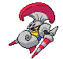

#589 - Escavalier
<table cellspacing="0" cellpadding="0"><tr><th colspan="1" align="center"></th><th colspan="1" align="center">Type</th><th colspan="1" align="center">Ability</th></tr><tr><td align="center";rowspan="1"></td><td align="center";rowspan="1"> </td><td rowspan="1">(1) No Guard   (2) Shell Armor   (HA) Overcoat</td></tr><tr><th colspan="3" align="center">Defenses</th></tr><tr><td align="right">Immune:</td><td colspan="2"></td></tr><tr><td align="right">0.25x Resist:</td><td colspan="2"></td></tr><tr><td align="right">0.5x Resist:</td><td colspan="2"></td></tr><tr><td align="right">Neutral:</td><td colspan="2"></td></tr><tr><td align="right">2x Weak:</td><td colspan="2"></td></tr><tr><td align="right">4x Weak:</td><td colspan="2"></td></tr></table>

## Evolutions
<table>
<tr><td rowspan="1"style="vertical-align: middle;">    <a href="../588">Karrablast</a> </td><td rowspan="1"style="vertical-align: middle; word-break:break-all;">Level up with pokemon with Shelmet in party or Use Metal Coat</td><td rowspan="1"style="vertical-align: middle;">    <a href="../589">Escavalier</a> </td></tr>
</table>

## Stats
<table class="stat"><tr><td class="stat-icon-single"></td><td class="stat-single"><u>HP</u> 70</td><td class="stat-single"><u>ATK</u> 135</td><td class="stat-single"><u>DEF</u> 105</td><td class="stat-single"><u>SPA</u> 60</td><td class="stat-single"><u>SPD</u> 105</td><td class="stat-single"><u>SPE</u> 20</td><td class="stat-single"><u>BST</u> 495</td></tr></table>

## Level Up Moves
<table><th>Level</th><th>Name</th><th>Power</th><th>Accuracy</th><th>PP</th><th>Type</th><th>Damage Class</th><th>Effect</th>
<tr><td>1</td><td>Horn Attack</td><td>65</td><td>100</td><td>25</td><td></td><td></td><td>Priority: 0. Inflicts regular damage.</td></tr>
<tr><td>1</td><td>Peck</td><td>35</td><td>100</td><td>35</td><td></td><td></td><td>Priority: 0. Inflicts regular damage.</td></tr>
<tr><td>1</td><td>Quick Attack</td><td>40</td><td>100</td><td>20</td><td></td><td></td><td>Priority: 1. Inflicts regular damage.</td></tr>
<tr><td>1</td><td>Revenge</td><td>60</td><td>100</td><td>10</td><td></td><td></td><td>Priority: -4. If the target damaged the user this turn and was the last to do so, this move has double power.  pain split does not count as damaging the user.</td></tr>
<tr><td>4</td><td>Endure</td><td>None</td><td>None</td><td>10</td><td></td><td></td><td>Priority: 4. The user's HP cannot be lowered below 1 by any means for the remainder of this turn.</td></tr>
<tr><td>7</td><td>Counter</td><td>None</td><td>100</td><td>20</td><td></td><td></td><td>Priority: -5. Targets the last opposing Pokémon to hit the user with a physical move this turn.  Inflicts twice the damage that move did to the user.</td></tr>
<tr><td>10</td><td>Flail</td><td>None</td><td>100</td><td>15</td><td></td><td></td><td>Priority: 0. Power varies inversely with the user's proportional remaining HP.  64 * current HP / max HP | Power -----------------------: | ----:  0– 1                    |  200  2– 5                    |  150  6–12                    |  100 13–21                    |   80 22–42                    |   40 43–64                    |   20</td></tr>
<tr><td>13</td><td>Pursuit</td><td>40</td><td>100</td><td>20</td><td></td><td></td><td>Priority: 0. If the target attempts to switch out this turn before the user acts, this move hits the target before it leaves and has double power.  This effect can still hit a Pokémon that switches out when it has a substitute up or when an ally has used follow me.</td></tr>
<tr><td>16</td><td>Headbutt</td><td>70</td><td>100</td><td>15</td><td></td><td></td><td>Priority: 0. Has a 30% chance to make the target flinch.</td></tr>
<tr><td>20</td><td>Acid Spray</td><td>40</td><td>100</td><td>20</td><td></td><td></td><td>Priority: 0. Lowers the target's Special Defense by two stages.</td></tr>
<tr><td>24</td><td>Bug Bite</td><td>60</td><td>100</td><td>20</td><td></td><td></td><td>Priority: 0. If the target is holding a berry, the user takes the berry and uses it immediately.  If the target is holding a jaboca berry or rowap berry, the berry is still removed, but has no effect.  If this move is super effective and the target is holding a berry that can reduce this move's damage, it will do so, and will not be stolen.</td></tr>
<tr><td>28</td><td>Feint Attack</td><td>60</td><td>None</td><td>20</td><td></td><td></td><td>Priority: 0. Ignores accuracy and evasion modifiers.</td></tr>
<tr><td>32</td><td>Iron Defense</td><td>None</td><td>None</td><td>15</td><td></td><td></td><td>Priority: 0. Raises the user's Defense by two stages.</td></tr>
<tr><td>36</td><td>Fury Cutter</td><td>30</td><td>95</td><td>20</td><td></td><td></td><td>Priority: 0. Power doubles after every time this move is used, whether consecutively or not, maxing out at 16x.  If this move misses or the user leaves the field, power resets.</td></tr>
<tr><td>39</td><td>Night Slash</td><td>70</td><td>100</td><td>15</td><td></td><td></td><td>Priority: 0. User's critical hit rate is one level higher when using this move.</td></tr>
<tr><td>39</td><td>Slash</td><td>70</td><td>100</td><td>15</td><td></td><td></td><td>Priority: 0. User's critical hit rate is one level higher when using this move.</td></tr>
<tr><td>42</td><td>Twineedle</td><td>40</td><td>100</td><td>20</td><td></td><td></td><td>Priority: 0. Hits twice in the same turn.  Has a 20% chance to poison the target.</td></tr>
<tr><td>45</td><td>Smart Strike</td><td>70</td><td>None</td><td>10</td><td></td><td></td><td>Priority: 0. Ignores accuracy and evasion modifiers.</td></tr>
<tr><td>48</td><td>Take Down</td><td>90</td><td>85</td><td>20</td><td></td><td></td><td>Priority: 0. User takes 1/4 the damage it inflicts in recoil.</td></tr>
<tr><td>51</td><td>Razor Shell</td><td>75</td><td>100</td><td>10</td><td></td><td></td><td>Priority: 0. Has a 50% chance to lower the target's Defense by one stage.</td></tr>
<tr><td>54</td><td>Metal Burst</td><td>None</td><td>100</td><td>10</td><td></td><td></td><td>Priority: 0. Targets the last opposing Pokémon to hit the user with a damaging move this turn.  Inflicts 1.5× the damage that move did to the user. Type immunity applies, but other type effects are ignored.</td></tr>
<tr><td>57</td><td>Megahorn</td><td>120</td><td>85</td><td>10</td><td></td><td></td><td>Priority: 0. Inflicts regular damage.</td></tr>
<tr><td>60</td><td>Reversal</td><td>None</td><td>100</td><td>15</td><td></td><td></td><td>Priority: 0. Power varies inversely with the user's proportional remaining HP.  64 * current HP / max HP | Power -----------------------: | ----:  0– 1                    |  200  2– 5                    |  150  6–12                    |  100 13–21                    |   80 22–42                    |   40 43–64                    |   20</td></tr>
<tr><td>63</td><td>Double-Edge</td><td>120</td><td>100</td><td>15</td><td></td><td></td><td>Priority: 0. User takes 1/3 the damage it inflicts in recoil.</td></tr>
<tr><td>66</td><td>Close Combat</td><td>120</td><td>100</td><td>5</td><td></td><td></td><td>Priority: 0. Inflicts regular damage, then lowers the user's Defense and Special Defense by one stage each.</td></tr>
</table>

## TM Moves
<table><th>Machine</th><th>Name</th><th>Power</th><th>Accuracy</th><th>PP</th><th>Type</th><th>Damage Class</th><th>Effect</th>
<tr><td>TM6</td><td>Toxic</td><td>None</td><td>90</td><td>10</td><td></td><td></td><td>Priority: 0. Badly poisons the target.  Never misses when used by a poison-type Pokémon.</td></tr>
<tr><td>TM10</td><td>Hidden Power</td><td>60</td><td>100</td><td>15</td><td></td><td></td><td>Priority: 0. Power and type depend upon user's IVs. Power can range from 30 to 70.</td></tr>
<tr><td>TM15</td><td>Hyper Beam</td><td>150</td><td>90</td><td>5</td><td></td><td></td><td>Priority: 0. User loses its next turn to "recharge", and cannot attack or switch out during that turn.</td></tr>
<tr><td>TM17</td><td>Protect</td><td>None</td><td>None</td><td>10</td><td></td><td></td><td>Priority: 4. No moves will hit the user for the remainder of this turn. If the user is last to act this turn, this move will fail. Success rate drops by 1/2 on successive attempts.</td></tr>
<tr><td>TM18</td><td>Rain Dance</td><td>None</td><td>None</td><td>5</td><td></td><td></td><td>Priority: 0. Changes the weather to rain for five turns, during which water moves inflict 50% extra damage, and fire moves inflict half damage.</td></tr>
<tr><td>TM19</td><td>Giga Drain</td><td>80</td><td>100</td><td>10</td><td></td><td></td><td>Priority: 0. Drains half the damage inflicted to heal the user.</td></tr>
<tr><td>TM21</td><td>Frustration</td><td>None</td><td>100</td><td>20</td><td></td><td></td><td>Priority: 0. Power increases inversely with happiness, given by `(255 - happiness) * 2 / 5`, to a maximum of 102.  Power bottoms out at 1.</td></tr>
<tr><td>TM27</td><td>Return</td><td>None</td><td>100</td><td>20</td><td></td><td></td><td>Priority: 0. Power increases with happiness, given by `happiness * 2 / 5`, to a maximum of 102.  Power bottoms out at 1.</td></tr>
<tr><td>TM40</td><td>Aerial Ace</td><td>60</td><td>None</td><td>20</td><td></td><td></td><td>Priority: 0. Ignores accuracy and evasion modifiers.</td></tr>
<tr><td>TM41</td><td>Infestation</td><td>20</td><td>100</td><td>20</td><td></td><td></td><td>Priority: 0. For the next 2–5 turns, the target cannot leave the field and is damaged for 1/16 its max HP at the end of each turn.  The user continues to use other moves during this time.  If the user leaves the field, this effect ends.  Has a 3/8 chance each to hit 2 or 3 times, and a 1/8 chance each to hit 4 or 5 times.  Averages to 3 hits per use.</td></tr>
<tr><td>TM42</td><td>Facade</td><td>70</td><td>100</td><td>20</td><td></td><td></td><td>Priority: 0. If the user is burned, paralyzed, or poisoned, this move has double power.</td></tr>
<tr><td>TM44</td><td>Rest</td><td>None</td><td>None</td><td>10</td><td></td><td></td><td>Priority: 0. User falls to sleep for two turns, replacing any existing non-volatile status ailments, and immediately regains all its HP.</td></tr>
<tr><td>TM52</td><td>Focus Blast</td><td>120</td><td>70</td><td>5</td><td></td><td></td><td>Priority: 0. Has a 10% chance to lower the target's Special Defense by one stage.</td></tr>
<tr><td>TM53</td><td>Energy Ball</td><td>90</td><td>100</td><td>10</td><td></td><td></td><td>Priority: 0. Has a 10% chance to lower the target's Special Defense by one stage.</td></tr>
<tr><td>TM54</td><td>False Swipe</td><td>40</td><td>100</td><td>30</td><td></td><td></td><td>Priority: 0. Will not reduce the target's HP below 1.</td></tr>
<tr><td>TM63</td><td>Brutal Swing</td><td>60</td><td>100</td><td>20</td><td></td><td></td><td>Priority: 0. Inflicts regular damage.</td></tr>
<tr><td>TM68</td><td>Giga Impact</td><td>150</td><td>90</td><td>5</td><td></td><td></td><td>Priority: 0. User loses its next turn to "recharge", and cannot attack or switch out during that turn.</td></tr>
<tr><td>TM74</td><td>Gyro Ball</td><td>None</td><td>100</td><td>5</td><td></td><td></td><td>Priority: 0. Power increases with the target's current Speed compared to the user, given by `1 + 25 * target Speed / user Speed`, capped at 150.</td></tr>
<tr><td>TM75</td><td>Swords Dance</td><td>None</td><td>None</td><td>20</td><td></td><td></td><td>Priority: 0. Raises the user's Attack by two stages.</td></tr>
<tr><td>TM76</td><td>Bug Buzz</td><td>90</td><td>100</td><td>10</td><td></td><td></td><td>Priority: 0. Has a 10% chance to lower the target's Special Defense by one stage.</td></tr>
<tr><td>TM81</td><td>X-Scissor</td><td>80</td><td>100</td><td>10</td><td></td><td></td><td>Priority: 0. The user's critical hit rate is boosted one stage when using this move.</td></tr>
<tr><td>TM84</td><td>Poison Jab</td><td>80</td><td>100</td><td>10</td><td></td><td></td><td>Priority: 0. Has a 30% chance to poison the target.</td></tr>
<tr><td>TM90</td><td>Substitute</td><td>None</td><td>None</td><td>10</td><td></td><td></td><td>Priority: 0. Transfers 1/4 the user's max HP into a doll that absorbs damage and causes most negative move effects to fail.</td></tr>
<tr><td>TM94</td><td>Rock Smash</td><td>55</td><td>100</td><td>15</td><td></td><td></td><td>Priority: 0. 100% chance to drop target's Def by one stage. Also boosted by the ability Iron Fist</td></tr>
<tr><td>HM1</td><td>Cut</td><td>50</td><td>95</td><td>30</td><td></td><td></td><td>Priority: 0. High Critical Ratio</td></tr>
</table>

## Tutor Moves
<table><th>Name</th><th>Power</th><th>Accuracy</th><th>PP</th><th>Type</th><th>Damage Class</th><th>Effect</th>
<tr><td>Bug Bite</td><td>60</td><td>100</td><td>20</td><td></td><td></td><td>Priority: 0. If the target is holding a berry, the user takes the berry and uses it immediately.  If the target is holding a jaboca berry or rowap berry, the berry is still removed, but has no effect.  If this move is super effective and the target is holding a berry that can reduce this move's damage, it will do so, and will not be stolen.</td></tr>
<tr><td>Drill Run</td><td>80</td><td>95</td><td>10</td><td></td><td></td><td>Priority: 0. User's critical hit rate is one level higher when using this move.</td></tr>
<tr><td>Giga Drain</td><td>80</td><td>100</td><td>10</td><td></td><td></td><td>Priority: 0. Drains half the damage inflicted to heal the user.</td></tr>
<tr><td>Iron Defense</td><td>None</td><td>None</td><td>15</td><td></td><td></td><td>Priority: 0. Raises the user's Defense by two stages.</td></tr>
<tr><td>Iron Head</td><td>80</td><td>100</td><td>15</td><td></td><td></td><td>Priority: 0. Has a 30% chance to make the target flinch.</td></tr>
<tr><td>Knock Off</td><td>65</td><td>100</td><td>20</td><td></td><td></td><td>Priority: 0. Target loses its held item.</td></tr>
<tr><td>Sleep Talk</td><td>None</td><td>None</td><td>10</td><td></td><td></td><td>Priority: 0. Only usable if the user is sleeping. Randomly selects and uses one of the user's other three moves. Use of the selected move requires and costs 0 PP.</td></tr>
<tr><td>Snore</td><td>50</td><td>100</td><td>15</td><td></td><td></td><td>Priority: 0. Only usable if the user is sleeping.   Has a 30% chance to make the target flinch.</td></tr>
</table>

## Pre-Evolution Moves
| Species | Method | Move |
|: --- :|: --- :|: --- :|
| Karrablast | Lvl 1 | Leer |
| Karrablast | Lvl 52 | Scary Face |

--8<-- "includes/abilities.md"

