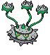

#597 - Ferroseed
<table cellspacing="0" cellpadding="0"><tr><th colspan="1" align="center"></th><th colspan="1" align="center">Type</th><th colspan="1" align="center">Ability</th></tr><tr><td align="center";rowspan="1"></td><td align="center";rowspan="1"> </td><td rowspan="1">(1) Iron Barbs</td></tr><tr><th colspan="3" align="center">Defenses</th></tr><tr><td align="right">Immune:</td><td colspan="2"></td></tr><tr><td align="right">0.25x Resist:</td><td colspan="2"></td></tr><tr><td align="right">0.5x Resist:</td><td colspan="2"></td></tr><tr><td align="right">Neutral:</td><td colspan="2"></td></tr><tr><td align="right">2x Weak:</td><td colspan="2"></td></tr><tr><td align="right">4x Weak:</td><td colspan="2"></td></tr></table>

## Evolutions
<table>
<tr><td rowspan="1"style="vertical-align: middle;">    <a href="../597">Ferroseed</a> </td><td rowspan="1"style="vertical-align: middle; word-break:break-all;">Level 40</td><td rowspan="1"style="vertical-align: middle;">    <a href="../598">Ferrothorn</a> </td></tr>
</table>

## Stats
<table class="stat"><tr><td class="stat-icon-single"></td><td class="stat-single"><u>HP</u> 44</td><td class="stat-single"><u>ATK</u> 50</td><td class="stat-single"><u>DEF</u> 91</td><td class="stat-single"><u>SPA</u> 24</td><td class="stat-single"><u>SPD</u> 86</td><td class="stat-single"><u>SPE</u> 10</td><td class="stat-single"><u>BST</u> 305</td></tr></table>

## Wild Hold Items
- 5%: Sticky Barb

## Level Up Moves
<table><th>Level</th><th>Name</th><th>Power</th><th>Accuracy</th><th>PP</th><th>Type</th><th>Damage Class</th><th>Effect</th>
<tr><td>1</td><td>Harden</td><td>None</td><td>None</td><td>30</td><td></td><td></td><td>Priority: 0. Raises the user's Defense by one stage.</td></tr>
<tr><td>1</td><td>Tackle</td><td>50</td><td>100</td><td>30</td><td></td><td></td><td>Priority: 0. Inflicts regular damage.</td></tr>
<tr><td>4</td><td>Endure</td><td>None</td><td>None</td><td>10</td><td></td><td></td><td>Priority: 4. The user's HP cannot be lowered below 1 by any means for the remainder of this turn.</td></tr>
<tr><td>7</td><td>Acid Spray</td><td>40</td><td>100</td><td>20</td><td></td><td></td><td>Priority: 0. Lowers the target's Special Defense by two stages.</td></tr>
<tr><td>10</td><td>Curse</td><td>None</td><td>None</td><td>10</td><td></td><td></td><td>Priority: 0. If the user is a ghost: user pays half its max HP to place a curse on the target, damaging it for 1/4 its max HP every turn. Otherwise: Lowers the user's Speed by one stage, and raises its Attack and Defense by one stage each.  The curse effect is passed on by baton pass.  This move cannot be copied by mirror move.</td></tr>
<tr><td>13</td><td>Payback</td><td>50</td><td>100</td><td>10</td><td></td><td></td><td>Priority: 0. If the target uses a move or switches out this turn before this move is used, this move has double power.</td></tr>
<tr><td>16</td><td>Pin Missile</td><td>25</td><td>95</td><td>20</td><td></td><td></td><td>Priority: 0. Hits 2–5 times in one turn.  Has a 3/8 chance each to hit 2 or 3 times, and a 1/8 chance each to hit 4 or 5 times.  Averages to 3 hits per use.</td></tr>
<tr><td>19</td><td>Rollout</td><td>40</td><td>90</td><td>20</td><td></td><td></td><td>Priority: 0. User is forced to use this move for five turns.  Power doubles every time this move is used in succession to a maximum of 16x, and resets to normal after the lock-in ends.</td></tr>
<tr><td>22</td><td>Mirror Shot</td><td>65</td><td>85</td><td>10</td><td></td><td></td><td>Priority: 0. Has a 30% chance to lower the target's accuracy by one stage.</td></tr>
<tr><td>25</td><td>Iron Defense</td><td>None</td><td>None</td><td>15</td><td></td><td></td><td>Priority: 0. Raises the user's Defense by two stages.</td></tr>
<tr><td>28</td><td>Bullet Seed</td><td>25</td><td>100</td><td>30</td><td></td><td></td><td>Priority: 0. Hits 2–5 times in one turn.  Has a 3/8 chance each to hit 2 or 3 times, and a 1/8 chance each to hit 4 or 5 times.  Averages to 3 hits per use.</td></tr>
<tr><td>31</td><td>Assurance</td><td>60</td><td>100</td><td>10</td><td></td><td></td><td>Priority: 0. If the target takes damage this turn for any reason before this move is used, this move has double power.</td></tr>
<tr><td>34</td><td>Leech Seed</td><td>None</td><td>90</td><td>10</td><td></td><td></td><td>Priority: 0. Plants a seed on the target that drains 1/8 of its max HP at the end of every turn and heals the user for the amount taken.</td></tr>
<tr><td>37</td><td>Metal Claw</td><td>50</td><td>95</td><td>35</td><td></td><td></td><td>Priority: 0. Has a 10% chance to raise the user's Attack one stage.</td></tr>
<tr><td>40</td><td>Spikes</td><td>None</td><td>None</td><td>20</td><td></td><td></td><td>Priority: 0. Scatters spikes around the opposing field, which damage opposing Pokémon that enter the field for 1/8 of their max HP.  Pokémon immune to ground moves are immune to this damage, except during gravity.  Up to three layers of spikes may be laid down, adding 1/16 to the damage done: two layers of spikes damage for 3/16 max HP, and three layers damage for 1/4 max HP.</td></tr>
<tr><td>44</td><td>Revenge</td><td>60</td><td>100</td><td>10</td><td></td><td></td><td>Priority: -4. If the target damaged the user this turn and was the last to do so, this move has double power.  pain split does not count as damaging the user.</td></tr>
<tr><td>48</td><td>Ingrain</td><td>None</td><td>None</td><td>20</td><td></td><td></td><td>Priority: 0. Prevents the user from switching out.  User regains 1/16 of its max HP at the end of every turn.  If the user was immune to ground attacks, it will now take normal damage from them.  roar and whirlwind will not affect the user.  The user cannot use magnet rise.</td></tr>
<tr><td>52</td><td>Gravity</td><td>None</td><td>None</td><td>5</td><td></td><td></td><td>Priority: 0. For five turns (including this one), all immunities to ground moves are disabled.  For the duration of this effect, the evasion of every Pokémon on the field is lowered by two stages.  Cancels the effects of bounce, fly, and sky drop.  Specifically, flying Pokémon and those with levitate or that have used magnet rise are no longer immune to ground attacks, arena trap, spikes, or toxic spikes.  bounce, fly, sky drop, high jump kick, jump kick, and splash cannot be used while this move is in effect.  *Bug*: If this move is used during a double or triple battle while Pokémon are under the effect of sky drop, Sky Drop's effect is not correctly canceled on its target, and it remains high in the air indefinitely.  As Sky Drop prevents the target from acting, the only way to subsequently remove it from the field is to faint it.</td></tr>
<tr><td>56</td><td>Stealth Rock</td><td>None</td><td>None</td><td>20</td><td></td><td></td><td>Priority: 0. Spreads sharp rocks around the opposing field, damaging any Pokémon that enters the field for 1/8 its max HP.  This damage is affected by the entering Pokémon's susceptibility to rock moves.  rapid spin removes this effect from its user's side of the field.</td></tr>
<tr><td>60</td><td>Self-Destruct</td><td>200</td><td>100</td><td>5</td><td></td><td></td><td>Priority: 0. User faints, even if the attack fails or misses.  Inflicts regular damage.</td></tr>
</table>

## TM Moves
<table><th>Machine</th><th>Name</th><th>Power</th><th>Accuracy</th><th>PP</th><th>Type</th><th>Damage Class</th><th>Effect</th>
<tr><td>TM1</td><td>Hone Claws</td><td>None</td><td>None</td><td>15</td><td></td><td></td><td>Priority: 0. Raises the user's Attack and accuracy by one stage.</td></tr>
<tr><td>TM6</td><td>Toxic</td><td>None</td><td>90</td><td>10</td><td></td><td></td><td>Priority: 0. Badly poisons the target.  Never misses when used by a poison-type Pokémon.</td></tr>
<tr><td>TM10</td><td>Hidden Power</td><td>60</td><td>100</td><td>15</td><td></td><td></td><td>Priority: 0. Power and type depend upon user's IVs. Power can range from 30 to 70.</td></tr>
<tr><td>TM11</td><td>Sunny Day</td><td>None</td><td>None</td><td>5</td><td></td><td></td><td>Priority: 0. Changes the weather to sunshine for five turns.</td></tr>
<tr><td>TM17</td><td>Protect</td><td>None</td><td>None</td><td>10</td><td></td><td></td><td>Priority: 4. No moves will hit the user for the remainder of this turn. If the user is last to act this turn, this move will fail. Success rate drops by 1/2 on successive attempts.</td></tr>
<tr><td>TM19</td><td>Giga Drain</td><td>80</td><td>100</td><td>10</td><td></td><td></td><td>Priority: 0. Drains half the damage inflicted to heal the user.</td></tr>
<tr><td>TM21</td><td>Frustration</td><td>None</td><td>100</td><td>20</td><td></td><td></td><td>Priority: 0. Power increases inversely with happiness, given by `(255 - happiness) * 2 / 5`, to a maximum of 102.  Power bottoms out at 1.</td></tr>
<tr><td>TM22</td><td>Solar Beam</td><td>120</td><td>100</td><td>10</td><td></td><td></td><td>Priority: 0. User charges for one turn before attacking.</td></tr>
<tr><td>TM24</td><td>Thunderbolt</td><td>90</td><td>100</td><td>10</td><td></td><td></td><td>Priority: 0. Has a 10% chance to paralyze the target.</td></tr>
<tr><td>TM27</td><td>Return</td><td>None</td><td>100</td><td>20</td><td></td><td></td><td>Priority: 0. Power increases with happiness, given by `happiness * 2 / 5`, to a maximum of 102.  Power bottoms out at 1.</td></tr>
<tr><td>TM42</td><td>Facade</td><td>70</td><td>100</td><td>20</td><td></td><td></td><td>Priority: 0. If the user is burned, paralyzed, or poisoned, this move has double power.</td></tr>
<tr><td>TM44</td><td>Rest</td><td>None</td><td>None</td><td>10</td><td></td><td></td><td>Priority: 0. User falls to sleep for two turns, replacing any existing non-volatile status ailments, and immediately regains all its HP.</td></tr>
<tr><td>TM53</td><td>Energy Ball</td><td>90</td><td>100</td><td>10</td><td></td><td></td><td>Priority: 0. Has a 10% chance to lower the target's Special Defense by one stage.</td></tr>
<tr><td>TM64</td><td>Explosion</td><td>250</td><td>100</td><td>5</td><td></td><td></td><td>Priority: 0. User faints, even if the attack fails or misses.  Inflicts regular damage.</td></tr>
<tr><td>TM69</td><td>Rock Polish</td><td>None</td><td>None</td><td>20</td><td></td><td></td><td>Priority: 0. Raises the user's Speed by two stages.</td></tr>
<tr><td>TM70</td><td>Flash</td><td>None</td><td>100</td><td>20</td><td></td><td></td><td>Priority: 0. Lowers the target's accuracy by one stage.</td></tr>
<tr><td>TM73</td><td>Thunder Wave</td><td>None</td><td>90</td><td>20</td><td></td><td></td><td>Priority: 0. Paralyzes the target.</td></tr>
<tr><td>TM74</td><td>Gyro Ball</td><td>None</td><td>100</td><td>5</td><td></td><td></td><td>Priority: 0. Power increases with the target's current Speed compared to the user, given by `1 + 25 * target Speed / user Speed`, capped at 150.</td></tr>
<tr><td>TM84</td><td>Poison Jab</td><td>80</td><td>100</td><td>10</td><td></td><td></td><td>Priority: 0. Has a 30% chance to poison the target.</td></tr>
<tr><td>TM87</td><td>Rock Climb</td><td>80</td><td>95</td><td>10</td><td></td><td></td><td>Priority: 0. Has a 20% chance to confuse the target.</td></tr>
<tr><td>TM90</td><td>Substitute</td><td>None</td><td>None</td><td>10</td><td></td><td></td><td>Priority: 0. Transfers 1/4 the user's max HP into a doll that absorbs damage and causes most negative move effects to fail.</td></tr>
<tr><td>TM91</td><td>Flash Cannon</td><td>90</td><td>100</td><td>10</td><td></td><td></td><td>Priority: 0. Has a 10% chance to lower the target's Special Defense by one stage.</td></tr>
<tr><td>TM94</td><td>Rock Smash</td><td>55</td><td>100</td><td>15</td><td></td><td></td><td>Priority: 0. 100% chance to drop target's Def by one stage. Also boosted by the ability Iron Fist</td></tr>
</table>

## Tutor Moves
<table><th>Name</th><th>Power</th><th>Accuracy</th><th>PP</th><th>Type</th><th>Damage Class</th><th>Effect</th>
<tr><td>Endeavor</td><td>None</td><td>100</td><td>5</td><td></td><td></td><td>Priority: 0. Inflicts exactly enough damage to lower the target's HP to equal the user's.  If the target's HP is not higher than the user's, this move has no effect.  Type immunity applies, but other type effects are ignored.  This effect counts as damage for moves that respond to damage.</td></tr>
<tr><td>Giga Drain</td><td>80</td><td>100</td><td>10</td><td></td><td></td><td>Priority: 0. Drains half the damage inflicted to heal the user.</td></tr>
<tr><td>Gravity</td><td>None</td><td>None</td><td>5</td><td></td><td></td><td>Priority: 0. For five turns (including this one), all immunities to ground moves are disabled.  For the duration of this effect, the evasion of every Pokémon on the field is lowered by two stages.  Cancels the effects of bounce, fly, and sky drop.  Specifically, flying Pokémon and those with levitate or that have used magnet rise are no longer immune to ground attacks, arena trap, spikes, or toxic spikes.  bounce, fly, sky drop, high jump kick, jump kick, and splash cannot be used while this move is in effect.  *Bug*: If this move is used during a double or triple battle while Pokémon are under the effect of sky drop, Sky Drop's effect is not correctly canceled on its target, and it remains high in the air indefinitely.  As Sky Drop prevents the target from acting, the only way to subsequently remove it from the field is to faint it.</td></tr>
<tr><td>Iron Defense</td><td>None</td><td>None</td><td>15</td><td></td><td></td><td>Priority: 0. Raises the user's Defense by two stages.</td></tr>
<tr><td>Iron Head</td><td>80</td><td>100</td><td>15</td><td></td><td></td><td>Priority: 0. Has a 30% chance to make the target flinch.</td></tr>
<tr><td>Magnet Rise</td><td>None</td><td>None</td><td>10</td><td></td><td></td><td>Priority: 0. For five turns, the user is immune to ground moves.  If the user is under the effect of ingrain or has levitate, this move will fail.  This effect is temporarily disabled by and cannot be used during gravity.  This effect is passed on by baton pass.</td></tr>
<tr><td>Seed Bomb</td><td>80</td><td>100</td><td>15</td><td></td><td></td><td>Priority: 0. Inflicts regular damage.</td></tr>
<tr><td>Sleep Talk</td><td>None</td><td>None</td><td>10</td><td></td><td></td><td>Priority: 0. Only usable if the user is sleeping. Randomly selects and uses one of the user's other three moves. Use of the selected move requires and costs 0 PP.</td></tr>
<tr><td>Snore</td><td>50</td><td>100</td><td>15</td><td></td><td></td><td>Priority: 0. Only usable if the user is sleeping.   Has a 30% chance to make the target flinch.</td></tr>
<tr><td>Stealth Rock</td><td>None</td><td>None</td><td>20</td><td></td><td></td><td>Priority: 0. Spreads sharp rocks around the opposing field, damaging any Pokémon that enters the field for 1/8 its max HP.  This damage is affected by the entering Pokémon's susceptibility to rock moves.  rapid spin removes this effect from its user's side of the field.</td></tr>
<tr><td>Worry Seed</td><td>None</td><td>100</td><td>10</td><td></td><td></td><td>Priority: 0. Changes the target's ability to insomnia.  If the target's ability is truant or multitype, this move will fail.</td></tr>
</table>

## Encounter Locations

| Location | &nbsp; | &nbsp; | Level | Spawn Percent |
|: -- :|: -- :|: -- :|: -- :|: -- :|
| [Chargestone Cave] | 1F | Cave | 32-36 | 10.0 |
| [Chargestone Cave] | B1F | Cave | 36-40 | 10.0 |
| [Chargestone Cave] | B2F | Cave | 38-41 | 10.0 |

--8<-- "includes/abilities.md"

[Chargestone Cave]: ../../wildareas/Chargestone_Cave/
