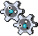

#599 - Klink
<table cellspacing="0" cellpadding="0"><tr><th colspan="1" align="center"></th><th colspan="1" align="center">Type</th><th colspan="1" align="center">Ability</th></tr><tr><td align="center";rowspan="1"></td><td align="center";rowspan="1"></td><td rowspan="1">(1) Levitate</td></tr><tr><th colspan="3" align="center">Defenses</th></tr><tr><td align="right">Immune:</td><td colspan="2"></td></tr><tr><td align="right">0.25x Resist:</td><td colspan="2"></td></tr><tr><td align="right">0.5x Resist:</td><td colspan="2"></td></tr><tr><td align="right">Neutral:</td><td colspan="2"></td></tr><tr><td align="right">2x Weak:</td><td colspan="2"></td></tr><tr><td align="right">4x Weak:</td><td colspan="2"></td></tr></table>

## Evolutions
<table>
<tr><td rowspan="1"style="vertical-align: middle;">    <a href="../599">Klink</a> </td><td rowspan="1"style="vertical-align: middle; word-break:break-all;">Level 30</td><td rowspan="1"style="vertical-align: middle;">    <a href="../600">Klang</a> </td><td rowspan="1"style="vertical-align: middle; word-break:break-all;">Level 49</td><td rowspan="1"style="vertical-align: middle;">    <a href="../601">Klinklang</a> </td></tr>
</table>

## Stats
<table class="stat"><tr><td class="stat-icon-single"></td><td class="stat-single"><u>HP</u> 40</td><td class="stat-single"><u>ATK</u> 55</td><td class="stat-single"><u>DEF</u> 70</td><td class="stat-single"><u>SPA</u> 45</td><td class="stat-single"><u>SPD</u> 60</td><td class="stat-single"><u>SPE</u> 30</td><td class="stat-single"><u>BST</u> 300</td></tr></table>

## Level Up Moves
<table><th>Level</th><th>Name</th><th>Power</th><th>Accuracy</th><th>PP</th><th>Type</th><th>Damage Class</th><th>Effect</th>
<tr><td>1</td><td>Thunder Shock</td><td>40</td><td>100</td><td>25</td><td></td><td></td><td>Priority: 0. Has a 10% chance to paralyze the target.</td></tr>
<tr><td>4</td><td>Bind</td><td>15</td><td>85</td><td>20</td><td></td><td></td><td>Priority: 0. For the next 2–5 turns, the target cannot leave the field and is damaged for 1/16 its max HP at the end of each turn.</td></tr>
<tr><td>8</td><td>Charge</td><td>None</td><td>None</td><td>20</td><td></td><td></td><td>Priority: 0. Raises the user's Special Defense by one stage.  If the user uses an electric move next turn, its power will be doubled.</td></tr>
<tr><td>12</td><td>Charge Beam</td><td>50</td><td>90</td><td>15</td><td></td><td></td><td>Priority: 0. Has a 70% chance to raise the user's Special Attack by one stage.</td></tr>
<tr><td>15</td><td>Iron Defense</td><td>None</td><td>None</td><td>15</td><td></td><td></td><td>Priority: 0. Raises the user's Defense by two stages.</td></tr>
<tr><td>18</td><td>Mirror Shot</td><td>65</td><td>85</td><td>10</td><td></td><td></td><td>Priority: 0. Has a 30% chance to lower the target's accuracy by one stage.</td></tr>
<tr><td>21</td><td>Autotomize</td><td>None</td><td>None</td><td>15</td><td></td><td></td><td>Priority: 0. Raises the user's Speed by two stages.  Halves the user's weight; this effect does not stack.</td></tr>
<tr><td>24</td><td>Ally Switch</td><td>None</td><td>None</td><td>15</td><td></td><td></td><td>Priority: 2. User switches position on the field with the friendly Pokémon opposite it.  If the user is in the middle position in a triple battle, or there are no other friendly Pokémon, this move will fail.</td></tr>
<tr><td>27</td><td>Spark</td><td>65</td><td>100</td><td>20</td><td></td><td></td><td>Priority: 0. Has a 30% chance to paralyze the target.</td></tr>
<tr><td>30</td><td>Gear Grind</td><td>65</td><td>95</td><td>10</td><td></td><td></td><td>Priority: 0. Hits twice in one turn.</td></tr>
<tr><td>33</td><td>Rapid Spin</td><td>50</td><td>100</td><td>40</td><td></td><td></td><td>Priority: 0. Removes leech seed from the user, frees the user from bind, clamp, fire spin, magma storm, sand tomb, whirlpool, and wrap, and clears spikes, stealth rock, and toxic spikes from the user's side of the field.  If this move misses or has no effect, its effect doesn't activate.</td></tr>
<tr><td>36</td><td>Assurance</td><td>60</td><td>100</td><td>10</td><td></td><td></td><td>Priority: 0. If the target takes damage this turn for any reason before this move is used, this move has double power.</td></tr>
<tr><td>39</td><td>Discharge</td><td>80</td><td>100</td><td>15</td><td></td><td></td><td>Priority: 0. Has a 30% chance to paralyze the target.</td></tr>
<tr><td>42</td><td>Shift Gear</td><td>None</td><td>None</td><td>10</td><td></td><td></td><td>Priority: 0. Raises the user's Attack by one stage and its Speed by two stages.</td></tr>
<tr><td>45</td><td>Flame Wheel</td><td>75</td><td>100</td><td>20</td><td></td><td></td><td>Priority: 0. Has a 10% chance to burn the target.  Frozen Pokémon may use this move, in which case they will thaw.</td></tr>
<tr><td>48</td><td>Mega Kick</td><td>120</td><td>75</td><td>5</td><td></td><td></td><td>Priority: 0. Inflicts regular damage.</td></tr>
<tr><td>51</td><td>Lock-On</td><td>None</td><td>None</td><td>5</td><td></td><td></td><td>Priority: 0. If the user targets the same target again before the end of the next turn, the move it uses is guaranteed to hit.</td></tr>
<tr><td>54</td><td>Zap Cannon</td><td>120</td><td>50</td><td>5</td><td></td><td></td><td>Priority: 0. Has a 100% chance to paralyze the target.</td></tr>
<tr><td>57</td><td>Hyper Beam</td><td>150</td><td>90</td><td>5</td><td></td><td></td><td>Priority: 0. User loses its next turn to "recharge", and cannot attack or switch out during that turn.</td></tr>
</table>

## TM Moves
<table><th>Machine</th><th>Name</th><th>Power</th><th>Accuracy</th><th>PP</th><th>Type</th><th>Damage Class</th><th>Effect</th>
<tr><td>TM6</td><td>Toxic</td><td>None</td><td>90</td><td>10</td><td></td><td></td><td>Priority: 0. Badly poisons the target.  Never misses when used by a poison-type Pokémon.</td></tr>
<tr><td>TM10</td><td>Hidden Power</td><td>60</td><td>100</td><td>15</td><td></td><td></td><td>Priority: 0. Power and type depend upon user's IVs. Power can range from 30 to 70.</td></tr>
<tr><td>TM15</td><td>Hyper Beam</td><td>150</td><td>90</td><td>5</td><td></td><td></td><td>Priority: 0. User loses its next turn to "recharge", and cannot attack or switch out during that turn.</td></tr>
<tr><td>TM17</td><td>Protect</td><td>None</td><td>None</td><td>10</td><td></td><td></td><td>Priority: 4. No moves will hit the user for the remainder of this turn. If the user is last to act this turn, this move will fail. Success rate drops by 1/2 on successive attempts.</td></tr>
<tr><td>TM21</td><td>Frustration</td><td>None</td><td>100</td><td>20</td><td></td><td></td><td>Priority: 0. Power increases inversely with happiness, given by `(255 - happiness) * 2 / 5`, to a maximum of 102.  Power bottoms out at 1.</td></tr>
<tr><td>TM24</td><td>Thunderbolt</td><td>90</td><td>100</td><td>10</td><td></td><td></td><td>Priority: 0. Has a 10% chance to paralyze the target.</td></tr>
<tr><td>TM27</td><td>Return</td><td>None</td><td>100</td><td>20</td><td></td><td></td><td>Priority: 0. Power increases with happiness, given by `happiness * 2 / 5`, to a maximum of 102.  Power bottoms out at 1.</td></tr>
<tr><td>TM37</td><td>Sandstorm</td><td>None</td><td>None</td><td>10</td><td></td><td></td><td>Priority: 0. Changes the weather to a sandstorm for five turns.  Pokémon that are not ground, rock, or steel take 1/16 their max HP at the end of every turn.  Every rock Pokémon's original Special Defense is raised by 50% for the duration of this effect.</td></tr>
<tr><td>TM42</td><td>Facade</td><td>70</td><td>100</td><td>20</td><td></td><td></td><td>Priority: 0. If the user is burned, paralyzed, or poisoned, this move has double power.</td></tr>
<tr><td>TM44</td><td>Rest</td><td>None</td><td>None</td><td>10</td><td></td><td></td><td>Priority: 0. User falls to sleep for two turns, replacing any existing non-volatile status ailments, and immediately regains all its HP.</td></tr>
<tr><td>TM57</td><td>Charge Beam</td><td>50</td><td>90</td><td>15</td><td></td><td></td><td>Priority: 0. Has a 70% chance to raise the user's Special Attack by one stage.</td></tr>
<tr><td>TM66</td><td>Power Gem</td><td>90</td><td>100</td><td>10</td><td></td><td></td><td>Priority: 0. 10% chance to drop opponents Sp. Def by one stage</td></tr>
<tr><td>TM69</td><td>Rock Polish</td><td>None</td><td>None</td><td>20</td><td></td><td></td><td>Priority: 0. Raises the user's Speed by two stages.</td></tr>
<tr><td>TM72</td><td>Volt Switch</td><td>70</td><td>100</td><td>20</td><td></td><td></td><td>Priority: 0. Inflicts regular damage, then the user immediately switches out, and the trainer selects a replacement Pokémon from the party.  If the target faints from this attack, the user's trainer selects the new Pokémon to send out first.  If the user is the last Pokémon in its party that can battle, it will not switch out.  The user may be hit by pursuit when it switches out, if it has been targeted and pursuit has not yet been used.  This move may be used even if the user is under the effect of ingrain.  ingrain's effect will end.</td></tr>
<tr><td>TM73</td><td>Thunder Wave</td><td>None</td><td>90</td><td>20</td><td></td><td></td><td>Priority: 0. Paralyzes the target.</td></tr>
<tr><td>TM90</td><td>Substitute</td><td>None</td><td>None</td><td>10</td><td></td><td></td><td>Priority: 0. Transfers 1/4 the user's max HP into a doll that absorbs damage and causes most negative move effects to fail.</td></tr>
<tr><td>TM91</td><td>Flash Cannon</td><td>90</td><td>100</td><td>10</td><td></td><td></td><td>Priority: 0. Has a 10% chance to lower the target's Special Defense by one stage.</td></tr>
<tr><td>TM93</td><td>Wild Charge</td><td>90</td><td>100</td><td>10</td><td></td><td></td><td>Priority: 0. Inflicts regular damage without recoil.</td></tr>
<tr><td>TM94</td><td>Rock Smash</td><td>55</td><td>100</td><td>15</td><td></td><td></td><td>Priority: 0. 100% chance to drop target's Def by one stage. Also boosted by the ability Iron Fist</td></tr>
</table>

## Tutor Moves
<table><th>Name</th><th>Power</th><th>Accuracy</th><th>PP</th><th>Type</th><th>Damage Class</th><th>Effect</th>
<tr><td>Bind</td><td>15</td><td>85</td><td>20</td><td></td><td></td><td>Priority: 0. For the next 2–5 turns, the target cannot leave the field and is damaged for 1/16 its max HP at the end of each turn.</td></tr>
<tr><td>Gravity</td><td>None</td><td>None</td><td>5</td><td></td><td></td><td>Priority: 0. For five turns (including this one), all immunities to ground moves are disabled.  For the duration of this effect, the evasion of every Pokémon on the field is lowered by two stages.  Cancels the effects of bounce, fly, and sky drop.  Specifically, flying Pokémon and those with levitate or that have used magnet rise are no longer immune to ground attacks, arena trap, spikes, or toxic spikes.  bounce, fly, sky drop, high jump kick, jump kick, and splash cannot be used while this move is in effect.  *Bug*: If this move is used during a double or triple battle while Pokémon are under the effect of sky drop, Sky Drop's effect is not correctly canceled on its target, and it remains high in the air indefinitely.  As Sky Drop prevents the target from acting, the only way to subsequently remove it from the field is to faint it.</td></tr>
<tr><td>Iron Defense</td><td>None</td><td>None</td><td>15</td><td></td><td></td><td>Priority: 0. Raises the user's Defense by two stages.</td></tr>
<tr><td>Magic Coat</td><td>None</td><td>None</td><td>15</td><td></td><td></td><td>Priority: 4. The first non-damaging move targeting the user this turn that inflicts major status effects, stat changes, or trapping effects will be reflected at its user.  defog, memento, and teeter dance are not reflected.  attract, flatter, gastro acid, leech seed, swagger, worry seed, and yawn are reflected.  This move cannot be copied by mirror move.</td></tr>
<tr><td>Magnet Rise</td><td>None</td><td>None</td><td>10</td><td></td><td></td><td>Priority: 0. For five turns, the user is immune to ground moves.  If the user is under the effect of ingrain or has levitate, this move will fail.  This effect is temporarily disabled by and cannot be used during gravity.  This effect is passed on by baton pass.</td></tr>
<tr><td>Recycle</td><td>None</td><td>None</td><td>10</td><td></td><td></td><td>Priority: 0. User recovers the last item consumed by the user or a Pokémon in its position on the field.  The item must be used again before it can be recovered by this move again.  If the user is holding an item, this move fails.  Items taken or given away by covet, knock off, switcheroo, thief, or trick may not be recovered.</td></tr>
<tr><td>Signal Beam</td><td>75</td><td>100</td><td>15</td><td></td><td></td><td>Priority: 0. Has a 10% chance to confuse the target.</td></tr>
<tr><td>Sleep Talk</td><td>None</td><td>None</td><td>10</td><td></td><td></td><td>Priority: 0. Only usable if the user is sleeping. Randomly selects and uses one of the user's other three moves. Use of the selected move requires and costs 0 PP.</td></tr>
<tr><td>Snore</td><td>50</td><td>100</td><td>15</td><td></td><td></td><td>Priority: 0. Only usable if the user is sleeping.   Has a 30% chance to make the target flinch.</td></tr>
<tr><td>Uproar</td><td>90</td><td>100</td><td>10</td><td></td><td></td><td>Priority: 0. User is forced to use this move for 2–5 turns, selected at random. No Pokemon can sleep during the effect of this move. </td></tr>
</table>

## Encounter Locations

| Location | &nbsp; | &nbsp; | Level | Spawn Percent |
|: -- :|: -- :|: -- :|: -- :|: -- :|
| [Chargestone Cave] | 1F | Cave | 32-36 | 20.0 |
| [Chargestone Cave] | B1F | Cave | 36-40 | 20.0 |
| [Chargestone Cave] | B2F | Cave | 38-41 | 20.0 |
| [P2 Laboratory] | Grass | &nbsp; | 63 | 4.0 |
| [Virbank Complex - Inside] | Grass | &nbsp; | 14-15 | 5.0 |

--8<-- "includes/abilities.md"

[P2 Laboratory]: ../../wildareas/P2_Laboratory/
[Chargestone Cave]: ../../wildareas/Chargestone_Cave/
[Virbank Complex - Inside]: ../../wildareas/Virbank_Complex_-_Inside/
