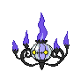

#609 - Chandelure
<table cellspacing="0" cellpadding="0"><tr><th colspan="1" align="center"></th><th colspan="1" align="center">Type</th><th colspan="1" align="center">Ability</th></tr><tr><td align="center";rowspan="1"></td><td align="center";rowspan="1"> </td><td rowspan="1">(1) Flash Fire   (2) Flame Body   (HA) Shadow Tag</td></tr><tr><th colspan="3" align="center">Defenses</th></tr><tr><td align="right">Immune:</td><td colspan="2"></td></tr><tr><td align="right">0.25x Resist:</td><td colspan="2"></td></tr><tr><td align="right">0.5x Resist:</td><td colspan="2"></td></tr><tr><td align="right">Neutral:</td><td colspan="2"></td></tr><tr><td align="right">2x Weak:</td><td colspan="2"></td></tr><tr><td align="right">4x Weak:</td><td colspan="2"></td></tr></table>

## Evolutions
<table>
<tr><td rowspan="1"style="vertical-align: middle;">    <a href="../607">Litwick</a> </td><td rowspan="1"style="vertical-align: middle; word-break:break-all;">Level 27</td><td rowspan="1"style="vertical-align: middle;">    <a href="../608">Lampent</a> </td><td rowspan="1"style="vertical-align: middle; word-break:break-all;">Use Dusk Stone</td><td rowspan="1"style="vertical-align: middle;">    <a href="../609">Chandelure</a> </td></tr>
</table>

## Stats
<table class="stat"><tr><td class="stat-icon-single"></td><td class="stat-single"><u>HP</u> 60</td><td class="stat-single"><u>ATK</u> 55</td><td class="stat-single"><u>DEF</u> 90</td><td class="stat-single"><u>SPA</u> 145</td><td class="stat-single"><u>SPD</u> 90</td><td class="stat-single"><u>SPE</u> 80</td><td class="stat-single"><u>BST</u> 520</td></tr></table>

## Level Up Moves
<table><th>Level</th><th>Name</th><th>Power</th><th>Accuracy</th><th>PP</th><th>Type</th><th>Damage Class</th><th>Effect</th>
<tr><td>1</td><td>Acid Armor</td><td>None</td><td>None</td><td>20</td><td></td><td></td><td>Priority: 0. Raises the user's Defense by two stages.</td></tr>
<tr><td>1</td><td>Ally Switch</td><td>None</td><td>None</td><td>15</td><td></td><td></td><td>Priority: 2. User switches position on the field with the friendly Pokémon opposite it.  If the user is in the middle position in a triple battle, or there are no other friendly Pokémon, this move will fail.</td></tr>
<tr><td>1</td><td>Clear Smog</td><td>50</td><td>None</td><td>15</td><td></td><td></td><td>Priority: 0. All of the target's stat modifiers are reset to zero.</td></tr>
<tr><td>1</td><td>Haze</td><td>None</td><td>None</td><td>30</td><td></td><td></td><td>Priority: 0. Removes stat, accuracy, and evasion modifiers from every Pokémon on the field.</td></tr>
<tr><td>1</td><td>Imprison</td><td>None</td><td>None</td><td>10</td><td></td><td></td><td>Priority: 0. Prevents any Pokémon on the opposing side of the field from using any move the user knows until the user leaves the field.  This effect is live; if the user obtains new moves while on the field, these moves become restricted.</td></tr>
<tr><td>1</td><td>Night Shade</td><td>None</td><td>100</td><td>15</td><td></td><td></td><td>Priority: 0. Inflicts damage equal to the user's level.  Type immunity applies, but other type effects are ignored.</td></tr>
<tr><td>40</td><td>Hex</td><td>65</td><td>100</td><td>15</td><td></td><td></td><td>Priority: 0. If the target has a major status ailment, this move has double power.</td></tr>
<tr><td>50</td><td>Inferno</td><td>100</td><td>65</td><td>5</td><td></td><td></td><td>Priority: 0. Has a 100% chance to burn the target.</td></tr>
<tr><td>60</td><td>Pain Split</td><td>None</td><td>None</td><td>20</td><td></td><td></td><td>Priority: 0. Changes the user's and target's remaining HP to the average of their current remaining HP.</td></tr>
<tr><td>70</td><td>Overheat</td><td>130</td><td>90</td><td>5</td><td></td><td></td><td>Priority: 0. Inflicts regular damage, then lowers the user's Special Attack by two stages.</td></tr>
</table>

## TM Moves
<table><th>Machine</th><th>Name</th><th>Power</th><th>Accuracy</th><th>PP</th><th>Type</th><th>Damage Class</th><th>Effect</th>
<tr><td>TM4</td><td>Calm Mind</td><td>None</td><td>None</td><td>10</td><td></td><td></td><td>Priority: 0. Raises the user's Special Attack and Special Defense by one stage each.</td></tr>
<tr><td>TM6</td><td>Toxic</td><td>None</td><td>90</td><td>10</td><td></td><td></td><td>Priority: 0. Badly poisons the target.  Never misses when used by a poison-type Pokémon.</td></tr>
<tr><td>TM10</td><td>Hidden Power</td><td>60</td><td>100</td><td>15</td><td></td><td></td><td>Priority: 0. Power and type depend upon user's IVs. Power can range from 30 to 70.</td></tr>
<tr><td>TM11</td><td>Sunny Day</td><td>None</td><td>None</td><td>5</td><td></td><td></td><td>Priority: 0. Changes the weather to sunshine for five turns.</td></tr>
<tr><td>TM12</td><td>Taunt</td><td>None</td><td>100</td><td>20</td><td></td><td></td><td>Priority: 0. Target is forced to only use damaging moves for the next 3–5 turns, selected at random.</td></tr>
<tr><td>TM15</td><td>Hyper Beam</td><td>150</td><td>90</td><td>5</td><td></td><td></td><td>Priority: 0. User loses its next turn to "recharge", and cannot attack or switch out during that turn.</td></tr>
<tr><td>TM17</td><td>Protect</td><td>None</td><td>None</td><td>10</td><td></td><td></td><td>Priority: 4. No moves will hit the user for the remainder of this turn. If the user is last to act this turn, this move will fail. Success rate drops by 1/2 on successive attempts.</td></tr>
<tr><td>TM21</td><td>Frustration</td><td>None</td><td>100</td><td>20</td><td></td><td></td><td>Priority: 0. Power increases inversely with happiness, given by `(255 - happiness) * 2 / 5`, to a maximum of 102.  Power bottoms out at 1.</td></tr>
<tr><td>TM22</td><td>Solar Beam</td><td>120</td><td>100</td><td>10</td><td></td><td></td><td>Priority: 0. User charges for one turn before attacking.</td></tr>
<tr><td>TM27</td><td>Return</td><td>None</td><td>100</td><td>20</td><td></td><td></td><td>Priority: 0. Power increases with happiness, given by `happiness * 2 / 5`, to a maximum of 102.  Power bottoms out at 1.</td></tr>
<tr><td>TM29</td><td>Psychic</td><td>90</td><td>100</td><td>10</td><td></td><td></td><td>Priority: 0. Has a 10% chance to lower the target's Special Defense by one stage.</td></tr>
<tr><td>TM30</td><td>Shadow Ball</td><td>80</td><td>100</td><td>10</td><td></td><td></td><td>Priority: 0. Has a 20% chance to lower the target's Special Defense by one stage.</td></tr>
<tr><td>TM32</td><td>Dazzling Gleam</td><td>80</td><td>100</td><td>10</td><td></td><td></td><td>Priority: 0. Inflicts regular damage.</td></tr>
<tr><td>TM35</td><td>Flamethrower</td><td>90</td><td>100</td><td>10</td><td></td><td></td><td>Priority: 0. Has a 10% chance to burn the target.</td></tr>
<tr><td>TM38</td><td>Fire Blast</td><td>110</td><td>85</td><td>5</td><td></td><td></td><td>Priority: 0. Has a 10% chance to burn the target.</td></tr>
<tr><td>TM42</td><td>Facade</td><td>70</td><td>100</td><td>20</td><td></td><td></td><td>Priority: 0. If the user is burned, paralyzed, or poisoned, this move has double power.</td></tr>
<tr><td>TM43</td><td>Flame Charge</td><td>60</td><td>100</td><td>20</td><td></td><td></td><td>Priority: 0. Raises the user's Speed by one stage.</td></tr>
<tr><td>TM44</td><td>Rest</td><td>None</td><td>None</td><td>10</td><td></td><td></td><td>Priority: 0. User falls to sleep for two turns, replacing any existing non-volatile status ailments, and immediately regains all its HP.</td></tr>
<tr><td>TM48</td><td>Mystical Fire</td><td>75</td><td>100</td><td>10</td><td></td><td></td><td>Priority: 0. Has a 100% chance to lower the target's Special Attack by one stage.</td></tr>
<tr><td>TM50</td><td>Overheat</td><td>130</td><td>90</td><td>5</td><td></td><td></td><td>Priority: 0. Inflicts regular damage, then lowers the user's Special Attack by two stages.</td></tr>
<tr><td>TM53</td><td>Energy Ball</td><td>90</td><td>100</td><td>10</td><td></td><td></td><td>Priority: 0. Has a 10% chance to lower the target's Special Defense by one stage.</td></tr>
<tr><td>TM59</td><td>Incinerate</td><td>60</td><td>100</td><td>15</td><td></td><td></td><td>Priority: 0. If the target is holding a berry, it's destroyed and cannot be used in response to this move.</td></tr>
<tr><td>TM61</td><td>Will-O-Wisp</td><td>None</td><td>85</td><td>15</td><td></td><td></td><td>Priority: 0. Burns the target.</td></tr>
<tr><td>TM68</td><td>Giga Impact</td><td>150</td><td>90</td><td>5</td><td></td><td></td><td>Priority: 0. User loses its next turn to "recharge", and cannot attack or switch out during that turn.</td></tr>
<tr><td>TM70</td><td>Flash</td><td>None</td><td>100</td><td>20</td><td></td><td></td><td>Priority: 0. Lowers the target's accuracy by one stage.</td></tr>
<tr><td>TM77</td><td>Psych Up</td><td>None</td><td>None</td><td>10</td><td></td><td></td><td>Priority: 0. Discards the user's stat changes and copies the target's.  This move cannot be copied by mirror move.</td></tr>
<tr><td>TM90</td><td>Substitute</td><td>None</td><td>None</td><td>10</td><td></td><td></td><td>Priority: 0. Transfers 1/4 the user's max HP into a doll that absorbs damage and causes most negative move effects to fail.</td></tr>
<tr><td>TM92</td><td>Trick Room</td><td>None</td><td>None</td><td>5</td><td></td><td></td><td>Priority: -7. For five turns (including this one), slower Pokémon will act before faster Pokémon.  Move priority is not affected.  Using this move when its effect is already active will end the effect.</td></tr>
</table>

## Tutor Moves
<table><th>Name</th><th>Power</th><th>Accuracy</th><th>PP</th><th>Type</th><th>Damage Class</th><th>Effect</th>
<tr><td>Dark Pulse</td><td>80</td><td>Never Miss</td><td>10</td><td></td><td></td><td>Priority: 0. Has a 20% chance to make the target flinch.</td></tr>
<tr><td>Heat Wave</td><td>100</td><td>90</td><td>10</td><td></td><td></td><td>Priority: 0. Has a 10% chance to burn the target.</td></tr>
<tr><td>Pain Split</td><td>None</td><td>None</td><td>20</td><td></td><td></td><td>Priority: 0. Changes the user's and target's remaining HP to the average of their current remaining HP.</td></tr>
<tr><td>Sleep Talk</td><td>None</td><td>None</td><td>10</td><td></td><td></td><td>Priority: 0. Only usable if the user is sleeping. Randomly selects and uses one of the user's other three moves. Use of the selected move requires and costs 0 PP.</td></tr>
<tr><td>Snore</td><td>50</td><td>100</td><td>15</td><td></td><td></td><td>Priority: 0. Only usable if the user is sleeping.   Has a 30% chance to make the target flinch.</td></tr>
<tr><td>Spite</td><td>None</td><td>100</td><td>10</td><td></td><td></td><td>Priority: 0. Lowers the PP of the target's last used move by 4.  If the target hasn't used a move since entering the field, if it tried to use a move this turn and failed, or if its last used move has 0 PP remaining, this move will fail.</td></tr>
<tr><td>Trick</td><td>None</td><td>100</td><td>10</td><td></td><td></td><td>Priority: 0. User and target permanently swap held items.</td></tr>
</table>

## Pre-Evolution Moves
| Species | Method | Move |
|: --- :|: --- :|: --- :|
| Lampent | Lvl 1 | Acid |
| Lampent | Lvl 1 | Astonish |
| Lampent | Lvl 1 | Captivate |
| Lampent | Lvl 12 | Confuse Ray |
| Lampent | Lvl 37 | Curse |
| Lampent | Lvl 1 | Ember |
| Lampent | Lvl 8 | Fire Spin |
| Lampent | Lvl 27 | Flame Burst |
| Lampent | Lvl 61 | Memento |
| Lampent | Lvl 53 | Power Split |
| Lampent | Lvl 10 | Smog |

--8<-- "includes/abilities.md"

