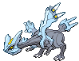
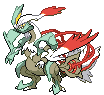

#646 - Kyurem
=== "Kyurem"
	<table cellspacing="0" cellpadding="0"><tr><th colspan="1" align="center"></th><th colspan="1" align="center">Type</th><th colspan="1" align="center">Ability</th></tr><tr><td align="center";rowspan="1"></td><td align="center";rowspan="1"> </td><td rowspan="1">(1) Pressure   (2) Pressure</td></tr><tr><th colspan="3" align="center">Defenses</th></tr><tr><td align="right">Immune:</td><td colspan="2"></td></tr><tr><td align="right">0.25x Resist:</td><td colspan="2"></td></tr><tr><td align="right">0.5x Resist:</td><td colspan="2"></td></tr><tr><td align="right">Neutral:</td><td colspan="2"></td></tr><tr><td align="right">2x Weak:</td><td colspan="2"></td></tr><tr><td align="right">4x Weak:</td><td colspan="2"></td></tr></table>

=== "White"
	<table cellspacing="0" cellpadding="0"><tr><th colspan="1" align="center">White</th><th colspan="1" align="center">Type</th><th colspan="1" align="center">Ability</th></tr><tr><td align="center";rowspan="1"></td><td align="center";rowspan="1"> </td><td rowspan="1">(1) Turboblaze</td></tr></table>

=== "Black"
	<table cellspacing="0" cellpadding="0"><tr><th colspan="1" align="center">Black</th><th colspan="1" align="center">Type</th><th colspan="1" align="center">Ability</th></tr><tr><td align="center";rowspan="1"></td><td align="center";rowspan="1"> </td><td rowspan="1">(1) Teravolt</td></tr></table>

&nbsp;

## Stats
<table class="stat"><tr><td class="stat-icon-single"></td><td class="stat-single"><u>HP</u> 125</td><td class="stat-single"><u>ATK</u> 130</td><td class="stat-single"><u>DEF</u> 90</td><td class="stat-single"><u>SPA</u> 130</td><td class="stat-single"><u>SPD</u> 90</td><td class="stat-single"><u>SPE</u> 95</td><td class="stat-single"><u>BST</u> 660</td></tr>
<tr><td class="stat-icon-single"></td><td class="stat-single"><u>HP</u> 125</td><td class="stat-single"><u>ATK</u> 120</td><td class="stat-single"><u>DEF</u> 90</td><td class="stat-single"><u>SPA</u> 170</td><td class="stat-single"><u>SPD</u> 100</td><td class="stat-single"><u>SPE</u> 95</td><td class="stat-single"><u>BST</u> 700</td></tr>
<tr><td class="stat-icon-single"></td><td class="stat-single"><u>HP</u> 125</td><td class="stat-single"><u>ATK</u> 170</td><td class="stat-single"><u>DEF</u> 100</td><td class="stat-single"><u>SPA</u> 120</td><td class="stat-single"><u>SPD</u> 90</td><td class="stat-single"><u>SPE</u> 95</td><td class="stat-single"><u>BST</u> 700</td></tr></table>

## Wild Hold Items
<table><tr><th> White

</th><th> Black

</th></tr>
<tr><td>- 50%: Power Herb - 5%: Power Herb - 1%: Power Herb </td><td>- 50%: Power Herb - 5%: Power Herb - 1%: Power Herb </td></tr>
</table>

## Level Up Moves
<table><th>Form</th><th>Level</th><th>Name</th><th>Power</th><th>Accuracy</th><th>PP</th><th>Type</th><th>Damage Class</th><th>Effect</th>
<tr><td></td><td>1</td><td>Ancient Power</td><td>60</td><td>100</td><td>5</td><td></td><td></td><td>Priority: 0. Has a 10% chance to raise all of the user's stats one stage.</td></tr>
<tr><td></td><td>1</td><td>Dragon Breath</td><td>70</td><td>100</td><td>20</td><td></td><td></td><td>Priority: 0. Has a 30% chance to paralyze the target.</td></tr>
<tr><td></td><td>1</td><td>Dragon Dance</td><td>None</td><td>None</td><td>20</td><td></td><td></td><td>Priority: 0. Raises the user's Attack and Speed by one stage each.</td></tr>
<tr><td></td><td>1</td><td>Dual Wingbeat</td><td>40</td><td>90</td><td>10</td><td></td><td></td><td>Priority: 0. Inflicts regular damage.</td></tr>
<tr><td></td><td>1</td><td>Icicle Spear</td><td>25</td><td>100</td><td>30</td><td></td><td></td><td>Priority: 0. Hits 2–5 times in one turn.  Has a 3/8 chance each to hit 2 or 3 times, and a 1/8 chance each to hit 4 or 5 times.  Averages to 3 hits per use.</td></tr>
<tr><td></td><td>8</td><td>Slash</td><td>70</td><td>100</td><td>15</td><td></td><td></td><td>Priority: 0. User's critical hit rate is one level higher when using this move.</td></tr>
<tr><td></td><td>14</td><td>Endeavor</td><td>None</td><td>100</td><td>5</td><td></td><td></td><td>Priority: 0. Inflicts exactly enough damage to lower the target's HP to equal the user's.  If the target's HP is not higher than the user's, this move has no effect.  Type immunity applies, but other type effects are ignored.  This effect counts as damage for moves that respond to damage.</td></tr>
<tr><td></td><td>19</td><td>Ice Beam</td><td>90</td><td>100</td><td>10</td><td></td><td></td><td>Priority: 0. Has a 10% chance to freeze the target.</td></tr>
<tr><td></td><td>24</td><td>Dragon Pulse</td><td>90</td><td>None</td><td>10</td><td></td><td></td><td>Priority: 0. Bypasses accuracy checks</td></tr>
<tr><td></td><td>29</td><td>Icicle Crash</td><td>85</td><td>90</td><td>10</td><td></td><td></td><td>Priority: 0. Has a 30% chance to make the target flinch.</td></tr>
<tr><td></td><td>32</td><td>Hyper Voice</td><td>90</td><td>100</td><td>10</td><td></td><td></td><td>Priority: 0. Inflicts regular damage.</td></tr>
<tr><td></td><td>35</td><td>Scary Face</td><td>None</td><td>100</td><td>10</td><td></td><td></td><td>Priority: 0. Lowers the target's Speed by two stages.</td></tr>
<tr><td></td><td>38</td><td>Blizzard</td><td>110</td><td>70</td><td>5</td><td></td><td></td><td>Priority: 0. Has a 10% chance to freeze the target.  During hail, this move has 100% accuracy.</td></tr>
<tr><td></td><td>41</td><td>Imprison</td><td>None</td><td>None</td><td>10</td><td></td><td></td><td>Priority: 0. Prevents any Pokémon on the opposing side of the field from using any move the user knows until the user leaves the field.  This effect is live; if the user obtains new moves while on the field, these moves become restricted.</td></tr>
<tr><td></td><td>44</td><td>Outrage</td><td>120</td><td>100</td><td>10</td><td></td><td></td><td>Priority: 0. User is forced to attack with this move for 2–3 turns,selected at random.  After the last hit, the user becomes confused.</td></tr>
<tr><td></td><td>47</td><td>Glaciate</td><td>85</td><td>100</td><td>10</td><td></td><td></td><td>Priority: 0. Lowers the target's Speed by one stage.</td></tr>
<tr><td></td><td>50</td><td>Sheer Cold</td><td>None</td><td>30</td><td>5</td><td></td><td></td><td>Priority: 0. Inflicts damage equal to the target's max HP.  Ignores accuracy and evasion modifiers.  This move's accuracy is 30% plus 1% for each level the user is higher than the target.  If the user is a lower level than the target, this move will fail.  Because this move inflicts a specific and finite amount of damage, endure still prevents the target from fainting.  The effects of lock on, mind reader, and no guard still apply, as long as the user is equal or higher level than the target.</td></tr>
<tr><td></td><td>70</td><td>Dragon Dance</td><td>None</td><td>None</td><td>20</td><td></td><td></td><td>Priority: 0. Raises the user's Attack and Speed by one stage each.</td></tr>
<tr><td></td><td>70</td><td>Esper Wing</td><td>70</td><td>100</td><td>10</td><td></td><td></td><td>Priority: 1. None</td></tr>
<tr><td></td><td>70</td><td>Freeze Shock</td><td>140</td><td>90</td><td>5</td><td></td><td></td><td>Priority: 0. Has a 30% chance to paralyze the target.  User charges for one turn before attacking.</td></tr>
<tr><td></td><td>70</td><td>Fusion Bolt</td><td>100</td><td>100</td><td>5</td><td></td><td></td><td>Priority: 0. If a friendly Pokémon used fusion flare earlier this turn, this move has double power.</td></tr>
<tr><td></td><td>70</td><td>Fusion Flare</td><td>100</td><td>100</td><td>5</td><td></td><td></td><td>Priority: 0. If a friendly Pokémon used fusion bolt earlier this turn, this move has double power.</td></tr>
<tr><td></td><td>70</td><td>Ice Beam</td><td>90</td><td>100</td><td>10</td><td></td><td></td><td>Priority: 0. Has a 10% chance to freeze the target.</td></tr>
<tr><td></td><td>70</td><td>Ice Burn</td><td>140</td><td>90</td><td>5</td><td></td><td></td><td>Priority: 0. Has a 30% chance to burn the target.  User charges for one turn before attacking.</td></tr>
<tr><td></td><td>70</td><td>Icicle Crash</td><td>85</td><td>90</td><td>10</td><td></td><td></td><td>Priority: 0. Has a 30% chance to make the target flinch.</td></tr>
</table>

## TM Moves
<table><th>Machine</th><th>Name</th><th>Power</th><th>Accuracy</th><th>PP</th><th>Type</th><th>Damage Class</th><th>Effect</th>
<tr><td>TM1</td><td>Hone Claws</td><td>None</td><td>None</td><td>15</td><td></td><td></td><td>Priority: 0. Raises the user's Attack and accuracy by one stage.</td></tr>
<tr><td>TM2</td><td>Dragon Claw</td><td>85</td><td>100</td><td>10</td><td></td><td></td><td>Priority: 0. High Critical Ratio</td></tr>
<tr><td>TM6</td><td>Toxic</td><td>None</td><td>90</td><td>10</td><td></td><td></td><td>Priority: 0. Badly poisons the target.  Never misses when used by a poison-type Pokémon.</td></tr>
<tr><td>TM7</td><td>Hail</td><td>None</td><td>None</td><td>10</td><td></td><td></td><td>Priority: 0. Changes the weather to hail for five turns, during which non-ice Pokémon are damaged for 1/16 their max HP at the end of every turn.</td></tr>
<tr><td>TM10</td><td>Hidden Power</td><td>60</td><td>100</td><td>15</td><td></td><td></td><td>Priority: 0. Power and type depend upon user's IVs. Power can range from 30 to 70.</td></tr>
<tr><td>TM11</td><td>Sunny Day</td><td>None</td><td>None</td><td>5</td><td></td><td></td><td>Priority: 0. Changes the weather to sunshine for five turns.</td></tr>
<tr><td>TM13</td><td>Ice Beam</td><td>90</td><td>100</td><td>10</td><td></td><td></td><td>Priority: 0. Has a 10% chance to freeze the target.</td></tr>
<tr><td>TM14</td><td>Blizzard</td><td>110</td><td>70</td><td>5</td><td></td><td></td><td>Priority: 0. Has a 10% chance to freeze the target.  During hail, this move has 100% accuracy.</td></tr>
<tr><td>TM15</td><td>Hyper Beam</td><td>150</td><td>90</td><td>5</td><td></td><td></td><td>Priority: 0. User loses its next turn to "recharge", and cannot attack or switch out during that turn.</td></tr>
<tr><td>TM16</td><td>Light Screen</td><td>None</td><td>None</td><td>30</td><td></td><td></td><td>Priority: 0. Reduces damage from special attacks by half for five turns. In double battles, the reduction is 1/3.</td></tr>
<tr><td>TM17</td><td>Protect</td><td>None</td><td>None</td><td>10</td><td></td><td></td><td>Priority: 4. No moves will hit the user for the remainder of this turn. If the user is last to act this turn, this move will fail. Success rate drops by 1/2 on successive attempts.</td></tr>
<tr><td>TM18</td><td>Rain Dance</td><td>None</td><td>None</td><td>5</td><td></td><td></td><td>Priority: 0. Changes the weather to rain for five turns, during which water moves inflict 50% extra damage, and fire moves inflict half damage.</td></tr>
<tr><td>TM21</td><td>Frustration</td><td>None</td><td>100</td><td>20</td><td></td><td></td><td>Priority: 0. Power increases inversely with happiness, given by `(255 - happiness) * 2 / 5`, to a maximum of 102.  Power bottoms out at 1.</td></tr>
<tr><td>TM27</td><td>Return</td><td>None</td><td>100</td><td>20</td><td></td><td></td><td>Priority: 0. Power increases with happiness, given by `happiness * 2 / 5`, to a maximum of 102.  Power bottoms out at 1.</td></tr>
<tr><td>TM29</td><td>Psychic</td><td>90</td><td>100</td><td>10</td><td></td><td></td><td>Priority: 0. Has a 10% chance to lower the target's Special Defense by one stage.</td></tr>
<tr><td>TM30</td><td>Shadow Ball</td><td>80</td><td>100</td><td>10</td><td></td><td></td><td>Priority: 0. Has a 20% chance to lower the target's Special Defense by one stage.</td></tr>
<tr><td>TM33</td><td>Reflect</td><td>None</td><td>None</td><td>20</td><td></td><td></td><td>Priority: 0. Reduces damage from physical attacks by half for five turns. In double battles, the reduction is 1/3.</td></tr>
<tr><td>TM39</td><td>Rock Tomb</td><td>60</td><td>95</td><td>15</td><td></td><td></td><td>Priority: 0. Has a 100% chance to lower the target's Speed by one stage.</td></tr>
<tr><td>TM42</td><td>Facade</td><td>70</td><td>100</td><td>20</td><td></td><td></td><td>Priority: 0. If the user is burned, paralyzed, or poisoned, this move has double power.</td></tr>
<tr><td>TM44</td><td>Rest</td><td>None</td><td>None</td><td>10</td><td></td><td></td><td>Priority: 0. User falls to sleep for two turns, replacing any existing non-volatile status ailments, and immediately regains all its HP.</td></tr>
<tr><td>TM49</td><td>Echoed Voice</td><td>50</td><td>100</td><td>15</td><td></td><td></td><td>Priority: 0. If any friendly Pokémon used this move earlier this turn or on the previous turn, that use's power is added to this move's power, to a maximum of 200.</td></tr>
<tr><td>TM52</td><td>Focus Blast</td><td>120</td><td>70</td><td>5</td><td></td><td></td><td>Priority: 0. Has a 10% chance to lower the target's Special Defense by one stage.</td></tr>
<tr><td>TM56</td><td>Weather Ball</td><td>50</td><td>100</td><td>10</td><td></td><td></td><td>Priority: 0. If a weather move is active, this move has double power, and its type becomes the type of the weather move.</td></tr>
<tr><td>TM63</td><td>Brutal Swing</td><td>60</td><td>100</td><td>20</td><td></td><td></td><td>Priority: 0. Inflicts regular damage.</td></tr>
<tr><td>TM65</td><td>Shadow Claw</td><td>70</td><td>100</td><td>90</td><td></td><td></td><td>Priority: 0. User's critical hit rate is one level higher when using this move.</td></tr>
<tr><td>TM68</td><td>Giga Impact</td><td>150</td><td>90</td><td>5</td><td></td><td></td><td>Priority: 0. User loses its next turn to "recharge", and cannot attack or switch out during that turn.</td></tr>
<tr><td>TM71</td><td>Stone Edge</td><td>100</td><td>80</td><td>5</td><td></td><td></td><td>Priority: 0. User's critical hit rate is one level higher when using this move.</td></tr>
<tr><td>TM79</td><td>Frost Breath</td><td>50</td><td>90</td><td>10</td><td></td><td></td><td>Priority: 0. Always scores a critical hit.</td></tr>
<tr><td>TM80</td><td>Rock Slide</td><td>75</td><td>90</td><td>10</td><td></td><td></td><td>Priority: 0. Has a 30% chance to make the target flinch.</td></tr>
<tr><td>TM82</td><td>Dragon Tail</td><td>60</td><td>95</td><td>10</td><td></td><td></td><td>Priority: -6. Inflicts regular damage, then switches the target out for another of its trainer's Pokémon, selected at random.  If the target is under the effect of ingrain or suction cups, or it has a substitute, or its Trainer has no more usable Pokémon, it will not be switched out.  If the target is a wild Pokémon, the battle ends instead.</td></tr>
<tr><td>TM83</td><td>Work Up</td><td>None</td><td>None</td><td>30</td><td></td><td></td><td>Priority: 0. Raises the user's Attack and Special Attack by one stage each.</td></tr>
<tr><td>TM87</td><td>Rock Climb</td><td>80</td><td>95</td><td>10</td><td></td><td></td><td>Priority: 0. Has a 20% chance to confuse the target.</td></tr>
<tr><td>TM90</td><td>Substitute</td><td>None</td><td>None</td><td>10</td><td></td><td></td><td>Priority: 0. Transfers 1/4 the user's max HP into a doll that absorbs damage and causes most negative move effects to fail.</td></tr>
<tr><td>TM91</td><td>Flash Cannon</td><td>90</td><td>100</td><td>10</td><td></td><td></td><td>Priority: 0. Has a 10% chance to lower the target's Special Defense by one stage.</td></tr>
<tr><td>TM94</td><td>Rock Smash</td><td>55</td><td>100</td><td>15</td><td></td><td></td><td>Priority: 0. 100% chance to drop target's Def by one stage. Also boosted by the ability Iron Fist</td></tr>
<tr><td>HM1</td><td>Cut</td><td>50</td><td>95</td><td>30</td><td></td><td></td><td>Priority: 0. High Critical Ratio</td></tr>
<tr><td>HM2</td><td>Fly</td><td>80</td><td>100</td><td>15</td><td></td><td></td><td>Priority: 0. User flies high into the air for one turn, becoming immune to attack, and hits on the second turn.  During the immune turn, gust (2x dmg), hurricane, sky uppercut, smack down, thunder, twister (2x dmg), and whirlwind still hit the user normally.  Gust and twister also have double power against the user.  The damage from hail and sandstorm still applies during the immune turn.  The user may be hit under the effect of lock on, mind reader, or no guard.  This move cannot be used while gravity is in effect.  This move cannot be selected by sleep talk.</td></tr>
<tr><td>HM4</td><td>Strength</td><td>85</td><td>100</td><td>10</td><td></td><td></td><td>Priority: 0. 10% Raise Attack</td></tr>
</table>

## Tutor Moves
<table><th>Form</th><th>Name</th><th>Power</th><th>Accuracy</th><th>PP</th><th>Type</th><th>Damage Class</th><th>Effect</th>
<tr><td></td><td>Bounce</td><td>85</td><td>85</td><td>5</td><td></td><td></td><td>Priority: 0. User bounces high into the air for one turn, becoming immune to attack, and hits on the second turn.  Has a 30% chance to paralyze the target.  During the immune turn, gust, hurricane, sky uppercut, smack down, thunder, and twister still hit the user normally.  gust and twister also have double power against the user.  The damage from hail and sandstorm still applies during the immune turn.  The user may be hit during its immune turn if under the effect of lock on, mind reader, or no guard.  This move cannot be used while gravity is in effect.</td></tr>
<tr><td></td><td>Draco Meteor</td><td>130</td><td>90</td><td>5</td><td></td><td></td><td>Priority: 0. Inflicts regular damage, then lowers the user's Special Attack by two stages.</td></tr>
<tr><td></td><td>Dragon Pulse</td><td>90</td><td>None</td><td>10</td><td></td><td></td><td>Priority: 0. Bypasses accuracy checks</td></tr>
<tr><td></td><td>Earth Power</td><td>90</td><td>100</td><td>10</td><td></td><td></td><td>Priority: 0. Has a 10% chance to lower the target's Special Defense by one stage.</td></tr>
<tr><td></td><td>Endeavor</td><td>None</td><td>100</td><td>5</td><td></td><td></td><td>Priority: 0. Inflicts exactly enough damage to lower the target's HP to equal the user's.  If the target's HP is not higher than the user's, this move has no effect.  Type immunity applies, but other type effects are ignored.  This effect counts as damage for moves that respond to damage.</td></tr>
<tr><td></td><td>Gunk Shot</td><td>120</td><td>80</td><td>5</td><td></td><td></td><td>Priority: 0. Has a 30% chance to poison the target.</td></tr>
<tr><td></td><td>Hyper Voice</td><td>90</td><td>100</td><td>10</td><td></td><td></td><td>Priority: 0. Inflicts regular damage.</td></tr>
<tr><td></td><td>Icy Wind</td><td>55</td><td>95</td><td>15</td><td></td><td></td><td>Priority: 0. Has a 100% chance to lower the target's Speed by one stage.</td></tr>
<tr><td></td><td>Iron Head</td><td>80</td><td>100</td><td>15</td><td></td><td></td><td>Priority: 0. Has a 30% chance to make the target flinch.</td></tr>
<tr><td></td><td>Low Kick</td><td>None</td><td>100</td><td>20</td><td></td><td></td><td>Priority: 0. Power increases with the target's weight in kilograms, to a maximum of 120.  Target's weight | Power --------------- | ----: Up to 10kg      |    20 Up to 25kg      |    40 Up to 50kg      |    60 Up to 100kg     |    80 Up to 200kg     |   100 Above 200kg     |   120</td></tr>
<tr><td></td><td>Outrage</td><td>120</td><td>100</td><td>10</td><td></td><td></td><td>Priority: 0. User is forced to attack with this move for 2–3 turns,selected at random.  After the last hit, the user becomes confused.</td></tr>
<tr><td></td><td>Roost</td><td>None</td><td>None</td><td>10</td><td></td><td></td><td>Priority: 0. Heals the user for half its max HP.  If the user is flying, its flying type is ignored until the end of this turn.</td></tr>
<tr><td></td><td>Signal Beam</td><td>75</td><td>100</td><td>15</td><td></td><td></td><td>Priority: 0. Has a 10% chance to confuse the target.</td></tr>
<tr><td></td><td>Sleep Talk</td><td>None</td><td>None</td><td>10</td><td></td><td></td><td>Priority: 0. Only usable if the user is sleeping. Randomly selects and uses one of the user's other three moves. Use of the selected move requires and costs 0 PP.</td></tr>
<tr><td></td><td>Snore</td><td>50</td><td>100</td><td>15</td><td></td><td></td><td>Priority: 0. Only usable if the user is sleeping.   Has a 30% chance to make the target flinch.</td></tr>
<tr><td></td><td>Zen Headbutt</td><td>80</td><td>90</td><td>10</td><td></td><td></td><td>Priority: 0. Has a 20% chance to make the target flinch.</td></tr>
</table>

## Encounter Locations

| Location | &nbsp; | &nbsp; | Level | Spawn Percent |
|: -- :|: -- :|: -- :|: -- :|: -- :|
| [Giants Chasm] | Kyurems Cave | Special Event | 75 | 100.0 |

--8<-- "includes/abilities.md"

[Giants Chasm]: ../../wildareas/Giants_Chasm/
