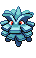
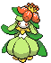
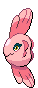

<table><tr><th colspan="1">Encounter Method</th><th colspan="5" style = "text-align: center;">Available Pokémon</th></tr>
<tr><td rowspan="2" style="vertical-align: middle; word-wrap: break-word; text-align: center;">Grass</td><td style="text-align: center; vertical-align: bottom;">    <a href="../../pokemons/546">Cottonee</a>   Lv: 41-44   20.0% </td><td style="text-align: center; vertical-align: bottom;">    <a href="../../pokemons/548">Petilil</a>   Lv: 41-44   20.0% </td><td style="text-align: center; vertical-align: bottom;">    <a href="../../pokemons/055">Golduck</a>   Lv: 41-44   10.0% </td><td style="text-align: center; vertical-align: bottom;">    <a href="../../pokemons/044">Gloom</a>   Lv: 41-44   10.0% </td><td style="text-align: center; vertical-align: bottom;">    <a href="../../pokemons/183">Marill</a>   Lv: 41-44   10.0% </td></tr>
<tr><td style="text-align: center; vertical-align: bottom;">    <a href="../../pokemons/333">Swablu</a>   Lv: 41-44   10.0% </td><td style="text-align: center; vertical-align: bottom;">    <a href="../../pokemons/204">Pineco</a>   Lv: 41-44   5.0% </td><td style="text-align: center; vertical-align: bottom;">    <a href="../../pokemons/133">Eevee</a>   Lv: 41-44   5.0% </td><td style="text-align: center; vertical-align: bottom;">    <a href="../../pokemons/037">Vulpix</a>   Lv: 41-44   5.0% </td><td style="text-align: center; vertical-align: bottom;">    <a href="../../pokemons/079">Slowpoke</a>   Lv: 41-44   5.0% </td></tr>
<tr><td rowspan="2" style="vertical-align: middle; word-wrap: break-word; text-align: center;">Dark Grass (Doubles)</td><td style="text-align: center; vertical-align: bottom;">    <a href="../../pokemons/546">Cottonee</a>   Lv: 42-46   20.0% </td><td style="text-align: center; vertical-align: bottom;">    <a href="../../pokemons/548">Petilil</a>   Lv: 42-46   20.0% </td><td style="text-align: center; vertical-align: bottom;">    <a href="../../pokemons/055">Golduck</a>   Lv: 42-46   15.0% </td><td style="text-align: center; vertical-align: bottom;">    <a href="../../pokemons/334">Altaria</a>   Lv: 42-46   15.0% </td><td style="text-align: center; vertical-align: bottom;">    <a href="../../pokemons/183">Marill</a>   Lv: 42-46   10.0% </td></tr>
<tr><td style="text-align: center; vertical-align: bottom;">    <a href="../../pokemons/044">Gloom</a>   Lv: 42-46   10.0% </td><td style="text-align: center; vertical-align: bottom;">    <a href="../../pokemons/204">Pineco</a>   Lv: 42-46   5.0% </td><td style="text-align: center; vertical-align: bottom;">    <a href="../../pokemons/133">Eevee</a>   Lv: 42-46   5.0% </td><td></td><td></td></tr>
<tr><td rowspan="2" style="vertical-align: middle; word-wrap: break-word; text-align: center;">Shaking Grass</td><td style="text-align: center; vertical-align: bottom;">    <a href="../../pokemons/531">Audino</a>   Lv: 45-46   60.0% </td><td style="text-align: center; vertical-align: bottom;">    <a href="../../pokemons/547">Whimsicott</a>   Lv: 42-46   10.0% </td><td style="text-align: center; vertical-align: bottom;">    <a href="../../pokemons/549">Lilligant</a>   Lv: 42-46   10.0% </td><td style="text-align: center; vertical-align: bottom;">    <a href="../../pokemons/045">Vileplume</a>   Lv: 42-46   5.0% </td><td style="text-align: center; vertical-align: bottom;">    <a href="../../pokemons/182">Bellossom</a>   Lv: 42-46   5.0% </td></tr>
<tr><td style="text-align: center; vertical-align: bottom;">    <a href="../../pokemons/038">Ninetales</a>   Lv: 42-46   5.0% </td><td style="text-align: center; vertical-align: bottom;">    <a href="../../pokemons/587">Emolga</a>   Lv: 42-46   5.0% </td><td></td><td></td><td></td></tr>
<tr><td rowspan="1" style="vertical-align: middle; word-wrap: break-word; text-align: center;">Surf</td><td style="text-align: center; vertical-align: bottom;">    <a href="../../pokemons/118">Goldeen</a>   Lv: 40-46   65.0% </td><td style="text-align: center; vertical-align: bottom;">    <a href="../../pokemons/211">Qwilfish</a>   Lv: 40-46   30.0% </td><td style="text-align: center; vertical-align: bottom;">    <a href="../../pokemons/079">Slowpoke</a>   Lv: 40-46   5.0% </td><td></td><td></td></tr>
<tr><td rowspan="1" style="vertical-align: middle; word-wrap: break-word; text-align: center;">Surf, Rippling Water</td><td style="text-align: center; vertical-align: bottom;">    <a href="../../pokemons/119">Seaking</a>   Lv: 40-46   70.0% </td><td style="text-align: center; vertical-align: bottom;">    <a href="../../pokemons/211">Qwilfish</a>   Lv: 40-46   30.0% </td><td></td><td></td><td></td></tr>
<tr><td rowspan="1" style="vertical-align: middle; word-wrap: break-word; text-align: center;">Fish</td><td style="text-align: center; vertical-align: bottom;">    <a href="../../pokemons/341">Corphish</a>   Lv: 40-46   70.0% </td><td style="text-align: center; vertical-align: bottom;">    <a href="../../pokemons/550">Basculin-Blue</a>   Lv: 40-46   30.0% </td><td style="text-align: center; vertical-align: bottom;">    <a href="../../pokemons/342">Crawdaunt</a>   Lv: 40-46   10.0% </td><td></td><td></td></tr>
<tr><td rowspan="1" style="vertical-align: middle; word-wrap: break-word; text-align: center;">Fish, Rippling Water</td><td style="text-align: center; vertical-align: bottom;">    <a href="../../pokemons/341">Corphish</a>   Lv: 40-46   60.0% </td><td style="text-align: center; vertical-align: bottom;">    <a href="../../pokemons/550">Basculin-Red</a>   Lv: 40-46   30.0% </td><td></td><td></td><td></td></tr>
<tr><td rowspan="3" style="vertical-align: middle; word-wrap: break-word; text-align: center;">Hidden Grotto: Entrance</td><td style="text-align: center; vertical-align: bottom;">    <a href="../../pokemons/043">Oddish</a>   Lv: ??   3.75% </td><td style="text-align: center; vertical-align: bottom;">    <a href="../../pokemons/054">Psyduck</a>   Lv: ??   3.75% </td><td style="text-align: center; vertical-align: bottom;">    <a href="../../pokemons/204">Pineco</a>   Lv: ??   3.75% </td><td style="text-align: center; vertical-align: bottom;">    <a href="../../pokemons/333">Swablu</a>   Lv: ??   3.75% </td><td style="text-align: center; vertical-align: bottom;">    <a href="../../pokemons/211">Qwilfish</a>   Lv: ??   1.0% </td></tr>
<tr><td style="text-align: center; vertical-align: bottom;">    <a href="../../pokemons/341">Corphish</a>   Lv: ??   1.0% </td><td style="text-align: center; vertical-align: bottom;">    <a href="../../pokemons/406">Budew</a>   Lv: ??   1.0% </td><td style="text-align: center; vertical-align: bottom;">    <a href="../../pokemons/183">Marill</a>   Lv: ??   1.0% </td><td style="text-align: center; vertical-align: bottom;">    <a href="../../pokemons/133">Eevee</a>   Lv: ??   0.25% </td><td style="text-align: center; vertical-align: bottom;">    <a href="../../pokemons/079">Slowpoke</a>   Lv: ??   0.25% </td></tr>
<tr><td style="text-align: center; vertical-align: bottom;">    <a href="../../pokemons/037">Vulpix</a>   Lv: ??   0.25% </td><td style="text-align: center; vertical-align: bottom;">    <a href="../../pokemons/063">Abra</a>   Lv: ??   0.25% </td><td></td><td></td><td></td></tr>
<tr><td rowspan="2" style="vertical-align: middle; word-wrap: break-word; text-align: center;">Hidden Grotto: Back Pond near Shrine</td><td style="text-align: center; vertical-align: bottom;">    <a href="../../pokemons/333">Swablu</a>   Lv: ??   7.5% </td><td style="text-align: center; vertical-align: bottom;">    <a href="../../pokemons/594">Alomomola</a>   Lv: ??   7.5% </td><td style="text-align: center; vertical-align: bottom;">    <a href="../../pokemons/341">Corphish</a>   Lv: ??   1.0% </td><td style="text-align: center; vertical-align: bottom;">    <a href="../../pokemons/098">Krabby</a>   Lv: ??   1.0% </td><td style="text-align: center; vertical-align: bottom;">    <a href="../../pokemons/211">Qwilfish</a>   Lv: ??   1.0% </td></tr>
<tr><td style="text-align: center; vertical-align: bottom;">    <a href="../../pokemons/318">Carvanha</a>   Lv: ??   1.0% </td><td style="text-align: center; vertical-align: bottom;">    <a href="../../pokemons/147">Dratini</a>   Lv: ??   0.5% </td><td style="text-align: center; vertical-align: bottom;">    <a href="../../pokemons/060">Poliwag</a>   Lv: ??   0.5% </td><td></td><td></td></tr></table>