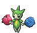

<table><tr><th colspan="1">Encounter Method</th><th colspan="5" style = "text-align: center;">Available Pokémon</th></tr>
<tr><td rowspan="2" style="vertical-align: middle; word-wrap: break-word; text-align: center;">Grass</td><td style="text-align: center; vertical-align: bottom;">    <a href="../../pokemons/546">Cottonee</a>   Lv: 22-24   20.0% </td><td style="text-align: center; vertical-align: bottom;">    <a href="../../pokemons/548">Petilil</a>   Lv: 22-24   20.0% </td><td style="text-align: center; vertical-align: bottom;">    <a href="../../pokemons/133">Eevee</a>   Lv: 22-24   10.0% </td><td style="text-align: center; vertical-align: bottom;">    <a href="../../pokemons/517">Munna</a>   Lv: 22-24   10.0% </td><td style="text-align: center; vertical-align: bottom;">    <a href="../../pokemons/427">Buneary</a>   Lv: 22-24   10.0% </td></tr>
<tr><td style="text-align: center; vertical-align: bottom;">    <a href="../../pokemons/209">Snubbull</a>   Lv: 22-24   10.0% </td><td style="text-align: center; vertical-align: bottom;">    <a href="../../pokemons/300">Skitty</a>   Lv: 22-24   5.0% </td><td style="text-align: center; vertical-align: bottom;">    <a href="../../pokemons/315">Roselia</a>   Lv: 22-24   5.0% </td><td style="text-align: center; vertical-align: bottom;">    <a href="../../pokemons/412">Burmy</a>   Lv: 22-24   5.0% </td><td style="text-align: center; vertical-align: bottom;">    <a href="../../pokemons/063">Abra</a>   Lv: 22-24   5.0% </td></tr>
<tr><td rowspan="2" style="vertical-align: middle; word-wrap: break-word; text-align: center;">Dark Grass (Doubles)</td><td style="text-align: center; vertical-align: bottom;">    <a href="../../pokemons/546">Cottonee</a>   Lv: 23-25   20.0% </td><td style="text-align: center; vertical-align: bottom;">    <a href="../../pokemons/548">Petilil</a>   Lv: 23-25   20.0% </td><td style="text-align: center; vertical-align: bottom;">    <a href="../../pokemons/315">Roselia</a>   Lv: 23-25   10.0% </td><td style="text-align: center; vertical-align: bottom;">    <a href="../../pokemons/043">Oddish</a>   Lv: 23-25   10.0% </td><td style="text-align: center; vertical-align: bottom;">    <a href="../../pokemons/209">Snubbull</a>   Lv: 23-25   10.0% </td></tr>
<tr><td style="text-align: center; vertical-align: bottom;">    <a href="../../pokemons/300">Skitty</a>   Lv: 23-25   10.0% </td><td style="text-align: center; vertical-align: bottom;">    <a href="../../pokemons/012">Butterfree</a>   Lv: 23-25   5.0% </td><td style="text-align: center; vertical-align: bottom;">    <a href="../../pokemons/015">Beedrill</a>   Lv: 23-25   5.0% </td><td style="text-align: center; vertical-align: bottom;">    <a href="../../pokemons/039">Jigglypuff</a>   Lv: 23-25   5.0% </td><td style="text-align: center; vertical-align: bottom;">    <a href="../../pokemons/063">Abra</a>   Lv: 23-25   5.0% </td></tr>
<tr><td rowspan="1" style="vertical-align: middle; word-wrap: break-word; text-align: center;">Shaking Grass</td><td style="text-align: center; vertical-align: bottom;">    <a href="../../pokemons/531">Audino</a>   Lv: 25   100.0% </td><td></td><td></td><td></td><td></td></tr></table>