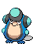

<table><tr><th colspan="1">Encounter Method</th><th colspan="5" style = "text-align: center;">Available Pokémon</th></tr>
<tr><td rowspan="2" style="vertical-align: middle; word-wrap: break-word; text-align: center;">Sewer</td><td style="text-align: center; vertical-align: bottom;">    <a href="../../pokemons/088">Grimer</a>   Lv: 19-20   20.0% </td><td style="text-align: center; vertical-align: bottom;">    <a href="../../pokemons/109">Koffing</a>   Lv: 19-20   20.0% </td><td style="text-align: center; vertical-align: bottom;">    <a href="../../pokemons/019">Rattata</a>   Lv: 19-20   10.0% </td><td style="text-align: center; vertical-align: bottom;">    <a href="../../pokemons/041">Zubat</a>   Lv: 19-20   10.0% </td><td style="text-align: center; vertical-align: bottom;">    <a href="../../pokemons/316">Gulpin</a>   Lv: 19-20   10.0% </td></tr>
<tr><td style="text-align: center; vertical-align: bottom;">    <a href="../../pokemons/568">Trubbish</a>   Lv: 19-20   10.0% </td><td style="text-align: center; vertical-align: bottom;">    <a href="../../pokemons/167">Spinarak</a>   Lv: 19-20   10.0% </td><td style="text-align: center; vertical-align: bottom;">    <a href="../../pokemons/092">Gastly</a>   Lv: 19-20   5.0% </td><td style="text-align: center; vertical-align: bottom;">    <a href="../../pokemons/079">Slowpoke</a>   Lv: 19-20   5.0% </td><td></td></tr>
<tr><td rowspan="1" style="vertical-align: middle; word-wrap: break-word; text-align: center;">Surf</td><td style="text-align: center; vertical-align: bottom;">    <a href="../../pokemons/088">Grimer</a>   Lv: 25-35   60.0% </td><td style="text-align: center; vertical-align: bottom;">    <a href="../../pokemons/618">Stunfisk</a>   Lv: 25-35   30.0% </td><td style="text-align: center; vertical-align: bottom;">    <a href="../../pokemons/536">Palpitoad</a>   Lv: 25-35   5.0% </td><td style="text-align: center; vertical-align: bottom;">    <a href="../../pokemons/536">Palpitoad</a>   Lv: 30-40   5.0% </td><td></td></tr>
<tr><td rowspan="1" style="vertical-align: middle; word-wrap: break-word; text-align: center;">Surf, Rippling Water</td><td style="text-align: center; vertical-align: bottom;">    <a href="../../pokemons/618">Stunfisk</a>   Lv: 30-40   60.0% </td><td style="text-align: center; vertical-align: bottom;">    <a href="../../pokemons/536">Palpitoad</a>   Lv: 30-40   30.0% </td><td style="text-align: center; vertical-align: bottom;">    <a href="../../pokemons/537">Seismitoad</a>   Lv: 35-45   5.0% </td><td style="text-align: center; vertical-align: bottom;">    <a href="../../pokemons/089">Muk</a>   Lv: 35-45   5.0% </td><td></td></tr>
<tr><td rowspan="1" style="vertical-align: middle; word-wrap: break-word; text-align: center;">Fish</td><td style="text-align: center; vertical-align: bottom;">    <a href="../../pokemons/088">Grimer</a>   Lv: 10-20   65.0% </td><td style="text-align: center; vertical-align: bottom;">    <a href="../../pokemons/618">Stunfisk</a>   Lv: 10-20   35.0% </td><td></td><td></td><td></td></tr>
<tr><td rowspan="1" style="vertical-align: middle; word-wrap: break-word; text-align: center;">Fish, Rippling Water</td><td style="text-align: center; vertical-align: bottom;">    <a href="../../pokemons/088">Grimer</a>   Lv: 10-23   65.0% </td><td style="text-align: center; vertical-align: bottom;">    <a href="../../pokemons/618">Stunfisk</a>   Lv: 17-23   35.0% </td><td></td><td></td><td></td></tr></table>