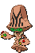

## 2F

<table><tr><th colspan="1">Encounter Method</th><th colspan="5" style = "text-align: center;">Available Pokémon</th></tr>
<tr><td rowspan="2" style="vertical-align: middle; word-wrap: break-word; text-align: center;">Floor</td><td style="text-align: center; vertical-align: bottom;">    <a href="../../pokemons/607">Litwick</a>   Lv: 39-42   20.0% </td><td style="text-align: center; vertical-align: bottom;">    <a href="../../pokemons/104">Cubone</a>   Lv: 39-42   20.0% </td><td style="text-align: center; vertical-align: bottom;">    <a href="../../pokemons/433">Chingling</a>   Lv: 39-42   10.0% </td><td style="text-align: center; vertical-align: bottom;">    <a href="../../pokemons/353">Shuppet</a>   Lv: 39-42   10.0% </td><td style="text-align: center; vertical-align: bottom;">    <a href="../../pokemons/355">Duskull</a>   Lv: 39-42   10.0% </td></tr>
<tr><td style="text-align: center; vertical-align: bottom;">    <a href="../../pokemons/605">Elgyem</a>   Lv: 39-42   10.0% </td><td style="text-align: center; vertical-align: bottom;">    <a href="../../pokemons/436">Bronzor</a>   Lv: 39-42   5.0% </td><td style="text-align: center; vertical-align: bottom;">    <a href="../../pokemons/198">Murkrow</a>   Lv: 39-42   5.0% </td><td style="text-align: center; vertical-align: bottom;">    <a href="../../pokemons/200">Misdreavus</a>   Lv: 39-42   5.0% </td><td style="text-align: center; vertical-align: bottom;">    <a href="../../pokemons/358">Chimecho</a>   Lv: 39-42   5.0% </td></tr></table>
## 3F

<table><tr><th colspan="1">Encounter Method</th><th colspan="5" style = "text-align: center;">Available Pokémon</th></tr>
<tr><td rowspan="2" style="vertical-align: middle; word-wrap: break-word; text-align: center;">Floor</td><td style="text-align: center; vertical-align: bottom;">    <a href="../../pokemons/607">Litwick</a>   Lv: 40-43   20.0% </td><td style="text-align: center; vertical-align: bottom;">    <a href="../../pokemons/605">Elgyem</a>   Lv: 40-43   20.0% </td><td style="text-align: center; vertical-align: bottom;">    <a href="../../pokemons/104">Cubone</a>   Lv: 40-43   10.0% </td><td style="text-align: center; vertical-align: bottom;">    <a href="../../pokemons/355">Duskull</a>   Lv: 40-43   10.0% </td><td style="text-align: center; vertical-align: bottom;">    <a href="../../pokemons/433">Chingling</a>   Lv: 40-43   10.0% </td></tr>
<tr><td style="text-align: center; vertical-align: bottom;">    <a href="../../pokemons/436">Bronzor</a>   Lv: 40-43   10.0% </td><td style="text-align: center; vertical-align: bottom;">    <a href="../../pokemons/093">Haunter</a>   Lv: 40-43   5.0% </td><td style="text-align: center; vertical-align: bottom;">    <a href="../../pokemons/198">Murkrow</a>   Lv: 40-43   5.0% </td><td style="text-align: center; vertical-align: bottom;">    <a href="../../pokemons/200">Misdreavus</a>   Lv: 40-43   5.0% </td><td style="text-align: center; vertical-align: bottom;">    <a href="../../pokemons/353">Shuppet</a>   Lv: 40-43   5.0% </td></tr></table>
## 4F

<table><tr><th colspan="1">Encounter Method</th><th colspan="5" style = "text-align: center;">Available Pokémon</th></tr>
<tr><td rowspan="2" style="vertical-align: middle; word-wrap: break-word; text-align: center;">Floor</td><td style="text-align: center; vertical-align: bottom;">    <a href="../../pokemons/607">Litwick</a>   Lv: 40-43   20.0% </td><td style="text-align: center; vertical-align: bottom;">    <a href="../../pokemons/605">Elgyem</a>   Lv: 40-43   20.0% </td><td style="text-align: center; vertical-align: bottom;">    <a href="../../pokemons/358">Chimecho</a>   Lv: 40-43   10.0% </td><td style="text-align: center; vertical-align: bottom;">    <a href="../../pokemons/105">Marowak</a>   Lv: 40-43   10.0% </td><td style="text-align: center; vertical-align: bottom;">    <a href="../../pokemons/356">Dusclops</a>   Lv: 40-43   10.0% </td></tr>
<tr><td style="text-align: center; vertical-align: bottom;">    <a href="../../pokemons/436">Bronzor</a>   Lv: 40-43   10.0% </td><td style="text-align: center; vertical-align: bottom;">    <a href="../../pokemons/093">Haunter</a>   Lv: 40-43   5.0% </td><td style="text-align: center; vertical-align: bottom;">    <a href="../../pokemons/200">Misdreavus</a>   Lv: 40-43   5.0% </td><td style="text-align: center; vertical-align: bottom;">    <a href="../../pokemons/198">Murkrow</a>   Lv: 40-43   5.0% </td><td style="text-align: center; vertical-align: bottom;">    <a href="../../pokemons/354">Banette</a>   Lv: 40-43   5.0% </td></tr></table>
## Roof

<table><tr><th colspan="1">Encounter Method</th><th colspan="5" style = "text-align: center;">Available Pokémon</th></tr>
<tr><td rowspan="2" style="vertical-align: middle; word-wrap: break-word; text-align: center;">Floor</td><td style="text-align: center; vertical-align: bottom;">    <a href="../../pokemons/608">Lampent</a>   Lv: 40-44   20.0% </td><td style="text-align: center; vertical-align: bottom;">    <a href="../../pokemons/605">Elgyem</a>   Lv: 40-44   20.0% </td><td style="text-align: center; vertical-align: bottom;">    <a href="../../pokemons/164">Noctowl</a>   Lv: 40-44   10.0% </td><td style="text-align: center; vertical-align: bottom;">    <a href="../../pokemons/426">Drifblim</a>   Lv: 40-44   10.0% </td><td style="text-align: center; vertical-align: bottom;">    <a href="../../pokemons/358">Chimecho</a>   Lv: 40-44   10.0% </td></tr>
<tr><td style="text-align: center; vertical-align: bottom;">    <a href="../../pokemons/606">Beheeyem</a>   Lv: 40-44   10.0% </td><td style="text-align: center; vertical-align: bottom;">    <a href="../../pokemons/198">Murkrow</a>   Lv: 40-44   5.0% </td><td style="text-align: center; vertical-align: bottom;">    <a href="../../pokemons/200">Misdreavus</a>   Lv: 40-44   5.0% </td><td style="text-align: center; vertical-align: bottom;">    <a href="../../pokemons/093">Haunter</a>   Lv: 40-44   5.0% </td><td style="text-align: center; vertical-align: bottom;">    <a href="../../pokemons/437">Bronzong</a>   Lv: 40-44   5.0% </td></tr></table>
