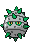

## 1F

<table><tr><th colspan="1">Encounter Method</th><th colspan="5" style = "text-align: center;">Available Pokémon</th></tr>
<tr><td rowspan="2" style="vertical-align: middle; word-wrap: break-word; text-align: center;">Cave</td><td style="text-align: center; vertical-align: bottom;">    <a href="../../pokemons/299">Nosepass</a>   Lv: 32-36   20.0% </td><td style="text-align: center; vertical-align: bottom;">    <a href="../../pokemons/599">Klink</a>   Lv: 32-36   20.0% </td><td style="text-align: center; vertical-align: bottom;">    <a href="../../pokemons/597">Ferroseed</a>   Lv: 32-36   10.0% </td><td style="text-align: center; vertical-align: bottom;">    <a href="../../pokemons/525">Boldore</a>   Lv: 32-36   10.0% </td><td style="text-align: center; vertical-align: bottom;">    <a href="../../pokemons/081">Magnemite</a>   Lv: 32-36   10.0% </td></tr>
<tr><td style="text-align: center; vertical-align: bottom;">    <a href="../../pokemons/595">Joltik</a>   Lv: 32-36   10.0% </td><td style="text-align: center; vertical-align: bottom;">    <a href="../../pokemons/602">Tynamo</a>   Lv: 32-36   6.0% </td><td style="text-align: center; vertical-align: bottom;">    <a href="../../pokemons/632">Durant</a>   Lv: 32-36   5.0% </td><td style="text-align: center; vertical-align: bottom;">    <a href="../../pokemons/631">Heatmor</a>   Lv: 32-36   5.0% </td><td style="text-align: center; vertical-align: bottom;">    <a href="../../pokemons/100">Voltorb</a>   Lv: 32-36   4.0% </td></tr>
<tr><td rowspan="1" style="vertical-align: middle; word-wrap: break-word; text-align: center;">Dust Cloud</td><td style="text-align: center; vertical-align: bottom;">    <a href="../../pokemons/299">Nosepass</a>   Lv: 32-36   50.0% </td><td style="text-align: center; vertical-align: bottom;">    <a href="../../pokemons/074">Geodude</a>   Lv: 32-36   30.0% </td><td style="text-align: center; vertical-align: bottom;">    <a href="../../pokemons/050">Diglett</a>   Lv: 32-36   20.0% </td><td></td><td></td></tr></table>
## B1F

<table><tr><th colspan="1">Encounter Method</th><th colspan="5" style = "text-align: center;">Available Pokémon</th></tr>
<tr><td rowspan="2" style="vertical-align: middle; word-wrap: break-word; text-align: center;">Cave</td><td style="text-align: center; vertical-align: bottom;">    <a href="../../pokemons/299">Nosepass</a>   Lv: 36-40   20.0% </td><td style="text-align: center; vertical-align: bottom;">    <a href="../../pokemons/599">Klink</a>   Lv: 36-40   20.0% </td><td style="text-align: center; vertical-align: bottom;">    <a href="../../pokemons/597">Ferroseed</a>   Lv: 36-40   10.0% </td><td style="text-align: center; vertical-align: bottom;">    <a href="../../pokemons/525">Boldore</a>   Lv: 36-40   10.0% </td><td style="text-align: center; vertical-align: bottom;">    <a href="../../pokemons/082">Magneton</a>   Lv: 36-40   10.0% </td></tr>
<tr><td style="text-align: center; vertical-align: bottom;">    <a href="../../pokemons/595">Joltik</a>   Lv: 36-40   10.0% </td><td style="text-align: center; vertical-align: bottom;">    <a href="../../pokemons/602">Tynamo</a>   Lv: 36-40   6.0% </td><td style="text-align: center; vertical-align: bottom;">    <a href="../../pokemons/631">Heatmor</a>   Lv: 36-40   5.0% </td><td style="text-align: center; vertical-align: bottom;">    <a href="../../pokemons/632">Durant</a>   Lv: 36-40   5.0% </td><td style="text-align: center; vertical-align: bottom;">    <a href="../../pokemons/101">Electrode</a>   Lv: 36-40   4.0% </td></tr>
<tr><td rowspan="1" style="vertical-align: middle; word-wrap: break-word; text-align: center;">Dust Cloud</td><td style="text-align: center; vertical-align: bottom;">    <a href="../../pokemons/299">Nosepass</a>   Lv: 36-40   50.0% </td><td style="text-align: center; vertical-align: bottom;">    <a href="../../pokemons/075">Graveler</a>   Lv: 36-40   30.0% </td><td style="text-align: center; vertical-align: bottom;">    <a href="../../pokemons/051">Dugtrio</a>   Lv: 36-40   20.0% </td><td></td><td></td></tr></table>
## B2F

<table><tr><th colspan="1">Encounter Method</th><th colspan="5" style = "text-align: center;">Available Pokémon</th></tr>
<tr><td rowspan="2" style="vertical-align: middle; word-wrap: break-word; text-align: center;">Cave</td><td style="text-align: center; vertical-align: bottom;">    <a href="../../pokemons/299">Nosepass</a>   Lv: 38-41   20.0% </td><td style="text-align: center; vertical-align: bottom;">    <a href="../../pokemons/599">Klink</a>   Lv: 38-41   20.0% </td><td style="text-align: center; vertical-align: bottom;">    <a href="../../pokemons/597">Ferroseed</a>   Lv: 38-41   10.0% </td><td style="text-align: center; vertical-align: bottom;">    <a href="../../pokemons/525">Boldore</a>   Lv: 38-41   10.0% </td><td style="text-align: center; vertical-align: bottom;">    <a href="../../pokemons/082">Magneton</a>   Lv: 38-41   10.0% </td></tr>
<tr><td style="text-align: center; vertical-align: bottom;">    <a href="../../pokemons/595">Joltik</a>   Lv: 38-41   10.0% </td><td style="text-align: center; vertical-align: bottom;">    <a href="../../pokemons/602">Tynamo</a>   Lv: 38-41   6.0% </td><td style="text-align: center; vertical-align: bottom;">    <a href="../../pokemons/631">Heatmor</a>   Lv: 38-41   5.0% </td><td style="text-align: center; vertical-align: bottom;">    <a href="../../pokemons/632">Durant</a>   Lv: 38-41   5.0% </td><td style="text-align: center; vertical-align: bottom;">    <a href="../../pokemons/101">Electrode</a>   Lv: 38-41   4.0% </td></tr>
<tr><td rowspan="1" style="vertical-align: middle; word-wrap: break-word; text-align: center;">Dust Cloud</td><td style="text-align: center; vertical-align: bottom;">    <a href="../../pokemons/476">Probopass</a>   Lv: 38-41   50.0% </td><td style="text-align: center; vertical-align: bottom;">    <a href="../../pokemons/075">Graveler</a>   Lv: 38-41   30.0% </td><td style="text-align: center; vertical-align: bottom;">    <a href="../../pokemons/051">Dugtrio</a>   Lv: 38-41   20.0% </td><td></td><td></td></tr></table>
