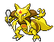
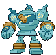

## Spring, Summer, Autumn

<table><tr><th colspan="1">Encounter Method</th><th colspan="5" style = "text-align: center;">Available Pokémon</th></tr>
<tr><td rowspan="3" style="vertical-align: middle; word-wrap: break-word; text-align: center;">Grass</td><td style="text-align: center; vertical-align: bottom;">    <a href="../../pokemons/520">Tranquill</a>   Lv: 63   20.0% </td><td style="text-align: center; vertical-align: bottom;">    <a href="../../pokemons/520">Tranquill</a>   Lv: 64   20.0% </td><td style="text-align: center; vertical-align: bottom;">    <a href="../../pokemons/620">Mienshao</a>   Lv: 65   10.0% </td><td style="text-align: center; vertical-align: bottom;">    <a href="../../pokemons/620">Mienshao</a>   Lv: 66   10.0% </td><td style="text-align: center; vertical-align: bottom;">    <a href="../../pokemons/586">Sawsbuck</a>   Lv: 65   10.0% </td></tr>
<tr><td style="text-align: center; vertical-align: bottom;">    <a href="../../pokemons/586">Sawsbuck</a>   Lv: 66   10.0% </td><td style="text-align: center; vertical-align: bottom;">    <a href="../../pokemons/621">Druddigon</a>   Lv: 65   10.0% </td><td style="text-align: center; vertical-align: bottom;">    <a href="../../pokemons/064">Kadabra</a>   Lv: 64   4.0% </td><td style="text-align: center; vertical-align: bottom;">    <a href="../../pokemons/064">Kadabra</a>   Lv: 65   1.0% </td><td style="text-align: center; vertical-align: bottom;">    <a href="../../pokemons/334">Altaria</a>   Lv: 65   4.0% </td></tr>
<tr><td style="text-align: center; vertical-align: bottom;">    <a href="../../pokemons/334">Altaria</a>   Lv: 66   1.0% </td><td></td><td></td><td></td><td></td></tr>
<tr><td rowspan="3" style="vertical-align: middle; word-wrap: break-word; text-align: center;">Dark Grass (Doubles)</td><td style="text-align: center; vertical-align: bottom;">    <a href="../../pokemons/520">Tranquill</a>   Lv: 67   20.0% </td><td style="text-align: center; vertical-align: bottom;">    <a href="../../pokemons/520">Tranquill</a>   Lv: 68   20.0% </td><td style="text-align: center; vertical-align: bottom;">    <a href="../../pokemons/620">Mienshao</a>   Lv: 68   10.0% </td><td style="text-align: center; vertical-align: bottom;">    <a href="../../pokemons/620">Mienshao</a>   Lv: 69   10.0% </td><td style="text-align: center; vertical-align: bottom;">    <a href="../../pokemons/586">Sawsbuck</a>   Lv: 68   10.0% </td></tr>
<tr><td style="text-align: center; vertical-align: bottom;">    <a href="../../pokemons/586">Sawsbuck</a>   Lv: 69   10.0% </td><td style="text-align: center; vertical-align: bottom;">    <a href="../../pokemons/621">Druddigon</a>   Lv: 69   10.0% </td><td style="text-align: center; vertical-align: bottom;">    <a href="../../pokemons/064">Kadabra</a>   Lv: 67   4.0% </td><td style="text-align: center; vertical-align: bottom;">    <a href="../../pokemons/064">Kadabra</a>   Lv: 68   1.0% </td><td style="text-align: center; vertical-align: bottom;">    <a href="../../pokemons/334">Altaria</a>   Lv: 68   4.0% </td></tr>
<tr><td style="text-align: center; vertical-align: bottom;">    <a href="../../pokemons/334">Altaria</a>   Lv: 69   1.0% </td><td></td><td></td><td></td><td></td></tr>
<tr><td rowspan="1" style="vertical-align: middle; word-wrap: break-word; text-align: center;">Shaking Grass</td><td style="text-align: center; vertical-align: bottom;">    <a href="../../pokemons/531">Audino</a>   Lv: 65   50.0% </td><td style="text-align: center; vertical-align: bottom;">    <a href="../../pokemons/531">Audino</a>   Lv: 66   30.0% </td><td style="text-align: center; vertical-align: bottom;">    <a href="../../pokemons/587">Emolga</a>   Lv: 65   10.0% </td><td style="text-align: center; vertical-align: bottom;">    <a href="../../pokemons/065">Alakazam</a>   Lv: 68   5.0% </td><td style="text-align: center; vertical-align: bottom;">    <a href="../../pokemons/521">Unfezant</a>   Lv: 68   5.0% </td></tr>
<tr><td rowspan="1" style="vertical-align: middle; word-wrap: break-word; text-align: center;">Surf</td><td style="text-align: center; vertical-align: bottom;">    <a href="../../pokemons/550">Basculin-Red</a>   Lv: 40-60   60.0% </td><td style="text-align: center; vertical-align: bottom;">    <a href="../../pokemons/550">Basculin-Red</a>   Lv: 45-65   35.0% </td><td style="text-align: center; vertical-align: bottom;">    <a href="../../pokemons/131">Lapras</a>   Lv: 55-65   5.0% </td><td></td><td></td></tr>
<tr><td rowspan="1" style="vertical-align: middle; word-wrap: break-word; text-align: center;">Surf, Rippling Water</td><td style="text-align: center; vertical-align: bottom;">    <a href="../../pokemons/550">Basculin-Blue</a>   Lv: 55-65   66.0% </td><td style="text-align: center; vertical-align: bottom;">    <a href="../../pokemons/131">Lapras</a>   Lv: 60-70   30.0% </td><td></td><td></td><td></td></tr>
<tr><td rowspan="1" style="vertical-align: middle; word-wrap: break-word; text-align: center;">Fish</td><td style="text-align: center; vertical-align: bottom;">    <a href="../../pokemons/147">Dratini</a>   Lv: 50-56   60.0% </td><td style="text-align: center; vertical-align: bottom;">    <a href="../../pokemons/550">Basculin-Red</a>   Lv: 51-57   30.0% </td><td style="text-align: center; vertical-align: bottom;">    <a href="../../pokemons/148">Dragonair</a>   Lv: 50-60   10.0% </td><td></td><td></td></tr>
<tr><td rowspan="1" style="vertical-align: middle; word-wrap: break-word; text-align: center;">Fish, Rippling Water</td><td style="text-align: center; vertical-align: bottom;">    <a href="../../pokemons/148">Dragonair</a>   Lv: 60-70   65.0% </td><td style="text-align: center; vertical-align: bottom;">    <a href="../../pokemons/550">Basculin-Blue</a>   Lv: 60-70   30.0% </td><td style="text-align: center; vertical-align: bottom;">    <a href="../../pokemons/149">Dragonite</a>   Lv: 65-75   5.0% </td><td></td><td></td></tr></table>
## Winter

<table><tr><th colspan="1">Encounter Method</th><th colspan="5" style = "text-align: center;">Available Pokémon</th></tr>
<tr><td rowspan="3" style="vertical-align: middle; word-wrap: break-word; text-align: center;">Grass</td><td style="text-align: center; vertical-align: bottom;">    <a href="../../pokemons/583">Vanillish</a>   Lv: 63   20.0% </td><td style="text-align: center; vertical-align: bottom;">    <a href="../../pokemons/583">Vanillish</a>   Lv: 64   20.0% </td><td style="text-align: center; vertical-align: bottom;">    <a href="../../pokemons/620">Mienshao</a>   Lv: 65   10.0% </td><td style="text-align: center; vertical-align: bottom;">    <a href="../../pokemons/620">Mienshao</a>   Lv: 66   10.0% </td><td style="text-align: center; vertical-align: bottom;">    <a href="../../pokemons/586">Sawsbuck</a>   Lv: 65   10.0% </td></tr>
<tr><td style="text-align: center; vertical-align: bottom;">    <a href="../../pokemons/586">Sawsbuck</a>   Lv: 66   10.0% </td><td style="text-align: center; vertical-align: bottom;">    <a href="../../pokemons/614">Beartic</a>   Lv: 66   10.0% </td><td style="text-align: center; vertical-align: bottom;">    <a href="../../pokemons/064">Kadabra</a>   Lv: 64   4.0% </td><td style="text-align: center; vertical-align: bottom;">    <a href="../../pokemons/064">Kadabra</a>   Lv: 65   1.0% </td><td style="text-align: center; vertical-align: bottom;">    <a href="../../pokemons/334">Altaria</a>   Lv: 65   4.0% </td></tr>
<tr><td style="text-align: center; vertical-align: bottom;">    <a href="../../pokemons/334">Altaria</a>   Lv: 66   1.0% </td><td></td><td></td><td></td><td></td></tr>
<tr><td rowspan="3" style="vertical-align: middle; word-wrap: break-word; text-align: center;">Dark Grass (Doubles)</td><td style="text-align: center; vertical-align: bottom;">    <a href="../../pokemons/583">Vanillish</a>   Lv: 67   20.0% </td><td style="text-align: center; vertical-align: bottom;">    <a href="../../pokemons/583">Vanillish</a>   Lv: 68   20.0% </td><td style="text-align: center; vertical-align: bottom;">    <a href="../../pokemons/620">Mienshao</a>   Lv: 68   10.0% </td><td style="text-align: center; vertical-align: bottom;">    <a href="../../pokemons/620">Mienshao</a>   Lv: 69   5.0% </td><td style="text-align: center; vertical-align: bottom;">    <a href="../../pokemons/586">Sawsbuck</a>   Lv: 68   10.0% </td></tr>
<tr><td style="text-align: center; vertical-align: bottom;">    <a href="../../pokemons/586">Sawsbuck</a>   Lv: 69   10.0% </td><td style="text-align: center; vertical-align: bottom;">    <a href="../../pokemons/614">Beartic</a>   Lv: 69   10.0% </td><td style="text-align: center; vertical-align: bottom;">    <a href="../../pokemons/064">Kadabra</a>   Lv: 67   5.0% </td><td style="text-align: center; vertical-align: bottom;">    <a href="../../pokemons/064">Kadabra</a>   Lv: 68   4.0% </td><td style="text-align: center; vertical-align: bottom;">    <a href="../../pokemons/334">Altaria</a>   Lv: 68   5.0% </td></tr>
<tr><td style="text-align: center; vertical-align: bottom;">    <a href="../../pokemons/334">Altaria</a>   Lv: 69   1.0% </td><td></td><td></td><td></td><td></td></tr>
<tr><td rowspan="1" style="vertical-align: middle; word-wrap: break-word; text-align: center;">Shaking Grass</td><td style="text-align: center; vertical-align: bottom;">    <a href="../../pokemons/531">Audino</a>   Lv: 65   50.0% </td><td style="text-align: center; vertical-align: bottom;">    <a href="../../pokemons/531">Audino</a>   Lv: 66   26.0% </td><td style="text-align: center; vertical-align: bottom;">    <a href="../../pokemons/587">Emolga</a>   Lv: 65   10.0% </td><td style="text-align: center; vertical-align: bottom;">    <a href="../../pokemons/065">Alakazam</a>   Lv: 68   5.0% </td><td style="text-align: center; vertical-align: bottom;">    <a href="../../pokemons/584">Vanilluxe</a>   Lv: 68   5.0% </td></tr>
<tr><td rowspan="1" style="vertical-align: middle; word-wrap: break-word; text-align: center;">Surf</td><td style="text-align: center; vertical-align: bottom;">    <a href="../../pokemons/550">Basculin-Red</a>   Lv: 40-60   60.0% </td><td style="text-align: center; vertical-align: bottom;">    <a href="../../pokemons/550">Basculin-Red</a>   Lv: 45-65   35.0% </td><td style="text-align: center; vertical-align: bottom;">    <a href="../../pokemons/131">Lapras</a>   Lv: 55-65   5.0% </td><td></td><td></td></tr>
<tr><td rowspan="1" style="vertical-align: middle; word-wrap: break-word; text-align: center;">Surf, Rippling Water</td><td style="text-align: center; vertical-align: bottom;">    <a href="../../pokemons/550">Basculin-Blue</a>   Lv: 55-65   70.0% </td><td style="text-align: center; vertical-align: bottom;">    <a href="../../pokemons/131">Lapras</a>   Lv: 60-70   30.0% </td><td></td><td></td><td></td></tr>
<tr><td rowspan="1" style="vertical-align: middle; word-wrap: break-word; text-align: center;">Fish</td><td style="text-align: center; vertical-align: bottom;">    <a href="../../pokemons/147">Dratini</a>   Lv: 50-56   60.0% </td><td style="text-align: center; vertical-align: bottom;">    <a href="../../pokemons/550">Basculin-Red</a>   Lv: 51-57   30.0% </td><td style="text-align: center; vertical-align: bottom;">    <a href="../../pokemons/148">Dragonair</a>   Lv: 50-60   10.0% </td><td></td><td></td></tr>
<tr><td rowspan="1" style="vertical-align: middle; word-wrap: break-word; text-align: center;">Fish, Rippling Water</td><td style="text-align: center; vertical-align: bottom;">    <a href="../../pokemons/148">Dragonair</a>   Lv: 60-70   65.0% </td><td style="text-align: center; vertical-align: bottom;">    <a href="../../pokemons/550">Basculin-Blue</a>   Lv: 60-70   30.0% </td><td style="text-align: center; vertical-align: bottom;">    <a href="../../pokemons/149">Dragonite</a>   Lv: 65-75   5.0% </td><td></td><td></td></tr></table>
## Indoors, First Room

<table><tr><th colspan="1">Encounter Method</th><th colspan="5" style = "text-align: center;">Available Pokémon</th></tr>
<tr><td rowspan="2" style="vertical-align: middle; word-wrap: break-word; text-align: center;">Floor</td><td style="text-align: center; vertical-align: bottom;">    <a href="../../pokemons/622">Golett</a>   Lv: 62   20.0% </td><td style="text-align: center; vertical-align: bottom;">    <a href="../../pokemons/622">Golett</a>   Lv: 63   20.0% </td><td style="text-align: center; vertical-align: bottom;">    <a href="../../pokemons/623">Golurk</a>   Lv: 66   10.0% </td><td style="text-align: center; vertical-align: bottom;">    <a href="../../pokemons/623">Golurk</a>   Lv: 67   10.0% </td><td style="text-align: center; vertical-align: bottom;">    <a href="../../pokemons/621">Druddigon</a>   Lv: 66   10.0% </td></tr>
<tr><td style="text-align: center; vertical-align: bottom;">    <a href="../../pokemons/621">Druddigon</a>   Lv: 67   10.0% </td><td style="text-align: center; vertical-align: bottom;">    <a href="../../pokemons/620">Mienshao</a>   Lv: 67   10.0% </td><td style="text-align: center; vertical-align: bottom;">    <a href="../../pokemons/437">Bronzong</a>   Lv: 66   5.0% </td><td style="text-align: center; vertical-align: bottom;">    <a href="../../pokemons/437">Bronzong</a>   Lv: 67   5.0% </td><td></td></tr></table>
## Indoors, Second Room

<table><tr><th colspan="1">Encounter Method</th><th colspan="5" style = "text-align: center;">Available Pokémon</th></tr>
<tr><td rowspan="2" style="vertical-align: middle; word-wrap: break-word; text-align: center;">Floor</td><td style="text-align: center; vertical-align: bottom;">    <a href="../../pokemons/623">Golurk</a>   Lv: 67   20.0% </td><td style="text-align: center; vertical-align: bottom;">    <a href="../../pokemons/623">Golurk</a>   Lv: 68   20.0% </td><td style="text-align: center; vertical-align: bottom;">    <a href="../../pokemons/620">Mienshao</a>   Lv: 67   10.0% </td><td style="text-align: center; vertical-align: bottom;">    <a href="../../pokemons/620">Mienshao</a>   Lv: 68   10.0% </td><td style="text-align: center; vertical-align: bottom;">    <a href="../../pokemons/437">Bronzong</a>   Lv: 67   10.0% </td></tr>
<tr><td style="text-align: center; vertical-align: bottom;">    <a href="../../pokemons/437">Bronzong</a>   Lv: 68   10.0% </td><td style="text-align: center; vertical-align: bottom;">    <a href="../../pokemons/621">Druddigon</a>   Lv: 68   10.0% </td><td style="text-align: center; vertical-align: bottom;">    <a href="../../pokemons/621">Druddigon</a>   Lv: 67   5.0% </td><td style="text-align: center; vertical-align: bottom;">    <a href="../../pokemons/621">Druddigon</a>   Lv: 69   5.0% </td><td></td></tr></table>
## Roof

<table><tr><th colspan="1">Encounter Method</th><th colspan="5" style = "text-align: center;">Available Pokémon</th></tr>
<tr><td rowspan="1" style="vertical-align: middle; word-wrap: break-word; text-align: center;">Event Encounter, BB2</td><td style="text-align: center; vertical-align: bottom;">    <a href="../../pokemons/644">Zekrom</a>   Lv: 75   100.0% </td><td></td><td></td><td></td><td></td></tr>
<tr><td rowspan="1" style="vertical-align: middle; word-wrap: break-word; text-align: center;">Event Encounter, VW2</td><td style="text-align: center; vertical-align: bottom;">    <a href="../../pokemons/643">Reshiram</a>   Lv: 75   100.0% </td><td></td><td></td><td></td><td></td></tr></table>
