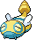

## Surface

<table><tr><th colspan="1">Encounter Method</th><th colspan="5" style = "text-align: center;">Available Pokémon</th></tr>
<tr><td rowspan="2" style="vertical-align: middle; word-wrap: break-word; text-align: center;">Dark Grass (Doubles)</td><td style="text-align: center; vertical-align: bottom;">    <a href="../../pokemons/505">Watchog</a>   Lv: 70   20.0% </td><td style="text-align: center; vertical-align: bottom;">    <a href="../../pokemons/517">Munna</a>   Lv: 66   20.0% </td><td style="text-align: center; vertical-align: bottom;">    <a href="../../pokemons/517">Munna</a>   Lv: 67   5.0% </td><td style="text-align: center; vertical-align: bottom;">    <a href="../../pokemons/510">Liepard</a>   Lv: 70   10.0% </td><td style="text-align: center; vertical-align: bottom;">    <a href="../../pokemons/020">Raticate</a>   Lv: 70   10.0% </td></tr>
<tr><td style="text-align: center; vertical-align: bottom;">    <a href="../../pokemons/097">Hypno</a>   Lv: 70   10.0% </td><td style="text-align: center; vertical-align: bottom;">    <a href="../../pokemons/039">Jigglypuff</a>   Lv: 66   10.0% </td><td style="text-align: center; vertical-align: bottom;">    <a href="../../pokemons/166">Ledian</a>   Lv: 69   5.0% </td><td style="text-align: center; vertical-align: bottom;">    <a href="../../pokemons/168">Ariados</a>   Lv: 69   5.0% </td><td style="text-align: center; vertical-align: bottom;">    <a href="../../pokemons/049">Venomoth</a>   Lv: 70   5.0% </td></tr>
<tr><td rowspan="3" style="vertical-align: middle; word-wrap: break-word; text-align: center;">Shaking Grass</td><td style="text-align: center; vertical-align: bottom;">    <a href="../../pokemons/505">Watchog</a>   Lv: 66   20.0% </td><td style="text-align: center; vertical-align: bottom;">    <a href="../../pokemons/510">Liepard</a>   Lv: 66   20.0% </td><td style="text-align: center; vertical-align: bottom;">    <a href="../../pokemons/517">Munna</a>   Lv: 62   10.0% </td><td style="text-align: center; vertical-align: bottom;">    <a href="../../pokemons/517">Munna</a>   Lv: 63   10.0% </td><td style="text-align: center; vertical-align: bottom;">    <a href="../../pokemons/020">Raticate</a>   Lv: 66   10.0% </td></tr>
<tr><td style="text-align: center; vertical-align: bottom;">    <a href="../../pokemons/039">Jigglypuff</a>   Lv: 62   10.0% </td><td style="text-align: center; vertical-align: bottom;">    <a href="../../pokemons/049">Venomoth</a>   Lv: 66   5.0% </td><td style="text-align: center; vertical-align: bottom;">    <a href="../../pokemons/166">Ledian</a>   Lv: 65   5.0% </td><td style="text-align: center; vertical-align: bottom;">    <a href="../../pokemons/168">Ariados</a>   Lv: 65   5.0% </td><td style="text-align: center; vertical-align: bottom;">    <a href="../../pokemons/097">Hypno</a>   Lv: 66   5.0% </td></tr>
<tr><td style="text-align: center; vertical-align: bottom;">    <a href="../../pokemons/531">Audino</a>   Lv: 65   50.0% </td><td style="text-align: center; vertical-align: bottom;">    <a href="../../pokemons/531">Audino</a>   Lv: 66   30.0% </td><td style="text-align: center; vertical-align: bottom;">    <a href="../../pokemons/206">Dunsparce</a>   Lv: 65   10.0% </td><td style="text-align: center; vertical-align: bottom;">    <a href="../../pokemons/040">Wigglytuff</a>   Lv: 68   5.0% </td><td style="text-align: center; vertical-align: bottom;">    <a href="../../pokemons/518">Musharna</a>   Lv: 68   5.0% </td></tr></table>
## Basement

<table><tr><th colspan="1">Encounter Method</th><th colspan="5" style = "text-align: center;">Available Pokémon</th></tr>
<tr><td rowspan="2" style="vertical-align: middle; word-wrap: break-word; text-align: center;">Grass Doubles</td><td style="text-align: center; vertical-align: bottom;">    <a href="../../pokemons/020">Raticate</a>   Lv: 70   20.0% </td><td style="text-align: center; vertical-align: bottom;">    <a href="../../pokemons/042">Golbat</a>   Lv: 69   20.0% </td><td style="text-align: center; vertical-align: bottom;">    <a href="../../pokemons/517">Munna</a>   Lv: 65   10.0% </td><td style="text-align: center; vertical-align: bottom;">    <a href="../../pokemons/517">Munna</a>   Lv: 66   10.0% </td><td style="text-align: center; vertical-align: bottom;">    <a href="../../pokemons/049">Venomoth</a>   Lv: 70   10.0% </td></tr>
<tr><td style="text-align: center; vertical-align: bottom;">    <a href="../../pokemons/281">Kirlia</a>   Lv: 66   10.0% </td><td style="text-align: center; vertical-align: bottom;">    <a href="../../pokemons/510">Liepard</a>   Lv: 70   5.0% </td><td style="text-align: center; vertical-align: bottom;">    <a href="../../pokemons/053">Persian</a>   Lv: 70   5.0% </td><td style="text-align: center; vertical-align: bottom;">    <a href="../../pokemons/337">Lunatone</a>   Lv: 69   5.0% </td><td style="text-align: center; vertical-align: bottom;">    <a href="../../pokemons/338">Solrock</a>   Lv: 69   5.0% </td></tr></table>
