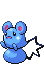
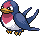
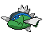

<table><tr><th colspan="1">Encounter Method</th><th colspan="5" style = "text-align: center;">Available Pokémon</th></tr>
<tr><td rowspan="2" style="vertical-align: middle; word-wrap: break-word; text-align: center;">Grass</td><td style="text-align: center; vertical-align: bottom;">    <a href="../../pokemons/506">Lillipup</a>   Lv: 07-09   20.0% </td><td style="text-align: center; vertical-align: bottom;">    <a href="../../pokemons/298">Azurill</a>   Lv: 07-09   20.0% </td><td style="text-align: center; vertical-align: bottom;">    <a href="../../pokemons/066">Machop</a>   Lv: 07-09   10.0% </td><td style="text-align: center; vertical-align: bottom;">    <a href="../../pokemons/179">Mareep</a>   Lv: 07-09   10.0% </td><td style="text-align: center; vertical-align: bottom;">    <a href="../../pokemons/447">Riolu</a>   Lv: 07-09   10.0% </td></tr>
<tr><td style="text-align: center; vertical-align: bottom;">    <a href="../../pokemons/077">Ponyta</a>   Lv: 07-09   10.0% </td><td style="text-align: center; vertical-align: bottom;">    <a href="../../pokemons/054">Psyduck</a>   Lv: 07-09   5.0% </td><td style="text-align: center; vertical-align: bottom;">    <a href="../../pokemons/276">Taillow</a>   Lv: 07-09   5.0% </td><td style="text-align: center; vertical-align: bottom;">    <a href="../../pokemons/261">Poochyena</a>   Lv: 07-09   5.0% </td><td style="text-align: center; vertical-align: bottom;">    <a href="../../pokemons/228">Houndour</a>   Lv: 07-09   5.0% </td></tr>
<tr><td rowspan="1" style="vertical-align: middle; word-wrap: break-word; text-align: center;">Shaking Grass</td><td style="text-align: center; vertical-align: bottom;">    <a href="../../pokemons/531">Audino</a>   Lv: 10-12   40.0% </td><td style="text-align: center; vertical-align: bottom;">    <a href="../../pokemons/206">Dunsparce</a>   Lv: 10-12   30.0% </td><td style="text-align: center; vertical-align: bottom;">    <a href="../../pokemons/216">Teddiursa</a>   Lv: 10-12   20.0% </td><td style="text-align: center; vertical-align: bottom;">    <a href="../../pokemons/440">Happiny</a>   Lv: 10-12   5.0% </td><td style="text-align: center; vertical-align: bottom;">    <a href="../../pokemons/175">Togepi</a>   Lv: 10-12   5.0% </td></tr>
<tr><td rowspan="1" style="vertical-align: middle; word-wrap: break-word; text-align: center;">Surf</td><td style="text-align: center; vertical-align: bottom;">    <a href="../../pokemons/129">Magikarp</a>   Lv: 20-30   70.0% </td><td style="text-align: center; vertical-align: bottom;">    <a href="../../pokemons/550">Basculin-Red</a>   Lv: 20-30   30.0% </td><td></td><td></td><td></td></tr>
<tr><td rowspan="1" style="vertical-align: middle; word-wrap: break-word; text-align: center;">Surf, Rippling Water</td><td style="text-align: center; vertical-align: bottom;">    <a href="../../pokemons/129">Magikarp</a>   Lv: 30-40   70.0% </td><td style="text-align: center; vertical-align: bottom;">    <a href="../../pokemons/550">Basculin-Blue</a>   Lv: 30-40   30.0% </td><td></td><td></td><td></td></tr>
<tr><td rowspan="1" style="vertical-align: middle; word-wrap: break-word; text-align: center;">Fish</td><td style="text-align: center; vertical-align: bottom;">    <a href="../../pokemons/060">Poliwag</a>   Lv: 05-15   70.0% </td><td style="text-align: center; vertical-align: bottom;">    <a href="../../pokemons/118">Goldeen</a>   Lv: 05-15   30.0% </td><td></td><td></td><td></td></tr>
<tr><td rowspan="1" style="vertical-align: middle; word-wrap: break-word; text-align: center;">Fish, Rippling Water</td><td style="text-align: center; vertical-align: bottom;">    <a href="../../pokemons/118">Goldeen</a>   Lv: 05-15   60.0% </td><td style="text-align: center; vertical-align: bottom;">    <a href="../../pokemons/060">Poliwag</a>   Lv: 05-15   40.0% </td><td></td><td></td><td></td></tr>
<tr><td rowspan="3" style="vertical-align: middle; word-wrap: break-word; text-align: center;">Hidden Grotto</td><td style="text-align: center; vertical-align: bottom;">    <a href="../../pokemons/184">Azumarill</a>   Lv: ??   3.75% </td><td style="text-align: center; vertical-align: bottom;">    <a href="../../pokemons/507">Herdier</a>   Lv: ??   3.75% </td><td style="text-align: center; vertical-align: bottom;">    <a href="../../pokemons/195">Quagsire</a>   Lv: ??   3.75% </td><td style="text-align: center; vertical-align: bottom;">    <a href="../../pokemons/277">Swellow</a>   Lv: ??   3.75% </td><td style="text-align: center; vertical-align: bottom;">    <a href="../../pokemons/523">Zebstrika</a>   Lv: ??   1.33% </td></tr>
<tr><td style="text-align: center; vertical-align: bottom;">    <a href="../../pokemons/505">Watchog</a>   Lv: ??   1.33% </td><td style="text-align: center; vertical-align: bottom;">    <a href="../../pokemons/206">Dunsparce</a>   Lv: ??   1.33% </td><td style="text-align: center; vertical-align: bottom;">    <a href="../../pokemons/077">Ponyta</a>   Lv: ??   0.25% </td><td style="text-align: center; vertical-align: bottom;">    <a href="../../pokemons/228">Houndour</a>   Lv: ??   0.25% </td><td style="text-align: center; vertical-align: bottom;">    <a href="../../pokemons/241">Miltank</a>   Lv: ??   0.25% </td></tr>
<tr><td style="text-align: center; vertical-align: bottom;">    <a href="../../pokemons/128">Tauros</a>   Lv: ??   0.25% </td><td></td><td></td><td></td><td></td></tr></table>