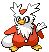
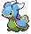
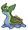
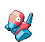

## Route 13

<table><tr><th colspan="1">Encounter Method</th><th colspan="5" style = "text-align: center;">Available Pokémon</th></tr>
<tr><td rowspan="2" style="vertical-align: middle; word-wrap: break-word; text-align: center;">Grass</td><td style="text-align: center; vertical-align: bottom;">    <a href="../../pokemons/114">Tangela</a>   Lv: 53-56   30.0% </td><td style="text-align: center; vertical-align: bottom;">    <a href="../../pokemons/277">Swellow</a>   Lv: 53-56   20.0% </td><td style="text-align: center; vertical-align: bottom;">    <a href="../../pokemons/042">Golbat</a>   Lv: 53-56   10.0% </td><td style="text-align: center; vertical-align: bottom;">    <a href="../../pokemons/337">Lunatone</a>   Lv: 53-56   10.0% </td><td style="text-align: center; vertical-align: bottom;">    <a href="../../pokemons/338">Solrock</a>   Lv: 53-56   10.0% </td></tr>
<tr><td style="text-align: center; vertical-align: bottom;">    <a href="../../pokemons/035">Clefairy</a>   Lv: 53-56   10.0% </td><td style="text-align: center; vertical-align: bottom;">    <a href="../../pokemons/583">Vanillish</a>   Lv: 53-56   5.0% </td><td style="text-align: center; vertical-align: bottom;">    <a href="../../pokemons/221">Piloswine</a>   Lv: 53-56   5.0% </td><td></td><td></td></tr>
<tr><td rowspan="2" style="vertical-align: middle; word-wrap: break-word; text-align: center;">Dark Grass (Doubles)</td><td style="text-align: center; vertical-align: bottom;">    <a href="../../pokemons/114">Tangela</a>   Lv: 54-58   30.0% </td><td style="text-align: center; vertical-align: bottom;">    <a href="../../pokemons/277">Swellow</a>   Lv: 54-58   20.0% </td><td style="text-align: center; vertical-align: bottom;">    <a href="../../pokemons/042">Golbat</a>   Lv: 54-58   10.0% </td><td style="text-align: center; vertical-align: bottom;">    <a href="../../pokemons/337">Lunatone</a>   Lv: 54-58   10.0% </td><td style="text-align: center; vertical-align: bottom;">    <a href="../../pokemons/338">Solrock</a>   Lv: 54-58   10.0% </td></tr>
<tr><td style="text-align: center; vertical-align: bottom;">    <a href="../../pokemons/035">Clefairy</a>   Lv: 54-58   10.0% </td><td style="text-align: center; vertical-align: bottom;">    <a href="../../pokemons/583">Vanillish</a>   Lv: 54-58   5.0% </td><td style="text-align: center; vertical-align: bottom;">    <a href="../../pokemons/221">Piloswine</a>   Lv: 54-58   5.0% </td><td></td><td></td></tr>
<tr><td rowspan="1" style="vertical-align: middle; word-wrap: break-word; text-align: center;">Shaking Grass</td><td style="text-align: center; vertical-align: bottom;">    <a href="../../pokemons/531">Audino</a>   Lv: 54-58   80.0% </td><td style="text-align: center; vertical-align: bottom;">    <a href="../../pokemons/584">Vanilluxe</a>   Lv: 54-58   5.0% </td><td style="text-align: center; vertical-align: bottom;">    <a href="../../pokemons/473">Mamoswine</a>   Lv: 54-58   5.0% </td><td style="text-align: center; vertical-align: bottom;">    <a href="../../pokemons/036">Clefable</a>   Lv: 54-58   5.0% </td><td style="text-align: center; vertical-align: bottom;">    <a href="../../pokemons/169">Crobat</a>   Lv: 54-58   5.0% </td></tr></table>
## Entrance Cave

<table><tr><th colspan="1">Encounter Method</th><th colspan="5" style = "text-align: center;">Available Pokémon</th></tr>
<tr><td rowspan="2" style="vertical-align: middle; word-wrap: break-word; text-align: center;">Cave</td><td style="text-align: center; vertical-align: bottom;">    <a href="../../pokemons/221">Piloswine</a>   Lv: 53-56   20.0% </td><td style="text-align: center; vertical-align: bottom;">    <a href="../../pokemons/042">Golbat</a>   Lv: 53-56   20.0% </td><td style="text-align: center; vertical-align: bottom;">    <a href="../../pokemons/225">Delibird</a>   Lv: 53-56   10.0% </td><td style="text-align: center; vertical-align: bottom;">    <a href="../../pokemons/525">Boldore</a>   Lv: 53-56   10.0% </td><td style="text-align: center; vertical-align: bottom;">    <a href="../../pokemons/124">Jynx</a>   Lv: 53-56   10.0% </td></tr>
<tr><td style="text-align: center; vertical-align: bottom;">    <a href="../../pokemons/583">Vanillish</a>   Lv: 53-56   10.0% </td><td style="text-align: center; vertical-align: bottom;">    <a href="../../pokemons/615">Cryogonal</a>   Lv: 53-56   5.0% </td><td style="text-align: center; vertical-align: bottom;">    <a href="../../pokemons/215">Sneasel</a>   Lv: 53-56   5.0% </td><td style="text-align: center; vertical-align: bottom;">    <a href="../../pokemons/338">Solrock</a>   Lv: 53-56   5.0% </td><td style="text-align: center; vertical-align: bottom;">    <a href="../../pokemons/337">Lunatone</a>   Lv: 53-56   5.0% </td></tr>
<tr><td rowspan="1" style="vertical-align: middle; word-wrap: break-word; text-align: center;">Dust Cloud</td><td style="text-align: center; vertical-align: bottom;">    <a href="../../pokemons/337">Lunatone</a>   Lv: 54-58   50.0% </td><td style="text-align: center; vertical-align: bottom;">    <a href="../../pokemons/338">Solrock</a>   Lv: 54-58   50.0% </td><td></td><td></td><td></td></tr>
<tr><td rowspan="1" style="vertical-align: middle; word-wrap: break-word; text-align: center;">Surf</td><td style="text-align: center; vertical-align: bottom;">    <a href="../../pokemons/422">Shellos-East</a>   Lv: 50-60   70.0% </td><td style="text-align: center; vertical-align: bottom;">    <a href="../../pokemons/086">Seel</a>   Lv: 50-60   30.0% </td><td style="text-align: center; vertical-align: bottom;">    <a href="../../pokemons/087">Dewgong</a>   Lv: 50-60   10.0% </td><td></td><td></td></tr>
<tr><td rowspan="1" style="vertical-align: middle; word-wrap: break-word; text-align: center;">Surf, Rippling Water</td><td style="text-align: center; vertical-align: bottom;">    <a href="../../pokemons/086">Seel</a>   Lv: 50-60   70.0% </td><td style="text-align: center; vertical-align: bottom;">    <a href="../../pokemons/423">Gastrodon-East</a>   Lv: 50-60   30.0% </td><td></td><td></td><td></td></tr>
<tr><td rowspan="1" style="vertical-align: middle; word-wrap: break-word; text-align: center;">Fish</td><td style="text-align: center; vertical-align: bottom;">    <a href="../../pokemons/090">Shellder</a>   Lv: 50-60   70.0% </td><td style="text-align: center; vertical-align: bottom;">    <a href="../../pokemons/422">Shellos-East</a>   Lv: 50-60   30.0% </td><td></td><td></td><td></td></tr>
<tr><td rowspan="1" style="vertical-align: middle; word-wrap: break-word; text-align: center;">Fish, Rippling Water</td><td style="text-align: center; vertical-align: bottom;">    <a href="../../pokemons/091">Cloyster</a>   Lv: 50-60   90.0% </td><td style="text-align: center; vertical-align: bottom;">    <a href="../../pokemons/423">Gastrodon-East</a>   Lv: 50-60   5.0% </td><td></td><td></td><td></td></tr></table>
## Plasma Airship Area

<table><tr><th colspan="1">Encounter Method</th><th colspan="5" style = "text-align: center;">Available Pokémon</th></tr>
<tr><td rowspan="2" style="vertical-align: middle; word-wrap: break-word; text-align: center;">Grass</td><td style="text-align: center; vertical-align: bottom;">    <a href="../../pokemons/221">Piloswine</a>   Lv: 53-56   30.0% </td><td style="text-align: center; vertical-align: bottom;">    <a href="../../pokemons/035">Clefairy</a>   Lv: 53-56   20.0% </td><td style="text-align: center; vertical-align: bottom;">    <a href="../../pokemons/132">Ditto</a>   Lv: 53-56   10.0% </td><td style="text-align: center; vertical-align: bottom;">    <a href="../../pokemons/375">Metang</a>   Lv: 53-56   10.0% </td><td style="text-align: center; vertical-align: bottom;">    <a href="../../pokemons/361">Snorunt</a>   Lv: 53-56   10.0% </td></tr>
<tr><td style="text-align: center; vertical-align: bottom;">    <a href="../../pokemons/225">Delibird</a>   Lv: 53-56   5.0% </td><td style="text-align: center; vertical-align: bottom;">    <a href="../../pokemons/459">Snover</a>   Lv: 53-56   5.0% </td><td style="text-align: center; vertical-align: bottom;">    <a href="../../pokemons/338">Solrock</a>   Lv: 53-56   5.0% </td><td style="text-align: center; vertical-align: bottom;">    <a href="../../pokemons/337">Lunatone</a>   Lv: 53-56   5.0% </td><td></td></tr>
<tr><td rowspan="2" style="vertical-align: middle; word-wrap: break-word; text-align: center;">Dark Grass (Doubles)</td><td style="text-align: center; vertical-align: bottom;">    <a href="../../pokemons/221">Piloswine</a>   Lv: 54-58   30.0% </td><td style="text-align: center; vertical-align: bottom;">    <a href="../../pokemons/035">Clefairy</a>   Lv: 54-58   20.0% </td><td style="text-align: center; vertical-align: bottom;">    <a href="../../pokemons/132">Ditto</a>   Lv: 54-58   10.0% </td><td style="text-align: center; vertical-align: bottom;">    <a href="../../pokemons/375">Metang</a>   Lv: 54-58   10.0% </td><td style="text-align: center; vertical-align: bottom;">    <a href="../../pokemons/460">Abomasnow</a>   Lv: 54-58   10.0% </td></tr>
<tr><td style="text-align: center; vertical-align: bottom;">    <a href="../../pokemons/225">Delibird</a>   Lv: 54-58   5.0% </td><td style="text-align: center; vertical-align: bottom;">    <a href="../../pokemons/459">Snover</a>   Lv: 54-58   5.0% </td><td style="text-align: center; vertical-align: bottom;">    <a href="../../pokemons/338">Solrock</a>   Lv: 54-58   5.0% </td><td style="text-align: center; vertical-align: bottom;">    <a href="../../pokemons/337">Lunatone</a>   Lv: 54-58   5.0% </td><td></td></tr>
<tr><td rowspan="1" style="vertical-align: middle; word-wrap: break-word; text-align: center;">Shaking Grass</td><td style="text-align: center; vertical-align: bottom;">    <a href="../../pokemons/531">Audino</a>   Lv: 49   90.0% </td><td style="text-align: center; vertical-align: bottom;">    <a href="../../pokemons/473">Mamoswine</a>   Lv: 50   5.0% </td><td style="text-align: center; vertical-align: bottom;">    <a href="../../pokemons/584">Vanilluxe</a>   Lv: 50   5.0% </td><td></td><td></td></tr>
<tr><td rowspan="3" style="vertical-align: middle; word-wrap: break-word; text-align: center;">Hidden Grotto</td><td style="text-align: center; vertical-align: bottom;">    <a href="../../pokemons/035">Clefairy</a>   Lv: ??   3.75% </td><td style="text-align: center; vertical-align: bottom;">    <a href="../../pokemons/359">Absol</a>   Lv: ??   3.75% </td><td style="text-align: center; vertical-align: bottom;">    <a href="../../pokemons/096">Drowzee</a>   Lv: ??   3.75% </td><td style="text-align: center; vertical-align: bottom;">    <a href="../../pokemons/351">Castform</a>   Lv: ??   3.75% </td><td style="text-align: center; vertical-align: bottom;">    <a href="../../pokemons/137">Porygon</a>   Lv: ??   1.0% </td></tr>
<tr><td style="text-align: center; vertical-align: bottom;">    <a href="../../pokemons/124">Jynx</a>   Lv: ??   1.0% </td><td style="text-align: center; vertical-align: bottom;">    <a href="../../pokemons/427">Buneary</a>   Lv: ??   1.0% </td><td style="text-align: center; vertical-align: bottom;">    <a href="../../pokemons/583">Vanillish</a>   Lv: ??   1.0% </td><td style="text-align: center; vertical-align: bottom;">    <a href="../../pokemons/529">Drilbur</a>   Lv: ??   0.25% </td><td style="text-align: center; vertical-align: bottom;">    <a href="../../pokemons/374">Beldum</a>   Lv: ??   0.25% </td></tr>
<tr><td style="text-align: center; vertical-align: bottom;">    <a href="../../pokemons/132">Ditto</a>   Lv: ??   0.25% </td><td style="text-align: center; vertical-align: bottom;">    <a href="../../pokemons/524">Roggenrola</a>   Lv: ??   0.25% </td><td></td><td></td><td></td></tr></table>
## Kyurems Cave

<table><tr><th colspan="1">Encounter Method</th><th colspan="5" style = "text-align: center;">Available Pokémon</th></tr>
<tr><td rowspan="2" style="vertical-align: middle; word-wrap: break-word; text-align: center;">Cave</td><td style="text-align: center; vertical-align: bottom;">    <a href="../../pokemons/221">Piloswine</a>   Lv: 53-56   20.0% </td><td style="text-align: center; vertical-align: bottom;">    <a href="../../pokemons/042">Golbat</a>   Lv: 53-56   20.0% </td><td style="text-align: center; vertical-align: bottom;">    <a href="../../pokemons/225">Delibird</a>   Lv: 53-56   10.0% </td><td style="text-align: center; vertical-align: bottom;">    <a href="../../pokemons/525">Boldore</a>   Lv: 53-56   10.0% </td><td style="text-align: center; vertical-align: bottom;">    <a href="../../pokemons/124">Jynx</a>   Lv: 53-56   10.0% </td></tr>
<tr><td style="text-align: center; vertical-align: bottom;">    <a href="../../pokemons/583">Vanillish</a>   Lv: 53-56   10.0% </td><td style="text-align: center; vertical-align: bottom;">    <a href="../../pokemons/615">Cryogonal</a>   Lv: 53-56   5.0% </td><td style="text-align: center; vertical-align: bottom;">    <a href="../../pokemons/215">Sneasel</a>   Lv: 53-56   5.0% </td><td style="text-align: center; vertical-align: bottom;">    <a href="../../pokemons/338">Solrock</a>   Lv: 53-56   5.0% </td><td style="text-align: center; vertical-align: bottom;">    <a href="../../pokemons/337">Lunatone</a>   Lv: 53-56   5.0% </td></tr>
<tr><td rowspan="1" style="vertical-align: middle; word-wrap: break-word; text-align: center;">Dust Cloud</td><td style="text-align: center; vertical-align: bottom;">    <a href="../../pokemons/337">Lunatone</a>   Lv: 54-58   50.0% </td><td style="text-align: center; vertical-align: bottom;">    <a href="../../pokemons/338">Solrock</a>   Lv: 54-58   50.0% </td><td></td><td></td><td></td></tr>
<tr><td rowspan="1" style="vertical-align: middle; word-wrap: break-word; text-align: center;">Surf</td><td style="text-align: center; vertical-align: bottom;">    <a href="../../pokemons/422">Shellos-East</a>   Lv: 50-60   70.0% </td><td style="text-align: center; vertical-align: bottom;">    <a href="../../pokemons/086">Seel</a>   Lv: 50-60   30.0% </td><td style="text-align: center; vertical-align: bottom;">    <a href="../../pokemons/087">Dewgong</a>   Lv: 50-60   10.0% </td><td></td><td></td></tr>
<tr><td rowspan="1" style="vertical-align: middle; word-wrap: break-word; text-align: center;">Surf, Rippling Water</td><td style="text-align: center; vertical-align: bottom;">    <a href="../../pokemons/086">Seel</a>   Lv: 50-60   70.0% </td><td style="text-align: center; vertical-align: bottom;">    <a href="../../pokemons/423">Gastrodon-East</a>   Lv: 50-60   30.0% </td><td></td><td></td><td></td></tr>
<tr><td rowspan="1" style="vertical-align: middle; word-wrap: break-word; text-align: center;">Fish</td><td style="text-align: center; vertical-align: bottom;">    <a href="../../pokemons/090">Shellder</a>   Lv: 50-60   70.0% </td><td style="text-align: center; vertical-align: bottom;">    <a href="../../pokemons/422">Shellos-East</a>   Lv: 50-60   30.0% </td><td></td><td></td><td></td></tr>
<tr><td rowspan="1" style="vertical-align: middle; word-wrap: break-word; text-align: center;">Fish, Rippling Water</td><td style="text-align: center; vertical-align: bottom;">    <a href="../../pokemons/091">Cloyster</a>   Lv: 50-60   90.0% </td><td style="text-align: center; vertical-align: bottom;">    <a href="../../pokemons/423">Gastrodon-East</a>   Lv: 50-60   5.0% </td><td></td><td></td><td></td></tr>
<tr><td rowspan="1" style="vertical-align: middle; word-wrap: break-word; text-align: center;">Special Event</td><td style="text-align: center; vertical-align: bottom;">    <a href="../../pokemons/646">Kyurem</a>   Lv: 75   100.0% </td><td></td><td></td><td></td><td></td></tr></table>
