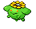

<table><tr><th colspan="1">Encounter Method</th><th colspan="5" style = "text-align: center;">Available Pokémon</th></tr>
<tr><td rowspan="2" style="vertical-align: middle; word-wrap: break-word; text-align: center;">Shadows Overhead</td><td style="text-align: center; vertical-align: bottom;">    <a href="../../pokemons/581">Swanna</a>   Lv: 68   40.0% </td><td style="text-align: center; vertical-align: bottom;">    <a href="../../pokemons/581">Swanna</a>   Lv: 70   1.0% </td><td style="text-align: center; vertical-align: bottom;">    <a href="../../pokemons/279">Pelipper</a>   Lv: 68   10.0% </td><td style="text-align: center; vertical-align: bottom;">    <a href="../../pokemons/279">Pelipper</a>   Lv: 70   1.0% </td><td style="text-align: center; vertical-align: bottom;">    <a href="../../pokemons/022">Fearow</a>   Lv: 68   10.0% </td></tr>
<tr><td style="text-align: center; vertical-align: bottom;">    <a href="../../pokemons/188">Skiploom</a>   Lv: 66   10.0% </td><td style="text-align: center; vertical-align: bottom;">    <a href="../../pokemons/017">Pidgeotto</a>   Lv: 66   10.0% </td><td style="text-align: center; vertical-align: bottom;">    <a href="../../pokemons/083">Farfetch'd</a>   Lv: 67   9.0% </td><td style="text-align: center; vertical-align: bottom;">    <a href="../../pokemons/441">Chatot</a>   Lv: 67   9.0% </td><td></td></tr></table>