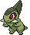
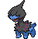

## 1F

<table><tr><th colspan="1">Encounter Method</th><th colspan="5" style = "text-align: center;">Available Pokémon</th></tr>
<tr><td rowspan="2" style="vertical-align: middle; word-wrap: break-word; text-align: center;">Cave</td><td style="text-align: center; vertical-align: bottom;">    <a href="../../pokemons/525">Boldore</a>   Lv: 34-36   20.0% </td><td style="text-align: center; vertical-align: bottom;">    <a href="../../pokemons/304">Aron</a>   Lv: 34-36   20.0% </td><td style="text-align: center; vertical-align: bottom;">    <a href="../../pokemons/115">Kangaskhan</a>   Lv: 34-36   15.0% </td><td style="text-align: center; vertical-align: bottom;">    <a href="../../pokemons/360">Wynaut</a>   Lv: 34-36   10.0% </td><td style="text-align: center; vertical-align: bottom;">    <a href="../../pokemons/610">Axew</a>   Lv: 34-36   10.0% </td></tr>
<tr><td style="text-align: center; vertical-align: bottom;">    <a href="../../pokemons/216">Teddiursa</a>   Lv: 34-36   10.0% </td><td style="text-align: center; vertical-align: bottom;">    <a href="../../pokemons/633">Deino</a>   Lv: 34-36   5.0% </td><td style="text-align: center; vertical-align: bottom;">    <a href="../../pokemons/371">Bagon</a>   Lv: 34-36   5.0% </td><td style="text-align: center; vertical-align: bottom;">    <a href="../../pokemons/246">Larvitar</a>   Lv: 34-36   5.0% </td><td></td></tr>
<tr><td rowspan="1" style="vertical-align: middle; word-wrap: break-word; text-align: center;">Dust Cloud</td><td style="text-align: center; vertical-align: bottom;">    <a href="../../pokemons/115">Kangaskhan</a>   Lv: 35-37   100.0% </td><td></td><td></td><td></td><td></td></tr></table>
## 2F

<table><tr><th colspan="1">Encounter Method</th><th colspan="5" style = "text-align: center;">Available Pokémon</th></tr>
<tr><td rowspan="2" style="vertical-align: middle; word-wrap: break-word; text-align: center;">Cave</td><td style="text-align: center; vertical-align: bottom;">    <a href="../../pokemons/525">Boldore</a>   Lv: 35-37   20.0% </td><td style="text-align: center; vertical-align: bottom;">    <a href="../../pokemons/304">Aron</a>   Lv: 35-37   20.0% </td><td style="text-align: center; vertical-align: bottom;">    <a href="../../pokemons/115">Kangaskhan</a>   Lv: 35-37   15.0% </td><td style="text-align: center; vertical-align: bottom;">    <a href="../../pokemons/202">Wobbuffet</a>   Lv: 35-37   10.0% </td><td style="text-align: center; vertical-align: bottom;">    <a href="../../pokemons/610">Axew</a>   Lv: 35-37   10.0% </td></tr>
<tr><td style="text-align: center; vertical-align: bottom;">    <a href="../../pokemons/216">Teddiursa</a>   Lv: 35-37   10.0% </td><td style="text-align: center; vertical-align: bottom;">    <a href="../../pokemons/633">Deino</a>   Lv: 35-37   5.0% </td><td style="text-align: center; vertical-align: bottom;">    <a href="../../pokemons/371">Bagon</a>   Lv: 35-37   5.0% </td><td style="text-align: center; vertical-align: bottom;">    <a href="../../pokemons/246">Larvitar</a>   Lv: 35-37   5.0% </td><td></td></tr>
<tr><td rowspan="1" style="vertical-align: middle; word-wrap: break-word; text-align: center;">Dust Cloud</td><td style="text-align: center; vertical-align: bottom;">    <a href="../../pokemons/115">Kangaskhan</a>   Lv: 35-37   100.0% </td><td></td><td></td><td></td><td></td></tr></table>
## 3F

<table><tr><th colspan="1">Encounter Method</th><th colspan="5" style = "text-align: center;">Available Pokémon</th></tr>
<tr><td rowspan="2" style="vertical-align: middle; word-wrap: break-word; text-align: center;">Cave</td><td style="text-align: center; vertical-align: bottom;">    <a href="../../pokemons/525">Boldore</a>   Lv: 36-38   20.0% </td><td style="text-align: center; vertical-align: bottom;">    <a href="../../pokemons/305">Lairon</a>   Lv: 36-38   20.0% </td><td style="text-align: center; vertical-align: bottom;">    <a href="../../pokemons/115">Kangaskhan</a>   Lv: 36-38   15.0% </td><td style="text-align: center; vertical-align: bottom;">    <a href="../../pokemons/202">Wobbuffet</a>   Lv: 36-38   10.0% </td><td style="text-align: center; vertical-align: bottom;">    <a href="../../pokemons/610">Axew</a>   Lv: 36-38   10.0% </td></tr>
<tr><td style="text-align: center; vertical-align: bottom;">    <a href="../../pokemons/217">Ursaring</a>   Lv: 36-38   10.0% </td><td style="text-align: center; vertical-align: bottom;">    <a href="../../pokemons/633">Deino</a>   Lv: 36-38   5.0% </td><td style="text-align: center; vertical-align: bottom;">    <a href="../../pokemons/372">Shelgon</a>   Lv: 36-38   5.0% </td><td style="text-align: center; vertical-align: bottom;">    <a href="../../pokemons/247">Pupitar</a>   Lv: 36-38   5.0% </td><td></td></tr>
<tr><td rowspan="1" style="vertical-align: middle; word-wrap: break-word; text-align: center;">Dust Cloud</td><td style="text-align: center; vertical-align: bottom;">    <a href="../../pokemons/115">Kangaskhan</a>   Lv: 36-38   100.0% </td><td></td><td></td><td></td><td></td></tr></table>
