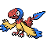

## 1F

<table><tr><th colspan="1">Encounter Method</th><th colspan="5" style = "text-align: center;">Available Pokémon</th></tr>
<tr><td rowspan="2" style="vertical-align: middle; word-wrap: break-word; text-align: center;">Sand</td><td style="text-align: center; vertical-align: bottom;">    <a href="../../pokemons/343">Baltoy</a>   Lv: 23-25   20.0% </td><td style="text-align: center; vertical-align: bottom;">    <a href="../../pokemons/562">Yamask</a>   Lv: 23-25   20.0% </td><td style="text-align: center; vertical-align: bottom;">    <a href="../../pokemons/605">Elgyem</a>   Lv: 23-25   10.0% </td><td style="text-align: center; vertical-align: bottom;">    <a href="../../pokemons/322">Numel</a>   Lv: 23-25   10.0% </td><td style="text-align: center; vertical-align: bottom;">    <a href="../../pokemons/436">Bronzor</a>   Lv: 23-25   10.0% </td></tr>
<tr><td style="text-align: center; vertical-align: bottom;">    <a href="../../pokemons/622">Golett</a>   Lv: 23-25   10.0% </td><td style="text-align: center; vertical-align: bottom;">    <a href="../../pokemons/433">Chingling</a>   Lv: 23-25   10.0% </td><td style="text-align: center; vertical-align: bottom;">    <a href="../../pokemons/104">Cubone</a>   Lv: 23-25   10.0% </td><td></td><td></td></tr></table>
## B1F

<table><tr><th colspan="1">Encounter Method</th><th colspan="5" style = "text-align: center;">Available Pokémon</th></tr>
<tr><td rowspan="2" style="vertical-align: middle; word-wrap: break-word; text-align: center;">Sand</td><td style="text-align: center; vertical-align: bottom;">    <a href="../../pokemons/343">Baltoy</a>   Lv: 24-26   20.0% </td><td style="text-align: center; vertical-align: bottom;">    <a href="../../pokemons/562">Yamask</a>   Lv: 24-26   20.0% </td><td style="text-align: center; vertical-align: bottom;">    <a href="../../pokemons/605">Elgyem</a>   Lv: 24-26   10.0% </td><td style="text-align: center; vertical-align: bottom;">    <a href="../../pokemons/622">Golett</a>   Lv: 24-26   10.0% </td><td style="text-align: center; vertical-align: bottom;">    <a href="../../pokemons/436">Bronzor</a>   Lv: 24-26   10.0% </td></tr>
<tr><td style="text-align: center; vertical-align: bottom;">    <a href="../../pokemons/433">Chingling</a>   Lv: 24-26   10.0% </td><td style="text-align: center; vertical-align: bottom;">    <a href="../../pokemons/095">Onix</a>   Lv: 24-26   10.0% </td><td style="text-align: center; vertical-align: bottom;">    <a href="../../pokemons/607">Litwick</a>   Lv: 24-26   10.0% </td><td></td><td></td></tr></table>
## Lowest Floor, Room Left of Pots

<table><tr><th colspan="1">Encounter Method</th><th colspan="5" style = "text-align: center;">Available Pokémon</th></tr>
<tr><td rowspan="2" style="vertical-align: middle; word-wrap: break-word; text-align: center;">Floor</td><td style="text-align: center; vertical-align: bottom;">    <a href="../../pokemons/552">Krokorok</a>   Lv: 31-35   20.0% </td><td style="text-align: center; vertical-align: bottom;">    <a href="../../pokemons/562">Yamask</a>   Lv: 31-35   20.0% </td><td style="text-align: center; vertical-align: bottom;">    <a href="../../pokemons/201">Unown-H</a>   Lv: 30   10.0% </td><td style="text-align: center; vertical-align: bottom;">    <a href="../../pokemons/201">Unown-O</a>   Lv: 30   10.0% </td><td style="text-align: center; vertical-align: bottom;">    <a href="../../pokemons/201">Unown-E</a>   Lv: 30   10.0% </td></tr>
<tr><td style="text-align: center; vertical-align: bottom;">    <a href="../../pokemons/201">Unown-N</a>   Lv: 30   10.0% </td><td style="text-align: center; vertical-align: bottom;">    <a href="../../pokemons/345">Lileep</a>   Lv: 30   5.0% </td><td style="text-align: center; vertical-align: bottom;">    <a href="../../pokemons/347">Anorith</a>   Lv: 30   5.0% </td><td style="text-align: center; vertical-align: bottom;">    <a href="../../pokemons/201">Unown-A</a>   Lv: 30   5.0% </td><td style="text-align: center; vertical-align: bottom;">    <a href="../../pokemons/201">Unown-Z</a>   Lv: 30   5.0% </td></tr></table>
## Lowest Floor, Room Right of Pots

<table><tr><th colspan="1">Encounter Method</th><th colspan="5" style = "text-align: center;">Available Pokémon</th></tr>
<tr><td rowspan="2" style="vertical-align: middle; word-wrap: break-word; text-align: center;">Floor</td><td style="text-align: center; vertical-align: bottom;">    <a href="../../pokemons/552">Krokorok</a>   Lv: 31-35   20.0% </td><td style="text-align: center; vertical-align: bottom;">    <a href="../../pokemons/562">Yamask</a>   Lv: 31-35   20.0% </td><td style="text-align: center; vertical-align: bottom;">    <a href="../../pokemons/201">Unown-K</a>   Lv: 30   10.0% </td><td style="text-align: center; vertical-align: bottom;">    <a href="../../pokemons/201">Unown-N</a>   Lv: 30   10.0% </td><td style="text-align: center; vertical-align: bottom;">    <a href="../../pokemons/201">Unown-T</a>   Lv: 30   10.0% </td></tr>
<tr><td style="text-align: center; vertical-align: bottom;">    <a href="../../pokemons/201">Unown-O</a>   Lv: 30   10.0% </td><td style="text-align: center; vertical-align: bottom;">    <a href="../../pokemons/138">Omanyte</a>   Lv: 30   5.0% </td><td style="text-align: center; vertical-align: bottom;">    <a href="../../pokemons/140">Kabuto</a>   Lv: 30   5.0% </td><td style="text-align: center; vertical-align: bottom;">    <a href="../../pokemons/201">Unown-C</a>   Lv: 30   5.0% </td><td style="text-align: center; vertical-align: bottom;">    <a href="../../pokemons/201">Unown-X</a>   Lv: 30   5.0% </td></tr></table>
## Lowest Floor, Furthest Right Room

<table><tr><th colspan="1">Encounter Method</th><th colspan="5" style = "text-align: center;">Available Pokémon</th></tr>
<tr><td rowspan="2" style="vertical-align: middle; word-wrap: break-word; text-align: center;">Floor</td><td style="text-align: center; vertical-align: bottom;">    <a href="../../pokemons/552">Krokorok</a>   Lv: 34-37   20.0% </td><td style="text-align: center; vertical-align: bottom;">    <a href="../../pokemons/563">Cofagrigus</a>   Lv: 34-37   20.0% </td><td style="text-align: center; vertical-align: bottom;">    <a href="../../pokemons/201">Unown-S</a>   Lv: 30   10.0% </td><td style="text-align: center; vertical-align: bottom;">    <a href="../../pokemons/201">Unown-N</a>   Lv: 30   10.0% </td><td style="text-align: center; vertical-align: bottom;">    <a href="../../pokemons/201">Unown-O</a>   Lv: 30   10.0% </td></tr>
<tr><td style="text-align: center; vertical-align: bottom;">    <a href="../../pokemons/201">Unown-H</a>   Lv: 30   10.0% </td><td style="text-align: center; vertical-align: bottom;">    <a href="../../pokemons/408">Cranidos</a>   Lv: 30   5.0% </td><td style="text-align: center; vertical-align: bottom;">    <a href="../../pokemons/410">Shieldon</a>   Lv: 30   5.0% </td><td style="text-align: center; vertical-align: bottom;">    <a href="../../pokemons/201">Unown-B</a>   Lv: 30   5.0% </td><td style="text-align: center; vertical-align: bottom;">    <a href="../../pokemons/201">Unown-Y</a>   Lv: 30   5.0% </td></tr></table>
## Lowest Floor, Furthest Left Room

<table><tr><th colspan="1">Encounter Method</th><th colspan="5" style = "text-align: center;">Available Pokémon</th></tr>
<tr><td rowspan="2" style="vertical-align: middle; word-wrap: break-word; text-align: center;">Floor</td><td style="text-align: center; vertical-align: bottom;">    <a href="../../pokemons/552">Krokorok</a>   Lv: 34-37   20.0% </td><td style="text-align: center; vertical-align: bottom;">    <a href="../../pokemons/563">Cofagrigus</a>   Lv: 34-37   20.0% </td><td style="text-align: center; vertical-align: bottom;">    <a href="../../pokemons/201">Unown-I</a>   Lv: 30   10.0% </td><td style="text-align: center; vertical-align: bottom;">    <a href="../../pokemons/201">Unown-S</a>   Lv: 30   10.0% </td><td style="text-align: center; vertical-align: bottom;">    <a href="../../pokemons/201">Unown-H</a>   Lv: 30   10.0% </td></tr>
<tr><td style="text-align: center; vertical-align: bottom;">    <a href="../../pokemons/201">Unown-U</a>   Lv: 30   10.0% </td><td style="text-align: center; vertical-align: bottom;">    <a href="../../pokemons/564">Tirtouga</a>   Lv: 30   5.0% </td><td style="text-align: center; vertical-align: bottom;">    <a href="../../pokemons/566">Archen</a>   Lv: 30   5.0% </td><td style="text-align: center; vertical-align: bottom;">    <a href="../../pokemons/201">Unown-D</a>   Lv: 30   5.0% </td><td style="text-align: center; vertical-align: bottom;">    <a href="../../pokemons/201">Unown-W</a>   Lv: 30   5.0% </td></tr></table>
## Lowest Floor, Pot Room

<table><tr><th colspan="1">Encounter Method</th><th colspan="5" style = "text-align: center;">Available Pokémon</th></tr>
<tr><td rowspan="2" style="vertical-align: middle; word-wrap: break-word; text-align: center;">Floor</td><td style="text-align: center; vertical-align: bottom;">    <a href="../../pokemons/343">Baltoy</a>   Lv: 31-35   40.0% </td><td style="text-align: center; vertical-align: bottom;">    <a href="../../pokemons/201">Unown-F</a>   Lv: 30   10.0% </td><td style="text-align: center; vertical-align: bottom;">    <a href="../../pokemons/201">Unown-P</a>   Lv: 30   10.0% </td><td style="text-align: center; vertical-align: bottom;">    <a href="../../pokemons/201">Unown-G</a>   Lv: 30   10.0% </td><td style="text-align: center; vertical-align: bottom;">    <a href="../../pokemons/201">Unown-Q</a>   Lv: 30   10.0% </td></tr>
<tr><td style="text-align: center; vertical-align: bottom;">    <a href="../../pokemons/201">Unown-M</a>   Lv: 30   10.0% </td><td style="text-align: center; vertical-align: bottom;">    <a href="../../pokemons/142">Aerodactyl</a>   Lv: 30   5.0% </td><td style="text-align: center; vertical-align: bottom;">    <a href="../../pokemons/555">Darmanitan-Zen</a>   Lv: 35   5.0% </td><td></td><td></td></tr></table>
## Lowest Floor, Volcarona Room

<table><tr><th colspan="1">Encounter Method</th><th colspan="5" style = "text-align: center;">Available Pokémon</th></tr>
<tr><td rowspan="2" style="vertical-align: middle; word-wrap: break-word; text-align: center;">Floor</td><td style="text-align: center; vertical-align: bottom;">    <a href="../../pokemons/344">Claydol</a>   Lv: 36-38   40.0% </td><td style="text-align: center; vertical-align: bottom;">    <a href="../../pokemons/201">Unown-J</a>   Lv: 30   10.0% </td><td style="text-align: center; vertical-align: bottom;">    <a href="../../pokemons/201">Unown-R</a>   Lv: 30   10.0% </td><td style="text-align: center; vertical-align: bottom;">    <a href="../../pokemons/201">Unown-L</a>   Lv: 30   10.0% </td><td style="text-align: center; vertical-align: bottom;">    <a href="../../pokemons/201">Unown-V</a>   Lv: 30   10.0% </td></tr>
<tr><td style="text-align: center; vertical-align: bottom;">    <a href="../../pokemons/201">Unown-!</a>   Lv: 30   10.0% </td><td style="text-align: center; vertical-align: bottom;">    <a href="../../pokemons/201">Unown-?</a>   Lv: 30   10.0% </td><td></td><td></td><td></td></tr>
<tr><td rowspan="1" style="vertical-align: middle; word-wrap: break-word; text-align: center;">Static Encounter</td><td style="text-align: center; vertical-align: bottom;">    <a href="../../pokemons/637">Volcarona</a>   Lv: 40   100.0% </td><td></td><td></td><td></td><td></td></tr></table>
