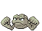
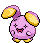
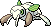
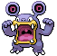
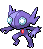
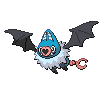

## Castelia City Exit

<table><tr><th colspan="1">Encounter Method</th><th colspan="5" style = "text-align: center;">Available Pokémon</th></tr>
<tr><td rowspan="2" style="vertical-align: middle; word-wrap: break-word; text-align: center;">Cave</td><td style="text-align: center; vertical-align: bottom;">    <a href="../../pokemons/111">Rhyhorn</a>   Lv: 19-20   20.0% </td><td style="text-align: center; vertical-align: bottom;">    <a href="../../pokemons/074">Geodude</a>   Lv: 19-20   20.0% </td><td style="text-align: center; vertical-align: bottom;">    <a href="../../pokemons/532">Timburr</a>   Lv: 19-20   10.0% </td><td style="text-align: center; vertical-align: bottom;">    <a href="../../pokemons/293">Whismur</a>   Lv: 19-20   10.0% </td><td style="text-align: center; vertical-align: bottom;">    <a href="../../pokemons/527">Woobat</a>   Lv: 19-20   10.0% </td></tr>
<tr><td style="text-align: center; vertical-align: bottom;">    <a href="../../pokemons/046">Paras</a>   Lv: 19-20   10.0% </td><td style="text-align: center; vertical-align: bottom;">    <a href="../../pokemons/524">Roggenrola</a>   Lv: 19-20   5.0% </td><td style="text-align: center; vertical-align: bottom;">    <a href="../../pokemons/035">Clefairy</a>   Lv: 19-20   5.0% </td><td style="text-align: center; vertical-align: bottom;">    <a href="../../pokemons/443">Gible</a>   Lv: 19-20   5.0% </td><td style="text-align: center; vertical-align: bottom;">    <a href="../../pokemons/246">Larvitar</a>   Lv: 19-20   5.0% </td></tr>
<tr><td rowspan="1" style="vertical-align: middle; word-wrap: break-word; text-align: center;">Dust Cloud</td><td style="text-align: center; vertical-align: bottom;">    <a href="../../pokemons/050">Diglett</a>   Lv: 19-20   40.0% </td><td style="text-align: center; vertical-align: bottom;">    <a href="../../pokemons/095">Onix</a>   Lv: 19-20   20.0% </td><td style="text-align: center; vertical-align: bottom;">    <a href="../../pokemons/290">Nincada</a>   Lv: 19-20   20.0% </td><td style="text-align: center; vertical-align: bottom;">    <a href="../../pokemons/304">Aron</a>   Lv: 19-20   20.0% </td><td></td></tr></table>
## Driftveil Side

<table><tr><th colspan="1">Encounter Method</th><th colspan="5" style = "text-align: center;">Available Pokémon</th></tr>
<tr><td rowspan="2" style="vertical-align: middle; word-wrap: break-word; text-align: center;">Cave</td><td style="text-align: center; vertical-align: bottom;">    <a href="../../pokemons/525">Boldore</a>   Lv: 31-34   20.0% </td><td style="text-align: center; vertical-align: bottom;">    <a href="../../pokemons/527">Woobat</a>   Lv: 29-32   20.0% </td><td style="text-align: center; vertical-align: bottom;">    <a href="../../pokemons/533">Gurdurr</a>   Lv: 31-34   10.0% </td><td style="text-align: center; vertical-align: bottom;">    <a href="../../pokemons/294">Loudred</a>   Lv: 31-34   10.0% </td><td style="text-align: center; vertical-align: bottom;">    <a href="../../pokemons/075">Graveler</a>   Lv: 31-34   10.0% </td></tr>
<tr><td style="text-align: center; vertical-align: bottom;">    <a href="../../pokemons/111">Rhyhorn</a>   Lv: 31-34   10.0% </td><td style="text-align: center; vertical-align: bottom;">    <a href="../../pokemons/307">Meditite</a>   Lv: 29-32   10.0% </td><td style="text-align: center; vertical-align: bottom;">    <a href="../../pokemons/047">Parasect</a>   Lv: 31-34   5.0% </td><td style="text-align: center; vertical-align: bottom;">    <a href="../../pokemons/035">Clefairy</a>   Lv: 29-32   5.0% </td><td></td></tr>
<tr><td rowspan="1" style="vertical-align: middle; word-wrap: break-word; text-align: center;">Dust Cloud</td><td style="text-align: center; vertical-align: bottom;">    <a href="../../pokemons/529">Drilbur</a>   Lv: 30-32   50.0% </td><td style="text-align: center; vertical-align: bottom;">    <a href="../../pokemons/095">Onix</a>   Lv: 30-32   20.0% </td><td style="text-align: center; vertical-align: bottom;">    <a href="../../pokemons/290">Nincada</a>   Lv: 30-32   20.0% </td><td style="text-align: center; vertical-align: bottom;">    <a href="../../pokemons/051">Dugtrio</a>   Lv: 32-34   10.0% </td><td></td></tr></table>
## Center

<table><tr><th colspan="1">Encounter Method</th><th colspan="5" style = "text-align: center;">Available Pokémon</th></tr>
<tr><td rowspan="3" style="vertical-align: middle; word-wrap: break-word; text-align: center;">Cave</td><td style="text-align: center; vertical-align: bottom;">    <a href="../../pokemons/525">Boldore</a>   Lv: 32-36   20.0% </td><td style="text-align: center; vertical-align: bottom;">    <a href="../../pokemons/533">Gurdurr</a>   Lv: 32-36   20.0% </td><td style="text-align: center; vertical-align: bottom;">    <a href="../../pokemons/111">Rhyhorn</a>   Lv: 32-36   10.0% </td><td style="text-align: center; vertical-align: bottom;">    <a href="../../pokemons/067">Machoke</a>   Lv: 32-36   10.0% </td><td style="text-align: center; vertical-align: bottom;">    <a href="../../pokemons/294">Loudred</a>   Lv: 32-36   10.0% </td></tr>
<tr><td style="text-align: center; vertical-align: bottom;">    <a href="../../pokemons/075">Graveler</a>   Lv: 32-36   10.0% </td><td style="text-align: center; vertical-align: bottom;">    <a href="../../pokemons/303">Mawile</a>   Lv: 32-36   5.0% </td><td style="text-align: center; vertical-align: bottom;">    <a href="../../pokemons/302">Sableye</a>   Lv: 32-36   5.0% </td><td style="text-align: center; vertical-align: bottom;">    <a href="../../pokemons/444">Gabite</a>   Lv: 32-36   4.0% </td><td style="text-align: center; vertical-align: bottom;">    <a href="../../pokemons/247">Pupitar</a>   Lv: 32-36   4.0% </td></tr>
<tr><td style="text-align: center; vertical-align: bottom;">    <a href="../../pokemons/528">Swoobat</a>   Lv: 32-36   2.0% </td><td></td><td></td><td></td><td></td></tr>
<tr><td rowspan="1" style="vertical-align: middle; word-wrap: break-word; text-align: center;">Dust Cloud</td><td style="text-align: center; vertical-align: bottom;">    <a href="../../pokemons/530">Excadrill</a>   Lv: 32-34   50.0% </td><td style="text-align: center; vertical-align: bottom;">    <a href="../../pokemons/095">Onix</a>   Lv: 30-32   20.0% </td><td style="text-align: center; vertical-align: bottom;">    <a href="../../pokemons/290">Nincada</a>   Lv: 30-32   20.0% </td><td style="text-align: center; vertical-align: bottom;">    <a href="../../pokemons/051">Dugtrio</a>   Lv: 32-34   10.0% </td><td></td></tr>
<tr><td rowspan="1" style="vertical-align: middle; word-wrap: break-word; text-align: center;">Surf</td><td style="text-align: center; vertical-align: bottom;">    <a href="../../pokemons/422">Shellos-West</a>   Lv: 25-35   70.0% </td><td style="text-align: center; vertical-align: bottom;">    <a href="../../pokemons/550">Basculin-Red</a>   Lv: 25-35   30.0% </td><td style="text-align: center; vertical-align: bottom;">    <a href="../../pokemons/423">Gastrodon-West</a>   Lv: 25-35   10.0% </td><td></td><td></td></tr>
<tr><td rowspan="1" style="vertical-align: middle; word-wrap: break-word; text-align: center;">Surf, Rippling Water</td><td style="text-align: center; vertical-align: bottom;">    <a href="../../pokemons/422">Shellos-West</a>   Lv: 25-35   60.0% </td><td style="text-align: center; vertical-align: bottom;">    <a href="../../pokemons/550">Basculin-Blue</a>   Lv: 25-35   30.0% </td><td></td><td></td><td></td></tr>
<tr><td rowspan="1" style="vertical-align: middle; word-wrap: break-word; text-align: center;">Fish</td><td style="text-align: center; vertical-align: bottom;">    <a href="../../pokemons/339">Barboach</a>   Lv: 25-35   100.0% </td><td></td><td></td><td></td><td></td></tr>
<tr><td rowspan="1" style="vertical-align: middle; word-wrap: break-word; text-align: center;">Fish, Rippling Water</td><td style="text-align: center; vertical-align: bottom;">    <a href="../../pokemons/339">Barboach</a>   Lv: 25-35   90.0% </td><td style="text-align: center; vertical-align: bottom;">    <a href="../../pokemons/340">Whiscash</a>   Lv: 25-35   10.0% </td><td></td><td></td><td></td></tr></table>
