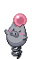
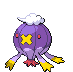
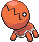
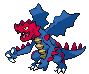

## Outside

<table><tr><th colspan="1">Encounter Method</th><th colspan="5" style = "text-align: center;">Available Pokémon</th></tr>
<tr><td rowspan="2" style="vertical-align: middle; word-wrap: break-word; text-align: center;">Grass</td><td style="text-align: center; vertical-align: bottom;">    <a href="../../pokemons/325">Spoink</a>   Lv: 39-42   20.0% </td><td style="text-align: center; vertical-align: bottom;">    <a href="../../pokemons/332">Cacturne</a>   Lv: 39-42   20.0% </td><td style="text-align: center; vertical-align: bottom;">    <a href="../../pokemons/426">Drifblim</a>   Lv: 39-42   10.0% </td><td style="text-align: center; vertical-align: bottom;">    <a href="../../pokemons/451">Skorupi</a>   Lv: 39-42   10.0% </td><td style="text-align: center; vertical-align: bottom;">    <a href="../../pokemons/322">Numel</a>   Lv: 39-42   10.0% </td></tr>
<tr><td style="text-align: center; vertical-align: bottom;">    <a href="../../pokemons/111">Rhyhorn</a>   Lv: 39-42   10.0% </td><td style="text-align: center; vertical-align: bottom;">    <a href="../../pokemons/324">Torkoal</a>   Lv: 39-42   5.0% </td><td style="text-align: center; vertical-align: bottom;">    <a href="../../pokemons/207">Gligar</a>   Lv: 39-42   5.0% </td><td style="text-align: center; vertical-align: bottom;">    <a href="../../pokemons/328">Trapinch</a>   Lv: 39-42   5.0% </td><td style="text-align: center; vertical-align: bottom;">    <a href="../../pokemons/227">Skarmory</a>   Lv: 39-42   5.0% </td></tr>
<tr><td rowspan="2" style="vertical-align: middle; word-wrap: break-word; text-align: center;">Dark Grass (Doubles)</td><td style="text-align: center; vertical-align: bottom;">    <a href="../../pokemons/326">Grumpig</a>   Lv: 40-43   20.0% </td><td style="text-align: center; vertical-align: bottom;">    <a href="../../pokemons/323">Camerupt</a>   Lv: 40-43   20.0% </td><td style="text-align: center; vertical-align: bottom;">    <a href="../../pokemons/426">Drifblim</a>   Lv: 40-43   20.0% </td><td style="text-align: center; vertical-align: bottom;">    <a href="../../pokemons/452">Drapion</a>   Lv: 40-43   10.0% </td><td style="text-align: center; vertical-align: bottom;">    <a href="../../pokemons/112">Rhydon</a>   Lv: 40-43   10.0% </td></tr>
<tr><td style="text-align: center; vertical-align: bottom;">    <a href="../../pokemons/227">Skarmory</a>   Lv: 40-43   10.0% </td><td style="text-align: center; vertical-align: bottom;">    <a href="../../pokemons/332">Cacturne</a>   Lv: 40-43   10.0% </td><td></td><td></td><td></td></tr>
<tr><td rowspan="1" style="vertical-align: middle; word-wrap: break-word; text-align: center;">Shaking Grass</td><td style="text-align: center; vertical-align: bottom;">    <a href="../../pokemons/531">Audino</a>   Lv: 40-43   70.0% </td><td style="text-align: center; vertical-align: bottom;">    <a href="../../pokemons/332">Cacturne</a>   Lv: 40-43   30.0% </td><td></td><td></td><td></td></tr></table>
## Inside, 1F

<table><tr><th colspan="1">Encounter Method</th><th colspan="5" style = "text-align: center;">Available Pokémon</th></tr>
<tr><td rowspan="2" style="vertical-align: middle; word-wrap: break-word; text-align: center;">Cave</td><td style="text-align: center; vertical-align: bottom;">    <a href="../../pokemons/619">Mienfoo</a>   Lv: 40-43   20.0% </td><td style="text-align: center; vertical-align: bottom;">    <a href="../../pokemons/194">Wooper</a>   Lv: 40-43   20.0% </td><td style="text-align: center; vertical-align: bottom;">    <a href="../../pokemons/325">Spoink</a>   Lv: 40-43   10.0% </td><td style="text-align: center; vertical-align: bottom;">    <a href="../../pokemons/322">Numel</a>   Lv: 40-43   10.0% </td><td style="text-align: center; vertical-align: bottom;">    <a href="../../pokemons/525">Boldore</a>   Lv: 40-43   10.0% </td></tr>
<tr><td style="text-align: center; vertical-align: bottom;">    <a href="../../pokemons/195">Quagsire</a>   Lv: 40-43   10.0% </td><td style="text-align: center; vertical-align: bottom;">    <a href="../../pokemons/621">Druddigon</a>   Lv: 40-43   5.0% </td><td style="text-align: center; vertical-align: bottom;">    <a href="../../pokemons/219">Magcargo</a>   Lv: 40-43   5.0% </td><td style="text-align: center; vertical-align: bottom;">    <a href="../../pokemons/538">Throh</a>   Lv: 40-43   5.0% </td><td style="text-align: center; vertical-align: bottom;">    <a href="../../pokemons/539">Sawk</a>   Lv: 40-43   5.0% </td></tr>
<tr><td rowspan="1" style="vertical-align: middle; word-wrap: break-word; text-align: center;">Dust Cloud</td><td style="text-align: center; vertical-align: bottom;">    <a href="../../pokemons/326">Grumpig</a>   Lv: 40-44   100.0% </td><td></td><td></td><td></td><td></td></tr></table>
## Inside, B1F

<table><tr><th colspan="1">Encounter Method</th><th colspan="5" style = "text-align: center;">Available Pokémon</th></tr>
<tr><td rowspan="2" style="vertical-align: middle; word-wrap: break-word; text-align: center;">Cave</td><td style="text-align: center; vertical-align: bottom;">    <a href="../../pokemons/619">Mienfoo</a>   Lv: 41-44   20.0% </td><td style="text-align: center; vertical-align: bottom;">    <a href="../../pokemons/195">Quagsire</a>   Lv: 41-44   20.0% </td><td style="text-align: center; vertical-align: bottom;">    <a href="../../pokemons/326">Grumpig</a>   Lv: 41-44   10.0% </td><td style="text-align: center; vertical-align: bottom;">    <a href="../../pokemons/323">Camerupt</a>   Lv: 41-44   10.0% </td><td style="text-align: center; vertical-align: bottom;">    <a href="../../pokemons/525">Boldore</a>   Lv: 41-44   10.0% </td></tr>
<tr><td style="text-align: center; vertical-align: bottom;">    <a href="../../pokemons/621">Druddigon</a>   Lv: 41-44   10.0% </td><td style="text-align: center; vertical-align: bottom;">    <a href="../../pokemons/219">Magcargo</a>   Lv: 41-44   5.0% </td><td style="text-align: center; vertical-align: bottom;">    <a href="../../pokemons/055">Golduck</a>   Lv: 41-44   5.0% </td><td style="text-align: center; vertical-align: bottom;">    <a href="../../pokemons/538">Throh</a>   Lv: 41-44   5.0% </td><td style="text-align: center; vertical-align: bottom;">    <a href="../../pokemons/539">Sawk</a>   Lv: 41-44   5.0% </td></tr>
<tr><td rowspan="1" style="vertical-align: middle; word-wrap: break-word; text-align: center;">Dust Cloud</td><td style="text-align: center; vertical-align: bottom;">    <a href="../../pokemons/326">Grumpig</a>   Lv: 41-45   100.0% </td><td></td><td></td><td></td><td></td></tr></table>
