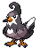
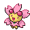
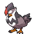

<table><tr><th colspan="1">Encounter Method</th><th colspan="5" style = "text-align: center;">Available Pokémon</th></tr>
<tr><td rowspan="2" style="vertical-align: middle; word-wrap: break-word; text-align: center;">Grass</td><td style="text-align: center; vertical-align: bottom;">    <a href="../../pokemons/077">Ponyta</a>   Lv: 43-45   20.0% </td><td style="text-align: center; vertical-align: bottom;">    <a href="../../pokemons/415">Combee</a>   Lv: 43-45   20.0% </td><td style="text-align: center; vertical-align: bottom;">    <a href="../../pokemons/267">Beautifly</a>   Lv: 43-45   10.0% </td><td style="text-align: center; vertical-align: bottom;">    <a href="../../pokemons/269">Dustox</a>   Lv: 43-45   10.0% </td><td style="text-align: center; vertical-align: bottom;">    <a href="../../pokemons/203">Girafarig</a>   Lv: 43-45   10.0% </td></tr>
<tr><td style="text-align: center; vertical-align: bottom;">    <a href="../../pokemons/420">Cherubi</a>   Lv: 43-45   10.0% </td><td style="text-align: center; vertical-align: bottom;">    <a href="../../pokemons/214">Heracross</a>   Lv: 43-45   5.0% </td><td style="text-align: center; vertical-align: bottom;">    <a href="../../pokemons/127">Pinsir</a>   Lv: 43-45   5.0% </td><td style="text-align: center; vertical-align: bottom;">    <a href="../../pokemons/084">Doduo</a>   Lv: 43-45   5.0% </td><td style="text-align: center; vertical-align: bottom;">    <a href="../../pokemons/397">Staravia</a>   Lv: 43-45   5.0% </td></tr>
<tr><td rowspan="2" style="vertical-align: middle; word-wrap: break-word; text-align: center;">Dark Grass (Doubles)</td><td style="text-align: center; vertical-align: bottom;">    <a href="../../pokemons/078">Rapidash</a>   Lv: 44-46   20.0% </td><td style="text-align: center; vertical-align: bottom;">    <a href="../../pokemons/415">Combee</a>   Lv: 44-46   20.0% </td><td style="text-align: center; vertical-align: bottom;">    <a href="../../pokemons/267">Beautifly</a>   Lv: 44-46   10.0% </td><td style="text-align: center; vertical-align: bottom;">    <a href="../../pokemons/269">Dustox</a>   Lv: 44-46   10.0% </td><td style="text-align: center; vertical-align: bottom;">    <a href="../../pokemons/203">Girafarig</a>   Lv: 44-46   10.0% </td></tr>
<tr><td style="text-align: center; vertical-align: bottom;">    <a href="../../pokemons/421">Cherrim - Sunshine</a>   Lv: 44-46   10.0% </td><td style="text-align: center; vertical-align: bottom;">    <a href="../../pokemons/214">Heracross</a>   Lv: 44-46   5.0% </td><td style="text-align: center; vertical-align: bottom;">    <a href="../../pokemons/127">Pinsir</a>   Lv: 44-46   5.0% </td><td style="text-align: center; vertical-align: bottom;">    <a href="../../pokemons/085">Dodrio</a>   Lv: 44-46   5.0% </td><td style="text-align: center; vertical-align: bottom;">    <a href="../../pokemons/397">Staravia</a>   Lv: 44-46   5.0% </td></tr>
<tr><td rowspan="1" style="vertical-align: middle; word-wrap: break-word; text-align: center;">Shaking Grass</td><td style="text-align: center; vertical-align: bottom;">    <a href="../../pokemons/531">Audino</a>   Lv: 44-46   75.0% </td><td style="text-align: center; vertical-align: bottom;">    <a href="../../pokemons/587">Emolga</a>   Lv: 44-46   10.0% </td><td style="text-align: center; vertical-align: bottom;">    <a href="../../pokemons/206">Dunsparce</a>   Lv: 44-46   10.0% </td><td style="text-align: center; vertical-align: bottom;">    <a href="../../pokemons/398">Staraptor</a>   Lv: 44-46   5.0% </td><td></td></tr></table>