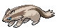
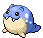

<table><tr><th colspan="1">Encounter Method</th><th colspan="5" style = "text-align: center;">Available Pokémon</th></tr>
<tr><td rowspan="2" style="vertical-align: middle; word-wrap: break-word; text-align: center;">Grass</td><td style="text-align: center; vertical-align: bottom;">    <a href="../../pokemons/114">Tangela</a>   Lv: 41-44   30.0% </td><td style="text-align: center; vertical-align: bottom;">    <a href="../../pokemons/277">Swellow</a>   Lv: 41-44   20.0% </td><td style="text-align: center; vertical-align: bottom;">    <a href="../../pokemons/042">Golbat</a>   Lv: 41-44   10.0% </td><td style="text-align: center; vertical-align: bottom;">    <a href="../../pokemons/337">Lunatone</a>   Lv: 41-44   10.0% </td><td style="text-align: center; vertical-align: bottom;">    <a href="../../pokemons/338">Solrock</a>   Lv: 41-44   10.0% </td></tr>
<tr><td style="text-align: center; vertical-align: bottom;">    <a href="../../pokemons/187">Hoppip</a>   Lv: 41-44   10.0% </td><td style="text-align: center; vertical-align: bottom;">    <a href="../../pokemons/278">Wingull</a>   Lv: 41-44   5.0% </td><td style="text-align: center; vertical-align: bottom;">    <a href="../../pokemons/264">Linoone</a>   Lv: 41-44   5.0% </td><td></td><td></td></tr>
<tr><td rowspan="2" style="vertical-align: middle; word-wrap: break-word; text-align: center;">Dark Grass (Doubles)</td><td style="text-align: center; vertical-align: bottom;">    <a href="../../pokemons/114">Tangela</a>   Lv: 42-45   30.0% </td><td style="text-align: center; vertical-align: bottom;">    <a href="../../pokemons/277">Swellow</a>   Lv: 42-45   20.0% </td><td style="text-align: center; vertical-align: bottom;">    <a href="../../pokemons/042">Golbat</a>   Lv: 42-45   10.0% </td><td style="text-align: center; vertical-align: bottom;">    <a href="../../pokemons/337">Lunatone</a>   Lv: 42-45   10.0% </td><td style="text-align: center; vertical-align: bottom;">    <a href="../../pokemons/338">Solrock</a>   Lv: 42-45   10.0% </td></tr>
<tr><td style="text-align: center; vertical-align: bottom;">    <a href="../../pokemons/188">Skiploom</a>   Lv: 42-45   10.0% </td><td style="text-align: center; vertical-align: bottom;">    <a href="../../pokemons/264">Linoone</a>   Lv: 42-45   10.0% </td><td></td><td></td><td></td></tr>
<tr><td rowspan="1" style="vertical-align: middle; word-wrap: break-word; text-align: center;">Shaking Grass</td><td style="text-align: center; vertical-align: bottom;">    <a href="../../pokemons/531">Audino</a>   Lv: 42-45   75.0% </td><td style="text-align: center; vertical-align: bottom;">    <a href="../../pokemons/587">Emolga</a>   Lv: 42-45   10.0% </td><td style="text-align: center; vertical-align: bottom;">    <a href="../../pokemons/189">Jumpluff</a>   Lv: 42-45   5.0% </td><td style="text-align: center; vertical-align: bottom;">    <a href="../../pokemons/169">Crobat</a>   Lv: 42-45   5.0% </td><td style="text-align: center; vertical-align: bottom;">    <a href="../../pokemons/465">Tangrowth</a>   Lv: 42-45   5.0% </td></tr>
<tr><td rowspan="1" style="vertical-align: middle; word-wrap: break-word; text-align: center;">Surf</td><td style="text-align: center; vertical-align: bottom;">    <a href="../../pokemons/370">Luvdisc</a>   Lv: 40-46   60.0% </td><td style="text-align: center; vertical-align: bottom;">    <a href="../../pokemons/592">Frillish</a>   Lv: 40-46   30.0% </td><td style="text-align: center; vertical-align: bottom;">    <a href="../../pokemons/222">Corsola</a>   Lv: 40-46   10.0% </td><td></td><td></td></tr>
<tr><td rowspan="1" style="vertical-align: middle; word-wrap: break-word; text-align: center;">Surf, Rippling Water</td><td style="text-align: center; vertical-align: bottom;">    <a href="../../pokemons/593">Jellicent</a>   Lv: 40-46   65.0% </td><td style="text-align: center; vertical-align: bottom;">    <a href="../../pokemons/222">Corsola</a>   Lv: 40-46   35.0% </td><td></td><td></td><td></td></tr>
<tr><td rowspan="1" style="vertical-align: middle; word-wrap: break-word; text-align: center;">Fish</td><td style="text-align: center; vertical-align: bottom;">    <a href="../../pokemons/098">Krabby</a>   Lv: 40-46   60.0% </td><td style="text-align: center; vertical-align: bottom;">    <a href="../../pokemons/120">Staryu</a>   Lv: 40-46   35.0% </td><td style="text-align: center; vertical-align: bottom;">    <a href="../../pokemons/370">Luvdisc</a>   Lv: 40-46   5.0% </td><td style="text-align: center; vertical-align: bottom;">    <a href="../../pokemons/121">Starmie</a>   Lv: 40-46   5.0% </td><td></td></tr>
<tr><td rowspan="1" style="vertical-align: middle; word-wrap: break-word; text-align: center;">Fish, Rippling Water</td><td style="text-align: center; vertical-align: bottom;">    <a href="../../pokemons/120">Staryu</a>   Lv: 40-46   60.0% </td><td style="text-align: center; vertical-align: bottom;">    <a href="../../pokemons/099">Kingler</a>   Lv: 40-46   30.0% </td><td style="text-align: center; vertical-align: bottom;">    <a href="../../pokemons/370">Luvdisc</a>   Lv: 40-46   5.0% </td><td></td><td></td></tr>
<tr><td rowspan="3" style="vertical-align: middle; word-wrap: break-word; text-align: center;">Hidden Grotto: Near Cobalion's Grove</td><td style="text-align: center; vertical-align: bottom;">    <a href="../../pokemons/187">Hoppip</a>   Lv: ??   3.75% </td><td style="text-align: center; vertical-align: bottom;">    <a href="../../pokemons/263">Zigzagoon</a>   Lv: ??   3.75% </td><td style="text-align: center; vertical-align: bottom;">    <a href="../../pokemons/337">Lunatone</a>   Lv: ??   3.75% </td><td style="text-align: center; vertical-align: bottom;">    <a href="../../pokemons/338">Solrock</a>   Lv: ??   3.75% </td><td style="text-align: center; vertical-align: bottom;">    <a href="../../pokemons/041">Zubat</a>   Lv: ??   1.0% </td></tr>
<tr><td style="text-align: center; vertical-align: bottom;">    <a href="../../pokemons/276">Taillow</a>   Lv: ??   1.0% </td><td style="text-align: center; vertical-align: bottom;">    <a href="../../pokemons/370">Luvdisc</a>   Lv: ??   1.0% </td><td style="text-align: center; vertical-align: bottom;">    <a href="../../pokemons/278">Wingull</a>   Lv: ??   1.0% </td><td style="text-align: center; vertical-align: bottom;">    <a href="../../pokemons/258">Mudkip</a>   Lv: ??   0.33% </td><td style="text-align: center; vertical-align: bottom;">    <a href="../../pokemons/393">Piplup</a>   Lv: ??   0.33% </td></tr>
<tr><td style="text-align: center; vertical-align: bottom;">    <a href="../../pokemons/120">Staryu</a>   Lv: ??   0.33% </td><td></td><td></td><td></td><td></td></tr>
<tr><td rowspan="3" style="vertical-align: middle; word-wrap: break-word; text-align: center;">Hidden Grotto: Outside Giant Chasm</td><td style="text-align: center; vertical-align: bottom;">    <a href="../../pokemons/352">Kecleon</a>   Lv: ??   3.75% </td><td style="text-align: center; vertical-align: bottom;">    <a href="../../pokemons/083">Farfetch'd</a>   Lv: ??   3.75% </td><td style="text-align: center; vertical-align: bottom;">    <a href="../../pokemons/422">Shellos-East</a>   Lv: ??   3.75% </td><td style="text-align: center; vertical-align: bottom;">    <a href="../../pokemons/422">Shellos-West</a>   Lv: ??   3.75% </td><td style="text-align: center; vertical-align: bottom;">    <a href="../../pokemons/086">Seel</a>   Lv: ??   1.0% </td></tr>
<tr><td style="text-align: center; vertical-align: bottom;">    <a href="../../pokemons/363">Spheal</a>   Lv: ??   1.0% </td><td style="text-align: center; vertical-align: bottom;">    <a href="../../pokemons/361">Snorunt</a>   Lv: ??   1.0% </td><td style="text-align: center; vertical-align: bottom;">    <a href="../../pokemons/116">Horsea</a>   Lv: ??   1.0% </td><td style="text-align: center; vertical-align: bottom;">    <a href="../../pokemons/349">Feebas</a>   Lv: ??   0.25% </td><td style="text-align: center; vertical-align: bottom;">    <a href="../../pokemons/425">Drifloon</a>   Lv: ??   0.25% </td></tr>
<tr><td style="text-align: center; vertical-align: bottom;">    <a href="../../pokemons/175">Togepi</a>   Lv: ??   0.25% </td><td style="text-align: center; vertical-align: bottom;">    <a href="../../pokemons/440">Happiny</a>   Lv: ??   0.25% </td><td></td><td></td><td></td></tr>
<tr><td rowspan="1" style="vertical-align: middle; word-wrap: break-word; text-align: center;">Special Event</td><td style="text-align: center; vertical-align: bottom;">    <a href="../../pokemons/638">Cobalion</a>   Lv: 50   100.0% </td><td></td><td></td><td></td><td></td></tr></table>